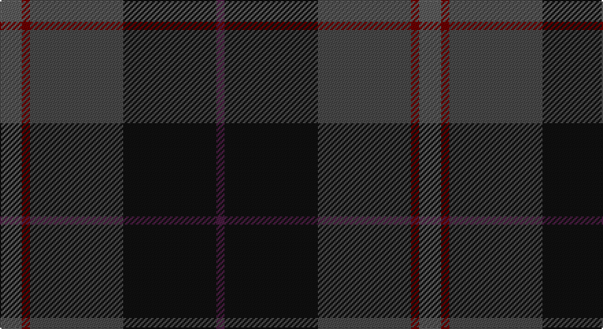

This page is one **sett** — a single exact thread-count. It belongs to the [tartan](/setts/n8o3ni34k34dp3/)
(the same proportion at any scale), whose colour order is pattern [BKBRB](/stripes/bkbrb/).

Sourced from tartans-authority.  It is a [5 stripe tartan](/stripes/stripes5/).

Original link http://www.tartansauthority.com/tartan-ferret/display/7735/

## Also known as

This cloth is also recorded under:

- Passion of Scotland, Pewter (Fashion

2 attestations — the source records this cloth was collapsed from (oldest owns this page)

<ul>
<li>December 2008 — Passion of Scotland, Pewter (Fashion (tartans-authority, <a href="http://www.tartansauthority.com/tartan-ferret/display/7735/">record</a>)</li>
<li>undated — Passion of Scotland Pewter (register-of-tartans, <a href="https://www.tartanregister.gov.uk/tartanDetails.aspx?ref=5718">record</a>)</li>
</ul>

## Register references

External register numbers recorded for this tartan.

- Scottish Register of Tartans: [5718](https://www.tartanregister.gov.uk/tartanDetails.aspx?ref=5718)
- Scottish Tartans Authority (ITI): 7735

## Thread count
Na/16 DR6 N68 K68 DP/6

One full sett is **306 threads**.

## Palette

Palette: <strong>Logan (The Scottish Gael, 1831)</strong> <small style="color:#888">(1 of 5 colours)</small>
<table><thead><tr><th>Colour</th><th>Threads</th><th>Shade</th><th>Base</th><th>OKLCh</th></tr></thead><tbody><tr><td>Na/</td><td style="text-align:right;font-variant-numeric:tabular-nums">16</td><td><code style="background-color:#5C5C5C;">#5C5C5C</code> <small style="color:#888">#5C5C5C</small></td><td>B <code style="background-color:#2A418A;">#2A418A</code></td><td><small style="color:#888">oklch(47.5% 0.000 89.9)</small></td></tr><tr><td>DR</td><td style="text-align:right;font-variant-numeric:tabular-nums">6</td><td><code style="background-color:#6C0000;">#6C0000</code> <small style="color:#888">#6C0000</small></td><td>R <code style="background-color:#CC0000;">#CC0000</code></td><td><small style="color:#888">oklch(33.4% 0.137 29.2)</small></td></tr><tr><td>N</td><td style="text-align:right;font-variant-numeric:tabular-nums">68</td><td><code style="background-color:#484848;">#484848</code> <small style="color:#888">#484848</small></td><td>B <code style="background-color:#2A418A;">#2A418A</code></td><td><small style="color:#888">oklch(40.2% 0.000 89.9)</small></td></tr><tr><td>K</td><td style="text-align:right;font-variant-numeric:tabular-nums">68</td><td><code style="background-color:#101010;">#101010</code> <small style="color:#888">#101010</small></td><td>K <code style="background-color:#000000;">#000000</code></td><td><small style="color:#888">oklch(17.3% 0.000 89.9)</small></td></tr><tr><td>DP/</td><td style="text-align:right;font-variant-numeric:tabular-nums">6</td><td><code style="background-color:#481C40;">#481C40</code> <small style="color:#888">#481C40</small></td><td>B <code style="background-color:#2A418A;">#2A418A</code></td><td><small style="color:#888">oklch(30.6% 0.084 334.9)</small></td></tr></tbody></table>

# Sample pattern

## Nearest tartans

The nearest existing variants by ΔTartan distance, with this tartan at the top so the swatches line up against it.

ΔTartan

Tartan

Sett

—

<a href="/ttd/edit/#slug=n8o3ni34k34dp3~x2">Passion of Scotland, Pewter (Fashion</a> <a class="nn-out" href="/variants/s5/n8o3ni34k34dp3~x2/" title="open its dictionary page">↗</a>

0.93

<a href="/ttd/edit/#slug=r1dy2dt12dy8db16lo1~x2&amp;base=n8o3ni34k34dp3~x2">Bobby Jones (Personal)</a> <a class="nn-out" href="/variants/s6/r1dy2dt12dy8db16lo1~x2/" title="open its dictionary page">↗</a>

1.05

<a href="/ttd/edit/#slug=r1dy2k12dy8db16lo1~x2&amp;base=n8o3ni34k34dp3~x2">Bobby Jones (Personal)</a> <a class="nn-out" href="/variants/s6/r1dy2k12dy8db16lo1~x2/" title="open its dictionary page">↗</a>

1.23

<a href="/variants/s5/k37dg37n8ki3dp5~x2/">Dallard (Personal)</a>

1.26

<a href="/ttd/edit/#slug=r4n38k4n6k41dg62y4&amp;base=n8o3ni34k34dp3~x2">Bennett, John Paul (Personal)</a> <a class="nn-out" href="/variants/s7/r4n38k4n6k41dg62y4/" title="open its dictionary page">↗</a>

1.27

<a href="/variants/s6/r1n12ki6k1do10r1~x4/">Andover</a>

1.28

<a href="/ttd/edit/#slug=r3db22k11dg32ly3~x2&amp;base=n8o3ni34k34dp3~x2">Cultoquhey Hotel Corporate Tartan</a> <a class="nn-out" href="/variants/s5/r3db22k11dg32ly3~x2/" title="open its dictionary page">↗</a>

1.35

<a href="/ttd/edit/#slug=dp5db8dt13g21db34dt55o3&amp;base=n8o3ni34k34dp3~x2">Bouncing Blackie (Personal)</a> <a class="nn-out" href="/variants/s7/dp5db8dt13g21db34dt55o3/" title="open its dictionary page">↗</a>

1.40

<a href="/ttd/edit/#slug=dt14k5dp5k5dt14dg32r4~x2&amp;base=n8o3ni34k34dp3~x2">Bennachie (Whisky)</a> <a class="nn-out" href="/variants/s7/dt14k5dp5k5dt14dg32r4~x2/" title="open its dictionary page">↗</a>

1.41

<a href="/ttd/edit/#slug=dt6o4dt2db25k30g2k2~x2&amp;base=n8o3ni34k34dp3~x2">Passion of Scotland (Fashion)</a> <a class="nn-out" href="/variants/s7/dt6o4dt2db25k30g2k2~x2/" title="open its dictionary page">↗</a>

1.42

<a href="/ttd/edit/#slug=dt37dg37o8k3dp5~x2&amp;base=n8o3ni34k34dp3~x2">Dallard Personal Tartan</a> <a class="nn-out" href="/variants/s5/dt37dg37o8k3dp5~x2/" title="open its dictionary page">↗</a>

## Neighbour map

Every grey dot is one of 14360 variants placed by the first two principal components of the ΔTartan feature space (44% of its variance). Red is this tartan; blue dots are its nearest — click one to open its page.

<svg viewBox="0 0 640 380" role="img" style="max-width:100%;height:auto;border:1px solid #e0e0e0;border-radius:4px;display:block" xmlns="http://www.w3.org/2000/svg"><image href="/nn/cloud.v1.png" width="640" height="380"/><a href="/variants/s6/r1dy2dt12dy8db16lo1~x2/"><circle cx="306.2" cy="229.7" r="4" fill="#3465a4"><title>Bobby Jones (Personal)</title></circle></a><a href="/variants/s6/r1dy2k12dy8db16lo1~x2/"><circle cx="286.2" cy="218.8" r="4" fill="#3465a4"><title>Bobby Jones (Personal)</title></circle></a><a href="/variants/s5/k37dg37n8ki3dp5~x2/"><circle cx="296.4" cy="246.4" r="4" fill="#3465a4"><title>Dallard (Personal)</title></circle></a><a href="/variants/s7/r4n38k4n6k41dg62y4/"><circle cx="291.6" cy="212.1" r="4" fill="#3465a4"><title>Bennett, John Paul (Personal)</title></circle></a><a href="/variants/s6/r1n12ki6k1do10r1~x4/"><circle cx="255.4" cy="217.3" r="4" fill="#3465a4"><title>Andover</title></circle></a><a href="/variants/s5/r3db22k11dg32ly3~x2/"><circle cx="271.5" cy="244.1" r="4" fill="#3465a4"><title>Cultoquhey Hotel Corporate Tartan</title></circle></a><a href="/variants/s7/dp5db8dt13g21db34dt55o3/"><circle cx="344.7" cy="218.9" r="4" fill="#3465a4"><title>Bouncing Blackie (Personal)</title></circle></a><a href="/variants/s7/dt14k5dp5k5dt14dg32r4~x2/"><circle cx="252.8" cy="243.6" r="4" fill="#3465a4"><title>Bennachie (Whisky)</title></circle></a><a href="/variants/s7/dt6o4dt2db25k30g2k2~x2/"><circle cx="335.1" cy="211.3" r="4" fill="#3465a4"><title>Passion of Scotland (Fashion)</title></circle></a><a href="/variants/s5/dt37dg37o8k3dp5~x2/"><circle cx="287.7" cy="237.6" r="4" fill="#3465a4"><title>Dallard Personal Tartan</title></circle></a><circle cx="314.1" cy="247.1" r="5" fill="#c00000"/></svg>

ID: /variants/s5/n8o3ni34k34dp3~x2/
