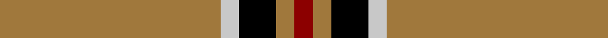
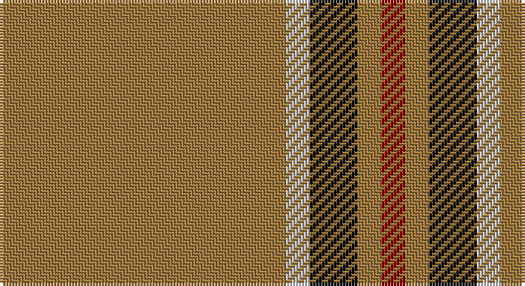

This page is one **sett** — a single exact thread-count. It belongs to the [tartan](/setts/o12lb1k2o1r1/)
(the same proportion at any scale), whose colour order is pattern [RRKWR](/stripes/rrkwr/).

Sourced from register-of-tartans.  It is a [5 stripe tartan](/stripes/stripes5/).

Original link https://www.tartanregister.gov.uk/tartanDetails.aspx?ref=2168

## Register references

External register numbers recorded for this tartan.

- Scottish Register of Tartans: [2168](https://www.tartanregister.gov.uk/tartanDetails.aspx?ref=2168)
- Scottish Tartans Authority (ITI): 5461

## Thread count
LT/96 N8 K16 LT8 DR/8

One full sett is **168 threads**.

## Palette

Palette: <strong>Tartan Register</strong> <small style="color:#888">(2 of 4 colours)</small>
<table><thead><tr><th>Colour</th><th>Threads</th><th>Shade</th><th>Base</th><th>OKLCh</th></tr></thead><tbody><tr><td>LT/</td><td style="text-align:right;font-variant-numeric:tabular-nums">96</td><td><code style="background-color:#A0783C;">#A0783C</code> <small style="color:#888">#A0783C</small></td><td>R <code style="background-color:#CC0000;">#CC0000</code></td><td><small style="color:#888">oklch(60.0% 0.092 75.5)</small></td></tr><tr><td>N</td><td style="text-align:right;font-variant-numeric:tabular-nums">8</td><td><code style="background-color:#C8C8C8;">#C8C8C8</code> <small style="color:#888">#C8C8C8</small></td><td>W <code style="background-color:#F7F7F7;">#F7F7F7</code></td><td><small style="color:#888">oklch(83.3% 0.000 89.9)</small></td></tr><tr><td>K</td><td style="text-align:right;font-variant-numeric:tabular-nums">16</td><td><code style="background-color:#000000;">#000000</code> <small style="color:#888">#000000</small></td><td>K <code style="background-color:#000000;">#000000</code></td><td><small style="color:#888">oklch(0.0% 0.000 0.0)</small></td></tr><tr><td>LT</td><td style="text-align:right;font-variant-numeric:tabular-nums">8</td><td><code style="background-color:#A0783C;">#A0783C</code> <small style="color:#888">#A0783C</small></td><td>R <code style="background-color:#CC0000;">#CC0000</code></td><td><small style="color:#888">oklch(60.0% 0.092 75.5)</small></td></tr><tr><td>DR/</td><td style="text-align:right;font-variant-numeric:tabular-nums">8</td><td><code style="background-color:#8C0000;">#8C0000</code> <small style="color:#888">#8C0000</small></td><td>R <code style="background-color:#CC0000;">#CC0000</code></td><td><small style="color:#888">oklch(40.2% 0.165 29.2)</small></td></tr></tbody></table>

# Sample pattern

## Nearest tartans

The nearest existing variants by ΔTartan distance, with this tartan at the top so the swatches line up against it.

ΔTartan

Tartan

Sett

—

<a href="/ttd/edit/#slug=o12lb1k2o1r1~x8">Lochcarron Camel</a> <a class="nn-out" href="/variants/s5/o12lb1k2o1r1~x8/" title="open its dictionary page">↗</a>

0.72

<a href="/variants/s5/o12k1o2o1ki1~x8/">Lochcarron, Camel (Fashion)</a>

1.09

<a href="/ttd/edit/#slug=w7dy7w7dy40r3~x2&amp;base=o12lb1k2o1r1~x8">Coca Cola</a> <a class="nn-out" href="/variants/s5/w7dy7w7dy40r3~x2/" title="open its dictionary page">↗</a>

1.17

<a href="/ttd/edit/#slug=w15dy15w15dy80r6&amp;base=o12lb1k2o1r1~x8">Coca Cola (Corporate)</a> <a class="nn-out" href="/variants/s5/w15dy15w15dy80r6/" title="open its dictionary page">↗</a>

1.18

<a href="/ttd/edit/#slug=w3k5lo3r3lo32k2lo3~x2&amp;base=o12lb1k2o1r1~x8">Bro-Dreger</a> <a class="nn-out" href="/variants/s7/w3k5lo3r3lo32k2lo3~x2/" title="open its dictionary page">↗</a>

1.44

<a href="/ttd/edit/#slug=dy6r2dy42db2dy5w16dy5db2~x2&amp;base=o12lb1k2o1r1~x8">Glenlivet Dress Reproduction (Corp)</a> <a class="nn-out" href="/variants/s8/dy6r2dy42db2dy5w16dy5db2~x2/" title="open its dictionary page">↗</a>

1.71

<a href="/ttd/edit/#slug=ly5k9ly2k7lo35r4lo35k4~x2&amp;base=o12lb1k2o1r1~x8">Wilbers</a> <a class="nn-out" href="/variants/s8/ly5k9ly2k7lo35r4lo35k4~x2/" title="open its dictionary page">↗</a>

1.73

<a href="/ttd/edit/#slug=o38w9o3dr9w3~x2&amp;base=o12lb1k2o1r1~x8">Loch Tummel</a> <a class="nn-out" href="/variants/s5/o38w9o3dr9w3~x2/" title="open its dictionary page">↗</a>

1.74

<a href="/ttd/edit/#slug=g3lo3k10lo26k3lo3~x2&amp;base=o12lb1k2o1r1~x8">Volkswagen Orange Trim</a> <a class="nn-out" href="/variants/s6/g3lo3k10lo26k3lo3~x2/" title="open its dictionary page">↗</a>

1.74

<a href="/ttd/edit/#slug=lo26k10lo3g3lo3k3~x6&amp;base=o12lb1k2o1r1~x8">Volkswagen Orange Trim (Fashion)</a> <a class="nn-out" href="/variants/s6/lo26k10lo3g3lo3k3~x6/" title="open its dictionary page">↗</a>

1.78

<a href="/ttd/edit/#slug=r35w3r8ly2g11~x2&amp;base=o12lb1k2o1r1~x8">Highlands at Wyomissing, The</a> <a class="nn-out" href="/variants/s5/r35w3r8ly2g11~x2/" title="open its dictionary page">↗</a>

## Neighbour map

Every grey dot is one of 14360 variants placed by the first two principal components of the ΔTartan feature space (44% of its variance). Red is this tartan; blue dots are its nearest — click one to open its page.

<svg viewBox="0 0 640 380" role="img" style="max-width:100%;height:auto;border:1px solid #e0e0e0;border-radius:4px;display:block" xmlns="http://www.w3.org/2000/svg"><image href="/nn/cloud.v1.png" width="640" height="380"/><a href="/variants/s5/o12k1o2o1ki1~x8/"><circle cx="481.5" cy="184.2" r="4" fill="#3465a4"><title>Lochcarron, Camel (Fashion)</title></circle></a><a href="/variants/s5/w7dy7w7dy40r3~x2/"><circle cx="454.2" cy="197.0" r="4" fill="#3465a4"><title>Coca Cola</title></circle></a><a href="/variants/s5/w15dy15w15dy80r6/"><circle cx="444.0" cy="198.1" r="4" fill="#3465a4"><title>Coca Cola (Corporate)</title></circle></a><a href="/variants/s7/w3k5lo3r3lo32k2lo3~x2/"><circle cx="467.8" cy="144.4" r="4" fill="#3465a4"><title>Bro-Dreger</title></circle></a><a href="/variants/s8/dy6r2dy42db2dy5w16dy5db2~x2/"><circle cx="451.4" cy="136.5" r="4" fill="#3465a4"><title>Glenlivet Dress Reproduction (Corp)</title></circle></a><a href="/variants/s8/ly5k9ly2k7lo35r4lo35k4~x2/"><circle cx="398.5" cy="150.5" r="4" fill="#3465a4"><title>Wilbers</title></circle></a><a href="/variants/s5/o38w9o3dr9w3~x2/"><circle cx="406.8" cy="198.6" r="4" fill="#3465a4"><title>Loch Tummel</title></circle></a><a href="/variants/s6/g3lo3k10lo26k3lo3~x2/"><circle cx="385.2" cy="196.1" r="4" fill="#3465a4"><title>Volkswagen Orange Trim</title></circle></a><a href="/variants/s6/lo26k10lo3g3lo3k3~x6/"><circle cx="385.2" cy="196.1" r="4" fill="#3465a4"><title>Volkswagen Orange Trim (Fashion)</title></circle></a><a href="/variants/s5/r35w3r8ly2g11~x2/"><circle cx="467.2" cy="181.0" r="4" fill="#3465a4"><title>Highlands at Wyomissing, The</title></circle></a><circle cx="466.1" cy="174.0" r="5" fill="#c00000"/></svg>

ID: /variants/s5/o12lb1k2o1r1~x8/
