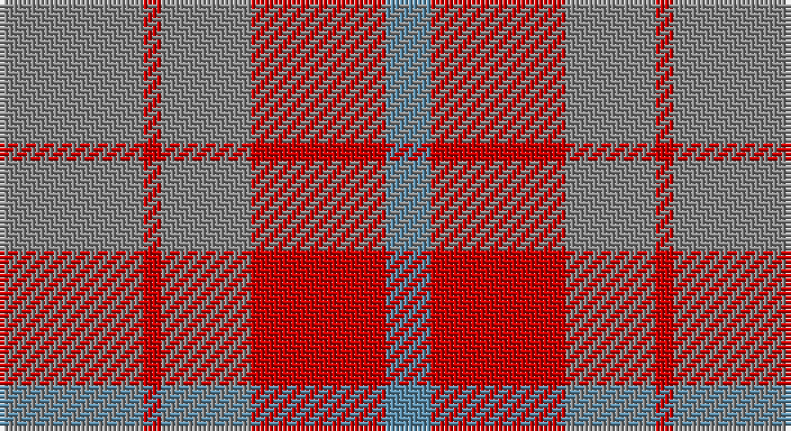

This page is one **sett** — a single exact thread-count. It belongs to the [tartan](/setts/o16r2o10r15t5/)
(the same proportion at any scale), whose colour order is pattern [BRRRR](/stripes/brrrr/).

Part of the [Mowbray](/tartans/mowbray/) tartan — the named design grouping this sett with its other cloths.

Sourced from house-of-tartan.  It is a [5 stripe tartan](/stripes/stripes5/).

Original link http://www.house-of-tartan.scotland.net/house/TartanViewjs.asp?colr=Def&tnam=565

## Provenance

Earliest known date: 1983 Designed C.1984 by Peter MacDonald for a Mr Mowbray in the USA. Sometimes woven with green in place of gray, and blue in place of azure.

## Also known as

This cloth is also recorded under:

- Mowbray,

## Thread count
N/32 R4 N20 R30 B/10

One full sett is **150 threads**.

## Palette

Palette: <strong>Tartan Register</strong>
<table><thead><tr><th>Colour</th><th>Threads</th><th>Shade</th><th>Base</th><th>OKLCh</th></tr></thead><tbody><tr><td>N/</td><td style="text-align:right;font-variant-numeric:tabular-nums">32</td><td><code style="background-color:#888888;">#888888</code> <small style="color:#888">#888888</small></td><td>R <code style="background-color:#CC0000;">#CC0000</code></td><td><small style="color:#888">oklch(62.7% 0.000 89.9)</small></td></tr><tr><td>R</td><td style="text-align:right;font-variant-numeric:tabular-nums">4</td><td><code style="background-color:#C80000;">#C80000</code> <small style="color:#888">#C80000</small></td><td>R <code style="background-color:#CC0000;">#CC0000</code></td><td><small style="color:#888">oklch(52.3% 0.215 29.2)</small></td></tr><tr><td>N</td><td style="text-align:right;font-variant-numeric:tabular-nums">20</td><td><code style="background-color:#888888;">#888888</code> <small style="color:#888">#888888</small></td><td>R <code style="background-color:#CC0000;">#CC0000</code></td><td><small style="color:#888">oklch(62.7% 0.000 89.9)</small></td></tr><tr><td>R</td><td style="text-align:right;font-variant-numeric:tabular-nums">30</td><td><code style="background-color:#C80000;">#C80000</code> <small style="color:#888">#C80000</small></td><td>R <code style="background-color:#CC0000;">#CC0000</code></td><td><small style="color:#888">oklch(52.3% 0.215 29.2)</small></td></tr><tr><td>B/</td><td style="text-align:right;font-variant-numeric:tabular-nums">10</td><td><code style="background-color:#5C8CA8;">#5C8CA8</code> <small style="color:#888">#5C8CA8</small></td><td>B <code style="background-color:#2A418A;">#2A418A</code></td><td><small style="color:#888">oklch(61.7% 0.067 235.0)</small></td></tr></tbody></table>

# Sample pattern

## Compared to the master

This cloth is one sett of its design; the master sett (the exemplar the design is anchored on) is below for comparison.

<figure style="margin:0"><figcaption style="color:#888;font-size:smaller">this sett</figcaption></figure>
<figure style="margin:0"><figcaption style="color:#888;font-size:smaller"><a href="/setts/n16r2n10r14t5/">master sett →</a></figcaption></figure>

## Nearest tartans

The nearest existing variants by ΔTartan distance, with this tartan at the top so the swatches line up against it.

ΔTartan

Tartan

Sett

—

<a href="/ttd/edit/#slug=o16r2o10r15t5~x2">Mowbray (Moubray) Family Tartan</a> <a class="nn-out" href="/variants/s5/o16r2o10r15t5~x2/" title="open its dictionary page">↗</a>

0.26

<a href="/ttd/edit/#slug=y16r2y10r15t5~x2&amp;base=o16r2o10r15t5~x2">Mowbray, (Moubray)</a> <a class="nn-out" href="/variants/s5/y16r2y10r15t5~x2/" title="open its dictionary page">↗</a>

1.40

<a href="/ttd/edit/#slug=n16r2n10r14t5~x2&amp;base=o16r2o10r15t5~x2">Mowbray (Personal)</a> <a class="nn-out" href="/variants/s5/n16r2n10r14t5~x2/" title="open its dictionary page">↗</a>

1.79

<a href="/ttd/edit/#slug=dy4lg11dy14o30r4~x2&amp;base=o16r2o10r15t5~x2">Trinity Bicycles</a> <a class="nn-out" href="/variants/s5/dy4lg11dy14o30r4~x2/" title="open its dictionary page">↗</a>

1.81

<a href="/ttd/edit/#slug=t6lo28o20t3~x2&amp;base=o16r2o10r15t5~x2">Prince of Orange</a> <a class="nn-out" href="/variants/s4/t6lo28o20t3~x2/" title="open its dictionary page">↗</a>

1.83

<a href="/ttd/edit/#slug=w1o6loi4o4lo1~x10&amp;base=o16r2o10r15t5~x2">Amber Rose (Fashion)</a> <a class="nn-out" href="/variants/s5/w1o6loi4o4lo1~x10/" title="open its dictionary page">↗</a>

2.03

<a href="/ttd/edit/#slug=r3lo8r3lo20dy20lo3dy8lo3~x2&amp;base=o16r2o10r15t5~x2">Miyuki #4</a> <a class="nn-out" href="/variants/s8/r3lo8r3lo20dy20lo3dy8lo3~x2/" title="open its dictionary page">↗</a>

2.04

<a href="/ttd/edit/#slug=o15r5o30db32o4ly3~x2&amp;base=o16r2o10r15t5~x2">Cameron, hunting</a> <a class="nn-out" href="/variants/s6/o15r5o30db32o4ly3~x2/" title="open its dictionary page">↗</a>

2.16

<a href="/ttd/edit/#slug=n7r1dt6r8lr1~x8&amp;base=o16r2o10r15t5~x2">Callum (Buchan) (Name)</a> <a class="nn-out" href="/variants/s5/n7r1dt6r8lr1~x8/" title="open its dictionary page">↗</a>

2.16

<a href="/ttd/edit/#slug=db16o2db16o19r4~x3&amp;base=o16r2o10r15t5~x2">Unidentified 17</a> <a class="nn-out" href="/variants/s5/db16o2db16o19r4~x3/" title="open its dictionary page">↗</a>

2.19

<a href="/ttd/edit/#slug=t6lo28dy20t3~x2&amp;base=o16r2o10r15t5~x2">Prince of Orange Tartan</a> <a class="nn-out" href="/variants/s4/t6lo28dy20t3~x2/" title="open its dictionary page">↗</a>

## Neighbour map

Every grey dot is one of 14360 variants placed by the first two principal components of the ΔTartan feature space (44% of its variance). Red is this tartan; blue dots are its nearest — click one to open its page.

<svg viewBox="0 0 640 380" role="img" style="max-width:100%;height:auto;border:1px solid #e0e0e0;border-radius:4px;display:block" xmlns="http://www.w3.org/2000/svg"><image href="/nn/cloud.v1.png" width="640" height="380"/><a href="/variants/s5/y16r2y10r15t5~x2/"><circle cx="373.9" cy="299.1" r="4" fill="#3465a4"><title>Mowbray, (Moubray)</title></circle></a><a href="/variants/s5/n16r2n10r14t5~x2/"><circle cx="397.5" cy="318.7" r="4" fill="#3465a4"><title>Mowbray (Personal)</title></circle></a><a href="/variants/s5/dy4lg11dy14o30r4~x2/"><circle cx="317.1" cy="270.9" r="4" fill="#3465a4"><title>Trinity Bicycles</title></circle></a><a href="/variants/s4/t6lo28o20t3~x2/"><circle cx="328.9" cy="260.1" r="4" fill="#3465a4"><title>Prince of Orange</title></circle></a><a href="/variants/s5/w1o6loi4o4lo1~x10/"><circle cx="373.5" cy="286.0" r="4" fill="#3465a4"><title>Amber Rose (Fashion)</title></circle></a><a href="/variants/s8/r3lo8r3lo20dy20lo3dy8lo3~x2/"><circle cx="350.3" cy="256.4" r="4" fill="#3465a4"><title>Miyuki #4</title></circle></a><a href="/variants/s6/o15r5o30db32o4ly3~x2/"><circle cx="378.5" cy="245.6" r="4" fill="#3465a4"><title>Cameron, hunting</title></circle></a><a href="/variants/s5/n7r1dt6r8lr1~x8/"><circle cx="258.2" cy="263.9" r="4" fill="#3465a4"><title>Callum (Buchan) (Name)</title></circle></a><a href="/variants/s5/db16o2db16o19r4~x3/"><circle cx="408.0" cy="307.9" r="4" fill="#3465a4"><title>Unidentified 17</title></circle></a><a href="/variants/s4/t6lo28dy20t3~x2/"><circle cx="321.9" cy="262.6" r="4" fill="#3465a4"><title>Prince of Orange Tartan</title></circle></a><circle cx="368.8" cy="295.2" r="5" fill="#c00000"/></svg>

ID: /variants/s5/o16r2o10r15t5~x2/
