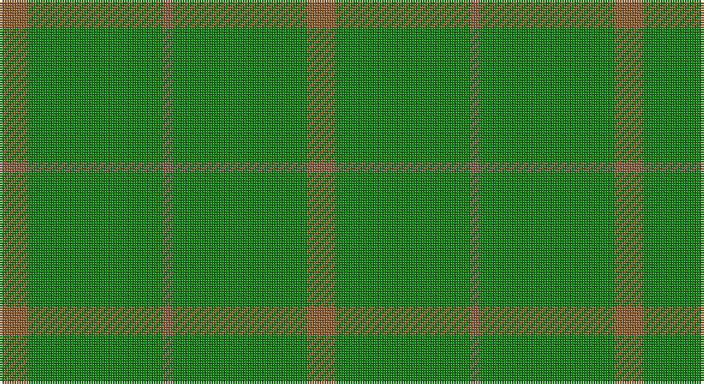

This page is one **sett** — a single exact thread-count. It belongs to the [tartan](/setts/o3g14oi1g14o3/)
(the same proportion at any scale), whose colour order is pattern [RGRGR](/stripes/rgrgr/).

Sourced from weddslist.  It is a [5 stripe tartan](/stripes/stripes5/).

Original link http://www.weddslist.com/cgi-bin/tartans/pg.pl?source=sts

## Thread count
LT/12 G56 LTa4 G56 LT/12

One full sett is **256 threads**.

## Palette

Palette: <strong>custom</strong>
<table><thead><tr><th>Colour</th><th>Threads</th><th>Shade</th><th>Base</th><th>OKLCh</th></tr></thead><tbody><tr><td>LT/</td><td style="text-align:right;font-variant-numeric:tabular-nums">12</td><td><code style="background-color:#906030;">#906030</code> <small style="color:#888">#906030</small></td><td>R <code style="background-color:#CC0000;">#CC0000</code></td><td><small style="color:#888">oklch(53.1% 0.089 63.7)</small></td></tr><tr><td>G</td><td style="text-align:right;font-variant-numeric:tabular-nums">56</td><td><code style="background-color:#008000;">#008000</code> <small style="color:#888">#008000</small></td><td>G <code style="background-color:#006100;">#006100</code></td><td><small style="color:#888">oklch(52.0% 0.177 142.5)</small></td></tr><tr><td>LTa</td><td style="text-align:right;font-variant-numeric:tabular-nums">4</td><td><code style="background-color:#806050;">#806050</code> <small style="color:#888">#806050</small></td><td>R <code style="background-color:#CC0000;">#CC0000</code></td><td><small style="color:#888">oklch(51.7% 0.049 47.8)</small></td></tr><tr><td>G</td><td style="text-align:right;font-variant-numeric:tabular-nums">56</td><td><code style="background-color:#008000;">#008000</code> <small style="color:#888">#008000</small></td><td>G <code style="background-color:#006100;">#006100</code></td><td><small style="color:#888">oklch(52.0% 0.177 142.5)</small></td></tr><tr><td>LT/</td><td style="text-align:right;font-variant-numeric:tabular-nums">12</td><td><code style="background-color:#906030;">#906030</code> <small style="color:#888">#906030</small></td><td>R <code style="background-color:#CC0000;">#CC0000</code></td><td><small style="color:#888">oklch(53.1% 0.089 63.7)</small></td></tr></tbody></table>

# Sample pattern

## Nearest tartans

The nearest existing variants by ΔTartan distance, with this tartan at the top so the swatches line up against it.

ΔTartan

Tartan

Sett

—

<a href="/ttd/edit/#slug=o3g14oi1g14o3~x4">Pearson</a> <a class="nn-out" href="/variants/s5/o3g14oi1g14o3~x4/" title="open its dictionary page">↗</a>

1.51

<a href="/ttd/edit/#slug=lo3g14dy1g14lo3~x4&amp;base=o3g14oi1g14o3~x4">Pearson Family Tartan</a> <a class="nn-out" href="/variants/s5/lo3g14dy1g14lo3~x4/" title="open its dictionary page">↗</a>

2.15

<a href="/ttd/edit/#slug=g2dy2g15dy1w1g15dy2g2~x2&amp;base=o3g14oi1g14o3~x4">Bannockbane Hunting Trade Tartan</a> <a class="nn-out" href="/variants/s8/g2dy2g15dy1w1g15dy2g2~x2/" title="open its dictionary page">↗</a>

2.37

<a href="/ttd/edit/#slug=g2o2g15o1w1g15o2g2~x2&amp;base=o3g14oi1g14o3~x4">Bannockbane, hunting</a> <a class="nn-out" href="/variants/s8/g2o2g15o1w1g15o2g2~x2/" title="open its dictionary page">↗</a>

2.69

<a href="/ttd/edit/#slug=g13dy3g1do3dy1~x6&amp;base=o3g14oi1g14o3~x4">Glen Boig</a> <a class="nn-out" href="/variants/s5/g13dy3g1do3dy1~x6/" title="open its dictionary page">↗</a>

2.96

<a href="/ttd/edit/#slug=g18r6g75db6g13dy35g12db6&amp;base=o3g14oi1g14o3~x4">Glenlivet Corporate Tartan</a> <a class="nn-out" href="/variants/s8/g18r6g75db6g13dy35g12db6/" title="open its dictionary page">↗</a>

2.96

<a href="/ttd/edit/#slug=dg22k3dg25k4~x2&amp;base=o3g14oi1g14o3~x4">Campbell Simpson</a> <a class="nn-out" href="/variants/s4/dg22k3dg25k4~x2/" title="open its dictionary page">↗</a>

3.15

<a href="/ttd/edit/#slug=gi40dg15g4dg4g4~x2&amp;base=o3g14oi1g14o3~x4">Celtic 2009 (Sports)</a> <a class="nn-out" href="/variants/s5/gi40dg15g4dg4g4~x2/" title="open its dictionary page">↗</a>

3.16

<a href="/ttd/edit/#slug=y72k8y4dy16y7o2~x2&amp;base=o3g14oi1g14o3~x4">MacAndrew Hunting (Name)</a> <a class="nn-out" href="/variants/s6/y72k8y4dy16y7o2~x2/" title="open its dictionary page">↗</a>

3.16

<a href="/ttd/edit/#slug=gi3lo1gi3r1gi14dg2gi3dg1gi3g1gi2g1gi2g2~x4&amp;base=o3g14oi1g14o3~x4">New South Wales</a> <a class="nn-out" href="/variants/s14/gi3lo1gi3r1gi14dg2gi3dg1gi3g1gi2g1gi2g2~x4/" title="open its dictionary page">↗</a>

3.16

<a href="/ttd/edit/#slug=dg18r6dg75db6dg13dy35dg12db6&amp;base=o3g14oi1g14o3~x4">Gayre Bodyguard</a> <a class="nn-out" href="/variants/s8/dg18r6dg75db6dg13dy35dg12db6/" title="open its dictionary page">↗</a>

## Neighbour map

Every grey dot is one of 14360 variants placed by the first two principal components of the ΔTartan feature space (44% of its variance). Red is this tartan; blue dots are its nearest — click one to open its page.

<svg viewBox="0 0 640 380" role="img" style="max-width:100%;height:auto;border:1px solid #e0e0e0;border-radius:4px;display:block" xmlns="http://www.w3.org/2000/svg"><image href="/nn/cloud.v1.png" width="640" height="380"/><a href="/variants/s5/lo3g14dy1g14lo3~x4/"><circle cx="608.6" cy="298.3" r="4" fill="#3465a4"><title>Pearson Family Tartan</title></circle></a><a href="/variants/s8/g2dy2g15dy1w1g15dy2g2~x2/"><circle cx="626.0" cy="258.4" r="4" fill="#3465a4"><title>Bannockbane Hunting Trade Tartan</title></circle></a><a href="/variants/s8/g2o2g15o1w1g15o2g2~x2/"><circle cx="626.0" cy="248.8" r="4" fill="#3465a4"><title>Bannockbane, hunting</title></circle></a><a href="/variants/s5/g13dy3g1do3dy1~x6/"><circle cx="568.6" cy="306.9" r="4" fill="#3465a4"><title>Glen Boig</title></circle></a><a href="/variants/s8/g18r6g75db6g13dy35g12db6/"><circle cx="498.1" cy="244.0" r="4" fill="#3465a4"><title>Glenlivet Corporate Tartan</title></circle></a><a href="/variants/s4/dg22k3dg25k4~x2/"><circle cx="626.0" cy="363.0" r="4" fill="#3465a4"><title>Campbell Simpson</title></circle></a><a href="/variants/s5/gi40dg15g4dg4g4~x2/"><circle cx="488.1" cy="307.3" r="4" fill="#3465a4"><title>Celtic 2009 (Sports)</title></circle></a><a href="/variants/s6/y72k8y4dy16y7o2~x2/"><circle cx="626.0" cy="208.3" r="4" fill="#3465a4"><title>MacAndrew Hunting (Name)</title></circle></a><a href="/variants/s14/gi3lo1gi3r1gi14dg2gi3dg1gi3g1gi2g1gi2g2~x4/"><circle cx="553.7" cy="208.9" r="4" fill="#3465a4"><title>New South Wales</title></circle></a><a href="/variants/s8/dg18r6dg75db6dg13dy35dg12db6/"><circle cx="541.3" cy="270.0" r="4" fill="#3465a4"><title>Gayre Bodyguard</title></circle></a><circle cx="626.0" cy="316.5" r="5" fill="#c00000"/></svg>

ID: /variants/s5/o3g14oi1g14o3~x4/
