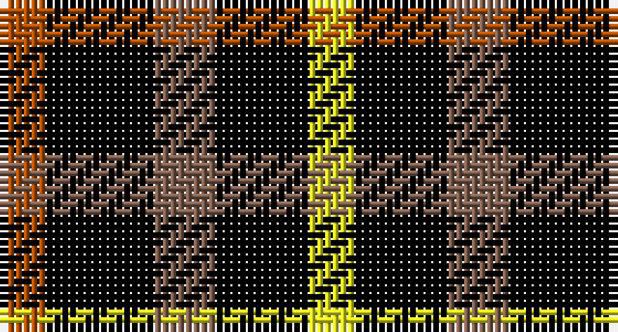

This page is one **sett** — a single exact thread-count. It belongs to the [tartan](/setts/o3k7oi4k6ly3/)
(the same proportion at any scale), whose colour order is pattern [RKRKY](/stripes/rkrky/).

Part of the [Daks](/tartans/daks/) tartan — the named design grouping this sett with its other cloths.

Sourced from weddslist.  It is a [5 stripe tartan](/stripes/stripes5/).

Original link http://www.weddslist.com/cgi-bin/tartans/pg.pl?source=sts

## Also known as

This cloth is also recorded under:

- Daks Muted blue
- Daks, Black
- Daks, Muted blue

## Thread count
DO/6 K14 LT8 K12 Y/6

One full sett is **80 threads**.

## Palette

Palette: <strong>Ingles Buchan</strong> <small style="color:#888">(1 of 4 colours)</small>
<table><thead><tr><th>Colour</th><th>Threads</th><th>Shade</th><th>Base</th><th>OKLCh</th></tr></thead><tbody><tr><td>DO/</td><td style="text-align:right;font-variant-numeric:tabular-nums">6</td><td><code style="background-color:#B05000;">#B05000</code> <small style="color:#888">#B05000</small></td><td>R <code style="background-color:#CC0000;">#CC0000</code></td><td><small style="color:#888">oklch(54.4% 0.145 49.4)</small></td></tr><tr><td>K</td><td style="text-align:right;font-variant-numeric:tabular-nums">14</td><td><code style="background-color:#000000;">#000000</code> <small style="color:#888">#000000</small></td><td>K <code style="background-color:#000000;">#000000</code></td><td><small style="color:#888">oklch(0.0% 0.000 0.0)</small></td></tr><tr><td>LT</td><td style="text-align:right;font-variant-numeric:tabular-nums">8</td><td><code style="background-color:#806050;">#806050</code> <small style="color:#888">#806050</small></td><td>R <code style="background-color:#CC0000;">#CC0000</code></td><td><small style="color:#888">oklch(51.7% 0.049 47.8)</small></td></tr><tr><td>K</td><td style="text-align:right;font-variant-numeric:tabular-nums">12</td><td><code style="background-color:#000000;">#000000</code> <small style="color:#888">#000000</small></td><td>K <code style="background-color:#000000;">#000000</code></td><td><small style="color:#888">oklch(0.0% 0.000 0.0)</small></td></tr><tr><td>Y/</td><td style="text-align:right;font-variant-numeric:tabular-nums">6</td><td><code style="background-color:#F0F020;">#F0F020</code> <small style="color:#888">#F0F020</small></td><td>Y <code style="background-color:#F2BF00;">#F2BF00</code></td><td><small style="color:#888">oklch(92.5% 0.196 109.7)</small></td></tr></tbody></table>

# Sample pattern

## Compared to the master

This cloth is one sett of its design; the master sett (the exemplar the design is anchored on) is below for comparison.

<figure style="margin:0"><figcaption style="color:#888;font-size:smaller">this sett</figcaption></figure>
<figure style="margin:0"><figcaption style="color:#888;font-size:smaller"><a href="/setts/db3dy7g2y2g14dy2g2db3/">master sett →</a></figcaption></figure>

## Nearest tartans

The nearest existing variants by ΔTartan distance, with this tartan at the top so the swatches line up against it.

ΔTartan

Tartan

Sett

—

<a href="/ttd/edit/#slug=o3k7oi4k6ly3~x2">Daks - Black House Check, C.6700.06</a> <a class="nn-out" href="/variants/s5/o3k7oi4k6ly3~x2/" title="open its dictionary page">↗</a>

1.06

<a href="/ttd/edit/#slug=r3k6dy4k6ly3~x2&amp;base=o3k7oi4k6ly3~x2">Daks, Black (Fashion)</a> <a class="nn-out" href="/variants/s5/r3k6dy4k6ly3~x2/" title="open its dictionary page">↗</a>

1.76

<a href="/ttd/edit/#slug=k5g4r2~x2&amp;base=o3k7oi4k6ly3~x2">Wilson's, No 94</a> <a class="nn-out" href="/variants/s3/k5g4r2~x2/" title="open its dictionary page">↗</a>

1.85

<a href="/ttd/edit/#slug=k6g5r2~x2&amp;base=o3k7oi4k6ly3~x2">Glen Lyon</a> <a class="nn-out" href="/variants/s3/k6g5r2~x2/" title="open its dictionary page">↗</a>

1.90

<a href="/ttd/edit/#slug=k23g8lo8~x4&amp;base=o3k7oi4k6ly3~x2">Zwijnenberg, Frans (Personal)</a> <a class="nn-out" href="/variants/s3/k23g8lo8~x4/" title="open its dictionary page">↗</a>

1.93

<a href="/ttd/edit/#slug=k13dy28lo13dy28k18w18k13~x2&amp;base=o3k7oi4k6ly3~x2">Boxer Beauty</a> <a class="nn-out" href="/variants/s7/k13dy28lo13dy28k18w18k13~x2/" title="open its dictionary page">↗</a>

2.02

<a href="/ttd/edit/#slug=k5g3t2~x2&amp;base=o3k7oi4k6ly3~x2">Glen Lyon, or Mull (No.53)</a> <a class="nn-out" href="/variants/s3/k5g3t2~x2/" title="open its dictionary page">↗</a>

2.08

<a href="/ttd/edit/#slug=r3k6dy4k6y3~x2&amp;base=o3k7oi4k6ly3~x2">Daks (Black)</a> <a class="nn-out" href="/variants/s5/r3k6dy4k6y3~x2/" title="open its dictionary page">↗</a>

2.12

<a href="/ttd/edit/#slug=k23g8ly8~x4&amp;base=o3k7oi4k6ly3~x2">Zwijnenberg, Frans (Personal)</a> <a class="nn-out" href="/variants/s3/k23g8ly8~x4/" title="open its dictionary page">↗</a>

2.13

<a href="/ttd/edit/#slug=g3dp3w1dp3g3r1~x4&amp;base=o3k7oi4k6ly3~x2">Wilson's No.113</a> <a class="nn-out" href="/variants/s6/g3dp3w1dp3g3r1~x4/" title="open its dictionary page">↗</a>

2.15

<a href="/ttd/edit/#slug=r10db6k8g10r6g3r6~x2&amp;base=o3k7oi4k6ly3~x2">MacDuff</a> <a class="nn-out" href="/variants/s7/r10db6k8g10r6g3r6~x2/" title="open its dictionary page">↗</a>

## Neighbour map

Every grey dot is one of 14360 variants placed by the first two principal components of the ΔTartan feature space (44% of its variance). Red is this tartan; blue dots are its nearest — click one to open its page.

<svg viewBox="0 0 640 380" role="img" style="max-width:100%;height:auto;border:1px solid #e0e0e0;border-radius:4px;display:block" xmlns="http://www.w3.org/2000/svg"><image href="/nn/cloud.v1.png" width="640" height="380"/><a href="/variants/s5/r3k6dy4k6ly3~x2/"><circle cx="146.6" cy="328.9" r="4" fill="#3465a4"><title>Daks, Black (Fashion)</title></circle></a><a href="/variants/s3/k5g4r2~x2/"><circle cx="147.8" cy="356.1" r="4" fill="#3465a4"><title>Wilson's, No 94</title></circle></a><a href="/variants/s3/k6g5r2~x2/"><circle cx="168.4" cy="343.5" r="4" fill="#3465a4"><title>Glen Lyon</title></circle></a><a href="/variants/s3/k23g8lo8~x4/"><circle cx="241.3" cy="325.1" r="4" fill="#3465a4"><title>Zwijnenberg, Frans (Personal)</title></circle></a><a href="/variants/s7/k13dy28lo13dy28k18w18k13~x2/"><circle cx="83.4" cy="299.3" r="4" fill="#3465a4"><title>Boxer Beauty</title></circle></a><a href="/variants/s3/k5g3t2~x2/"><circle cx="164.9" cy="356.5" r="4" fill="#3465a4"><title>Glen Lyon, or Mull (No.53)</title></circle></a><a href="/variants/s5/r3k6dy4k6y3~x2/"><circle cx="184.7" cy="350.0" r="4" fill="#3465a4"><title>Daks (Black)</title></circle></a><a href="/variants/s3/k23g8ly8~x4/"><circle cx="240.8" cy="320.6" r="4" fill="#3465a4"><title>Zwijnenberg, Frans (Personal)</title></circle></a><a href="/variants/s6/g3dp3w1dp3g3r1~x4/"><circle cx="148.6" cy="298.4" r="4" fill="#3465a4"><title>Wilson's No.113</title></circle></a><a href="/variants/s7/r10db6k8g10r6g3r6~x2/"><circle cx="115.2" cy="284.7" r="4" fill="#3465a4"><title>MacDuff</title></circle></a><circle cx="152.6" cy="312.6" r="5" fill="#c00000"/></svg>

ID: /variants/s5/o3k7oi4k6ly3~x2/
