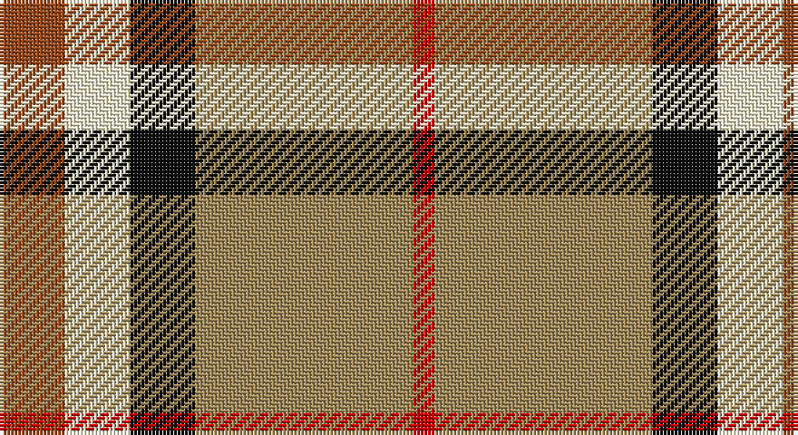

This page is one **sett** — a single exact thread-count. It belongs to the [tartan](/setts/o3w3k3lo10r1/)
(the same proportion at any scale), whose colour order is pattern [RWKYR](/stripes/rwkyr/).

Sourced from register-of-tartans.  It is a [5 stripe tartan](/stripes/stripes5/).

Original link https://www.tartanregister.gov.uk/tartanDetails.aspx?ref=441

## Register references

External register numbers recorded for this tartan.

- Scottish Register of Tartans: [441](https://www.tartanregister.gov.uk/tartanDetails.aspx?ref=441)
- Scottish Tartans Authority (ITI): 7049

## Thread count
T/18 LYa18 K18 LT60 R/6

One full sett is **216 threads**.

## Palette

Palette: <strong>Tartan Register</strong> <small style="color:#888">(6 of 8 colours)</small>
<table><thead><tr><th>Colour</th><th>Threads</th><th>Shade</th><th>Base</th><th>OKLCh</th></tr></thead><tbody><tr><td>T/</td><td style="text-align:right;font-variant-numeric:tabular-nums">18</td><td><code style="background-color:#98481C;">#98481C</code> <small style="color:#888">#98481C</small></td><td>R <code style="background-color:#CC0000;">#CC0000</code></td><td><small style="color:#888">oklch(49.6% 0.121 46.1)</small></td></tr><tr><td>LYa</td><td style="text-align:right;font-variant-numeric:tabular-nums">18</td><td><code style="background-color:#F8F4D0;">#F8F4D0</code> <small style="color:#888">#F8F4D0</small></td><td>W <code style="background-color:#F7F7F7;">#F7F7F7</code></td><td><small style="color:#888">oklch(96.1% 0.047 102.0)</small></td></tr><tr><td>K</td><td style="text-align:right;font-variant-numeric:tabular-nums">18</td><td><code style="background-color:#101010;">#101010</code> <small style="color:#888">#101010</small></td><td>K <code style="background-color:#000000;">#000000</code></td><td><small style="color:#888">oklch(17.3% 0.000 89.9)</small></td></tr><tr><td>LT</td><td style="text-align:right;font-variant-numeric:tabular-nums">60</td><td><code style="background-color:#A08858;">#A08858</code> <small style="color:#888">#A08858</small></td><td>Y <code style="background-color:#F2BF00;">#F2BF00</code></td><td><small style="color:#888">oklch(63.7% 0.071 84.0)</small></td></tr><tr><td>R/</td><td style="text-align:right;font-variant-numeric:tabular-nums">6</td><td><code style="background-color:#C80000;">#C80000</code> <small style="color:#888">#C80000</small></td><td>R <code style="background-color:#CC0000;">#CC0000</code></td><td><small style="color:#888">oklch(52.3% 0.215 29.2)</small></td></tr></tbody></table>

# Sample pattern

## Nearest tartans

The nearest existing variants by ΔTartan distance, with this tartan at the top so the swatches line up against it.

ΔTartan

Tartan

Sett

—

<a href="/ttd/edit/#slug=o3w3k3lo10r1~x6">Burberry Counterfeit</a> <a class="nn-out" href="/variants/s5/o3w3k3lo10r1~x6/" title="open its dictionary page">↗</a>

1.10

<a href="/ttd/edit/#slug=ly25r10g10db11w2~x2&amp;base=o3w3k3lo10r1~x6">Samye</a> <a class="nn-out" href="/variants/s5/ly25r10g10db11w2~x2/" title="open its dictionary page">↗</a>

1.16

<a href="/ttd/edit/#slug=r3w33dp8dg18r9g3~x2&amp;base=o3w3k3lo10r1~x6">MacKintosh Dress (Dance)</a> <a class="nn-out" href="/variants/s6/r3w33dp8dg18r9g3~x2/" title="open its dictionary page">↗</a>

1.22

<a href="/ttd/edit/#slug=k5db4g24r21w3~x2&amp;base=o3w3k3lo10r1~x6">Sachie Hara Scottish Check (Personal)</a> <a class="nn-out" href="/variants/s5/k5db4g24r21w3~x2/" title="open its dictionary page">↗</a>

1.25

<a href="/ttd/edit/#slug=ly15r9t30w3db4~x2&amp;base=o3w3k3lo10r1~x6">S.I.D.E. (Corporate)</a> <a class="nn-out" href="/variants/s5/ly15r9t30w3db4~x2/" title="open its dictionary page">↗</a>

1.26

<a href="/ttd/edit/#slug=r24n4k4g4w13k2~x4&amp;base=o3w3k3lo10r1~x6">Rose White Dress</a> <a class="nn-out" href="/variants/s6/r24n4k4g4w13k2~x4/" title="open its dictionary page">↗</a>

1.27

<a href="/ttd/edit/#slug=k6w6k6lo21r2~x4&amp;base=o3w3k3lo10r1~x6">Burberry Check Corporate Tartan</a> <a class="nn-out" href="/variants/s5/k6w6k6lo21r2~x4/" title="open its dictionary page">↗</a>

1.29

<a href="/ttd/edit/#slug=k3w3k3ly10r1~x6&amp;base=o3w3k3lo10r1~x6">Burberry (Genuine)</a> <a class="nn-out" href="/variants/s5/k3w3k3ly10r1~x6/" title="open its dictionary page">↗</a>

1.30

<a href="/ttd/edit/#slug=g15ly3r3dp8w2~x6&amp;base=o3w3k3lo10r1~x6">ChuMac (Personal)</a> <a class="nn-out" href="/variants/s5/g15ly3r3dp8w2~x6/" title="open its dictionary page">↗</a>

1.32

<a href="/ttd/edit/#slug=db6lo25o16k2db3~x2&amp;base=o3w3k3lo10r1~x6">Prince of Orange</a> <a class="nn-out" href="/variants/s5/db6lo25o16k2db3~x2/" title="open its dictionary page">↗</a>

1.33

<a href="/ttd/edit/#slug=y26k10r10ly10y3~x2&amp;base=o3w3k3lo10r1~x6">Ikelman No 2</a> <a class="nn-out" href="/variants/s5/y26k10r10ly10y3~x2/" title="open its dictionary page">↗</a>

## Neighbour map

Every grey dot is one of 14360 variants placed by the first two principal components of the ΔTartan feature space (44% of its variance). Red is this tartan; blue dots are its nearest — click one to open its page.

<svg viewBox="0 0 640 380" role="img" style="max-width:100%;height:auto;border:1px solid #e0e0e0;border-radius:4px;display:block" xmlns="http://www.w3.org/2000/svg"><image href="/nn/cloud.v1.png" width="640" height="380"/><a href="/variants/s5/ly25r10g10db11w2~x2/"><circle cx="158.9" cy="184.5" r="4" fill="#3465a4"><title>Samye</title></circle></a><a href="/variants/s6/r3w33dp8dg18r9g3~x2/"><circle cx="175.2" cy="158.8" r="4" fill="#3465a4"><title>MacKintosh Dress (Dance)</title></circle></a><a href="/variants/s5/k5db4g24r21w3~x2/"><circle cx="193.5" cy="202.6" r="4" fill="#3465a4"><title>Sachie Hara Scottish Check (Personal)</title></circle></a><a href="/variants/s5/ly15r9t30w3db4~x2/"><circle cx="230.0" cy="193.7" r="4" fill="#3465a4"><title>S.I.D.E. (Corporate)</title></circle></a><a href="/variants/s6/r24n4k4g4w13k2~x4/"><circle cx="201.2" cy="152.3" r="4" fill="#3465a4"><title>Rose White Dress</title></circle></a><a href="/variants/s5/k6w6k6lo21r2~x4/"><circle cx="243.9" cy="198.7" r="4" fill="#3465a4"><title>Burberry Check Corporate Tartan</title></circle></a><a href="/variants/s5/k3w3k3ly10r1~x6/"><circle cx="222.6" cy="195.8" r="4" fill="#3465a4"><title>Burberry (Genuine)</title></circle></a><a href="/variants/s5/g15ly3r3dp8w2~x6/"><circle cx="205.2" cy="211.4" r="4" fill="#3465a4"><title>ChuMac (Personal)</title></circle></a><a href="/variants/s5/db6lo25o16k2db3~x2/"><circle cx="265.5" cy="189.8" r="4" fill="#3465a4"><title>Prince of Orange</title></circle></a><a href="/variants/s5/y26k10r10ly10y3~x2/"><circle cx="199.2" cy="216.5" r="4" fill="#3465a4"><title>Ikelman No 2</title></circle></a><circle cx="211.7" cy="187.0" r="5" fill="#c00000"/></svg>

ID: /variants/s5/o3w3k3lo10r1~x6/
