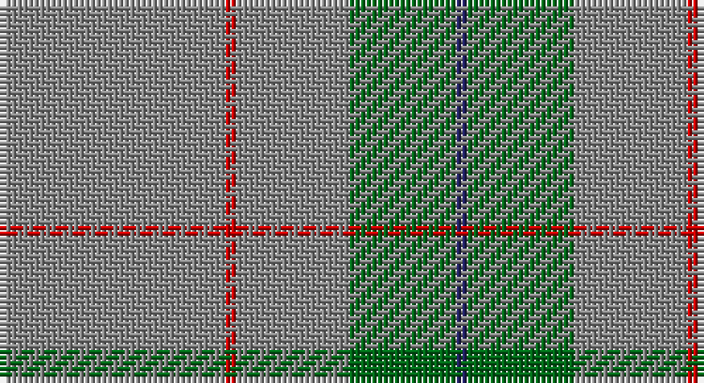

This page is one **sett** — a single exact thread-count. It belongs to the [tartan](/setts/o40r2o20g19db2/)
(the same proportion at any scale), whose colour order is pattern [BGRRR](/stripes/bgrrr/).

Part of the [Lloyd](/tartans/lloyd/) tartan — the named design grouping this sett with its other cloths.

Sourced from register-of-tartans.  It is a [5 stripe tartan](/stripes/stripes5/).

Original link https://www.tartanregister.gov.uk/tartanDetails.aspx?ref=2141

## Provenance

Earliest known date: 2002 The tartan for this Welsh surname and its variations, Floyd, Flood, is actually woven in Wales at the Cambrian Woollen Mill, weaving on the same site since 1830. This tartan differs from many traditional patterns in that the warp and weft differ, giving the finished worsted wool cloth more of a predominant stripe, vertically noticeable in the finished Kilt, or Cilt in Wales.

## Also known as

This cloth is also recorded under:

- Lloyd of Wales

2 attestations — the source records this cloth was collapsed from (oldest owns this page)

<ul>
<li>01/01/2002 — Lloyd of Wales (register-of-tartans, <a href="https://www.tartanregister.gov.uk/tartanDetails.aspx?ref=2141">record</a>)</li>
<li>undated — Lloyd Welsh Name Tartan (house-of-tartan, <a href="http://www.house-of-tartan.scotland.net/house/TartanViewjs.asp?colr=Def&tnam=5765">record</a>)</li>
</ul>

## Register references

External register numbers recorded for this tartan.

- Scottish Register of Tartans: [2141](https://www.tartanregister.gov.uk/tartanDetails.aspx?ref=2141)
- Scottish Tartans Authority (ITI): 5765

## Thread count
N/40 R2 N20 G19 DB/2

One full sett is **124 threads**.

## Palette

Palette: <strong>Tartan Register</strong>
<table><thead><tr><th>Colour</th><th>Threads</th><th>Shade</th><th>Base</th><th>OKLCh</th></tr></thead><tbody><tr><td>N/</td><td style="text-align:right;font-variant-numeric:tabular-nums">40</td><td><code style="background-color:#888888;">#888888</code> <small style="color:#888">#888888</small></td><td>R <code style="background-color:#CC0000;">#CC0000</code></td><td><small style="color:#888">oklch(62.7% 0.000 89.9)</small></td></tr><tr><td>R</td><td style="text-align:right;font-variant-numeric:tabular-nums">2</td><td><code style="background-color:#C80000;">#C80000</code> <small style="color:#888">#C80000</small></td><td>R <code style="background-color:#CC0000;">#CC0000</code></td><td><small style="color:#888">oklch(52.3% 0.215 29.2)</small></td></tr><tr><td>N</td><td style="text-align:right;font-variant-numeric:tabular-nums">20</td><td><code style="background-color:#888888;">#888888</code> <small style="color:#888">#888888</small></td><td>R <code style="background-color:#CC0000;">#CC0000</code></td><td><small style="color:#888">oklch(62.7% 0.000 89.9)</small></td></tr><tr><td>G</td><td style="text-align:right;font-variant-numeric:tabular-nums">19</td><td><code style="background-color:#006818;">#006818</code> <small style="color:#888">#006818</small></td><td>G <code style="background-color:#006100;">#006100</code></td><td><small style="color:#888">oklch(45.0% 0.142 145.0)</small></td></tr><tr><td>DB/</td><td style="text-align:right;font-variant-numeric:tabular-nums">2</td><td><code style="background-color:#202060;">#202060</code> <small style="color:#888">#202060</small></td><td>B <code style="background-color:#2A418A;">#2A418A</code></td><td><small style="color:#888">oklch(28.9% 0.111 276.9)</small></td></tr></tbody></table>

# Sample pattern

## Nearest tartans

The nearest existing variants by ΔTartan distance, with this tartan at the top so the swatches line up against it.

ΔTartan

Tartan

Sett

—

<a href="/ttd/edit/#slug=o40r2o20g19db2">Lloyd of Wales</a> <a class="nn-out" href="/variants/s5/o40r2o20g19db2/" title="open its dictionary page">↗</a>

1.01

<a href="/ttd/edit/#slug=y60g13y9r8ly4~x2&amp;base=o40r2o20g19db2">Ballantyne (Personal)</a> <a class="nn-out" href="/variants/s5/y60g13y9r8ly4~x2/" title="open its dictionary page">↗</a>

1.15

<a href="/ttd/edit/#slug=o60dg13o9oi8ly4~x2&amp;base=o40r2o20g19db2">Ballantyne Personal Tartan</a> <a class="nn-out" href="/variants/s5/o60dg13o9oi8ly4~x2/" title="open its dictionary page">↗</a>

1.71

<a href="/ttd/edit/#slug=o57w5g20o5lo10~x2&amp;base=o40r2o20g19db2">Johore (District)</a> <a class="nn-out" href="/variants/s5/o57w5g20o5lo10~x2/" title="open its dictionary page">↗</a>

1.85

<a href="/ttd/edit/#slug=n8g20w4r1~x5&amp;base=o40r2o20g19db2">Farooq (Personal)</a> <a class="nn-out" href="/variants/s4/n8g20w4r1~x5/" title="open its dictionary page">↗</a>

1.85

<a href="/ttd/edit/#slug=y57w5g20y5ly10&amp;base=o40r2o20g19db2">Jahore</a> <a class="nn-out" href="/variants/s5/y57w5g20y5ly10/" title="open its dictionary page">↗</a>

1.94

<a href="/ttd/edit/#slug=o57w5g20o5ly10&amp;base=o40r2o20g19db2">Jahore District Tartan</a> <a class="nn-out" href="/variants/s5/o57w5g20o5ly10/" title="open its dictionary page">↗</a>

1.96

<a href="/ttd/edit/#slug=db13k3db20o70db20o30w3~x2&amp;base=o40r2o20g19db2">Unidentified 21</a> <a class="nn-out" href="/variants/s7/db13k3db20o70db20o30w3~x2/" title="open its dictionary page">↗</a>

1.98

<a href="/ttd/edit/#slug=n65k2n4lr2n10r24~x2&amp;base=o40r2o20g19db2">Norsemen (Corporate)</a> <a class="nn-out" href="/variants/s6/n65k2n4lr2n10r24~x2/" title="open its dictionary page">↗</a>

1.98

<a href="/ttd/edit/#slug=db2n2lb1n18lb2r2~x4&amp;base=o40r2o20g19db2">St. Giles Cathedral (Corporate)</a> <a class="nn-out" href="/variants/s6/db2n2lb1n18lb2r2~x4/" title="open its dictionary page">↗</a>

2.05

<a href="/ttd/edit/#slug=n18w2k1w4g13n40r2~x2&amp;base=o40r2o20g19db2">Puxty-Dunne (Personal)</a> <a class="nn-out" href="/variants/s7/n18w2k1w4g13n40r2~x2/" title="open its dictionary page">↗</a>

## Neighbour map

Every grey dot is one of 14360 variants placed by the first two principal components of the ΔTartan feature space (44% of its variance). Red is this tartan; blue dots are its nearest — click one to open its page.

<svg viewBox="0 0 640 380" role="img" style="max-width:100%;height:auto;border:1px solid #e0e0e0;border-radius:4px;display:block" xmlns="http://www.w3.org/2000/svg"><image href="/nn/cloud.v1.png" width="640" height="380"/><a href="/variants/s5/y60g13y9r8ly4~x2/"><circle cx="526.7" cy="226.0" r="4" fill="#3465a4"><title>Ballantyne (Personal)</title></circle></a><a href="/variants/s5/o60dg13o9oi8ly4~x2/"><circle cx="505.7" cy="212.7" r="4" fill="#3465a4"><title>Ballantyne Personal Tartan</title></circle></a><a href="/variants/s5/o57w5g20o5lo10~x2/"><circle cx="420.7" cy="229.1" r="4" fill="#3465a4"><title>Johore (District)</title></circle></a><a href="/variants/s4/n8g20w4r1~x5/"><circle cx="414.7" cy="231.7" r="4" fill="#3465a4"><title>Farooq (Personal)</title></circle></a><a href="/variants/s5/y57w5g20y5ly10/"><circle cx="409.3" cy="223.5" r="4" fill="#3465a4"><title>Jahore</title></circle></a><a href="/variants/s5/o57w5g20o5ly10/"><circle cx="402.0" cy="218.9" r="4" fill="#3465a4"><title>Jahore District Tartan</title></circle></a><a href="/variants/s7/db13k3db20o70db20o30w3~x2/"><circle cx="460.1" cy="203.3" r="4" fill="#3465a4"><title>Unidentified 21</title></circle></a><a href="/variants/s6/n65k2n4lr2n10r24~x2/"><circle cx="578.6" cy="186.4" r="4" fill="#3465a4"><title>Norsemen (Corporate)</title></circle></a><a href="/variants/s6/db2n2lb1n18lb2r2~x4/"><circle cx="520.7" cy="185.4" r="4" fill="#3465a4"><title>St. Giles Cathedral (Corporate)</title></circle></a><a href="/variants/s7/n18w2k1w4g13n40r2~x2/"><circle cx="507.2" cy="150.1" r="4" fill="#3465a4"><title>Puxty-Dunne (Personal)</title></circle></a><circle cx="511.5" cy="233.3" r="5" fill="#c00000"/></svg>

ID: /variants/s5/o40r2o20g19db2/
