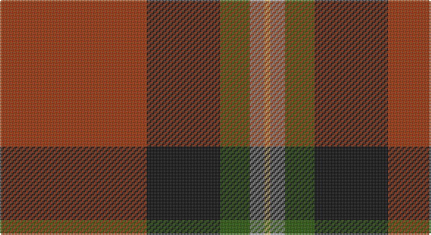

This page is one **sett** — a single exact thread-count. It belongs to the [tartan](/setts/o50k25dg10oi5ly2/)
(the same proportion at any scale), whose colour order is pattern [RKGRY](/stripes/rkgry/).

Sourced from register-of-tartans.  It is a [5 stripe tartan](/stripes/stripes5/).

Original link https://www.tartanregister.gov.uk/tartanDetails.aspx?ref=10289

## Register references

External register numbers recorded for this tartan.

- Scottish Register of Tartans: [10289](https://www.tartanregister.gov.uk/tartanDetails.aspx?ref=10289)

## Thread count
R/100 K50 G20 N10 LG/4

One full sett is **264 threads**.

## Palette

Palette: <strong>Tartan Register</strong> <small style="color:#888">(3 of 5 colours)</small>
<table><thead><tr><th>Colour</th><th>Threads</th><th>Shade</th><th>Base</th><th>OKLCh</th></tr></thead><tbody><tr><td>R/</td><td style="text-align:right;font-variant-numeric:tabular-nums">100</td><td><code style="background-color:#A03400;">#A03400</code> <small style="color:#888">#A03400</small></td><td>R <code style="background-color:#CC0000;">#CC0000</code></td><td><small style="color:#888">oklch(47.9% 0.152 39.6)</small></td></tr><tr><td>K</td><td style="text-align:right;font-variant-numeric:tabular-nums">50</td><td><code style="background-color:#101010;">#101010</code> <small style="color:#888">#101010</small></td><td>K <code style="background-color:#000000;">#000000</code></td><td><small style="color:#888">oklch(17.3% 0.000 89.9)</small></td></tr><tr><td>G</td><td style="text-align:right;font-variant-numeric:tabular-nums">20</td><td><code style="background-color:#285800;">#285800</code> <small style="color:#888">#285800</small></td><td>G <code style="background-color:#006100;">#006100</code></td><td><small style="color:#888">oklch(41.0% 0.122 135.8)</small></td></tr><tr><td>N</td><td style="text-align:right;font-variant-numeric:tabular-nums">10</td><td><code style="background-color:#888888;">#888888</code> <small style="color:#888">#888888</small></td><td>R <code style="background-color:#CC0000;">#CC0000</code></td><td><small style="color:#888">oklch(62.7% 0.000 89.9)</small></td></tr><tr><td>LG/</td><td style="text-align:right;font-variant-numeric:tabular-nums">4</td><td><code style="background-color:#C4A868;">#C4A868</code> <small style="color:#888">#C4A868</small></td><td>Y <code style="background-color:#F2BF00;">#F2BF00</code></td><td><small style="color:#888">oklch(74.2% 0.089 86.6)</small></td></tr></tbody></table>

# Sample pattern

## Nearest tartans

The nearest existing variants by ΔTartan distance, with this tartan at the top so the swatches line up against it.

ΔTartan

Tartan

Sett

—

<a href="/ttd/edit/#slug=o50k25dg10oi5ly2~x2">MacGleish Formal (Personal)</a> <a class="nn-out" href="/variants/s5/o50k25dg10oi5ly2~x2/" title="open its dictionary page">↗</a>

0.88

<a href="/ttd/edit/#slug=r25db7r3g13t1k2~x4&amp;base=o50k25dg10oi5ly2~x2">MacPhail</a> <a class="nn-out" href="/variants/s6/r25db7r3g13t1k2~x4/" title="open its dictionary page">↗</a>

1.13

<a href="/ttd/edit/#slug=r40b8r6g24t1k4~x2&amp;base=o50k25dg10oi5ly2~x2">MacPhail (Blue Bands)</a> <a class="nn-out" href="/variants/s6/r40b8r6g24t1k4~x2/" title="open its dictionary page">↗</a>

1.14

<a href="/ttd/edit/#slug=r50k25g10o5ly2~x2&amp;base=o50k25dg10oi5ly2~x2">MacGleish Formal (Personal)</a> <a class="nn-out" href="/variants/s5/r50k25g10o5ly2~x2/" title="open its dictionary page">↗</a>

1.16

<a href="/ttd/edit/#slug=dr18o9y9r1t1~x4&amp;base=o50k25dg10oi5ly2~x2">Jardine</a> <a class="nn-out" href="/variants/s5/dr18o9y9r1t1~x4/" title="open its dictionary page">↗</a>

1.20

<a href="/ttd/edit/#slug=r96db16dg34g48r18k6r9&amp;base=o50k25dg10oi5ly2~x2">MacDuff</a> <a class="nn-out" href="/variants/s7/r96db16dg34g48r18k6r9/" title="open its dictionary page">↗</a>

1.22

<a href="/ttd/edit/#slug=r25k7r3g13y1k2~x4&amp;base=o50k25dg10oi5ly2~x2">MacPhail</a> <a class="nn-out" href="/variants/s6/r25k7r3g13y1k2~x4/" title="open its dictionary page">↗</a>

1.27

<a href="/ttd/edit/#slug=r100k15g48db5r7db16~x2&amp;base=o50k25dg10oi5ly2~x2">Plummer (Personal)</a> <a class="nn-out" href="/variants/s6/r100k15g48db5r7db16~x2/" title="open its dictionary page">↗</a>

1.29

<a href="/ttd/edit/#slug=r27g4k4g4k4db6lo1~x4&amp;base=o50k25dg10oi5ly2~x2">MacLeay (Clan)</a> <a class="nn-out" href="/variants/s7/r27g4k4g4k4db6lo1~x4/" title="open its dictionary page">↗</a>

1.29

<a href="/ttd/edit/#slug=r24lb1k3lb1g14r8k3dp3lb2~x4&amp;base=o50k25dg10oi5ly2~x2">Leach (1995)</a> <a class="nn-out" href="/variants/s9/r24lb1k3lb1g14r8k3dp3lb2~x4/" title="open its dictionary page">↗</a>

1.31

<a href="/ttd/edit/#slug=k2r16dg6r3dg8lr1~x2&amp;base=o50k25dg10oi5ly2~x2">MacAulay</a> <a class="nn-out" href="/variants/s6/k2r16dg6r3dg8lr1~x2/" title="open its dictionary page">↗</a>

## Neighbour map

Every grey dot is one of 14360 variants placed by the first two principal components of the ΔTartan feature space (44% of its variance). Red is this tartan; blue dots are its nearest — click one to open its page.

<svg viewBox="0 0 640 380" role="img" style="max-width:100%;height:auto;border:1px solid #e0e0e0;border-radius:4px;display:block" xmlns="http://www.w3.org/2000/svg"><image href="/nn/cloud.v1.png" width="640" height="380"/><a href="/variants/s6/r25db7r3g13t1k2~x4/"><circle cx="327.3" cy="143.1" r="4" fill="#3465a4"><title>MacPhail</title></circle></a><a href="/variants/s6/r40b8r6g24t1k4~x2/"><circle cx="363.2" cy="130.7" r="4" fill="#3465a4"><title>MacPhail (Blue Bands)</title></circle></a><a href="/variants/s5/r50k25g10o5ly2~x2/"><circle cx="321.1" cy="146.9" r="4" fill="#3465a4"><title>MacGleish Formal (Personal)</title></circle></a><a href="/variants/s5/dr18o9y9r1t1~x4/"><circle cx="286.6" cy="192.7" r="4" fill="#3465a4"><title>Jardine</title></circle></a><a href="/variants/s7/r96db16dg34g48r18k6r9/"><circle cx="292.7" cy="160.0" r="4" fill="#3465a4"><title>MacDuff</title></circle></a><a href="/variants/s6/r25k7r3g13y1k2~x4/"><circle cx="350.5" cy="158.7" r="4" fill="#3465a4"><title>MacPhail</title></circle></a><a href="/variants/s6/r100k15g48db5r7db16~x2/"><circle cx="355.2" cy="163.9" r="4" fill="#3465a4"><title>Plummer (Personal)</title></circle></a><a href="/variants/s7/r27g4k4g4k4db6lo1~x4/"><circle cx="324.9" cy="121.0" r="4" fill="#3465a4"><title>MacLeay (Clan)</title></circle></a><a href="/variants/s9/r24lb1k3lb1g14r8k3dp3lb2~x4/"><circle cx="329.8" cy="129.9" r="4" fill="#3465a4"><title>Leach (1995)</title></circle></a><a href="/variants/s6/k2r16dg6r3dg8lr1~x2/"><circle cx="342.2" cy="198.2" r="4" fill="#3465a4"><title>MacAulay</title></circle></a><circle cx="341.0" cy="165.4" r="5" fill="#c00000"/></svg>

ID: /variants/s5/o50k25dg10oi5ly2~x2/
