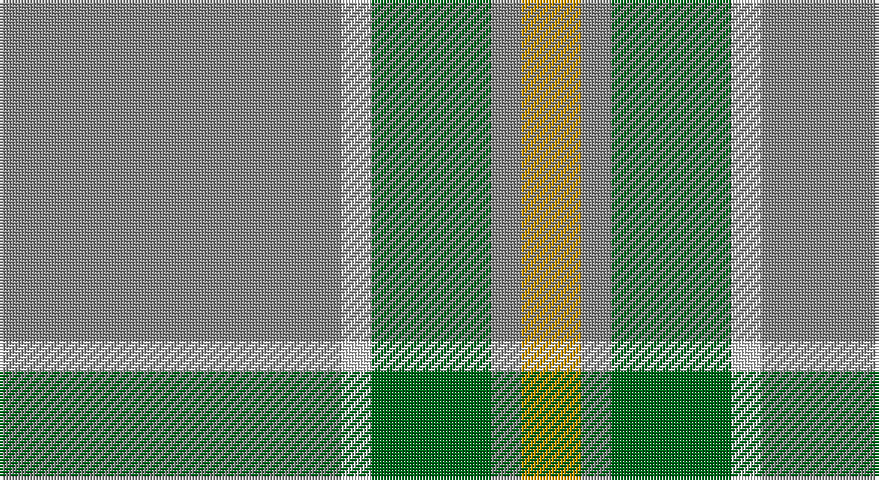

This page is one **sett** — a single exact thread-count. It belongs to the [tartan](/setts/o57w5g20o5lo10/)
(the same proportion at any scale), whose colour order is pattern [RWGRY](/stripes/rwgry/).

Sourced from tartans-authority.  It is a [5 stripe tartan](/stripes/stripes5/).

Original link http://www.tartansauthority.com/tartan-ferret/display/1309/

## Also known as

This cloth is also recorded under:

- Jahore

## Register references

External register numbers recorded for this tartan.

- Scottish Tartans Authority (ITI): 1309

## Thread count
N/114 LN10 G40 N10 DY/20

One full sett is **254 threads**.

## Palette

Palette: <strong>Tartan Register</strong> <small style="color:#888">(3 of 4 colours)</small>
<table><thead><tr><th>Colour</th><th>Threads</th><th>Shade</th><th>Base</th><th>OKLCh</th></tr></thead><tbody><tr><td>N/</td><td style="text-align:right;font-variant-numeric:tabular-nums">114</td><td><code style="background-color:#888888;">#888888</code> <small style="color:#888">#888888</small></td><td>R <code style="background-color:#CC0000;">#CC0000</code></td><td><small style="color:#888">oklch(62.7% 0.000 89.9)</small></td></tr><tr><td>LN</td><td style="text-align:right;font-variant-numeric:tabular-nums">10</td><td><code style="background-color:#E0E0E0;">#E0E0E0</code> <small style="color:#888">#E0E0E0</small></td><td>W <code style="background-color:#F7F7F7;">#F7F7F7</code></td><td><small style="color:#888">oklch(90.7% 0.000 89.9)</small></td></tr><tr><td>G</td><td style="text-align:right;font-variant-numeric:tabular-nums">40</td><td><code style="background-color:#006818;">#006818</code> <small style="color:#888">#006818</small></td><td>G <code style="background-color:#006100;">#006100</code></td><td><small style="color:#888">oklch(45.0% 0.142 145.0)</small></td></tr><tr><td>N</td><td style="text-align:right;font-variant-numeric:tabular-nums">10</td><td><code style="background-color:#888888;">#888888</code> <small style="color:#888">#888888</small></td><td>R <code style="background-color:#CC0000;">#CC0000</code></td><td><small style="color:#888">oklch(62.7% 0.000 89.9)</small></td></tr><tr><td>DY/</td><td style="text-align:right;font-variant-numeric:tabular-nums">20</td><td><code style="background-color:#D09800;">#D09800</code> <small style="color:#888">#D09800</small></td><td>Y <code style="background-color:#F2BF00;">#F2BF00</code></td><td><small style="color:#888">oklch(71.4% 0.147 82.1)</small></td></tr></tbody></table>

# Sample pattern

## Nearest tartans

The nearest existing variants by ΔTartan distance, with this tartan at the top so the swatches line up against it.

ΔTartan

Tartan

Sett

—

<a href="/ttd/edit/#slug=o57w5g20o5lo10~x2">Johore (District)</a> <a class="nn-out" href="/variants/s5/o57w5g20o5lo10~x2/" title="open its dictionary page">↗</a>

0.45

<a href="/ttd/edit/#slug=y57w5g20y5ly10&amp;base=o57w5g20o5lo10~x2">Jahore</a> <a class="nn-out" href="/variants/s5/y57w5g20y5ly10/" title="open its dictionary page">↗</a>

0.67

<a href="/ttd/edit/#slug=o57w5g20o5ly10&amp;base=o57w5g20o5lo10~x2">Jahore District Tartan</a> <a class="nn-out" href="/variants/s5/o57w5g20o5ly10/" title="open its dictionary page">↗</a>

1.26

<a href="/ttd/edit/#slug=n8g20w4r1~x5&amp;base=o57w5g20o5lo10~x2">Farooq (Personal)</a> <a class="nn-out" href="/variants/s4/n8g20w4r1~x5/" title="open its dictionary page">↗</a>

1.38

<a href="/ttd/edit/#slug=lb9y52dy15ly4~x2&amp;base=o57w5g20o5lo10~x2">McGuigan, Julia (Personal)</a> <a class="nn-out" href="/variants/s4/lb9y52dy15ly4~x2/" title="open its dictionary page">↗</a>

1.51

<a href="/ttd/edit/#slug=lg50r4lg12ly23r4g4~x2&amp;base=o57w5g20o5lo10~x2">Ingenico</a> <a class="nn-out" href="/variants/s6/lg50r4lg12ly23r4g4~x2/" title="open its dictionary page">↗</a>

1.52

<a href="/ttd/edit/#slug=o60dg13o9oi8ly4~x2&amp;base=o57w5g20o5lo10~x2">Ballantyne Personal Tartan</a> <a class="nn-out" href="/variants/s5/o60dg13o9oi8ly4~x2/" title="open its dictionary page">↗</a>

1.57

<a href="/ttd/edit/#slug=y60g13y9r8ly4~x2&amp;base=o57w5g20o5lo10~x2">Ballantyne (Personal)</a> <a class="nn-out" href="/variants/s5/y60g13y9r8ly4~x2/" title="open its dictionary page">↗</a>

1.59

<a href="/ttd/edit/#slug=g49t21k3t3w3~x2&amp;base=o57w5g20o5lo10~x2">Irvine of Drum (Clan)</a> <a class="nn-out" href="/variants/s5/g49t21k3t3w3~x2/" title="open its dictionary page">↗</a>

1.66

<a href="/variants/s8/o57w5g20o5lo10~x2/">Johore</a>

1.69

<a href="/ttd/edit/#slug=lr30w3lr3w3lr12n30o3n5~x2&amp;base=o57w5g20o5lo10~x2">Dama Classic (Fashion)</a> <a class="nn-out" href="/variants/s8/lr30w3lr3w3lr12n30o3n5~x2/" title="open its dictionary page">↗</a>

## Neighbour map

Every grey dot is one of 14360 variants placed by the first two principal components of the ΔTartan feature space (44% of its variance). Red is this tartan; blue dots are its nearest — click one to open its page.

<svg viewBox="0 0 640 380" role="img" style="max-width:100%;height:auto;border:1px solid #e0e0e0;border-radius:4px;display:block" xmlns="http://www.w3.org/2000/svg"><image href="/nn/cloud.v1.png" width="640" height="380"/><a href="/variants/s5/y57w5g20y5ly10/"><circle cx="409.3" cy="223.5" r="4" fill="#3465a4"><title>Jahore</title></circle></a><a href="/variants/s5/o57w5g20o5ly10/"><circle cx="402.0" cy="218.9" r="4" fill="#3465a4"><title>Jahore District Tartan</title></circle></a><a href="/variants/s4/n8g20w4r1~x5/"><circle cx="414.7" cy="231.7" r="4" fill="#3465a4"><title>Farooq (Personal)</title></circle></a><a href="/variants/s4/lb9y52dy15ly4~x2/"><circle cx="421.6" cy="235.8" r="4" fill="#3465a4"><title>McGuigan, Julia (Personal)</title></circle></a><a href="/variants/s6/lg50r4lg12ly23r4g4~x2/"><circle cx="387.1" cy="197.8" r="4" fill="#3465a4"><title>Ingenico</title></circle></a><a href="/variants/s5/o60dg13o9oi8ly4~x2/"><circle cx="505.7" cy="212.7" r="4" fill="#3465a4"><title>Ballantyne Personal Tartan</title></circle></a><a href="/variants/s5/y60g13y9r8ly4~x2/"><circle cx="526.7" cy="226.0" r="4" fill="#3465a4"><title>Ballantyne (Personal)</title></circle></a><a href="/variants/s5/g49t21k3t3w3~x2/"><circle cx="451.6" cy="226.9" r="4" fill="#3465a4"><title>Irvine of Drum (Clan)</title></circle></a><a href="/variants/s8/o57w5g20o5lo10~x2/"><circle cx="328.8" cy="195.8" r="4" fill="#3465a4"><title>Johore</title></circle></a><a href="/variants/s8/lr30w3lr3w3lr12n30o3n5~x2/"><circle cx="343.4" cy="208.2" r="4" fill="#3465a4"><title>Dama Classic (Fashion)</title></circle></a><circle cx="420.7" cy="229.1" r="5" fill="#c00000"/></svg>

ID: /variants/s5/o57w5g20o5lo10~x2/
