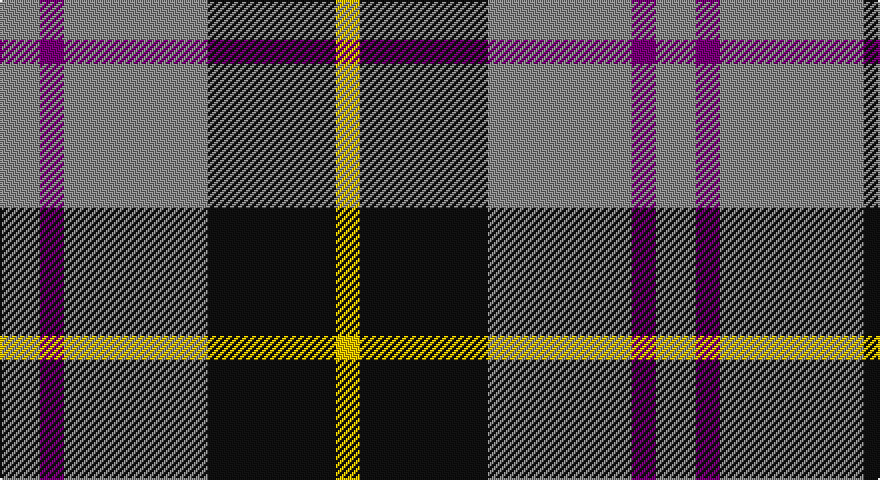

This page is one **sett** — a single exact thread-count. It belongs to the [tartan](/setts/o5dp3o18k16ly3/)
(the same proportion at any scale), whose colour order is pattern [RBRKY](/stripes/rbrky/).

Sourced from register-of-tartans.  It is a [5 stripe tartan](/stripes/stripes5/).

Original link https://www.tartanregister.gov.uk/tartanDetails.aspx?ref=3122

## Also known as

This cloth is also recorded under:

- New York State Police Pipe Band

2 attestations — the source records this cloth was collapsed from (oldest owns this page)

<ul>
<li>01/01/1993 — New York State Police Pipe Band (register-of-tartans, <a href="https://www.tartanregister.gov.uk/tartanDetails.aspx?ref=3122">record</a>)</li>
<li>1993 — New York State Police (Corporate) (tartans-authority, <a href="http://www.tartansauthority.com/tartan-ferret/display/5619/">record</a>)</li>
</ul>

## Register references

External register numbers recorded for this tartan.

- Scottish Register of Tartans: [3122](https://www.tartanregister.gov.uk/tartanDetails.aspx?ref=3122)
- Scottish Tartans Authority (ITI): 5619

## Thread count
N/20 P12 N72 K64 Y/12

One full sett is **328 threads**.

## Palette

Palette: <strong>Tartan Register</strong>
<table><thead><tr><th>Colour</th><th>Threads</th><th>Shade</th><th>Base</th><th>OKLCh</th></tr></thead><tbody><tr><td>N/</td><td style="text-align:right;font-variant-numeric:tabular-nums">20</td><td><code style="background-color:#888888;">#888888</code> <small style="color:#888">#888888</small></td><td>R <code style="background-color:#CC0000;">#CC0000</code></td><td><small style="color:#888">oklch(62.7% 0.000 89.9)</small></td></tr><tr><td>P</td><td style="text-align:right;font-variant-numeric:tabular-nums">12</td><td><code style="background-color:#780078;">#780078</code> <small style="color:#888">#780078</small></td><td>B <code style="background-color:#2A418A;">#2A418A</code></td><td><small style="color:#888">oklch(40.2% 0.185 328.4)</small></td></tr><tr><td>N</td><td style="text-align:right;font-variant-numeric:tabular-nums">72</td><td><code style="background-color:#888888;">#888888</code> <small style="color:#888">#888888</small></td><td>R <code style="background-color:#CC0000;">#CC0000</code></td><td><small style="color:#888">oklch(62.7% 0.000 89.9)</small></td></tr><tr><td>K</td><td style="text-align:right;font-variant-numeric:tabular-nums">64</td><td><code style="background-color:#101010;">#101010</code> <small style="color:#888">#101010</small></td><td>K <code style="background-color:#000000;">#000000</code></td><td><small style="color:#888">oklch(17.3% 0.000 89.9)</small></td></tr><tr><td>Y/</td><td style="text-align:right;font-variant-numeric:tabular-nums">12</td><td><code style="background-color:#E8C000;">#E8C000</code> <small style="color:#888">#E8C000</small></td><td>Y <code style="background-color:#F2BF00;">#F2BF00</code></td><td><small style="color:#888">oklch(81.9% 0.168 93.7)</small></td></tr></tbody></table>

# Sample pattern

## Nearest tartans

The nearest existing variants by ΔTartan distance, with this tartan at the top so the swatches line up against it.

ΔTartan

Tartan

Sett

—

<a href="/ttd/edit/#slug=o5dp3o18k16ly3~x4">New York State Police Pipe Band</a> <a class="nn-out" href="/variants/s5/o5dp3o18k16ly3~x4/" title="open its dictionary page">↗</a>

0.66

<a href="/ttd/edit/#slug=k4lb4k4o15r2~x4&amp;base=o5dp3o18k16ly3~x4">Oban Grey (Fashion)</a> <a class="nn-out" href="/variants/s5/k4lb4k4o15r2~x4/" title="open its dictionary page">↗</a>

0.78

<a href="/ttd/edit/#slug=r5o32k31w5&amp;base=o5dp3o18k16ly3~x4">Loganair Uniform Skirt Corporate Tartan</a> <a class="nn-out" href="/variants/s4/r5o32k31w5/" title="open its dictionary page">↗</a>

0.79

<a href="/ttd/edit/#slug=r5o32k31w5~x2&amp;base=o5dp3o18k16ly3~x4">Loganair</a> <a class="nn-out" href="/variants/s4/r5o32k31w5~x2/" title="open its dictionary page">↗</a>

0.96

<a href="/ttd/edit/#slug=r3o16k16lb3~x4&amp;base=o5dp3o18k16ly3~x4">Thompson, Dress (Clan)</a> <a class="nn-out" href="/variants/s4/r3o16k16lb3~x4/" title="open its dictionary page">↗</a>

1.00

<a href="/ttd/edit/#slug=k3w3k3y10r1~x6&amp;base=o5dp3o18k16ly3~x4">Burberry Hunting</a> <a class="nn-out" href="/variants/s5/k3w3k3y10r1~x6/" title="open its dictionary page">↗</a>

1.07

<a href="/ttd/edit/#slug=r10dy60dt13lb24dt24dy8&amp;base=o5dp3o18k16ly3~x4">Bronte House Check (Fashion)</a> <a class="nn-out" href="/variants/s6/r10dy60dt13lb24dt24dy8/" title="open its dictionary page">↗</a>

1.12

<a href="/ttd/edit/#slug=r5k3t22k17t22k3ly5~x2&amp;base=o5dp3o18k16ly3~x4">MacCrimmon from Skye</a> <a class="nn-out" href="/variants/s7/r5k3t22k17t22k3ly5~x2/" title="open its dictionary page">↗</a>

1.12

<a href="/ttd/edit/#slug=k4w3k4y9r1~x4&amp;base=o5dp3o18k16ly3~x4">Oban Grey</a> <a class="nn-out" href="/variants/s5/k4w3k4y9r1~x4/" title="open its dictionary page">↗</a>

1.12

<a href="/ttd/edit/#slug=k3lb3k3n10r1~x6&amp;base=o5dp3o18k16ly3~x4">Greystone (Burberry Grey)</a> <a class="nn-out" href="/variants/s5/k3lb3k3n10r1~x6/" title="open its dictionary page">↗</a>

1.14

<a href="/ttd/edit/#slug=k4w3k4o9r1~x4&amp;base=o5dp3o18k16ly3~x4">Oban Grey District Tartan</a> <a class="nn-out" href="/variants/s5/k4w3k4o9r1~x4/" title="open its dictionary page">↗</a>

## Neighbour map

Every grey dot is one of 14360 variants placed by the first two principal components of the ΔTartan feature space (44% of its variance). Red is this tartan; blue dots are its nearest — click one to open its page.

<svg viewBox="0 0 640 380" role="img" style="max-width:100%;height:auto;border:1px solid #e0e0e0;border-radius:4px;display:block" xmlns="http://www.w3.org/2000/svg"><image href="/nn/cloud.v1.png" width="640" height="380"/><a href="/variants/s5/k4lb4k4o15r2~x4/"><circle cx="241.8" cy="218.9" r="4" fill="#3465a4"><title>Oban Grey (Fashion)</title></circle></a><a href="/variants/s4/r5o32k31w5/"><circle cx="208.7" cy="240.7" r="4" fill="#3465a4"><title>Loganair Uniform Skirt Corporate Tartan</title></circle></a><a href="/variants/s4/r5o32k31w5~x2/"><circle cx="209.7" cy="242.3" r="4" fill="#3465a4"><title>Loganair</title></circle></a><a href="/variants/s4/r3o16k16lb3~x4/"><circle cx="192.2" cy="254.4" r="4" fill="#3465a4"><title>Thompson, Dress (Clan)</title></circle></a><a href="/variants/s5/k3w3k3y10r1~x6/"><circle cx="231.5" cy="211.6" r="4" fill="#3465a4"><title>Burberry Hunting</title></circle></a><a href="/variants/s6/r10dy60dt13lb24dt24dy8/"><circle cx="231.6" cy="221.3" r="4" fill="#3465a4"><title>Bronte House Check (Fashion)</title></circle></a><a href="/variants/s7/r5k3t22k17t22k3ly5~x2/"><circle cx="264.1" cy="215.5" r="4" fill="#3465a4"><title>MacCrimmon from Skye</title></circle></a><a href="/variants/s5/k4w3k4y9r1~x4/"><circle cx="186.9" cy="224.9" r="4" fill="#3465a4"><title>Oban Grey</title></circle></a><a href="/variants/s5/k3lb3k3n10r1~x6/"><circle cx="230.4" cy="210.3" r="4" fill="#3465a4"><title>Greystone (Burberry Grey)</title></circle></a><a href="/variants/s5/k4w3k4o9r1~x4/"><circle cx="185.2" cy="223.7" r="4" fill="#3465a4"><title>Oban Grey District Tartan</title></circle></a><circle cx="234.9" cy="235.1" r="5" fill="#c00000"/></svg>

ID: /variants/s5/o5dp3o18k16ly3~x4/
