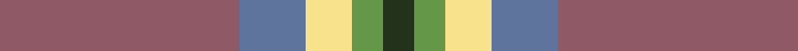
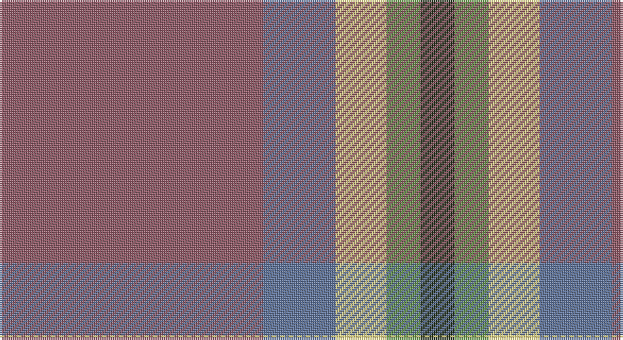

This page is one **sett** — a single exact thread-count. It belongs to the [tartan](/setts/o62t17ly12g8dg8/)
(the same proportion at any scale), whose colour order is pattern [GGYBR](/stripes/ggybr/).

Sourced from register-of-tartans.  It is a [5 stripe tartan](/stripes/stripes5/).

Original link https://www.tartanregister.gov.uk/tartanDetails.aspx?ref=10229

## Register references

External register numbers recorded for this tartan.

- Scottish Register of Tartans: [10229](https://www.tartanregister.gov.uk/tartanDetails.aspx?ref=10229)

## Thread count
LT/124 B34 LY24 LG16 K/16

One full sett is **288 threads**.

## Palette

Palette: <strong>Tartan Register</strong> <small style="color:#888">(3 of 5 colours)</small>
<table><thead><tr><th>Colour</th><th>Threads</th><th>Shade</th><th>Base</th><th>OKLCh</th></tr></thead><tbody><tr><td>LT/</td><td style="text-align:right;font-variant-numeric:tabular-nums">124</td><td><code style="background-color:#905966;">#905966</code> <small style="color:#888">#905966</small></td><td>R <code style="background-color:#CC0000;">#CC0000</code></td><td><small style="color:#888">oklch(52.9% 0.074 4.6)</small></td></tr><tr><td>B</td><td style="text-align:right;font-variant-numeric:tabular-nums">34</td><td><code style="background-color:#5F749C;">#5F749C</code> <small style="color:#888">#5F749C</small></td><td>B <code style="background-color:#2A418A;">#2A418A</code></td><td><small style="color:#888">oklch(55.8% 0.067 262.9)</small></td></tr><tr><td>LY</td><td style="text-align:right;font-variant-numeric:tabular-nums">24</td><td><code style="background-color:#F8E38C;">#F8E38C</code> <small style="color:#888">#F8E38C</small></td><td>Y <code style="background-color:#F2BF00;">#F2BF00</code></td><td><small style="color:#888">oklch(91.4% 0.110 96.2)</small></td></tr><tr><td>LG</td><td style="text-align:right;font-variant-numeric:tabular-nums">16</td><td><code style="background-color:#649848;">#649848</code> <small style="color:#888">#649848</small></td><td>G <code style="background-color:#006100;">#006100</code></td><td><small style="color:#888">oklch(62.4% 0.125 135.7)</small></td></tr><tr><td>K/</td><td style="text-align:right;font-variant-numeric:tabular-nums">16</td><td><code style="background-color:#23321B;">#23321B</code> <small style="color:#888">#23321B</small></td><td>G <code style="background-color:#006100;">#006100</code></td><td><small style="color:#888">oklch(29.7% 0.045 135.3)</small></td></tr></tbody></table>

# Sample pattern

## Nearest tartans

The nearest existing variants by ΔTartan distance, with this tartan at the top so the swatches line up against it.

ΔTartan

Tartan

Sett

—

<a href="/ttd/edit/#slug=o62t17ly12g8dg8~x2">Dundhuin Dress (Personal)</a> <a class="nn-out" href="/variants/s5/o62t17ly12g8dg8~x2/" title="open its dictionary page">↗</a>

1.30

<a href="/ttd/edit/#slug=w1dp1o7n4o1w1~x4&amp;base=o62t17ly12g8dg8~x2">Lochnagar Plaid (District)</a> <a class="nn-out" href="/variants/s6/w1dp1o7n4o1w1~x4/" title="open its dictionary page">↗</a>

1.34

<a href="/ttd/edit/#slug=n10w3lr3g1r1~x10&amp;base=o62t17ly12g8dg8~x2">Bagpipe Shop (Switzerland)</a> <a class="nn-out" href="/variants/s5/n10w3lr3g1r1~x10/" title="open its dictionary page">↗</a>

1.37

<a href="/ttd/edit/#slug=n10w3lb3g1r1~x10&amp;base=o62t17ly12g8dg8~x2">Bagpipe Shop (Corporate)</a> <a class="nn-out" href="/variants/s5/n10w3lb3g1r1~x10/" title="open its dictionary page">↗</a>

1.39

<a href="/ttd/edit/#slug=db18ly2o6ly2o19r3~x2&amp;base=o62t17ly12g8dg8~x2">Balfour blue &amp; brown</a> <a class="nn-out" href="/variants/s6/db18ly2o6ly2o19r3~x2/" title="open its dictionary page">↗</a>

1.42

<a href="/ttd/edit/#slug=o47w6r24w3dt5lo3~x2&amp;base=o62t17ly12g8dg8~x2">Duminiak (Personal)</a> <a class="nn-out" href="/variants/s6/o47w6r24w3dt5lo3~x2/" title="open its dictionary page">↗</a>

1.46

<a href="/ttd/edit/#slug=y47w6r24w3dp5lo3~x2&amp;base=o62t17ly12g8dg8~x2">Duminiak (Trevose, Pennsylvania)</a> <a class="nn-out" href="/variants/s6/y47w6r24w3dp5lo3~x2/" title="open its dictionary page">↗</a>

1.56

<a href="/ttd/edit/#slug=n2r10n10o3r2lr24w2~x2&amp;base=o62t17ly12g8dg8~x2">Un-named Dutch</a> <a class="nn-out" href="/variants/s7/n2r10n10o3r2lr24w2~x2/" title="open its dictionary page">↗</a>

1.64

<a href="/ttd/edit/#slug=dt8y4r30g30lo3g4~x2&amp;base=o62t17ly12g8dg8~x2">Hutcheson (Name)</a> <a class="nn-out" href="/variants/s6/dt8y4r30g30lo3g4~x2/" title="open its dictionary page">↗</a>

1.67

<a href="/ttd/edit/#slug=g11lo10dp11t33w3~x2&amp;base=o62t17ly12g8dg8~x2">Sterling, Rob (Florida) (Persona Name Tartan</a> <a class="nn-out" href="/variants/s5/g11lo10dp11t33w3~x2/" title="open its dictionary page">↗</a>

1.68

<a href="/ttd/edit/#slug=o59t28ly5dg3w4ly5~x2&amp;base=o62t17ly12g8dg8~x2">Dundhuin Gold</a> <a class="nn-out" href="/variants/s6/o59t28ly5dg3w4ly5~x2/" title="open its dictionary page">↗</a>

## Neighbour map

Every grey dot is one of 14360 variants placed by the first two principal components of the ΔTartan feature space (44% of its variance). Red is this tartan; blue dots are its nearest — click one to open its page.

<svg viewBox="0 0 640 380" role="img" style="max-width:100%;height:auto;border:1px solid #e0e0e0;border-radius:4px;display:block" xmlns="http://www.w3.org/2000/svg"><image href="/nn/cloud.v1.png" width="640" height="380"/><a href="/variants/s6/w1dp1o7n4o1w1~x4/"><circle cx="310.5" cy="231.4" r="4" fill="#3465a4"><title>Lochnagar Plaid (District)</title></circle></a><a href="/variants/s5/n10w3lr3g1r1~x10/"><circle cx="277.0" cy="188.8" r="4" fill="#3465a4"><title>Bagpipe Shop (Switzerland)</title></circle></a><a href="/variants/s5/n10w3lb3g1r1~x10/"><circle cx="274.0" cy="188.6" r="4" fill="#3465a4"><title>Bagpipe Shop (Corporate)</title></circle></a><a href="/variants/s6/db18ly2o6ly2o19r3~x2/"><circle cx="316.8" cy="227.3" r="4" fill="#3465a4"><title>Balfour blue &amp; brown</title></circle></a><a href="/variants/s6/o47w6r24w3dt5lo3~x2/"><circle cx="324.6" cy="158.8" r="4" fill="#3465a4"><title>Duminiak (Personal)</title></circle></a><a href="/variants/s6/y47w6r24w3dp5lo3~x2/"><circle cx="334.6" cy="167.2" r="4" fill="#3465a4"><title>Duminiak (Trevose, Pennsylvania)</title></circle></a><a href="/variants/s7/n2r10n10o3r2lr24w2~x2/"><circle cx="250.7" cy="170.5" r="4" fill="#3465a4"><title>Un-named Dutch</title></circle></a><a href="/variants/s6/dt8y4r30g30lo3g4~x2/"><circle cx="255.5" cy="200.5" r="4" fill="#3465a4"><title>Hutcheson (Name)</title></circle></a><a href="/variants/s5/g11lo10dp11t33w3~x2/"><circle cx="242.2" cy="215.6" r="4" fill="#3465a4"><title>Sterling, Rob (Florida) (Persona Name Tartan</title></circle></a><a href="/variants/s6/o59t28ly5dg3w4ly5~x2/"><circle cx="373.9" cy="160.5" r="4" fill="#3465a4"><title>Dundhuin Gold</title></circle></a><circle cx="314.7" cy="210.1" r="5" fill="#c00000"/></svg>

ID: /variants/s5/o62t17ly12g8dg8~x2/
