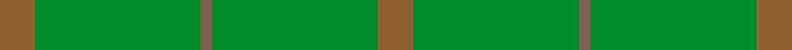

This page is one **sett** — a single exact thread-count. It belongs to the [tartan](/setts/oi3g14o1g14oi3/)
(the same proportion at any scale), whose colour order is pattern [RGRGR](/stripes/rgrgr/).

Sourced from weddslist.  It is a [5 stripe tartan](/stripes/stripes5/).

Original link http://www.weddslist.com/cgi-bin/tartans/pg.pl?source=sts

## Thread count
Oi/12 G56 O4 G56 Oi/12

One full sett is **256 threads**.

## Palette
<table><thead><tr><th>Colour</th><th>Shade</th><th>OKLCh</th></tr></thead><tbody><tr><td>G</td><td><code style="background-color:#008B2A;">#008B2A</code> <small style="color:#888">#008B2A</small></td><td><small style="color:#888">oklch(55.4% 0.170 145.9)</small></td></tr><tr><td>LT</td><td><code style="background-color:#906030;">#906030</code> <small style="color:#888">#906030</small></td><td><small style="color:#888">oklch(53.1% 0.089 63.7)</small></td></tr><tr><td>LTa</td><td><code style="background-color:#806050;">#806050</code> <small style="color:#888">#806050</small></td><td><small style="color:#888">oklch(51.7% 0.049 47.8)</small></td></tr></tbody></table>

# Sample pattern

## Nearest variants

The nearest existing variants by ΔTartan distance, with this cloth at the top so the swatches line up against it.

ΔTartan

Threads

Variant

Sett

—

256

<a href="/variants/s5/oi3g14o1g14oi3~x4~oi2104058-o2102055/">Pearson</a>

<a href="/ttd/edit/#slug=ly3g14dy1g14ly3~x4&amp;base=oi3g14o1g14oi3~x4~oi2104058-o2102055" title="compare in the TTD">2.70</a>

256

<a href="/variants/s5/ly3g14dy1g14ly3~x4/">Pearson Family Tartan</a>

<a href="/ttd/edit/#slug=g9o20g46lg5~x2&amp;base=oi3g14o1g14oi3~x4~oi2104058-o2102055" title="compare in the TTD">2.97</a>

292

<a href="/variants/s4/g9o20g46lg5~x2/">O'Neill, Red (Corporate?)</a>

<a href="/ttd/edit/#slug=g1y9g9lo1~x4&amp;base=oi3g14o1g14oi3~x4~oi2104058-o2102055" title="compare in the TTD">2.99</a>

152

<a href="/variants/s4/g1y9g9lo1~x4/">Spring Morning (Fashion)</a>

## Neighbour map

Every grey dot is one of 13620 variants placed by the first two principal components of the ΔTartan feature space (42% of its variance). Red is this tartan; blue dots are its nearest — click one to open its page.

<svg viewBox="0 0 640 380" role="img" style="max-width:100%;height:auto;border:1px solid #e0e0e0;border-radius:4px;display:block" xmlns="http://www.w3.org/2000/svg"><image href="/nn/cloud.v1.png" width="640" height="380"/><a href="/variants/s5/ly3g14dy1g14ly3~x4/"><circle cx="597.5" cy="269.6" r="4" fill="#3465a4"><title>Pearson Family Tartan</title></circle></a><a href="/variants/s4/g9o20g46lg5~x2/"><circle cx="536.0" cy="299.8" r="4" fill="#3465a4"><title>O'Neill, Red (Corporate?)</title></circle></a><a href="/variants/s4/g1y9g9lo1~x4/"><circle cx="538.1" cy="341.8" r="4" fill="#3465a4"><title>Spring Morning (Fashion)</title></circle></a><circle cx="626.0" cy="299.4" r="5" fill="#c00000"/><text x="320" y="376" text-anchor="middle" font-size="11" fill="#999">ground</text><text x="11" y="190" text-anchor="middle" font-size="11" fill="#999" transform="rotate(-90 11 190)">complexity</text></svg>

ID: /variants/s5/oi3g14o1g14oi3~x4~oi2104058-o2102055/
