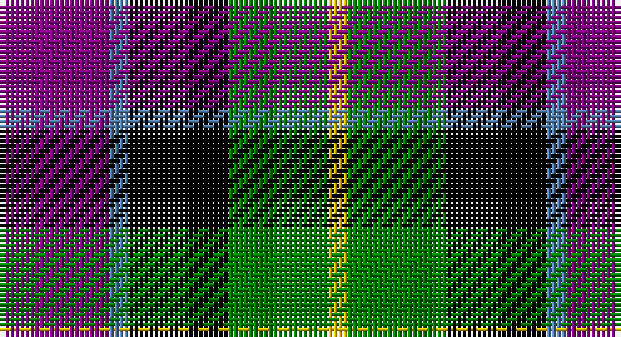

This page is one **sett** — a single exact thread-count. It belongs to the [tartan](/setts/p11t2k10g10ly2/)
(the same proportion at any scale), whose colour order is pattern [BBKGY](/stripes/bbkgy/).

Sourced from weddslist.  It is a [5 stripe tartan](/stripes/stripes5/).

Original link http://www.weddslist.com/cgi-bin/tartans/pg.pl?source=sts

## Thread count
P/22 B4 K20 G20 Y/4

One full sett is **114 threads**.

## Palette

Palette: <strong>Ingles Buchan</strong> <small style="color:#888">(1 of 5 colours)</small>
<table><thead><tr><th>Colour</th><th>Threads</th><th>Shade</th><th>Base</th><th>OKLCh</th></tr></thead><tbody><tr><td>P/</td><td style="text-align:right;font-variant-numeric:tabular-nums">22</td><td><code style="background-color:#800080;">#800080</code> <small style="color:#888">#800080</small></td><td>B <code style="background-color:#2A418A;">#2A418A</code></td><td><small style="color:#888">oklch(42.1% 0.193 328.4)</small></td></tr><tr><td>B</td><td style="text-align:right;font-variant-numeric:tabular-nums">4</td><td><code style="background-color:#5480B0;">#5480B0</code> <small style="color:#888">#5480B0</small></td><td>B <code style="background-color:#2A418A;">#2A418A</code></td><td><small style="color:#888">oklch(58.8% 0.089 251.5)</small></td></tr><tr><td>K</td><td style="text-align:right;font-variant-numeric:tabular-nums">20</td><td><code style="background-color:#000000;">#000000</code> <small style="color:#888">#000000</small></td><td>K <code style="background-color:#000000;">#000000</code></td><td><small style="color:#888">oklch(0.0% 0.000 0.0)</small></td></tr><tr><td>G</td><td style="text-align:right;font-variant-numeric:tabular-nums">20</td><td><code style="background-color:#008000;">#008000</code> <small style="color:#888">#008000</small></td><td>G <code style="background-color:#006100;">#006100</code></td><td><small style="color:#888">oklch(52.0% 0.177 142.5)</small></td></tr><tr><td>Y/</td><td style="text-align:right;font-variant-numeric:tabular-nums">4</td><td><code style="background-color:#F0C000;">#F0C000</code> <small style="color:#888">#F0C000</small></td><td>Y <code style="background-color:#F2BF00;">#F2BF00</code></td><td><small style="color:#888">oklch(82.7% 0.169 90.5)</small></td></tr></tbody></table>

# Sample pattern

## Nearest tartans

The nearest existing variants by ΔTartan distance, with this tartan at the top so the swatches line up against it.

ΔTartan

Tartan

Sett

—

<a href="/ttd/edit/#slug=p11t2k10g10ly2~x2">Wilson's, No 217</a> <a class="nn-out" href="/variants/s5/p11t2k10g10ly2~x2/" title="open its dictionary page">↗</a>

0.85

<a href="/ttd/edit/#slug=dp11t2k10g10ly3~x2&amp;base=p11t2k10g10ly2~x2">Nobiliary Fraternity</a> <a class="nn-out" href="/variants/s5/dp11t2k10g10ly3~x2/" title="open its dictionary page">↗</a>

0.89

<a href="/ttd/edit/#slug=k3r1g5k3w1p3~x2&amp;base=p11t2k10g10ly2~x2">Wilson's, No 194</a> <a class="nn-out" href="/variants/s6/k3r1g5k3w1p3~x2/" title="open its dictionary page">↗</a>

0.94

<a href="/ttd/edit/#slug=r1dy6db2lb4k4lb1~x6&amp;base=p11t2k10g10ly2~x2">Thompson's Fancy (Fashion)</a> <a class="nn-out" href="/variants/s6/r1dy6db2lb4k4lb1~x6/" title="open its dictionary page">↗</a>

0.95

<a href="/ttd/edit/#slug=k4g16k14ly3db16r4~x2&amp;base=p11t2k10g10ly2~x2">Birse</a> <a class="nn-out" href="/variants/s6/k4g16k14ly3db16r4~x2/" title="open its dictionary page">↗</a>

0.97

<a href="/ttd/edit/#slug=dp2g6k2db6k1r2~x4&amp;base=p11t2k10g10ly2~x2">MacCaughan, or MacEachain</a> <a class="nn-out" href="/variants/s6/dp2g6k2db6k1r2~x4/" title="open its dictionary page">↗</a>

1.02

<a href="/ttd/edit/#slug=k6b2db12g8r5k2g3~x4&amp;base=p11t2k10g10ly2~x2">Cooke</a> <a class="nn-out" href="/variants/s7/k6b2db12g8r5k2g3~x4/" title="open its dictionary page">↗</a>

1.05

<a href="/ttd/edit/#slug=w2p10k10g9k3w2~x2&amp;base=p11t2k10g10ly2~x2">MacNeil 2</a> <a class="nn-out" href="/variants/s6/w2p10k10g9k3w2~x2/" title="open its dictionary page">↗</a>

1.06

<a href="/ttd/edit/#slug=lr4g17k17db17r3db3~x2&amp;base=p11t2k10g10ly2~x2">Royal Highland</a> <a class="nn-out" href="/variants/s6/lr4g17k17db17r3db3~x2/" title="open its dictionary page">↗</a>

1.07

<a href="/ttd/edit/#slug=t3g8k9db7r2db2~x2&amp;base=p11t2k10g10ly2~x2">Wellington, or Waterloo</a> <a class="nn-out" href="/variants/s6/t3g8k9db7r2db2~x2/" title="open its dictionary page">↗</a>

1.08

<a href="/ttd/edit/#slug=r4g15k15db15w4~x2&amp;base=p11t2k10g10ly2~x2">Dalmeny</a> <a class="nn-out" href="/variants/s5/r4g15k15db15w4~x2/" title="open its dictionary page">↗</a>

## Neighbour map

Every grey dot is one of 14360 variants placed by the first two principal components of the ΔTartan feature space (44% of its variance). Red is this tartan; blue dots are its nearest — click one to open its page.

<svg viewBox="0 0 640 380" role="img" style="max-width:100%;height:auto;border:1px solid #e0e0e0;border-radius:4px;display:block" xmlns="http://www.w3.org/2000/svg"><image href="/nn/cloud.v1.png" width="640" height="380"/><a href="/variants/s5/dp11t2k10g10ly3~x2/"><circle cx="87.8" cy="247.3" r="4" fill="#3465a4"><title>Nobiliary Fraternity</title></circle></a><a href="/variants/s6/k3r1g5k3w1p3~x2/"><circle cx="84.7" cy="239.0" r="4" fill="#3465a4"><title>Wilson's, No 194</title></circle></a><a href="/variants/s6/r1dy6db2lb4k4lb1~x6/"><circle cx="87.4" cy="220.3" r="4" fill="#3465a4"><title>Thompson's Fancy (Fashion)</title></circle></a><a href="/variants/s6/k4g16k14ly3db16r4~x2/"><circle cx="77.5" cy="230.8" r="4" fill="#3465a4"><title>Birse</title></circle></a><a href="/variants/s6/dp2g6k2db6k1r2~x4/"><circle cx="94.1" cy="227.1" r="4" fill="#3465a4"><title>MacCaughan, or MacEachain</title></circle></a><a href="/variants/s7/k6b2db12g8r5k2g3~x4/"><circle cx="81.6" cy="220.6" r="4" fill="#3465a4"><title>Cooke</title></circle></a><a href="/variants/s6/w2p10k10g9k3w2~x2/"><circle cx="106.7" cy="239.6" r="4" fill="#3465a4"><title>MacNeil 2</title></circle></a><a href="/variants/s6/lr4g17k17db17r3db3~x2/"><circle cx="93.3" cy="225.4" r="4" fill="#3465a4"><title>Royal Highland</title></circle></a><a href="/variants/s6/t3g8k9db7r2db2~x2/"><circle cx="57.1" cy="246.6" r="4" fill="#3465a4"><title>Wellington, or Waterloo</title></circle></a><a href="/variants/s5/r4g15k15db15w4~x2/"><circle cx="36.3" cy="260.2" r="4" fill="#3465a4"><title>Dalmeny</title></circle></a><circle cx="79.7" cy="233.8" r="5" fill="#c00000"/></svg>

ID: /variants/s5/p11t2k10g10ly2~x2/
