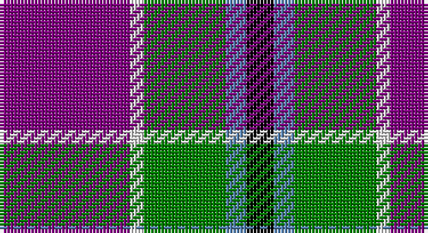

This page is one **sett** — a single exact thread-count. It belongs to the [tartan](/setts/p19w2g12t3k4/)
(the same proportion at any scale), whose colour order is pattern [BWGBK](/stripes/bwgbk/).

Sourced from weddslist.  It is a [5 stripe tartan](/stripes/stripes5/).

Original link http://www.weddslist.com/cgi-bin/tartans/pg.pl?source=sts

## Thread count
P/38 LN4 G24 B6 K/8

One full sett is **114 threads**.

## Palette

Palette: <strong>Tartan Register</strong> <small style="color:#888">(2 of 5 colours)</small>
<table><thead><tr><th>Colour</th><th>Threads</th><th>Shade</th><th>Base</th><th>OKLCh</th></tr></thead><tbody><tr><td>P/</td><td style="text-align:right;font-variant-numeric:tabular-nums">38</td><td><code style="background-color:#800080;">#800080</code> <small style="color:#888">#800080</small></td><td>B <code style="background-color:#2A418A;">#2A418A</code></td><td><small style="color:#888">oklch(42.1% 0.193 328.4)</small></td></tr><tr><td>LN</td><td style="text-align:right;font-variant-numeric:tabular-nums">4</td><td><code style="background-color:#E0E0E0;">#E0E0E0</code> <small style="color:#888">#E0E0E0</small></td><td>W <code style="background-color:#F7F7F7;">#F7F7F7</code></td><td><small style="color:#888">oklch(90.7% 0.000 89.9)</small></td></tr><tr><td>G</td><td style="text-align:right;font-variant-numeric:tabular-nums">24</td><td><code style="background-color:#008000;">#008000</code> <small style="color:#888">#008000</small></td><td>G <code style="background-color:#006100;">#006100</code></td><td><small style="color:#888">oklch(52.0% 0.177 142.5)</small></td></tr><tr><td>B</td><td style="text-align:right;font-variant-numeric:tabular-nums">6</td><td><code style="background-color:#5480B0;">#5480B0</code> <small style="color:#888">#5480B0</small></td><td>B <code style="background-color:#2A418A;">#2A418A</code></td><td><small style="color:#888">oklch(58.8% 0.089 251.5)</small></td></tr><tr><td>K/</td><td style="text-align:right;font-variant-numeric:tabular-nums">8</td><td><code style="background-color:#000000;">#000000</code> <small style="color:#888">#000000</small></td><td>K <code style="background-color:#000000;">#000000</code></td><td><small style="color:#888">oklch(0.0% 0.000 0.0)</small></td></tr></tbody></table>

# Sample pattern

## Nearest tartans

The nearest existing variants by ΔTartan distance, with this tartan at the top so the swatches line up against it.

ΔTartan

Tartan

Sett

—

<a href="/ttd/edit/#slug=p19w2g12t3k4~x2">Wilson's, No 111</a> <a class="nn-out" href="/variants/s5/p19w2g12t3k4~x2/" title="open its dictionary page">↗</a>

0.83

<a href="/ttd/edit/#slug=w6k29o29dp7k3r3~x2&amp;base=p19w2g12t3k4~x2">Jewell of Kernow (Personal)</a> <a class="nn-out" href="/variants/s6/w6k29o29dp7k3r3~x2/" title="open its dictionary page">↗</a>

1.05

<a href="/ttd/edit/#slug=r12db3g5dbi16ly2g2~x2&amp;base=p19w2g12t3k4~x2">Dunbog, Primary School</a> <a class="nn-out" href="/variants/s6/r12db3g5dbi16ly2g2~x2/" title="open its dictionary page">↗</a>

1.08

<a href="/ttd/edit/#slug=dp8ly6k2y1w1~x8&amp;base=p19w2g12t3k4~x2">Ballater Victoria Week</a> <a class="nn-out" href="/variants/s5/dp8ly6k2y1w1~x8/" title="open its dictionary page">↗</a>

1.09

<a href="/ttd/edit/#slug=db31t4db6k19r20ly4~x2&amp;base=p19w2g12t3k4~x2">Fife (McGill)</a> <a class="nn-out" href="/variants/s6/db31t4db6k19r20ly4~x2/" title="open its dictionary page">↗</a>

1.12

<a href="/ttd/edit/#slug=k7t3o30dt30w3~x2&amp;base=p19w2g12t3k4~x2">Douglas, brown</a> <a class="nn-out" href="/variants/s5/k7t3o30dt30w3~x2/" title="open its dictionary page">↗</a>

1.14

<a href="/ttd/edit/#slug=w15y98db72r25db8ly15&amp;base=p19w2g12t3k4~x2">Afternoon Tea / Darjeeling</a> <a class="nn-out" href="/variants/s6/w15y98db72r25db8ly15/" title="open its dictionary page">↗</a>

1.17

<a href="/ttd/edit/#slug=w6db24k7o11k2ly6~x2&amp;base=p19w2g12t3k4~x2">Clunie (Name)</a> <a class="nn-out" href="/variants/s6/w6db24k7o11k2ly6~x2/" title="open its dictionary page">↗</a>

1.18

<a href="/ttd/edit/#slug=r12db3g5db16ly2g2~x2&amp;base=p19w2g12t3k4~x2">Dunbog Primary (School)</a> <a class="nn-out" href="/variants/s6/r12db3g5db16ly2g2~x2/" title="open its dictionary page">↗</a>

1.20

<a href="/ttd/edit/#slug=w4db30g10r25w2~x2&amp;base=p19w2g12t3k4~x2">Highland Spring Dress (2004) (Corp)</a> <a class="nn-out" href="/variants/s5/w4db30g10r25w2~x2/" title="open its dictionary page">↗</a>

1.23

<a href="/ttd/edit/#slug=w12db48k13o22k3ly6&amp;base=p19w2g12t3k4~x2">Clunie (Personal)</a> <a class="nn-out" href="/variants/s6/w12db48k13o22k3ly6/" title="open its dictionary page">↗</a>

## Neighbour map

Every grey dot is one of 14360 variants placed by the first two principal components of the ΔTartan feature space (44% of its variance). Red is this tartan; blue dots are its nearest — click one to open its page.

<svg viewBox="0 0 640 380" role="img" style="max-width:100%;height:auto;border:1px solid #e0e0e0;border-radius:4px;display:block" xmlns="http://www.w3.org/2000/svg"><image href="/nn/cloud.v1.png" width="640" height="380"/><a href="/variants/s6/w6k29o29dp7k3r3~x2/"><circle cx="188.2" cy="178.3" r="4" fill="#3465a4"><title>Jewell of Kernow (Personal)</title></circle></a><a href="/variants/s6/r12db3g5dbi16ly2g2~x2/"><circle cx="159.6" cy="194.4" r="4" fill="#3465a4"><title>Dunbog, Primary School</title></circle></a><a href="/variants/s5/dp8ly6k2y1w1~x8/"><circle cx="172.0" cy="184.9" r="4" fill="#3465a4"><title>Ballater Victoria Week</title></circle></a><a href="/variants/s6/db31t4db6k19r20ly4~x2/"><circle cx="188.2" cy="210.2" r="4" fill="#3465a4"><title>Fife (McGill)</title></circle></a><a href="/variants/s5/k7t3o30dt30w3~x2/"><circle cx="216.1" cy="202.7" r="4" fill="#3465a4"><title>Douglas, brown</title></circle></a><a href="/variants/s6/w15y98db72r25db8ly15/"><circle cx="202.7" cy="181.2" r="4" fill="#3465a4"><title>Afternoon Tea / Darjeeling</title></circle></a><a href="/variants/s6/w6db24k7o11k2ly6~x2/"><circle cx="154.2" cy="177.4" r="4" fill="#3465a4"><title>Clunie (Name)</title></circle></a><a href="/variants/s6/r12db3g5db16ly2g2~x2/"><circle cx="223.3" cy="210.7" r="4" fill="#3465a4"><title>Dunbog Primary (School)</title></circle></a><a href="/variants/s5/w4db30g10r25w2~x2/"><circle cx="227.2" cy="195.2" r="4" fill="#3465a4"><title>Highland Spring Dress (2004) (Corp)</title></circle></a><a href="/variants/s6/w12db48k13o22k3ly6/"><circle cx="197.0" cy="161.4" r="4" fill="#3465a4"><title>Clunie (Personal)</title></circle></a><circle cx="208.2" cy="192.3" r="5" fill="#c00000"/></svg>

ID: /variants/s5/p19w2g12t3k4~x2/
