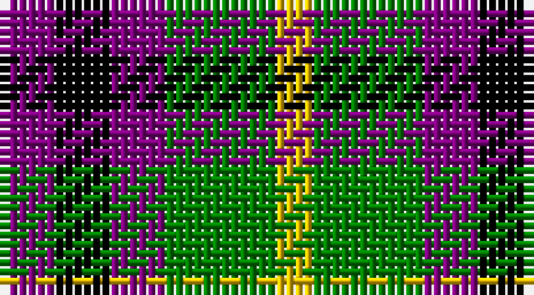

This page is one **sett** — a single exact thread-count. It belongs to the [tartan](/setts/p3k3p3g6ly2/)
(the same proportion at any scale), whose colour order is pattern [BKBGY](/stripes/bkbgy/).

Sourced from weddslist.  It is a [5 stripe tartan](/stripes/stripes5/).

Original link http://www.weddslist.com/cgi-bin/tartans/pg.pl?source=sts

## Thread count
P/6 K6 P6 G12 Y/4

One full sett is **58 threads**.

## Palette

Palette: <strong>Ingles Buchan</strong> <small style="color:#888">(1 of 4 colours)</small>
<table><thead><tr><th>Colour</th><th>Threads</th><th>Shade</th><th>Base</th><th>OKLCh</th></tr></thead><tbody><tr><td>P/</td><td style="text-align:right;font-variant-numeric:tabular-nums">6</td><td><code style="background-color:#800080;">#800080</code> <small style="color:#888">#800080</small></td><td>B <code style="background-color:#2A418A;">#2A418A</code></td><td><small style="color:#888">oklch(42.1% 0.193 328.4)</small></td></tr><tr><td>K</td><td style="text-align:right;font-variant-numeric:tabular-nums">6</td><td><code style="background-color:#000000;">#000000</code> <small style="color:#888">#000000</small></td><td>K <code style="background-color:#000000;">#000000</code></td><td><small style="color:#888">oklch(0.0% 0.000 0.0)</small></td></tr><tr><td>P</td><td style="text-align:right;font-variant-numeric:tabular-nums">6</td><td><code style="background-color:#800080;">#800080</code> <small style="color:#888">#800080</small></td><td>B <code style="background-color:#2A418A;">#2A418A</code></td><td><small style="color:#888">oklch(42.1% 0.193 328.4)</small></td></tr><tr><td>G</td><td style="text-align:right;font-variant-numeric:tabular-nums">12</td><td><code style="background-color:#008000;">#008000</code> <small style="color:#888">#008000</small></td><td>G <code style="background-color:#006100;">#006100</code></td><td><small style="color:#888">oklch(52.0% 0.177 142.5)</small></td></tr><tr><td>Y/</td><td style="text-align:right;font-variant-numeric:tabular-nums">4</td><td><code style="background-color:#F0C000;">#F0C000</code> <small style="color:#888">#F0C000</small></td><td>Y <code style="background-color:#F2BF00;">#F2BF00</code></td><td><small style="color:#888">oklch(82.7% 0.169 90.5)</small></td></tr></tbody></table>

# Sample pattern

## Nearest tartans

The nearest existing variants by ΔTartan distance, with this tartan at the top so the swatches line up against it.

ΔTartan

Tartan

Sett

—

<a href="/ttd/edit/#slug=p3k3p3g6ly2~x2">Austin / Wilson's No 173</a> <a class="nn-out" href="/variants/s5/p3k3p3g6ly2~x2/" title="open its dictionary page">↗</a>

0.67

<a href="/ttd/edit/#slug=p3k3p3g6r2~x2&amp;base=p3k3p3g6ly2~x2">Austin / Wilson's No 137</a> <a class="nn-out" href="/variants/s5/p3k3p3g6r2~x2/" title="open its dictionary page">↗</a>

1.13

<a href="/ttd/edit/#slug=dp3k3dp3dg6ly2~x2&amp;base=p3k3p3g6ly2~x2">Austin (Wilson's No 173)</a> <a class="nn-out" href="/variants/s5/dp3k3dp3dg6ly2~x2/" title="open its dictionary page">↗</a>

1.26

<a href="/ttd/edit/#slug=k13dy28lo13dy28k18w18k13~x2&amp;base=p3k3p3g6ly2~x2">Boxer Beauty</a> <a class="nn-out" href="/variants/s7/k13dy28lo13dy28k18w18k13~x2/" title="open its dictionary page">↗</a>

1.34

<a href="/ttd/edit/#slug=g3dp3w1dp3g3r1~x4&amp;base=p3k3p3g6ly2~x2">Wilson's No.113</a> <a class="nn-out" href="/variants/s6/g3dp3w1dp3g3r1~x4/" title="open its dictionary page">↗</a>

1.37

<a href="/ttd/edit/#slug=g4r3t1k1t3~x4&amp;base=p3k3p3g6ly2~x2">Wilson's, No 214</a> <a class="nn-out" href="/variants/s5/g4r3t1k1t3~x4/" title="open its dictionary page">↗</a>

1.38

<a href="/ttd/edit/#slug=r3k1dg1k1b3~x8&amp;base=p3k3p3g6ly2~x2">Clark</a> <a class="nn-out" href="/variants/s5/r3k1dg1k1b3~x8/" title="open its dictionary page">↗</a>

1.38

<a href="/ttd/edit/#slug=r3k1dg1k1b3~x4&amp;base=p3k3p3g6ly2~x2">Clark</a> <a class="nn-out" href="/variants/s5/r3k1dg1k1b3~x4/" title="open its dictionary page">↗</a>

1.39

<a href="/ttd/edit/#slug=r1g3p3w1~x4&amp;base=p3k3p3g6ly2~x2">Wilson's, No 113</a> <a class="nn-out" href="/variants/s4/r1g3p3w1~x4/" title="open its dictionary page">↗</a>

1.42

<a href="/ttd/edit/#slug=p8k11g9w2~x2&amp;base=p3k3p3g6ly2~x2">Wilson's, No 220</a> <a class="nn-out" href="/variants/s4/p8k11g9w2~x2/" title="open its dictionary page">↗</a>

1.43

<a href="/ttd/edit/#slug=k4lo9k13g6lo3g9w4~x2&amp;base=p3k3p3g6ly2~x2">Ramsay (Orange)</a> <a class="nn-out" href="/variants/s7/k4lo9k13g6lo3g9w4~x2/" title="open its dictionary page">↗</a>

## Neighbour map

Every grey dot is one of 14360 variants placed by the first two principal components of the ΔTartan feature space (44% of its variance). Red is this tartan; blue dots are its nearest — click one to open its page.

<svg viewBox="0 0 640 380" role="img" style="max-width:100%;height:auto;border:1px solid #e0e0e0;border-radius:4px;display:block" xmlns="http://www.w3.org/2000/svg"><image href="/nn/cloud.v1.png" width="640" height="380"/><a href="/variants/s5/p3k3p3g6r2~x2/"><circle cx="85.0" cy="295.3" r="4" fill="#3465a4"><title>Austin / Wilson's No 137</title></circle></a><a href="/variants/s5/dp3k3dp3dg6ly2~x2/"><circle cx="93.5" cy="305.8" r="4" fill="#3465a4"><title>Austin (Wilson's No 173)</title></circle></a><a href="/variants/s7/k13dy28lo13dy28k18w18k13~x2/"><circle cx="83.4" cy="299.3" r="4" fill="#3465a4"><title>Boxer Beauty</title></circle></a><a href="/variants/s6/g3dp3w1dp3g3r1~x4/"><circle cx="148.6" cy="298.4" r="4" fill="#3465a4"><title>Wilson's No.113</title></circle></a><a href="/variants/s5/g4r3t1k1t3~x4/"><circle cx="108.6" cy="277.5" r="4" fill="#3465a4"><title>Wilson's, No 214</title></circle></a><a href="/variants/s5/r3k1dg1k1b3~x8/"><circle cx="100.4" cy="279.2" r="4" fill="#3465a4"><title>Clark</title></circle></a><a href="/variants/s5/r3k1dg1k1b3~x4/"><circle cx="100.4" cy="279.2" r="4" fill="#3465a4"><title>Clark</title></circle></a><a href="/variants/s4/r1g3p3w1~x4/"><circle cx="119.1" cy="286.4" r="4" fill="#3465a4"><title>Wilson's, No 113</title></circle></a><a href="/variants/s4/p8k11g9w2~x2/"><circle cx="109.5" cy="277.7" r="4" fill="#3465a4"><title>Wilson's, No 220</title></circle></a><a href="/variants/s7/k4lo9k13g6lo3g9w4~x2/"><circle cx="94.8" cy="256.2" r="4" fill="#3465a4"><title>Ramsay (Orange)</title></circle></a><circle cx="71.1" cy="290.4" r="5" fill="#c00000"/></svg>

ID: /variants/s5/p3k3p3g6ly2~x2/
