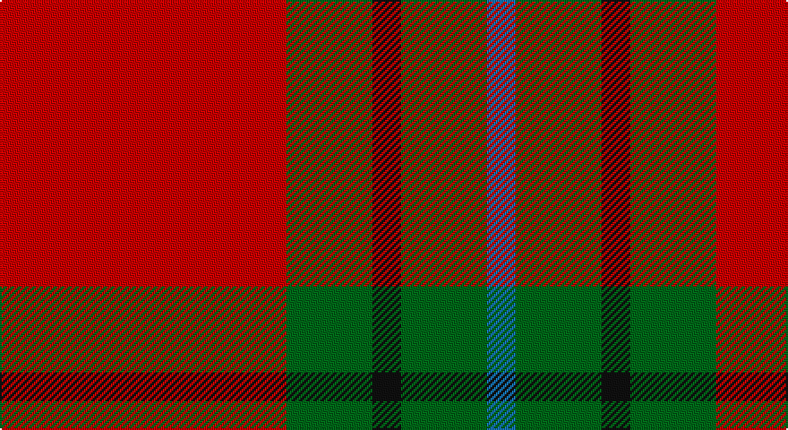

This page is one **sett** — a single exact thread-count. It belongs to the [tartan](/setts/r10g3k1g3b1/)
(the same proportion at any scale), whose colour order is pattern [BGKGR](/stripes/bgkgr/).

Sourced from tartans-authority.  It is a [5 stripe tartan](/stripes/stripes5/).

Original link http://www.tartansauthority.com/tartan-ferret/display/8391/

## Register references

External register numbers recorded for this tartan.

- Scottish Tartans Authority (ITI): 8391

## Thread count
R/160 G48 K16 G48 B/16

One full sett is **400 threads**.

## Palette

Palette: <strong>Tartan Register</strong>
<table><thead><tr><th>Colour</th><th>Threads</th><th>Shade</th><th>Base</th><th>OKLCh</th></tr></thead><tbody><tr><td>R/</td><td style="text-align:right;font-variant-numeric:tabular-nums">160</td><td><code style="background-color:#C80000;">#C80000</code> <small style="color:#888">#C80000</small></td><td>R <code style="background-color:#CC0000;">#CC0000</code></td><td><small style="color:#888">oklch(52.3% 0.215 29.2)</small></td></tr><tr><td>G</td><td style="text-align:right;font-variant-numeric:tabular-nums">48</td><td><code style="background-color:#006818;">#006818</code> <small style="color:#888">#006818</small></td><td>G <code style="background-color:#006100;">#006100</code></td><td><small style="color:#888">oklch(45.0% 0.142 145.0)</small></td></tr><tr><td>K</td><td style="text-align:right;font-variant-numeric:tabular-nums">16</td><td><code style="background-color:#101010;">#101010</code> <small style="color:#888">#101010</small></td><td>K <code style="background-color:#000000;">#000000</code></td><td><small style="color:#888">oklch(17.3% 0.000 89.9)</small></td></tr><tr><td>G</td><td style="text-align:right;font-variant-numeric:tabular-nums">48</td><td><code style="background-color:#006818;">#006818</code> <small style="color:#888">#006818</small></td><td>G <code style="background-color:#006100;">#006100</code></td><td><small style="color:#888">oklch(45.0% 0.142 145.0)</small></td></tr><tr><td>B/</td><td style="text-align:right;font-variant-numeric:tabular-nums">16</td><td><code style="background-color:#1474B4;">#1474B4</code> <small style="color:#888">#1474B4</small></td><td>B <code style="background-color:#2A418A;">#2A418A</code></td><td><small style="color:#888">oklch(54.0% 0.129 245.1)</small></td></tr></tbody></table>

# Sample pattern

## Nearest tartans

The nearest existing variants by ΔTartan distance, with this tartan at the top so the swatches line up against it.

ΔTartan

Tartan

Sett

—

<a href="/ttd/edit/#slug=r10g3k1g3b1~x16">Espy (Fashion?)</a> <a class="nn-out" href="/variants/s5/r10g3k1g3b1~x16/" title="open its dictionary page">↗</a>

0.91

<a href="/ttd/edit/#slug=k2r16g6r3g8lb1~x2&amp;base=r10g3k1g3b1~x16">MacAulay</a> <a class="nn-out" href="/variants/s6/k2r16g6r3g8lb1~x2/" title="open its dictionary page">↗</a>

0.94

<a href="/ttd/edit/#slug=k2r16g6r3g8w1~x4&amp;base=r10g3k1g3b1~x16">MacAulay (Clan)</a> <a class="nn-out" href="/variants/s6/k2r16g6r3g8w1~x4/" title="open its dictionary page">↗</a>

0.97

<a href="/ttd/edit/#slug=r32t5g17r4g5w2~x2&amp;base=r10g3k1g3b1~x16">Wilson's, No 5</a> <a class="nn-out" href="/variants/s6/r32t5g17r4g5w2~x2/" title="open its dictionary page">↗</a>

0.97

<a href="/ttd/edit/#slug=r3g16r4k6r28g2lo3~x2&amp;base=r10g3k1g3b1~x16">McInally (Name)</a> <a class="nn-out" href="/variants/s7/r3g16r4k6r28g2lo3~x2/" title="open its dictionary page">↗</a>

1.03

<a href="/ttd/edit/#slug=r4g21r4k7r34lo3r4~x2&amp;base=r10g3k1g3b1~x16">Kirk (Name)</a> <a class="nn-out" href="/variants/s7/r4g21r4k7r34lo3r4~x2/" title="open its dictionary page">↗</a>

1.06

<a href="/ttd/edit/#slug=r10g24k10r28lb3r6~x2&amp;base=r10g3k1g3b1~x16">Nisbet</a> <a class="nn-out" href="/variants/s6/r10g24k10r28lb3r6~x2/" title="open its dictionary page">↗</a>

1.07

<a href="/ttd/edit/#slug=g16r5g2r18k2~x2&amp;base=r10g3k1g3b1~x16">MacDonald, Lord of The Isles (Artef)</a> <a class="nn-out" href="/variants/s5/g16r5g2r18k2~x2/" title="open its dictionary page">↗</a>

1.08

<a href="/ttd/edit/#slug=r12db2w1db2r3g8r3db1~x2&amp;base=r10g3k1g3b1~x16">Chisholm, The</a> <a class="nn-out" href="/variants/s8/r12db2w1db2r3g8r3db1~x2/" title="open its dictionary page">↗</a>

1.08

<a href="/ttd/edit/#slug=dg16r5dg2r18k2~x2&amp;base=r10g3k1g3b1~x16">MacDonald Lord of the Isles #2</a> <a class="nn-out" href="/variants/s5/dg16r5dg2r18k2~x2/" title="open its dictionary page">↗</a>

1.11

<a href="/ttd/edit/#slug=r2db10r2g10r25w2~x2&amp;base=r10g3k1g3b1~x16">Grant of Lurg</a> <a class="nn-out" href="/variants/s6/r2db10r2g10r25w2~x2/" title="open its dictionary page">↗</a>

## Neighbour map

Every grey dot is one of 14360 variants placed by the first two principal components of the ΔTartan feature space (44% of its variance). Red is this tartan; blue dots are its nearest — click one to open its page.

<svg viewBox="0 0 640 380" role="img" style="max-width:100%;height:auto;border:1px solid #e0e0e0;border-radius:4px;display:block" xmlns="http://www.w3.org/2000/svg"><image href="/nn/cloud.v1.png" width="640" height="380"/><a href="/variants/s6/k2r16g6r3g8lb1~x2/"><circle cx="334.7" cy="190.4" r="4" fill="#3465a4"><title>MacAulay</title></circle></a><a href="/variants/s6/k2r16g6r3g8w1~x4/"><circle cx="330.6" cy="188.3" r="4" fill="#3465a4"><title>MacAulay (Clan)</title></circle></a><a href="/variants/s6/r32t5g17r4g5w2~x2/"><circle cx="351.4" cy="178.2" r="4" fill="#3465a4"><title>Wilson's, No 5</title></circle></a><a href="/variants/s7/r3g16r4k6r28g2lo3~x2/"><circle cx="344.4" cy="171.9" r="4" fill="#3465a4"><title>McInally (Name)</title></circle></a><a href="/variants/s7/r4g21r4k7r34lo3r4~x2/"><circle cx="375.3" cy="194.5" r="4" fill="#3465a4"><title>Kirk (Name)</title></circle></a><a href="/variants/s6/r10g24k10r28lb3r6~x2/"><circle cx="285.6" cy="217.7" r="4" fill="#3465a4"><title>Nisbet</title></circle></a><a href="/variants/s5/g16r5g2r18k2~x2/"><circle cx="351.5" cy="241.0" r="4" fill="#3465a4"><title>MacDonald, Lord of The Isles (Artef)</title></circle></a><a href="/variants/s8/r12db2w1db2r3g8r3db1~x2/"><circle cx="323.2" cy="178.7" r="4" fill="#3465a4"><title>Chisholm, The</title></circle></a><a href="/variants/s5/dg16r5dg2r18k2~x2/"><circle cx="342.1" cy="233.7" r="4" fill="#3465a4"><title>MacDonald Lord of the Isles #2</title></circle></a><a href="/variants/s6/r2db10r2g10r25w2~x2/"><circle cx="327.2" cy="179.7" r="4" fill="#3465a4"><title>Grant of Lurg</title></circle></a><circle cx="337.3" cy="209.0" r="5" fill="#c00000"/></svg>

ID: /variants/s5/r10g3k1g3b1~x16/
