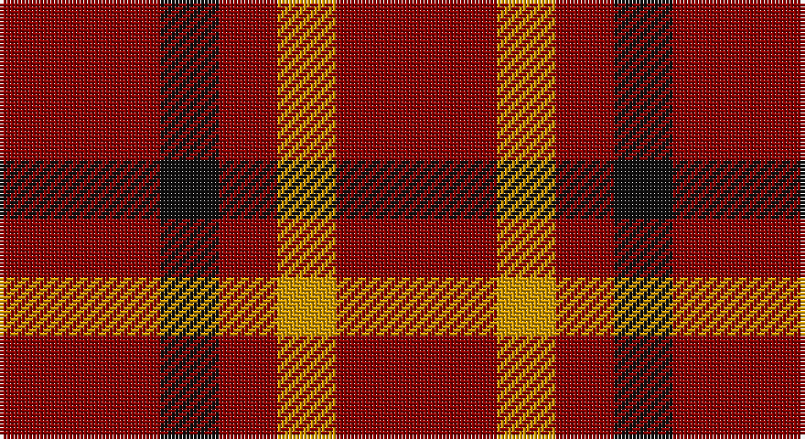

This page is one **sett** — a single exact thread-count. It belongs to the [tartan](/setts/r11k4r4lo4r11/)
(the same proportion at any scale), whose colour order is pattern [RKRYR](/stripes/rkryr/).

Part of the [Ikelman](/tartans/ikelman/) tartan — the named design grouping this sett with its other cloths.

Sourced from register-of-tartans.  It is a [5 stripe tartan](/stripes/stripes5/).

Original link https://www.tartanregister.gov.uk/tartanDetails.aspx?ref=1814

## Also known as

This cloth is also recorded under:

- Ikelman #2
- Ikelman #3
- Ikelman #4
- Ikelman #5
- Ikelman #6

2 attestations — the source records this cloth was collapsed from (oldest owns this page)

<ul>
<li>01/01/2002 — Ikelman #4 (Personal) (register-of-tartans, <a href="https://www.tartanregister.gov.uk/tartanDetails.aspx?ref=1814">record</a>)</li>
<li>pre 2002 — Ikelman #3 (Personal) (tartans-authority, <a href="http://www.tartansauthority.com/tartan-ferret/display/5243/">record</a>)</li>
</ul>

## Register references

External register numbers recorded for this tartan.

- Scottish Register of Tartans: [1814](https://www.tartanregister.gov.uk/tartanDetails.aspx?ref=1814)
- Scottish Tartans Authority (ITI): 5243

## Thread count
DR/44 K16 DR16 DY16 DR/44

One full sett is **184 threads**.

## Palette

Palette: <strong>Tartan Register</strong> <small style="color:#888">(2 of 3 colours)</small>
<table><thead><tr><th>Colour</th><th>Threads</th><th>Shade</th><th>Base</th><th>OKLCh</th></tr></thead><tbody><tr><td>DR/</td><td style="text-align:right;font-variant-numeric:tabular-nums">44</td><td><code style="background-color:#880000;">#880000</code> <small style="color:#888">#880000</small></td><td>R <code style="background-color:#CC0000;">#CC0000</code></td><td><small style="color:#888">oklch(39.4% 0.162 29.2)</small></td></tr><tr><td>K</td><td style="text-align:right;font-variant-numeric:tabular-nums">16</td><td><code style="background-color:#101010;">#101010</code> <small style="color:#888">#101010</small></td><td>K <code style="background-color:#000000;">#000000</code></td><td><small style="color:#888">oklch(17.3% 0.000 89.9)</small></td></tr><tr><td>DR</td><td style="text-align:right;font-variant-numeric:tabular-nums">16</td><td><code style="background-color:#880000;">#880000</code> <small style="color:#888">#880000</small></td><td>R <code style="background-color:#CC0000;">#CC0000</code></td><td><small style="color:#888">oklch(39.4% 0.162 29.2)</small></td></tr><tr><td>DY</td><td style="text-align:right;font-variant-numeric:tabular-nums">16</td><td><code style="background-color:#D09800;">#D09800</code> <small style="color:#888">#D09800</small></td><td>Y <code style="background-color:#F2BF00;">#F2BF00</code></td><td><small style="color:#888">oklch(71.4% 0.147 82.1)</small></td></tr><tr><td>DR/</td><td style="text-align:right;font-variant-numeric:tabular-nums">44</td><td><code style="background-color:#880000;">#880000</code> <small style="color:#888">#880000</small></td><td>R <code style="background-color:#CC0000;">#CC0000</code></td><td><small style="color:#888">oklch(39.4% 0.162 29.2)</small></td></tr></tbody></table>

# Sample pattern

## Compared to the master

This cloth is one sett of its design; the master sett (the exemplar the design is anchored on) is below for comparison.

<figure style="margin:0"><figcaption style="color:#888;font-size:smaller">this sett</figcaption></figure>
<figure style="margin:0"><figcaption style="color:#888;font-size:smaller"><a href="/setts/db15g2db2w1db1w1db1w1db2g2db15r10/">master sett →</a></figcaption></figure>

## Nearest tartans

The nearest existing variants by ΔTartan distance, with this tartan at the top so the swatches line up against it.

ΔTartan

Tartan

Sett

—

<a href="/ttd/edit/#slug=r11k4r4lo4r11~x4">Ikelman #4 (Personal)</a> <a class="nn-out" href="/variants/s5/r11k4r4lo4r11~x4/" title="open its dictionary page">↗</a>

2.32

<a href="/ttd/edit/#slug=r3g1~x14&amp;base=r11k4r4lo4r11~x4">Wilson's, No 134</a> <a class="nn-out" href="/variants/s2/r3g1~x14/" title="open its dictionary page">↗</a>

2.34

<a href="/ttd/edit/#slug=r3dg1~x14&amp;base=r11k4r4lo4r11~x4">Wilson's No.134</a> <a class="nn-out" href="/variants/s2/r3dg1~x14/" title="open its dictionary page">↗</a>

2.36

<a href="/ttd/edit/#slug=r8k3~x2&amp;base=r11k4r4lo4r11~x4">Wilson's No.234</a> <a class="nn-out" href="/variants/s2/r8k3~x2/" title="open its dictionary page">↗</a>

2.40

<a href="/ttd/edit/#slug=r30dg12k5lb8r30&amp;base=r11k4r4lo4r11~x4">Sinclair</a> <a class="nn-out" href="/variants/s5/r30dg12k5lb8r30/" title="open its dictionary page">↗</a>

2.55

<a href="/ttd/edit/#slug=r3t1~x14&amp;base=r11k4r4lo4r11~x4">Wilson's No.138</a> <a class="nn-out" href="/variants/s2/r3t1~x14/" title="open its dictionary page">↗</a>

2.55

<a href="/ttd/edit/#slug=r9k1r5g6r4k2~x4&amp;base=r11k4r4lo4r11~x4">MacAn of Lurgyvallan (Hose)</a> <a class="nn-out" href="/variants/s6/r9k1r5g6r4k2~x4/" title="open its dictionary page">↗</a>

2.59

<a href="/ttd/edit/#slug=r28dg16k4lb7r28&amp;base=r11k4r4lo4r11~x4">Sinclair Dress</a> <a class="nn-out" href="/variants/s5/r28dg16k4lb7r28/" title="open its dictionary page">↗</a>

2.64

<a href="/ttd/edit/#slug=r9dg2r3dg2r9dg3r3db3r3dg3r3db3~x2&amp;base=r11k4r4lo4r11~x4">Unidentified Early 18th Centuary #2</a> <a class="nn-out" href="/variants/s12/r9dg2r3dg2r9dg3r3db3r3dg3r3db3~x2/" title="open its dictionary page">↗</a>

2.71

<a href="/variants/s6/r10k1r4g6~x2/">Macan, of Lurgyvallan (Hose)</a>

2.81

<a href="/ttd/edit/#slug=r8g2r2k1r1g2~x10&amp;base=r11k4r4lo4r11~x4">Waverley Care Aids Trust (Corporate)</a> <a class="nn-out" href="/variants/s6/r8g2r2k1r1g2~x10/" title="open its dictionary page">↗</a>

## Neighbour map

Every grey dot is one of 14360 variants placed by the first two principal components of the ΔTartan feature space (44% of its variance). Red is this tartan; blue dots are its nearest — click one to open its page.

<svg viewBox="0 0 640 380" role="img" style="max-width:100%;height:auto;border:1px solid #e0e0e0;border-radius:4px;display:block" xmlns="http://www.w3.org/2000/svg"><image href="/nn/cloud.v1.png" width="640" height="380"/><a href="/variants/s2/r3g1~x14/"><circle cx="469.2" cy="366.0" r="4" fill="#3465a4"><title>Wilson's, No 134</title></circle></a><a href="/variants/s2/r3dg1~x14/"><circle cx="484.5" cy="366.0" r="4" fill="#3465a4"><title>Wilson's No.134</title></circle></a><a href="/variants/s2/r8k3~x2/"><circle cx="416.4" cy="365.2" r="4" fill="#3465a4"><title>Wilson's No.234</title></circle></a><a href="/variants/s5/r30dg12k5lb8r30/"><circle cx="363.2" cy="235.4" r="4" fill="#3465a4"><title>Sinclair</title></circle></a><a href="/variants/s2/r3t1~x14/"><circle cx="485.9" cy="366.0" r="4" fill="#3465a4"><title>Wilson's No.138</title></circle></a><a href="/variants/s6/r9k1r5g6r4k2~x4/"><circle cx="421.0" cy="277.9" r="4" fill="#3465a4"><title>MacAn of Lurgyvallan (Hose)</title></circle></a><a href="/variants/s5/r28dg16k4lb7r28/"><circle cx="346.0" cy="234.8" r="4" fill="#3465a4"><title>Sinclair Dress</title></circle></a><a href="/variants/s12/r9dg2r3dg2r9dg3r3db3r3dg3r3db3~x2/"><circle cx="339.8" cy="239.5" r="4" fill="#3465a4"><title>Unidentified Early 18th Centuary #2</title></circle></a><a href="/variants/s6/r10k1r4g6~x2/"><circle cx="406.6" cy="225.7" r="4" fill="#3465a4"><title>Macan, of Lurgyvallan (Hose)</title></circle></a><a href="/variants/s6/r8g2r2k1r1g2~x10/"><circle cx="470.6" cy="254.5" r="4" fill="#3465a4"><title>Waverley Care Aids Trust (Corporate)</title></circle></a><circle cx="428.5" cy="322.7" r="5" fill="#c00000"/></svg>

ID: /variants/s5/r11k4r4lo4r11~x4/
