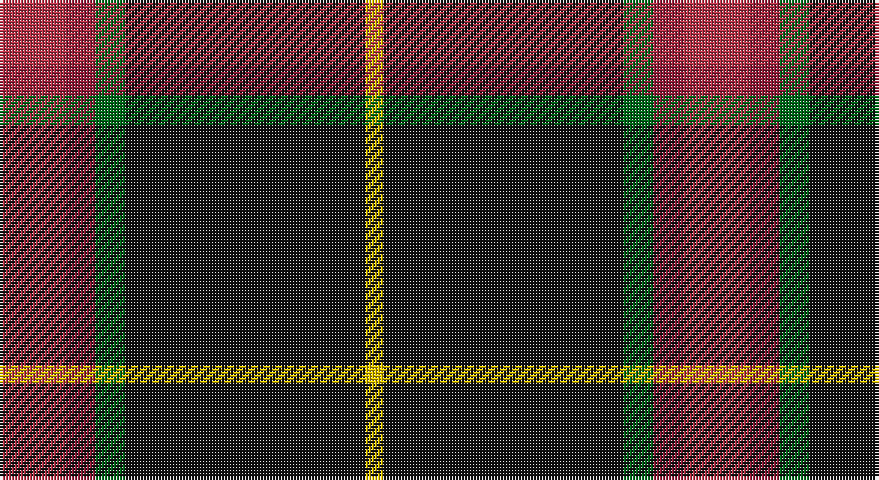

This page is one **sett** — a single exact thread-count. It belongs to the [tartan](/setts/r11ri5g5k40ly3/)
(the same proportion at any scale), whose colour order is pattern [RRGKY](/stripes/rrgky/).

Sourced from register-of-tartans.  It is a [5 stripe tartan](/stripes/stripes5/).

Original link https://www.tartanregister.gov.uk/tartanDetails.aspx?ref=2763

## Also known as

This cloth is also recorded under:

- MacShimsi Personal

2 attestations — the source records this cloth was collapsed from (oldest owns this page)

<ul>
<li>01/01/2007 — MacShimsi (register-of-tartans, <a href="https://www.tartanregister.gov.uk/tartanDetails.aspx?ref=2763">record</a>)</li>
<li>pre 2007 — MacShimsi (tartans-authority, <a href="http://www.tartansauthority.com/tartan-ferret/display/7318/">record</a>)</li>
</ul>

## Register references

External register numbers recorded for this tartan.

- Scottish Register of Tartans: [2763](https://www.tartanregister.gov.uk/tartanDetails.aspx?ref=2763)
- Scottish Tartans Authority (ITI): 7318

## Thread count
R/22 DR10 G10 K80 Y/6

One full sett is **228 threads**.

## Palette

Palette: <strong>Tartan Register</strong> <small style="color:#888">(4 of 5 colours)</small>
<table><thead><tr><th>Colour</th><th>Threads</th><th>Shade</th><th>Base</th><th>OKLCh</th></tr></thead><tbody><tr><td>R/</td><td style="text-align:right;font-variant-numeric:tabular-nums">22</td><td><code style="background-color:#B43448;">#B43448</code> <small style="color:#888">#B43448</small></td><td>R <code style="background-color:#CC0000;">#CC0000</code></td><td><small style="color:#888">oklch(52.2% 0.164 16.1)</small></td></tr><tr><td>DR</td><td style="text-align:right;font-variant-numeric:tabular-nums">10</td><td><code style="background-color:#901C38;">#901C38</code> <small style="color:#888">#901C38</small></td><td>R <code style="background-color:#CC0000;">#CC0000</code></td><td><small style="color:#888">oklch(43.2% 0.150 13.1)</small></td></tr><tr><td>G</td><td style="text-align:right;font-variant-numeric:tabular-nums">10</td><td><code style="background-color:#006818;">#006818</code> <small style="color:#888">#006818</small></td><td>G <code style="background-color:#006100;">#006100</code></td><td><small style="color:#888">oklch(45.0% 0.142 145.0)</small></td></tr><tr><td>K</td><td style="text-align:right;font-variant-numeric:tabular-nums">80</td><td><code style="background-color:#101010;">#101010</code> <small style="color:#888">#101010</small></td><td>K <code style="background-color:#000000;">#000000</code></td><td><small style="color:#888">oklch(17.3% 0.000 89.9)</small></td></tr><tr><td>Y/</td><td style="text-align:right;font-variant-numeric:tabular-nums">6</td><td><code style="background-color:#E8C000;">#E8C000</code> <small style="color:#888">#E8C000</small></td><td>Y <code style="background-color:#F2BF00;">#F2BF00</code></td><td><small style="color:#888">oklch(81.9% 0.168 93.7)</small></td></tr></tbody></table>

# Sample pattern

## Nearest tartans

The nearest existing variants by ΔTartan distance, with this tartan at the top so the swatches line up against it.

ΔTartan

Tartan

Sett

—

<a href="/ttd/edit/#slug=r11ri5g5k40ly3~x2">MacShimsi</a> <a class="nn-out" href="/variants/s5/r11ri5g5k40ly3~x2/" title="open its dictionary page">↗</a>

0.70

<a href="/ttd/edit/#slug=m11dr5dg5k40ly3~x2&amp;base=r11ri5g5k40ly3~x2">MacShimsi Personal Tartan</a> <a class="nn-out" href="/variants/s5/m11dr5dg5k40ly3~x2/" title="open its dictionary page">↗</a>

1.05

<a href="/ttd/edit/#slug=r17db7lo8dg58k6~x2&amp;base=r11ri5g5k40ly3~x2">St Johns County's Sheriff's Office</a> <a class="nn-out" href="/variants/s5/r17db7lo8dg58k6~x2/" title="open its dictionary page">↗</a>

1.06

<a href="/ttd/edit/#slug=g3ly5r14k36w3~x2&amp;base=r11ri5g5k40ly3~x2">Papua New Guinea</a> <a class="nn-out" href="/variants/s5/g3ly5r14k36w3~x2/" title="open its dictionary page">↗</a>

1.09

<a href="/ttd/edit/#slug=k31r12ly2n5k2~x4&amp;base=r11ri5g5k40ly3~x2">Perry (2014)</a> <a class="nn-out" href="/variants/s5/k31r12ly2n5k2~x4/" title="open its dictionary page">↗</a>

1.10

<a href="/ttd/edit/#slug=y4k48y16r12b3~x2&amp;base=r11ri5g5k40ly3~x2">Calgary Firefighters</a> <a class="nn-out" href="/variants/s5/y4k48y16r12b3~x2/" title="open its dictionary page">↗</a>

1.11

<a href="/ttd/edit/#slug=o4k48o16r12db3~x2&amp;base=r11ri5g5k40ly3~x2">Calgary Firefighters (Corporate)</a> <a class="nn-out" href="/variants/s5/o4k48o16r12db3~x2/" title="open its dictionary page">↗</a>

1.23

<a href="/ttd/edit/#slug=dp46k6g9lo9r4&amp;base=r11ri5g5k40ly3~x2">Ayllu Thuban (Corporate)</a> <a class="nn-out" href="/variants/s5/dp46k6g9lo9r4/" title="open its dictionary page">↗</a>

1.27

<a href="/ttd/edit/#slug=g3ly5r13k33w2~x2&amp;base=r11ri5g5k40ly3~x2">Papua New Guinea Pipes and Drums</a> <a class="nn-out" href="/variants/s5/g3ly5r13k33w2~x2/" title="open its dictionary page">↗</a>

1.33

<a href="/ttd/edit/#slug=k10y4k1t2r1~x10&amp;base=r11ri5g5k40ly3~x2">Brotherhood of the Kilt</a> <a class="nn-out" href="/variants/s5/k10y4k1t2r1~x10/" title="open its dictionary page">↗</a>

1.33

<a href="/ttd/edit/#slug=k50db6r6o6w3~x2&amp;base=r11ri5g5k40ly3~x2">Friends of Nordegg (Corporate)</a> <a class="nn-out" href="/variants/s5/k50db6r6o6w3~x2/" title="open its dictionary page">↗</a>

## Neighbour map

Every grey dot is one of 14360 variants placed by the first two principal components of the ΔTartan feature space (44% of its variance). Red is this tartan; blue dots are its nearest — click one to open its page.

<svg viewBox="0 0 640 380" role="img" style="max-width:100%;height:auto;border:1px solid #e0e0e0;border-radius:4px;display:block" xmlns="http://www.w3.org/2000/svg"><image href="/nn/cloud.v1.png" width="640" height="380"/><a href="/variants/s5/m11dr5dg5k40ly3~x2/"><circle cx="365.8" cy="192.1" r="4" fill="#3465a4"><title>MacShimsi Personal Tartan</title></circle></a><a href="/variants/s5/r17db7lo8dg58k6~x2/"><circle cx="316.8" cy="198.3" r="4" fill="#3465a4"><title>St Johns County's Sheriff's Office</title></circle></a><a href="/variants/s5/g3ly5r14k36w3~x2/"><circle cx="298.1" cy="170.2" r="4" fill="#3465a4"><title>Papua New Guinea</title></circle></a><a href="/variants/s5/k31r12ly2n5k2~x4/"><circle cx="400.5" cy="202.6" r="4" fill="#3465a4"><title>Perry (2014)</title></circle></a><a href="/variants/s5/y4k48y16r12b3~x2/"><circle cx="341.8" cy="193.6" r="4" fill="#3465a4"><title>Calgary Firefighters</title></circle></a><a href="/variants/s5/o4k48o16r12db3~x2/"><circle cx="335.4" cy="189.7" r="4" fill="#3465a4"><title>Calgary Firefighters (Corporate)</title></circle></a><a href="/variants/s5/dp46k6g9lo9r4/"><circle cx="345.9" cy="182.9" r="4" fill="#3465a4"><title>Ayllu Thuban (Corporate)</title></circle></a><a href="/variants/s5/g3ly5r13k33w2~x2/"><circle cx="306.6" cy="156.1" r="4" fill="#3465a4"><title>Papua New Guinea Pipes and Drums</title></circle></a><a href="/variants/s5/k10y4k1t2r1~x10/"><circle cx="356.6" cy="228.2" r="4" fill="#3465a4"><title>Brotherhood of the Kilt</title></circle></a><a href="/variants/s5/k50db6r6o6w3~x2/"><circle cx="418.0" cy="165.3" r="4" fill="#3465a4"><title>Friends of Nordegg (Corporate)</title></circle></a><circle cx="349.0" cy="180.2" r="5" fill="#c00000"/></svg>

ID: /variants/s5/r11ri5g5k40ly3~x2/
