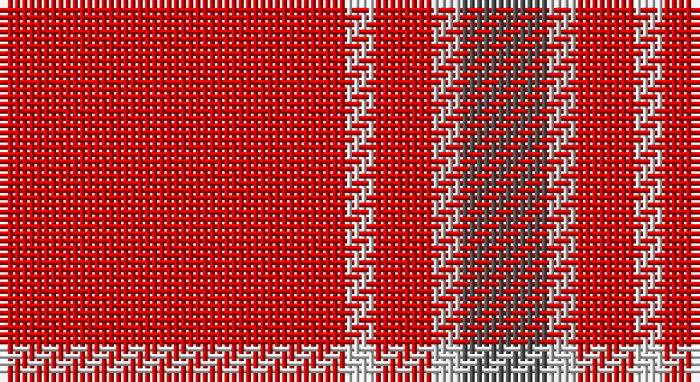

This page is one **sett** — a single exact thread-count. It belongs to the [tartan](/setts/r12w1r2lb1n3/)
(the same proportion at any scale), whose colour order is pattern [BWRWR](/stripes/bwrwr/).

Sourced from register-of-tartans.  It is a [5 stripe tartan](/stripes/stripes5/).

Original link https://www.tartanregister.gov.uk/tartanDetails.aspx?ref=1437

## Provenance

Earliest known date: pre 2003 Accredited by the Scottish Tartans Society in 1988. Glenmorangie is a well known malt whisky.

3 attestations — the source records this cloth was collapsed from (oldest owns this page)

<ul>
<li>undated — Glenshee (register-of-tartans, <a href="https://www.tartanregister.gov.uk/tartanDetails.aspx?ref=1437">record</a>)</li>
<li>undated — Glenshee (weddslist, <a href="http://www.weddslist.com/cgi-bin/tartans/pg.pl?source=sts">record</a>)</li>
<li>undated — Glenshee Trade Tartan (house-of-tartan, <a href="http://www.house-of-tartan.scotland.net/house/TartanViewjs.asp?colr=Def&tnam=1297">record</a>)</li>
</ul>

## Register references

External register numbers recorded for this tartan.

- Scottish Register of Tartans: [1437](https://www.tartanregister.gov.uk/tartanDetails.aspx?ref=1437)
- Scottish Tartans World Register: 1297

## Thread count
R/48 LN4 R8 Na4 N/12

One full sett is **92 threads**.

## Palette

Palette: <strong>Tartan Register</strong>
<table><thead><tr><th>Colour</th><th>Threads</th><th>Shade</th><th>Base</th><th>OKLCh</th></tr></thead><tbody><tr><td>R/</td><td style="text-align:right;font-variant-numeric:tabular-nums">48</td><td><code style="background-color:#DC0000;">#DC0000</code> <small style="color:#888">#DC0000</small></td><td>R <code style="background-color:#CC0000;">#CC0000</code></td><td><small style="color:#888">oklch(56.2% 0.230 29.2)</small></td></tr><tr><td>LN</td><td style="text-align:right;font-variant-numeric:tabular-nums">4</td><td><code style="background-color:#E0E0E0;">#E0E0E0</code> <small style="color:#888">#E0E0E0</small></td><td>W <code style="background-color:#F7F7F7;">#F7F7F7</code></td><td><small style="color:#888">oklch(90.7% 0.000 89.9)</small></td></tr><tr><td>R</td><td style="text-align:right;font-variant-numeric:tabular-nums">8</td><td><code style="background-color:#DC0000;">#DC0000</code> <small style="color:#888">#DC0000</small></td><td>R <code style="background-color:#CC0000;">#CC0000</code></td><td><small style="color:#888">oklch(56.2% 0.230 29.2)</small></td></tr><tr><td>Na</td><td style="text-align:right;font-variant-numeric:tabular-nums">4</td><td><code style="background-color:#C0C0C0;">#C0C0C0</code> <small style="color:#888">#C0C0C0</small></td><td>W <code style="background-color:#F7F7F7;">#F7F7F7</code></td><td><small style="color:#888">oklch(80.8% 0.000 89.9)</small></td></tr><tr><td>N/</td><td style="text-align:right;font-variant-numeric:tabular-nums">12</td><td><code style="background-color:#505050;">#505050</code> <small style="color:#888">#505050</small></td><td>B <code style="background-color:#2A418A;">#2A418A</code></td><td><small style="color:#888">oklch(43.1% 0.000 89.9)</small></td></tr></tbody></table>

# Sample pattern

## Nearest tartans

The nearest existing variants by ΔTartan distance, with this tartan at the top so the swatches line up against it.

ΔTartan

Tartan

Sett

—

<a href="/ttd/edit/#slug=r12w1r2lb1n3~x4">Glenshee</a> <a class="nn-out" href="/variants/s5/r12w1r2lb1n3~x4/" title="open its dictionary page">↗</a>

0.48

<a href="/ttd/edit/#slug=r12w1r2o1n3~x4&amp;base=r12w1r2lb1n3~x4">Glen Shee Plaid (Fashion)</a> <a class="nn-out" href="/variants/s5/r12w1r2o1n3~x4/" title="open its dictionary page">↗</a>

1.22

<a href="/ttd/edit/#slug=ly6k3r40w3~x2&amp;base=r12w1r2lb1n3~x4">Masai Shuka 18 (Artefact)</a> <a class="nn-out" href="/variants/s4/ly6k3r40w3~x2/" title="open its dictionary page">↗</a>

1.24

<a href="/ttd/edit/#slug=r65dg16r4dp4r4w5~x2&amp;base=r12w1r2lb1n3~x4">Howard, Vincent (Personal)</a> <a class="nn-out" href="/variants/s6/r65dg16r4dp4r4w5~x2/" title="open its dictionary page">↗</a>

1.26

<a href="/ttd/edit/#slug=r65g16r4dp4r4w5~x2&amp;base=r12w1r2lb1n3~x4">Howard, Vincent (Personal)</a> <a class="nn-out" href="/variants/s6/r65g16r4dp4r4w5~x2/" title="open its dictionary page">↗</a>

1.68

<a href="/ttd/edit/#slug=r58ly3r6dg16r12dg16r6&amp;base=r12w1r2lb1n3~x4">Cameron Ancient</a> <a class="nn-out" href="/variants/s7/r58ly3r6dg16r12dg16r6/" title="open its dictionary page">↗</a>

1.72

<a href="/ttd/edit/#slug=g4r32db9r6db2r3db2r12w3~x2&amp;base=r12w1r2lb1n3~x4">Rose</a> <a class="nn-out" href="/variants/s9/g4r32db9r6db2r3db2r12w3~x2/" title="open its dictionary page">↗</a>

1.77

<a href="/ttd/edit/#slug=r32lb4dt7ly2t2~x5&amp;base=r12w1r2lb1n3~x4">Sildesalaten</a> <a class="nn-out" href="/variants/s5/r32lb4dt7ly2t2~x5/" title="open its dictionary page">↗</a>

1.81

<a href="/ttd/edit/#slug=r34w4t7lo10t7r18~x2&amp;base=r12w1r2lb1n3~x4">Ploysongsang, Edward Thiravej (Personal)</a> <a class="nn-out" href="/variants/s6/r34w4t7lo10t7r18~x2/" title="open its dictionary page">↗</a>

1.82

<a href="/ttd/edit/#slug=r32dg8t4ly1~x2&amp;base=r12w1r2lb1n3~x4">MacLaine of Lochbuie (Coburn)</a> <a class="nn-out" href="/variants/s4/r32dg8t4ly1~x2/" title="open its dictionary page">↗</a>

1.87

<a href="/ttd/edit/#slug=r60db8w3db10ly3t4ly3r19~x2&amp;base=r12w1r2lb1n3~x4">Princess Elizabeth #2</a> <a class="nn-out" href="/variants/s8/r60db8w3db10ly3t4ly3r19~x2/" title="open its dictionary page">↗</a>

## Neighbour map

Every grey dot is one of 14360 variants placed by the first two principal components of the ΔTartan feature space (44% of its variance). Red is this tartan; blue dots are its nearest — click one to open its page.

<svg viewBox="0 0 640 380" role="img" style="max-width:100%;height:auto;border:1px solid #e0e0e0;border-radius:4px;display:block" xmlns="http://www.w3.org/2000/svg"><image href="/nn/cloud.v1.png" width="640" height="380"/><a href="/variants/s5/r12w1r2o1n3~x4/"><circle cx="499.8" cy="194.0" r="4" fill="#3465a4"><title>Glen Shee Plaid (Fashion)</title></circle></a><a href="/variants/s4/ly6k3r40w3~x2/"><circle cx="505.6" cy="173.9" r="4" fill="#3465a4"><title>Masai Shuka 18 (Artefact)</title></circle></a><a href="/variants/s6/r65dg16r4dp4r4w5~x2/"><circle cx="506.9" cy="152.1" r="4" fill="#3465a4"><title>Howard, Vincent (Personal)</title></circle></a><a href="/variants/s6/r65g16r4dp4r4w5~x2/"><circle cx="501.7" cy="149.4" r="4" fill="#3465a4"><title>Howard, Vincent (Personal)</title></circle></a><a href="/variants/s7/r58ly3r6dg16r12dg16r6/"><circle cx="487.3" cy="173.3" r="4" fill="#3465a4"><title>Cameron Ancient</title></circle></a><a href="/variants/s9/g4r32db9r6db2r3db2r12w3~x2/"><circle cx="461.9" cy="145.7" r="4" fill="#3465a4"><title>Rose</title></circle></a><a href="/variants/s5/r32lb4dt7ly2t2~x5/"><circle cx="415.6" cy="142.8" r="4" fill="#3465a4"><title>Sildesalaten</title></circle></a><a href="/variants/s6/r34w4t7lo10t7r18~x2/"><circle cx="372.7" cy="211.4" r="4" fill="#3465a4"><title>Ploysongsang, Edward Thiravej (Personal)</title></circle></a><a href="/variants/s4/r32dg8t4ly1~x2/"><circle cx="518.4" cy="171.6" r="4" fill="#3465a4"><title>MacLaine of Lochbuie (Coburn)</title></circle></a><a href="/variants/s8/r60db8w3db10ly3t4ly3r19~x2/"><circle cx="462.0" cy="114.8" r="4" fill="#3465a4"><title>Princess Elizabeth #2</title></circle></a><circle cx="492.3" cy="186.1" r="5" fill="#c00000"/></svg>

ID: /variants/s5/r12w1r2lb1n3~x4/
