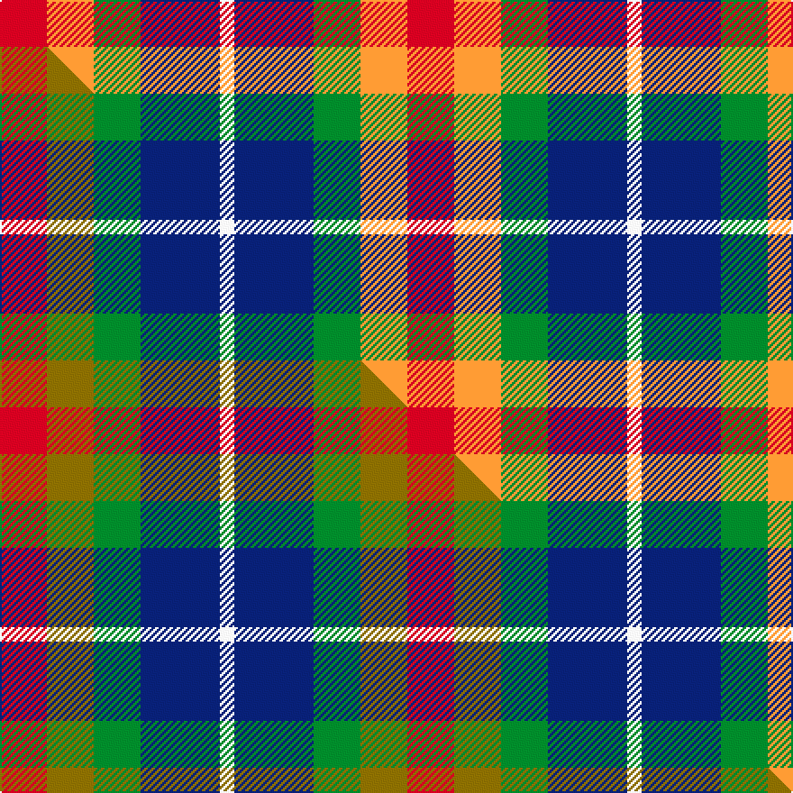

This page is one **sett** — a single exact thread-count. It belongs to the [tartan](/setts/r13lo13g13db22w4/)
(the same proportion at any scale), whose colour order is pattern [RYGBW](/stripes/rygbw/).

Part of the [Clan Haggis World](/tartans/clan-haggis-world/) tartan — the named design grouping this sett with its other cloths.

Sourced from tartans-authority.  It is a [5 stripe tartan](/stripes/stripes5/).

Original link https://www.tartanregister.gov.uk/tartanDetails.aspx?ref=10781

Dataset <small>— provenance for this record, inherited from the source manifest</small>

<dl class="dataset-prov">
<dt>source</dt><dd><a href="/sources/tartans-authority/">Scottish Tartans Authority</a></dd>
<dt>data captured from</dt><dd><a href="https://github.com/thetartan/tartan-database/blob/master/data/tartans-authority/data.csv">https://github.com/thetartan/tartan-database/blob/master/data/tartans-authority/data.csv</a></dd>
<dt>data date</dt><dd>22/01/2013 <small>(this record)</small></dd>
<dt>licence</dt><dd><a href="https://creativecommons.org/licenses/by-nc-nd/4.0/">CC BY-NC-ND 4.0</a></dd>
</dl>

Capture chain <small>— the hands this data passed through, oldest first; each capture carries its own licence</small>

<ol class="capture-chain">
<li><a href="https://www.tartansauthority.com/">Scottish Tartans Authority</a> <small>the heritage body's archive — its tartan-ferret record browser is retired (links repaired to the SRT, above)</small></li>
<li><a href="https://github.com/thetartan/tartan-database">thetartan/tartan-database</a> <small>2016-2017</small> · <a href="https://creativecommons.org/licenses/by-nc-nd/4.0/">CC BY-NC-ND 4.0</a> <small>Levko Kravets's frozen compilation — the capture we vendored, and where its CC licence text came from</small></li>
<li>this dictionary <small>captured 2026-06-10 · commit 5bf86c7566</small> <small>each re-capture is a git commit to data/sources</small></li>
</ol>

## Register references

External register numbers recorded for this tartan.

- Scottish Register of Tartans: [10781](https://www.tartanregister.gov.uk/tartanDetails?ref=10781)
- Scottish Tartans Authority (ITI): 10781

## Thread count
R/26 LO26 G26 DB44 W/8

One full sett is **226 threads**.

## Palette
<table><thead><tr><th>Colour</th><th>Shade</th><th>OKLCh</th></tr></thead><tbody><tr><td>DB</td><td><code style="background-color:#082077;">#082077</code> <small style="color:#888">#082077</small></td><td><small style="color:#888">oklch(30.0% 0.149 265.1)</small></td></tr><tr><td>G</td><td><code style="background-color:#008B2A;">#008B2A</code> <small style="color:#888">#008B2A</small></td><td><small style="color:#888">oklch(55.4% 0.170 145.9)</small></td></tr><tr><td>LO</td><td><code style="background-color:#FF9C34;">#FF9C34</code> <small style="color:#888">#FF9C34</small></td><td><small style="color:#888">oklch(77.9% 0.161 61.8)</small></td></tr><tr><td>R</td><td><code style="background-color:#D60020;">#D60020</code> <small style="color:#888">#D60020</small></td><td><small style="color:#888">oklch(55.2% 0.224 25.5)</small></td></tr><tr><td>W</td><td><code style="background-color:#F7F7F7;">#F7F7F7</code> <small style="color:#888">#F7F7F7</small></td><td><small style="color:#888">oklch(97.6% 0.000 89.9)</small></td></tr></tbody></table>

# Sample pattern

## Compared to the master

This cloth is one sett of its design; the master sett (the exemplar the design is anchored on) is below for comparison.

Its **ΔTartan distance** from the master is **1.00** — the same measure the nearest-tartans table ranks by (0 is identical; a re-scale of the same cloth is near 0, a recolour or a different proportion further).

<figure class="master-compare" style="margin:0">

this sett
master sett ★

<figcaption style="color:#888;font-size:smaller">One weave of this sett against the <a href="/setts/r13y13g13db22w4/">master sett ★</a>, split on the diagonal: a shared proportion runs seamlessly across it with only the shades shifting; a different proportion breaks on it.</figcaption>
</figure>

## Nearest tartan variants

The nearest existing variants by ΔTartan distance, with this cloth at the top so the swatches line up against it.

ΔTartan

Threads

Variant

Sett

—

226

<a href="/variants/s5/r13lo13g13db22w4~x2/">Clan Haggis World (Corporate)</a>

<a href="/ttd/edit/#slug=r13y13g13db22w4~x2&amp;base=r13lo13g13db22w4~x2" title="compare in the TTD">1.00</a>

226

<a href="/variants/s5/r13y13g13db22w4~x2/">Clan Haggis World (Corporate)</a>

<a href="/ttd/edit/#slug=g15dg18db23w4r8~x2&amp;base=r13lo13g13db22w4~x2" title="compare in the TTD">1.45</a>

226

<a href="/variants/s5/g15dg18db23w4r8~x2/">Friebe (2014)</a>

<a href="/ttd/edit/#slug=g21db34r14w6~x2&amp;base=r13lo13g13db22w4~x2" title="compare in the TTD">1.55</a>

246

<a href="/variants/s4/g21db34r14w6~x2/">Harbison (2015)</a>

<a href="/ttd/edit/#slug=db21g34r14w6~x2&amp;base=r13lo13g13db22w4~x2" title="compare in the TTD">1.62</a>

246

<a href="/variants/s4/db21g34r14w6~x2/">Harbison (2015)</a>

<a href="/ttd/edit/#slug=db10g10r5w1~x2&amp;base=r13lo13g13db22w4~x2" title="compare in the TTD">1.67</a>

82

<a href="/variants/s4/db10g10r5w1~x2/">Thorntons Law (Corporate)</a>

<a href="/ttd/edit/#slug=db3g6ly1r3~x10&amp;base=r13lo13g13db22w4~x2" title="compare in the TTD">2.05</a>

200

<a href="/variants/s4/db3g6ly1r3~x10/">Delroeux (Personal)</a>

<a href="/ttd/edit/#slug=lb3w10db10g10r2~x4&amp;base=r13lo13g13db22w4~x2" title="compare in the TTD">2.21</a>

260

<a href="/variants/s5/lb3w10db10g10r2~x4/">MacTeddy</a>

<a href="/ttd/edit/#slug=db2g4y1db1r2~x12&amp;base=r13lo13g13db22w4~x2" title="compare in the TTD">2.44</a>

192

<a href="/variants/s5/db2g4y1db1r2~x12/">Creek Indian Nation</a>

<a href="/ttd/edit/#slug=dy19g23ly3db15r11w5~x2&amp;base=r13lo13g13db22w4~x2" title="compare in the TTD">2.68</a>

256

<a href="/variants/s6/dy19g23ly3db15r11w5~x2/">Mekos, The</a>

<a href="/ttd/edit/#slug=g15dg18dp23w4r8~x2&amp;base=r13lo13g13db22w4~x2" title="compare in the TTD">2.68</a>

226

<a href="/variants/s5/g15dg18dp23w4r8~x2/">Friebe (2014)</a>

## Neighbour map

Every grey dot is one of 13620 variants placed by the first two principal components of the ΔTartan feature space (42% of its variance). Red is this tartan; blue dots are its nearest — click one to open its page.

<svg viewBox="0 0 640 380" role="img" style="max-width:100%;height:auto;border:1px solid #e0e0e0;border-radius:4px;display:block" xmlns="http://www.w3.org/2000/svg"><image href="/nn/cloud.v1.png" width="640" height="380"/><a href="/variants/s5/r13y13g13db22w4~x2/"><circle cx="107.4" cy="274.3" r="4" fill="#3465a4"><title>Clan Haggis World (Corporate)</title></circle></a><a href="/variants/s5/g15dg18db23w4r8~x2/"><circle cx="119.3" cy="267.8" r="4" fill="#3465a4"><title>Friebe (2014)</title></circle></a><a href="/variants/s4/g21db34r14w6~x2/"><circle cx="195.1" cy="277.2" r="4" fill="#3465a4"><title>Harbison (2015)</title></circle></a><a href="/variants/s4/db21g34r14w6~x2/"><circle cx="194.9" cy="279.1" r="4" fill="#3465a4"><title>Harbison (2015)</title></circle></a><a href="/variants/s4/db10g10r5w1~x2/"><circle cx="204.3" cy="256.7" r="4" fill="#3465a4"><title>Thorntons Law (Corporate)</title></circle></a><a href="/variants/s4/db3g6ly1r3~x10/"><circle cx="216.3" cy="282.2" r="4" fill="#3465a4"><title>Delroeux (Personal)</title></circle></a><a href="/variants/s5/lb3w10db10g10r2~x4/"><circle cx="74.9" cy="264.0" r="4" fill="#3465a4"><title>MacTeddy</title></circle></a><a href="/variants/s5/db2g4y1db1r2~x12/"><circle cx="182.9" cy="293.5" r="4" fill="#3465a4"><title>Creek Indian Nation</title></circle></a><a href="/variants/s6/dy19g23ly3db15r11w5~x2/"><circle cx="91.7" cy="229.6" r="4" fill="#3465a4"><title>Mekos, The</title></circle></a><a href="/variants/s5/g15dg18dp23w4r8~x2/"><circle cx="125.3" cy="264.9" r="4" fill="#3465a4"><title>Friebe (2014)</title></circle></a><circle cx="98.9" cy="272.0" r="5" fill="#c00000"/><text x="320" y="376" text-anchor="middle" font-size="11" fill="#999">ground</text><text x="11" y="190" text-anchor="middle" font-size="11" fill="#999" transform="rotate(-90 11 190)">complexity</text></svg>

ID: /variants/s5/r13lo13g13db22w4~x2/
