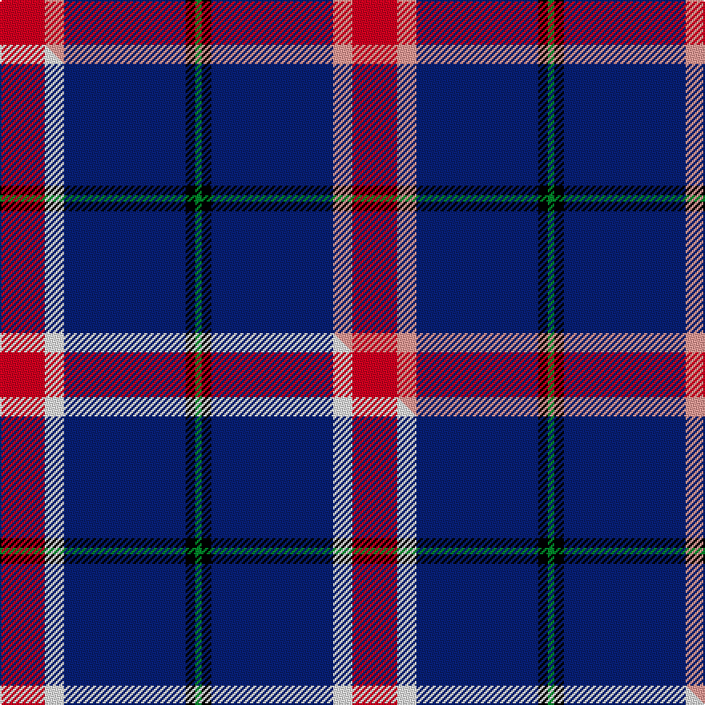

This is one **variant** — a specific cloth: this exact thread count and colourway, with its own
provenance below. It is one weaving of the [sett](/tartans/d/do/doten/) (the scale-free proportion — the
same cloth at any scale or shade), whose colour order is pattern [GKBYR](/stripes/gkbyr/).

Part of the [Doten](/tartans/d/do/doten/) tartan — the named design grouping this sett with its other cloths.

Sourced from tartans-authority.  It is a [5 stripe tartan](/stripes/stripes5/).

Original link <code>http://www.tartansauthority.com/tartan-ferret/display/10941/</code> — retired · [Internet Archive copy](https://web.archive.org/web/*/http://www.tartansauthority.com/tartan-ferret/display/10941/*)

Dataset <small>— provenance for this record, inherited from the source manifest</small>

<dl class="dataset-prov">
<dt>source</dt><dd><a href="/sources/tartans-authority/">Scottish Tartans Authority</a></dd>
<dt>data captured from</dt><dd><a href="https://github.com/thetartan/tartan-database/blob/master/data/tartans-authority/data.csv">https://github.com/thetartan/tartan-database/blob/master/data/tartans-authority/data.csv</a></dd>
<dt>data date</dt><dd>2013 <small>(this record)</small></dd>
<dt>licence</dt><dd><a href="https://creativecommons.org/licenses/by-nc-nd/4.0/">CC BY-NC-ND 4.0</a></dd>
</dl>

Capture chain <small>— the hands this data passed through, oldest first; each capture carries its own licence</small>

<ol class="capture-chain">
<li><a href="https://www.tartansauthority.com/">Scottish Tartans Authority</a> <small>the heritage body’s archive — its tartan-ferret record browser is retired; dead record links are shown unlinked, with an Internet Archive copy (ITI numbers are not SRT references)</small></li>
<li><a href="https://github.com/thetartan/tartan-database">thetartan/tartan-database</a> <small>2016-2017</small> · <a href="https://creativecommons.org/licenses/by-nc-nd/4.0/">CC BY-NC-ND 4.0</a> <small>Levko Kravets's frozen compilation — the capture we vendored, and where its CC licence text came from</small></li>
<li>this dictionary <small>captured 2026-06-10 · commit 5bf86c7566</small> <small>each re-capture is a git commit to data/sources</small></li>
</ol>

## Register references

External register numbers recorded for this tartan.

- Scottish Register of Tartans: [10941](https://www.tartanregister.gov.uk/tartanDetails?ref=10941)
- Scottish Tartans Authority (ITI): 10941

## Thread count
R/28 LR12 DB76 K6 G/4

One full sett is **220 threads**.

## Palette
<table><thead><tr><th>Colour</th><th>Shade</th><th>OKLCh</th></tr></thead><tbody><tr><td>DB</td><td><code style="background-color:#082077;">#082077</code> <small style="color:#888">#082077</small></td><td><small style="color:#888">oklch(30.0% 0.149 265.1)</small></td></tr><tr><td>G</td><td><code style="background-color:#008B2A;">#008B2A</code> <small style="color:#888">#008B2A</small></td><td><small style="color:#888">oklch(55.4% 0.170 145.9)</small></td></tr><tr><td>K</td><td><code style="background-color:#000000;">#000000</code> <small style="color:#888">#000000</small></td><td><small style="color:#888">oklch(0.0% 0.000 0.0)</small></td></tr><tr><td>LR</td><td><code style="background-color:#FF9C97;">#FF9C97</code> <small style="color:#888">#FF9C97</small></td><td><small style="color:#888">oklch(79.3% 0.119 23.2)</small></td></tr><tr><td>R</td><td><code style="background-color:#D60020;">#D60020</code> <small style="color:#888">#D60020</small></td><td><small style="color:#888">oklch(55.2% 0.224 25.5)</small></td></tr></tbody></table>

# Sample pattern

## Compared to the master

This cloth is one sett of its design; the master sett (the exemplar the design is anchored on) is below for comparison.

Its **ΔTartan distance** from the master is **0.30** — the same measure the nearest-tartans table ranks by (0 is identical; a re-scale of the same cloth is near 0, a recolour or a different proportion further).

<figure class="master-compare" style="margin:0">

this sett
master sett ★

<figcaption style="color:#888;font-size:smaller">One weave of this sett against the <a href="/setts/r14w6db38k3g2/">master sett ★</a>, split on the diagonal: a shared proportion runs seamlessly across it with only the shades shifting; a different proportion breaks on it.</figcaption>
</figure>

## Nearest tartan variants

The nearest existing variants by ΔTartan distance, with this cloth at the top so the swatches line up against it.

ΔTartan

Threads

Variant

Sett

—

220

<a href="/variants/s5/r14lr6db38k3g2~x2/">Doten (2013)</a>

<a href="/ttd/edit/#slug=r14w6db38k3g2~x2&amp;base=r14lr6db38k3g2~x2" title="compare in the TTD">0.30</a>

220

<a href="/variants/s5/r14w6db38k3g2~x2/">Doten (2013)</a>

<a href="/ttd/edit/#slug=db62r24y5g3~x2&amp;base=r14lr6db38k3g2~x2" title="compare in the TTD">1.05</a>

246

<a href="/variants/s4/db62r24y5g3~x2/">Meaux, Luc G (Personal)</a>

<a href="/ttd/edit/#slug=db14k3dr3w1~x2&amp;base=r14lr6db38k3g2~x2" title="compare in the TTD">1.14</a>

54

<a href="/variants/s4/db14k3dr3w1~x2/">Bacon, Blue</a>

<a href="/ttd/edit/#slug=b5g8k5db32w2r2~x2&amp;base=r14lr6db38k3g2~x2" title="compare in the TTD">1.26</a>

202

<a href="/variants/s6/b5g8k5db32w2r2~x2/">Marion (Personal)</a>

<a href="/ttd/edit/#slug=db46k6g9dy9r4&amp;base=r14lr6db38k3g2~x2" title="compare in the TTD">1.29</a>

98

<a href="/variants/s5/db46k6g9dy9r4/">Ayllu Thuban</a>

<a href="/ttd/edit/#slug=r5db26k12w2~x4&amp;base=r14lr6db38k3g2~x2" title="compare in the TTD">1.45</a>

332

<a href="/variants/s4/r5db26k12w2~x4/">Mirror (Corporate)</a>

<a href="/ttd/edit/#slug=r4db32k15w2~x2&amp;base=r14lr6db38k3g2~x2" title="compare in the TTD">1.46</a>

200

<a href="/variants/s4/r4db32k15w2~x2/">Scottish Nuclear</a>

<a href="/ttd/edit/#slug=db25r1g1n9w4~x2&amp;base=r14lr6db38k3g2~x2" title="compare in the TTD">1.50</a>

102

<a href="/variants/s5/db25r1g1n9w4~x2/">Tailor Ishida, Kobe</a>

<a href="/ttd/edit/#slug=dg10w2k10y5db35r6~x2&amp;base=r14lr6db38k3g2~x2" title="compare in the TTD">1.51</a>

240

<a href="/variants/s6/dg10w2k10y5db35r6~x2/">Hatfield &amp; Mize (Personal)</a>

<a href="/ttd/edit/#slug=dr80lb40k5dy6&amp;base=r14lr6db38k3g2~x2" title="compare in the TTD">1.52</a>

176

<a href="/variants/s4/dr80lb40k5dy6/">Broberg (Scania) (Personal)</a>

## Neighbour map

Every grey dot is one of 13656 variants placed by the first two principal components of the ΔTartan feature space (42% of its variance). Red is this tartan; blue dots are its nearest — click one to open its page. The map is a flat projection of a many-dimensional space — [how to read it](/posts/neighbourhood-maps/).

<svg viewBox="0 0 640 380" role="img" style="max-width:100%;height:auto;border:1px solid #e0e0e0;border-radius:4px;display:block" xmlns="http://www.w3.org/2000/svg"><image href="/nn/cloud.v1.png" width="640" height="380"/><a href="/variants/s5/r14w6db38k3g2~x2/"><circle cx="299.4" cy="138.1" r="4" fill="#3465a4"><title>Doten (2013)</title></circle></a><a href="/variants/s4/db62r24y5g3~x2/"><circle cx="423.1" cy="184.1" r="4" fill="#3465a4"><title>Meaux, Luc G (Personal)</title></circle></a><a href="/variants/s4/db14k3dr3w1~x2/"><circle cx="383.8" cy="192.5" r="4" fill="#3465a4"><title>Bacon, Blue</title></circle></a><a href="/variants/s6/b5g8k5db32w2r2~x2/"><circle cx="278.9" cy="129.1" r="4" fill="#3465a4"><title>Marion (Personal)</title></circle></a><a href="/variants/s5/db46k6g9dy9r4/"><circle cx="337.4" cy="176.8" r="4" fill="#3465a4"><title>Ayllu Thuban</title></circle></a><a href="/variants/s4/r5db26k12w2~x4/"><circle cx="293.7" cy="197.8" r="4" fill="#3465a4"><title>Mirror (Corporate)</title></circle></a><a href="/variants/s4/r4db32k15w2~x2/"><circle cx="329.9" cy="185.9" r="4" fill="#3465a4"><title>Scottish Nuclear</title></circle></a><a href="/variants/s5/db25r1g1n9w4~x2/"><circle cx="366.3" cy="148.9" r="4" fill="#3465a4"><title>Tailor Ishida, Kobe</title></circle></a><a href="/variants/s6/dg10w2k10y5db35r6~x2/"><circle cx="229.6" cy="140.0" r="4" fill="#3465a4"><title>Hatfield &amp; Mize (Personal)</title></circle></a><a href="/variants/s4/dr80lb40k5dy6/"><circle cx="334.7" cy="175.2" r="4" fill="#3465a4"><title>Broberg (Scania) (Personal)</title></circle></a><circle cx="313.4" cy="141.0" r="5" fill="#c00000"/><text x="320" y="376" text-anchor="middle" font-size="11" fill="#999">ground</text><text x="11" y="190" text-anchor="middle" font-size="11" fill="#999" transform="rotate(-90 11 190)">complexity</text></svg>

ID: /variants/s5/r14lr6db38k3g2~x2/
