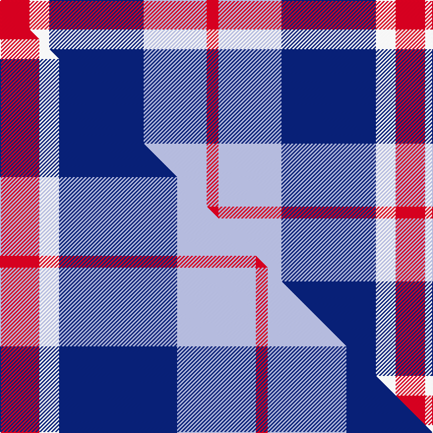

This is one **variant** — a specific cloth: this exact thread count and colourway, with its own
provenance below. It is one weaving of the [sett](/setts/r15w10db48lb32r6/) (the scale-free proportion — the
same cloth at any scale or shade), whose colour order is pattern [RWBWR](/stripes/rwbwr/).

Part of the [Lands of Liberty](/tartans/l/la/lands-of-liberty/) tartan — the named design grouping this sett with its other cloths.

Sourced from tartans-authority.  It is a [5 stripe tartan](/stripes/stripes5/).

Original link [https://www.tartanregister.gov.uk/tartanDetails.aspx?ref=10928](https://www.tartanregister.gov.uk/tartanDetails.aspx?ref=10928)

Dataset <small>— provenance for this record, inherited from the source manifest</small>

<dl class="dataset-prov">
<dt>source</dt><dd><a href="/sources/tartans-authority/">Scottish Tartans Authority</a></dd>
<dt>data captured from</dt><dd><a href="https://github.com/thetartan/tartan-database/blob/master/data/tartans-authority/data.csv">https://github.com/thetartan/tartan-database/blob/master/data/tartans-authority/data.csv</a></dd>
<dt>data date</dt><dd>2013 <small>(this record)</small></dd>
<dt>licence</dt><dd><a href="https://creativecommons.org/licenses/by-nc-nd/4.0/">CC BY-NC-ND 4.0</a></dd>
</dl>

Capture chain <small>— the hands this data passed through, oldest first; each capture carries its own licence</small>

<ol class="capture-chain">
<li><a href="https://www.tartansauthority.com/">Scottish Tartans Authority</a> <small>the heritage body's archive — its tartan-ferret record browser is retired (links repaired to the SRT, above)</small></li>
<li><a href="https://github.com/thetartan/tartan-database">thetartan/tartan-database</a> <small>2016-2017</small> · <a href="https://creativecommons.org/licenses/by-nc-nd/4.0/">CC BY-NC-ND 4.0</a> <small>Levko Kravets's frozen compilation — the capture we vendored, and where its CC licence text came from</small></li>
<li>this dictionary <small>captured 2026-06-10 · commit 5bf86c7566</small> <small>each re-capture is a git commit to data/sources</small></li>
</ol>

## Register references

External register numbers recorded for this tartan.

- Scottish Register of Tartans: [10928](https://www.tartanregister.gov.uk/tartanDetails?ref=10928)
- Scottish Tartans Authority (ITI): 10928

## Thread count
R/30 W20 DB96 LB64 R/12

One full sett is **402 threads**.

## Palette
<table><thead><tr><th>Colour</th><th>Shade</th><th>OKLCh</th></tr></thead><tbody><tr><td>LB</td><td><code style="background-color:#B5BBDE;">#B5BBDE</code> <small style="color:#888">#B5BBDE</small></td><td><small style="color:#888">oklch(79.9% 0.050 277.6)</small></td></tr><tr><td>DB</td><td><code style="background-color:#082077;">#082077</code> <small style="color:#888">#082077</small></td><td><small style="color:#888">oklch(30.0% 0.149 265.1)</small></td></tr><tr><td>R</td><td><code style="background-color:#D60020;">#D60020</code> <small style="color:#888">#D60020</small></td><td><small style="color:#888">oklch(55.2% 0.224 25.5)</small></td></tr><tr><td>W</td><td><code style="background-color:#F7F7F7;">#F7F7F7</code> <small style="color:#888">#F7F7F7</small></td><td><small style="color:#888">oklch(97.6% 0.000 89.9)</small></td></tr></tbody></table>

# Sample pattern

## Compared to the master

This cloth is one sett of its design; the master sett (the exemplar the design is anchored on) is below for comparison.

Its **ΔTartan distance** from the master is **0.24** — the same measure the nearest-tartans table ranks by (0 is identical; a re-scale of the same cloth is near 0, a recolour or a different proportion further).

<figure class="master-compare" style="margin:0">

this sett
master sett ★

<figcaption style="color:#888;font-size:smaller">One weave of this sett against the <a href="/setts/r10w5db30lb20r3/">master sett ★</a>, split on the diagonal: a shared proportion runs seamlessly across it with only the shades shifting; a different proportion breaks on it.</figcaption>
</figure>

## Nearest tartan variants

The nearest existing variants by ΔTartan distance, with this cloth at the top so the swatches line up against it.

ΔTartan

Threads

Variant

Sett

—

402

<a href="/variants/s5/r15w10db48lb32r6~x2/">Lands of Liberty (Fashion)</a>

<a href="/ttd/edit/#slug=r10w5db30lb20r3~x4&amp;base=r15w10db48lb32r6~x2" title="compare in the TTD">0.24</a>

492

<a href="/variants/s5/r10w5db30lb20r3~x4/">Lands of Liberty</a>

<a href="/ttd/edit/#slug=r21b43dt86w10~b1611266-dt1203284&amp;base=r15w10db48lb32r6~x2" title="compare in the TTD">1.39</a>

289

<a href="/variants/s4/r21b43dt86w10~b1511266-dt1203284/">Fong Wedding (Personal)</a>

<a href="/ttd/edit/#slug=db7y1db7lb11r2~x6&amp;base=r15w10db48lb32r6~x2" title="compare in the TTD">1.79</a>

282

<a href="/variants/s5/db7y1db7lb11r2~x6/">Brazell (Personal)</a>

<a href="/ttd/edit/#slug=w3db2dbi15lb15r2~x4~db1404245-dbi1406275&amp;base=r15w10db48lb32r6~x2" title="compare in the TTD">1.90</a>

276

<a href="/variants/s5/w3db2dbi15lb15r2~x4~db1404245-dbi1406275/">SABA</a>

<a href="/ttd/edit/#slug=db13y2r4g2lb8w2~x6&amp;base=r15w10db48lb32r6~x2" title="compare in the TTD">1.91</a>

282

<a href="/variants/s6/db13y2r4g2lb8w2~x6/">Meh Dundee</a>

<a href="/ttd/edit/#slug=lb6ly6t21db32r3~x2&amp;base=r15w10db48lb32r6~x2" title="compare in the TTD">1.96</a>

254

<a href="/variants/s5/lb6ly6t21db32r3~x2/">Jamieson, Robert (Personal)</a>

<a href="/ttd/edit/#slug=k1r2lb1db5ly1~x16&amp;base=r15w10db48lb32r6~x2" title="compare in the TTD">2.03</a>

288

<a href="/variants/s5/k1r2lb1db5ly1~x16/">University of Trinity College</a>

<a href="/ttd/edit/#slug=r1o8r2db8lb1~x2&amp;base=r15w10db48lb32r6~x2" title="compare in the TTD">2.04</a>

76

<a href="/variants/s5/r1o8r2db8lb1~x2/">Unamed, Riding cloak 1745</a>

<a href="/ttd/edit/#slug=r1g7r3db7lb1~x2&amp;base=r15w10db48lb32r6~x2" title="compare in the TTD">2.09</a>

72

<a href="/variants/s5/r1g7r3db7lb1~x2/">Hebridean 4</a>

<a href="/ttd/edit/#slug=r15dr98db72lb25db8w15&amp;base=r15w10db48lb32r6~x2" title="compare in the TTD">2.35</a>

436

<a href="/variants/s6/r15dr98db72lb25db8w15/">Afternoon Tea / Assam</a>

## Neighbour map

Every grey dot is one of 13656 variants placed by the first two principal components of the ΔTartan feature space (42% of its variance). Red is this tartan; blue dots are its nearest — click one to open its page. The map is a flat projection of a many-dimensional space — [how to read it](/posts/neighbourhood-maps/).

<svg viewBox="0 0 640 380" role="img" style="max-width:100%;height:auto;border:1px solid #e0e0e0;border-radius:4px;display:block" xmlns="http://www.w3.org/2000/svg"><image href="/nn/cloud.v1.png" width="640" height="380"/><a href="/variants/s5/r10w5db30lb20r3~x4/"><circle cx="210.3" cy="218.1" r="4" fill="#3465a4"><title>Lands of Liberty</title></circle></a><a href="/variants/s4/r21b43dt86w10~b1511266-dt1203284/"><circle cx="291.5" cy="244.0" r="4" fill="#3465a4"><title>Fong Wedding (Personal)</title></circle></a><a href="/variants/s5/db7y1db7lb11r2~x6/"><circle cx="263.1" cy="229.5" r="4" fill="#3465a4"><title>Brazell (Personal)</title></circle></a><a href="/variants/s5/w3db2dbi15lb15r2~x4~db1404245-dbi1406275/"><circle cx="208.6" cy="221.1" r="4" fill="#3465a4"><title>SABA</title></circle></a><a href="/variants/s6/db13y2r4g2lb8w2~x6/"><circle cx="143.4" cy="200.5" r="4" fill="#3465a4"><title>Meh Dundee</title></circle></a><a href="/variants/s5/lb6ly6t21db32r3~x2/"><circle cx="241.4" cy="212.3" r="4" fill="#3465a4"><title>Jamieson, Robert (Personal)</title></circle></a><a href="/variants/s5/k1r2lb1db5ly1~x16/"><circle cx="168.8" cy="210.0" r="4" fill="#3465a4"><title>University of Trinity College</title></circle></a><a href="/variants/s5/r1o8r2db8lb1~x2/"><circle cx="243.9" cy="229.2" r="4" fill="#3465a4"><title>Unamed, Riding cloak 1745</title></circle></a><a href="/variants/s5/r1g7r3db7lb1~x2/"><circle cx="193.9" cy="247.3" r="4" fill="#3465a4"><title>Hebridean 4</title></circle></a><a href="/variants/s6/r15dr98db72lb25db8w15/"><circle cx="217.5" cy="185.7" r="4" fill="#3465a4"><title>Afternoon Tea / Assam</title></circle></a><circle cx="193.7" cy="229.8" r="5" fill="#c00000"/><text x="320" y="376" text-anchor="middle" font-size="11" fill="#999">ground</text><text x="11" y="190" text-anchor="middle" font-size="11" fill="#999" transform="rotate(-90 11 190)">complexity</text></svg>

ID: /variants/s5/r15w10db48lb32r6~x2/
