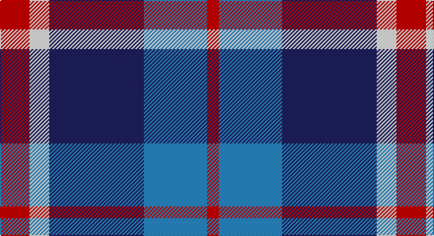

This page is one **sett** — a single exact thread-count. It belongs to the [tartan](/setts/r15w10db48t32r6/)
(the same proportion at any scale), whose colour order is pattern [RBBWR](/stripes/rbbwr/).

Part of the [Lands of Liberty](/tartans/lands-of-liberty/) tartan — the named design grouping this sett with its other cloths.

Sourced from tartans-authority.  It is a [5 stripe tartan](/stripes/stripes5/).

Original link http://www.tartansauthority.com/tartan-ferret/display/10928/

## Register references

External register numbers recorded for this tartan.

- Scottish Register of Tartans: [10928](https://www.tartanregister.gov.uk/tartanDetails?ref=10928)
- Scottish Tartans Authority (ITI): 10928

## Thread count
R/30 W20 DB96 B64 R/12

One full sett is **402 threads**.

## Palette

Palette: <strong>Tartan Register</strong>
<table><thead><tr><th>Colour</th><th>Threads</th><th>Shade</th><th>Base</th><th>OKLCh</th></tr></thead><tbody><tr><td>R/</td><td style="text-align:right;font-variant-numeric:tabular-nums">30</td><td><code style="background-color:#C80000;">#C80000</code> <small style="color:#888">#C80000</small></td><td>R <code style="background-color:#CC0000;">#CC0000</code></td><td><small style="color:#888">oklch(52.3% 0.215 29.2)</small></td></tr><tr><td>W</td><td style="text-align:right;font-variant-numeric:tabular-nums">20</td><td><code style="background-color:#FCFCFC;">#FCFCFC</code> <small style="color:#888">#FCFCFC</small></td><td>W <code style="background-color:#F7F7F7;">#F7F7F7</code></td><td><small style="color:#888">oklch(99.1% 0.000 89.9)</small></td></tr><tr><td>DB</td><td style="text-align:right;font-variant-numeric:tabular-nums">96</td><td><code style="background-color:#202060;">#202060</code> <small style="color:#888">#202060</small></td><td>B <code style="background-color:#2A418A;">#2A418A</code></td><td><small style="color:#888">oklch(28.9% 0.111 276.9)</small></td></tr><tr><td>B</td><td style="text-align:right;font-variant-numeric:tabular-nums">64</td><td><code style="background-color:#2888C4;">#2888C4</code> <small style="color:#888">#2888C4</small></td><td>B <code style="background-color:#2A418A;">#2A418A</code></td><td><small style="color:#888">oklch(60.1% 0.125 241.5)</small></td></tr><tr><td>R/</td><td style="text-align:right;font-variant-numeric:tabular-nums">12</td><td><code style="background-color:#C80000;">#C80000</code> <small style="color:#888">#C80000</small></td><td>R <code style="background-color:#CC0000;">#CC0000</code></td><td><small style="color:#888">oklch(52.3% 0.215 29.2)</small></td></tr></tbody></table>

# Sample pattern

## Compared to the master

This cloth is one sett of its design; the master sett (the exemplar the design is anchored on) is below for comparison.

<figure style="margin:0"><figcaption style="color:#888;font-size:smaller">this sett</figcaption></figure>
<figure style="margin:0"><figcaption style="color:#888;font-size:smaller"><a href="/setts/r10w5db30b20r3/">master sett →</a></figcaption></figure>

## Nearest tartans

The nearest existing variants by ΔTartan distance, with this tartan at the top so the swatches line up against it.

ΔTartan

Tartan

Sett

—

<a href="/ttd/edit/#slug=r15w10db48t32r6~x2">Lands of Liberty (Fashion)</a> <a class="nn-out" href="/variants/s5/r15w10db48t32r6~x2/" title="open its dictionary page">↗</a>

0.86

<a href="/ttd/edit/#slug=r10w5db30b20r3~x4&amp;base=r15w10db48t32r6~x2">Lands of Liberty</a> <a class="nn-out" href="/variants/s5/r10w5db30b20r3~x4/" title="open its dictionary page">↗</a>

0.97

<a href="/ttd/edit/#slug=db10g10r5w1~x2&amp;base=r15w10db48t32r6~x2">Thorntons Law (Corporate)</a> <a class="nn-out" href="/variants/s4/db10g10r5w1~x2/" title="open its dictionary page">↗</a>

1.03

<a href="/ttd/edit/#slug=r3k1w5k4db11r1~x4&amp;base=r15w10db48t32r6~x2">Hydro-Electric (Corporate)</a> <a class="nn-out" href="/variants/s6/r3k1w5k4db11r1~x4/" title="open its dictionary page">↗</a>

1.11

<a href="/ttd/edit/#slug=db9ly9db9t23r3~x2&amp;base=r15w10db48t32r6~x2">Tilburg (District)</a> <a class="nn-out" href="/variants/s5/db9ly9db9t23r3~x2/" title="open its dictionary page">↗</a>

1.12

<a href="/ttd/edit/#slug=db2ly1db7w1k7w2~x6&amp;base=r15w10db48t32r6~x2">Hawick Rugby Club (Corporate)</a> <a class="nn-out" href="/variants/s6/db2ly1db7w1k7w2~x6/" title="open its dictionary page">↗</a>

1.12

<a href="/ttd/edit/#slug=lr2r1t7db7lb1~x8&amp;base=r15w10db48t32r6~x2">Bryson (1988) (Name)</a> <a class="nn-out" href="/variants/s5/lr2r1t7db7lb1~x8/" title="open its dictionary page">↗</a>

1.16

<a href="/ttd/edit/#slug=r3db15w13o6db2o2r2~x2&amp;base=r15w10db48t32r6~x2">Thom(p)son, Navy</a> <a class="nn-out" href="/variants/s7/r3db15w13o6db2o2r2~x2/" title="open its dictionary page">↗</a>

1.20

<a href="/ttd/edit/#slug=k3lb10db2g6db18g2~x2&amp;base=r15w10db48t32r6~x2">Crombie House Check</a> <a class="nn-out" href="/variants/s6/k3lb10db2g6db18g2~x2/" title="open its dictionary page">↗</a>

1.21

<a href="/ttd/edit/#slug=r2lb1db8lb8y8lb1y1~x2&amp;base=r15w10db48t32r6~x2">Over Mountain</a> <a class="nn-out" href="/variants/s7/r2lb1db8lb8y8lb1y1~x2/" title="open its dictionary page">↗</a>

1.21

<a href="/ttd/edit/#slug=db9k7o5r1o5k1o2~x4&amp;base=r15w10db48t32r6~x2">Greyhound Grenadiers (Corporate)</a> <a class="nn-out" href="/variants/s7/db9k7o5r1o5k1o2~x4/" title="open its dictionary page">↗</a>

## Neighbour map

Every grey dot is one of 14360 variants placed by the first two principal components of the ΔTartan feature space (44% of its variance). Red is this tartan; blue dots are its nearest — click one to open its page.

<svg viewBox="0 0 640 380" role="img" style="max-width:100%;height:auto;border:1px solid #e0e0e0;border-radius:4px;display:block" xmlns="http://www.w3.org/2000/svg"><image href="/nn/cloud.v1.png" width="640" height="380"/><a href="/variants/s5/r10w5db30b20r3~x4/"><circle cx="210.1" cy="216.9" r="4" fill="#3465a4"><title>Lands of Liberty</title></circle></a><a href="/variants/s4/db10g10r5w1~x2/"><circle cx="177.9" cy="242.9" r="4" fill="#3465a4"><title>Thorntons Law (Corporate)</title></circle></a><a href="/variants/s6/r3k1w5k4db11r1~x4/"><circle cx="186.7" cy="186.0" r="4" fill="#3465a4"><title>Hydro-Electric (Corporate)</title></circle></a><a href="/variants/s5/db9ly9db9t23r3~x2/"><circle cx="194.3" cy="246.6" r="4" fill="#3465a4"><title>Tilburg (District)</title></circle></a><a href="/variants/s6/db2ly1db7w1k7w2~x6/"><circle cx="196.8" cy="218.7" r="4" fill="#3465a4"><title>Hawick Rugby Club (Corporate)</title></circle></a><a href="/variants/s5/lr2r1t7db7lb1~x8/"><circle cx="160.8" cy="213.0" r="4" fill="#3465a4"><title>Bryson (1988) (Name)</title></circle></a><a href="/variants/s7/r3db15w13o6db2o2r2~x2/"><circle cx="151.2" cy="190.0" r="4" fill="#3465a4"><title>Thom(p)son, Navy</title></circle></a><a href="/variants/s6/k3lb10db2g6db18g2~x2/"><circle cx="226.8" cy="209.5" r="4" fill="#3465a4"><title>Crombie House Check</title></circle></a><a href="/variants/s7/r2lb1db8lb8y8lb1y1~x2/"><circle cx="158.4" cy="199.3" r="4" fill="#3465a4"><title>Over Mountain</title></circle></a><a href="/variants/s7/db9k7o5r1o5k1o2~x4/"><circle cx="185.3" cy="222.0" r="4" fill="#3465a4"><title>Greyhound Grenadiers (Corporate)</title></circle></a><circle cx="185.6" cy="224.2" r="5" fill="#c00000"/></svg>

ID: /variants/s5/r15w10db48t32r6~x2/
