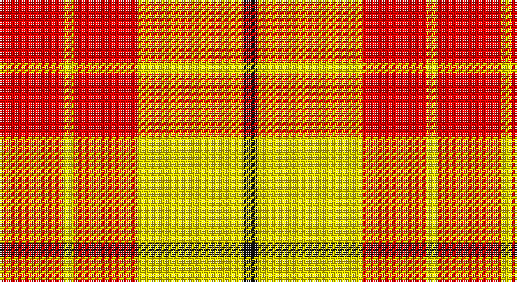

This page is one **sett** — a single exact thread-count. It belongs to the [tartan](/setts/r18ly3r18ly30k4/)
(the same proportion at any scale), whose colour order is pattern [KYRYR](/stripes/kyryr/).

Sourced from register-of-tartans.  It is a [5 stripe tartan](/stripes/stripes5/).

Original link https://www.tartanregister.gov.uk/tartanDetails.aspx?ref=10409

2 attestations — the source records this cloth was collapsed from (oldest owns this page)

<ul>
<li>07/03/2011 — Shire of Hornwood (USA) (register-of-tartans, <a href="https://www.tartanregister.gov.uk/tartanDetails.aspx?ref=10409">record</a>)</li>
<li>7th March 2011 — Shire of Hornwood (Corporate) (tartans-authority, <a href="http://www.tartansauthority.com/tartan-ferret/display/10409/">record</a>)</li>
</ul>

## Register references

External register numbers recorded for this tartan.

- Scottish Register of Tartans: [10409](https://www.tartanregister.gov.uk/tartanDetails?ref=10409)
- Scottish Tartans Authority (ITI): 10409

## Thread count
R/36 Y6 R36 Y60 K/8

One full sett is **248 threads**.

## Palette

Palette: <strong>Tartan Register</strong>
<table><thead><tr><th>Colour</th><th>Threads</th><th>Shade</th><th>Base</th><th>OKLCh</th></tr></thead><tbody><tr><td>R/</td><td style="text-align:right;font-variant-numeric:tabular-nums">36</td><td><code style="background-color:#FF0000;">#FF0000</code> <small style="color:#888">#FF0000</small></td><td>R <code style="background-color:#CC0000;">#CC0000</code></td><td><small style="color:#888">oklch(62.8% 0.258 29.2)</small></td></tr><tr><td>Y</td><td style="text-align:right;font-variant-numeric:tabular-nums">6</td><td><code style="background-color:#FFE600;">#FFE600</code> <small style="color:#888">#FFE600</small></td><td>Y <code style="background-color:#F2BF00;">#F2BF00</code></td><td><small style="color:#888">oklch(91.7% 0.192 101.4)</small></td></tr><tr><td>R</td><td style="text-align:right;font-variant-numeric:tabular-nums">36</td><td><code style="background-color:#FF0000;">#FF0000</code> <small style="color:#888">#FF0000</small></td><td>R <code style="background-color:#CC0000;">#CC0000</code></td><td><small style="color:#888">oklch(62.8% 0.258 29.2)</small></td></tr><tr><td>Y</td><td style="text-align:right;font-variant-numeric:tabular-nums">60</td><td><code style="background-color:#FFE600;">#FFE600</code> <small style="color:#888">#FFE600</small></td><td>Y <code style="background-color:#F2BF00;">#F2BF00</code></td><td><small style="color:#888">oklch(91.7% 0.192 101.4)</small></td></tr><tr><td>K/</td><td style="text-align:right;font-variant-numeric:tabular-nums">8</td><td><code style="background-color:#101010;">#101010</code> <small style="color:#888">#101010</small></td><td>K <code style="background-color:#000000;">#000000</code></td><td><small style="color:#888">oklch(17.3% 0.000 89.9)</small></td></tr></tbody></table>

# Sample pattern

## Nearest tartans

The nearest existing variants by ΔTartan distance, with this tartan at the top so the swatches line up against it.

ΔTartan

Tartan

Sett

—

<a href="/ttd/edit/#slug=r18ly3r18ly30k4~x2">Shire of Hornwood (USA)</a> <a class="nn-out" href="/variants/s5/r18ly3r18ly30k4~x2/" title="open its dictionary page">↗</a>

1.71

<a href="/ttd/edit/#slug=r29g2r2g2r6ly21~x4&amp;base=r18ly3r18ly30k4~x2">Maguire, Black</a> <a class="nn-out" href="/variants/s6/r29g2r2g2r6ly21~x4/" title="open its dictionary page">↗</a>

1.76

<a href="/ttd/edit/#slug=db4ly1r12ly2r2ly12r1ly4~x4&amp;base=r18ly3r18ly30k4~x2">Glassary #3</a> <a class="nn-out" href="/variants/s8/db4ly1r12ly2r2ly12r1ly4~x4/" title="open its dictionary page">↗</a>

1.89

<a href="/ttd/edit/#slug=ly42r15ri28ly12r6ri20&amp;base=r18ly3r18ly30k4~x2">Kozlosky, Kilt</a> <a class="nn-out" href="/variants/s6/ly42r15ri28ly12r6ri20/" title="open its dictionary page">↗</a>

1.91

<a href="/ttd/edit/#slug=ly6r1ly4r4db2~x5&amp;base=r18ly3r18ly30k4~x2">Sands-Pingot Family, Alabama (Personal)</a> <a class="nn-out" href="/variants/s5/ly6r1ly4r4db2~x5/" title="open its dictionary page">↗</a>

2.00

<a href="/ttd/edit/#slug=r4w35r31w4~x2&amp;base=r18ly3r18ly30k4~x2">Lewis, Red (Dance)</a> <a class="nn-out" href="/variants/s4/r4w35r31w4~x2/" title="open its dictionary page">↗</a>

2.01

<a href="/ttd/edit/#slug=r3ly1r12ly2r3ly8r2ly8r1~x2&amp;base=r18ly3r18ly30k4~x2">MacMillan</a> <a class="nn-out" href="/variants/s9/r3ly1r12ly2r3ly8r2ly8r1~x2/" title="open its dictionary page">↗</a>

2.04

<a href="/ttd/edit/#slug=ly21ri8r14ly6ri3r10~x2&amp;base=r18ly3r18ly30k4~x2">Kozlosky (Personal)</a> <a class="nn-out" href="/variants/s6/ly21ri8r14ly6ri3r10~x2/" title="open its dictionary page">↗</a>

2.04

<a href="/ttd/edit/#slug=r6ly2r18ly3r4ly12r3ly10r2~x2&amp;base=r18ly3r18ly30k4~x2">MacMillan Dress Clan Tartan</a> <a class="nn-out" href="/variants/s9/r6ly2r18ly3r4ly12r3ly10r2~x2/" title="open its dictionary page">↗</a>

2.11

<a href="/ttd/edit/#slug=r8ri3r28w32ri3w4~x2&amp;base=r18ly3r18ly30k4~x2">Ailsa, Red V2 (Dance)</a> <a class="nn-out" href="/variants/s6/r8ri3r28w32ri3w4~x2/" title="open its dictionary page">↗</a>

2.13

<a href="/ttd/edit/#slug=ly8k3ly4k2r30ly6~x2&amp;base=r18ly3r18ly30k4~x2">Masai Shuka 16 (Artefact)</a> <a class="nn-out" href="/variants/s6/ly8k3ly4k2r30ly6~x2/" title="open its dictionary page">↗</a>

## Neighbour map

Every grey dot is one of 14360 variants placed by the first two principal components of the ΔTartan feature space (44% of its variance). Red is this tartan; blue dots are its nearest — click one to open its page.

<svg viewBox="0 0 640 380" role="img" style="max-width:100%;height:auto;border:1px solid #e0e0e0;border-radius:4px;display:block" xmlns="http://www.w3.org/2000/svg"><image href="/nn/cloud.v1.png" width="640" height="380"/><a href="/variants/s6/r29g2r2g2r6ly21~x4/"><circle cx="381.0" cy="162.2" r="4" fill="#3465a4"><title>Maguire, Black</title></circle></a><a href="/variants/s8/db4ly1r12ly2r2ly12r1ly4~x4/"><circle cx="296.7" cy="172.1" r="4" fill="#3465a4"><title>Glassary #3</title></circle></a><a href="/variants/s6/ly42r15ri28ly12r6ri20/"><circle cx="247.1" cy="242.8" r="4" fill="#3465a4"><title>Kozlosky, Kilt</title></circle></a><a href="/variants/s5/ly6r1ly4r4db2~x5/"><circle cx="255.5" cy="243.3" r="4" fill="#3465a4"><title>Sands-Pingot Family, Alabama (Personal)</title></circle></a><a href="/variants/s4/r4w35r31w4~x2/"><circle cx="347.5" cy="233.9" r="4" fill="#3465a4"><title>Lewis, Red (Dance)</title></circle></a><a href="/variants/s9/r3ly1r12ly2r3ly8r2ly8r1~x2/"><circle cx="357.7" cy="196.7" r="4" fill="#3465a4"><title>MacMillan</title></circle></a><a href="/variants/s6/ly21ri8r14ly6ri3r10~x2/"><circle cx="248.7" cy="246.8" r="4" fill="#3465a4"><title>Kozlosky (Personal)</title></circle></a><a href="/variants/s9/r6ly2r18ly3r4ly12r3ly10r2~x2/"><circle cx="363.0" cy="210.7" r="4" fill="#3465a4"><title>MacMillan Dress Clan Tartan</title></circle></a><a href="/variants/s6/r8ri3r28w32ri3w4~x2/"><circle cx="291.5" cy="179.9" r="4" fill="#3465a4"><title>Ailsa, Red V2 (Dance)</title></circle></a><a href="/variants/s6/ly8k3ly4k2r30ly6~x2/"><circle cx="360.4" cy="163.2" r="4" fill="#3465a4"><title>Masai Shuka 16 (Artefact)</title></circle></a><circle cx="282.7" cy="204.7" r="5" fill="#c00000"/></svg>

ID: /variants/s5/r18ly3r18ly30k4~x2/
