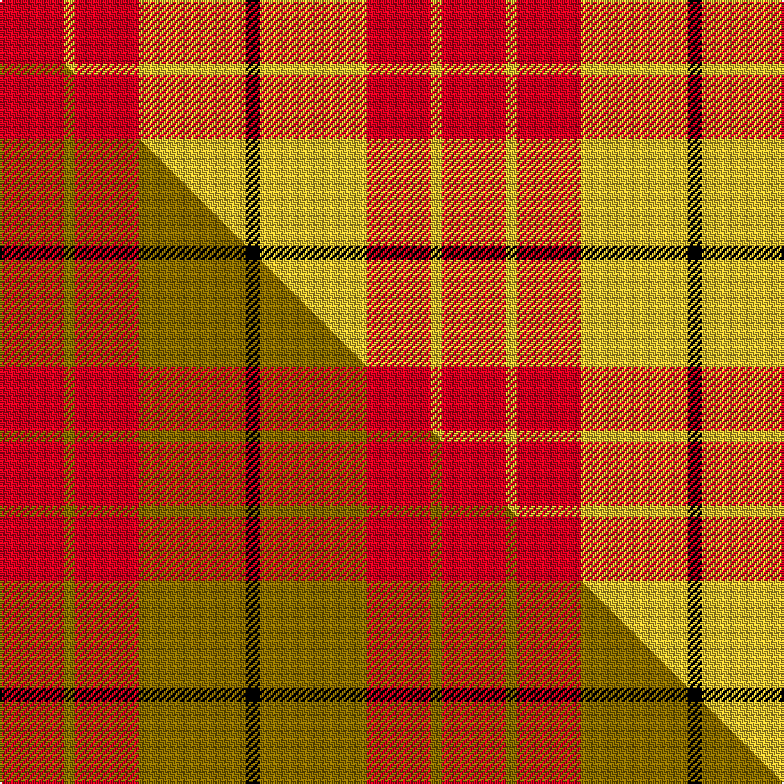

This page is one **sett** — a single exact thread-count. It belongs to the [tartan](/setts/r18ly3r18ly30k4/)
(the same proportion at any scale), whose colour order is pattern [KYRYR](/stripes/kyryr/).

Part of the [Shire of Hornwood](/tartans/shire-of-hornwood/) tartan — the named design grouping this sett with its other cloths.

Sourced from tartans-authority.  It is a [5 stripe tartan](/stripes/stripes5/).

Original link http://www.tartansauthority.com/tartan-ferret/display/10409/

## Register references

External register numbers recorded for this tartan.

- Scottish Register of Tartans: [10409](https://www.tartanregister.gov.uk/tartanDetails?ref=10409)
- Scottish Tartans Authority (ITI): 10409

## Thread count
R/36 LY6 R36 LY60 K/8

One full sett is **248 threads**.

## Palette
<table><thead><tr><th>Colour</th><th>Shade</th><th>OKLCh</th></tr></thead><tbody><tr><td>K</td><td><code style="background-color:#000000;">#000000</code> <small style="color:#888">#000000</small></td><td><small style="color:#888">oklch(0.0% 0.000 0.0)</small></td></tr><tr><td>R</td><td><code style="background-color:#D60020;">#D60020</code> <small style="color:#888">#D60020</small></td><td><small style="color:#888">oklch(55.2% 0.224 25.5)</small></td></tr><tr><td>LY</td><td><code style="background-color:#DCBC32;">#DCBC32</code> <small style="color:#888">#DCBC32</small></td><td><small style="color:#888">oklch(80.0% 0.150 95.2)</small></td></tr></tbody></table>

# Sample pattern

## Compared to the master

This cloth is one sett of its design; the master sett (the exemplar the design is anchored on) is below for comparison.

Its **ΔTartan distance** from the master is **2.01** — the same measure the nearest-tartans table ranks by (0 is identical; a re-scale of the same cloth is near 0, a recolour or a different proportion further).

<figure class="master-compare" style="margin:0">

this sett
master sett ★

<figcaption style="color:#888;font-size:smaller">One weave of this sett against the <a href="/setts/r18y3r18y30k4/">master sett ★</a>, split on the diagonal: a shared proportion runs seamlessly across it with only the shades shifting; a different proportion breaks on it.</figcaption>
</figure>

## Nearest variants

The nearest existing variants by ΔTartan distance, with this cloth at the top so the swatches line up against it.

ΔTartan

Threads

Variant

Sett

—

248

<a href="/variants/s5/r18ly3r18ly30k4~x2/">Shire of Hornwood (Corporate)</a>

<a href="/ttd/edit/#slug=r18y3r18y30k4~x2&amp;base=r18ly3r18ly30k4~x2" title="compare in the TTD">0.00</a>

248

<a href="/variants/s5/r18y3r18y30k4~x2/">Shire of Hornwood (USA)</a>

<a href="/ttd/edit/#slug=y8k3y4k2r30y6~x2&amp;base=r18ly3r18ly30k4~x2" title="compare in the TTD">2.09</a>

184

<a href="/variants/s6/y8k3y4k2r30y6~x2/">Masai Shuka 16 (Artefact)</a>

<a href="/ttd/edit/#slug=r4ly1r3g1ly8g2~x4&amp;base=r18ly3r18ly30k4~x2" title="compare in the TTD">2.54</a>

128

<a href="/variants/s6/r4ly1r3g1ly8g2~x4/">Buchele Check (Fashion?)</a>

<a href="/ttd/edit/#slug=k1r5g10r5g1~x4&amp;base=r18ly3r18ly30k4~x2" title="compare in the TTD">2.63</a>

168

<a href="/variants/s5/k1r5g10r5g1~x4/">Murray, Lord George (Hose)</a>

<a href="/ttd/edit/#slug=g7r3g1r9k1~x2&amp;base=r18ly3r18ly30k4~x2" title="compare in the TTD">2.84</a>

68

<a href="/variants/s5/g7r3g1r9k1~x2/">MacDonald of Sleat</a>

<a href="/ttd/edit/#slug=r6dg13k5r20w3~x2&amp;base=r18ly3r18ly30k4~x2" title="compare in the TTD">2.85</a>

170

<a href="/variants/s5/r6dg13k5r20w3~x2/">Ryutokukan Junior High School</a>

<a href="/ttd/edit/#slug=g16r5g2r18k2~x2&amp;base=r18ly3r18ly30k4~x2" title="compare in the TTD">2.87</a>

136

<a href="/variants/s5/g16r5g2r18k2~x2/">MacDonald, Lord of The Isles (Artef)</a>

<a href="/ttd/edit/#slug=g16r5g2r18k2&amp;base=r18ly3r18ly30k4~x2" title="compare in the TTD">2.87</a>

68

<a href="/variants/s5/g16r5g2r18k2/">MacDonald of Sleat</a>

<a href="/ttd/edit/#slug=r28g16k4w7r28&amp;base=r18ly3r18ly30k4~x2" title="compare in the TTD">2.91</a>

110

<a href="/variants/s5/r28g16k4w7r28/">Sinclair Dress</a>

<a href="/ttd/edit/#slug=y3k2r10k1~x4&amp;base=r18ly3r18ly30k4~x2" title="compare in the TTD">2.94</a>

112

<a href="/variants/s4/y3k2r10k1~x4/">Masai Shuka 26 (Artefact)</a>

## Neighbour map

Every grey dot is one of 13620 variants placed by the first two principal components of the ΔTartan feature space (42% of its variance). Red is this tartan; blue dots are its nearest — click one to open its page.

<svg viewBox="0 0 640 380" role="img" style="max-width:100%;height:auto;border:1px solid #e0e0e0;border-radius:4px;display:block" xmlns="http://www.w3.org/2000/svg"><image href="/nn/cloud.v1.png" width="640" height="380"/><a href="/variants/s5/r18y3r18y30k4~x2/"><circle cx="346.1" cy="241.9" r="4" fill="#3465a4"><title>Shire of Hornwood (USA)</title></circle></a><a href="/variants/s6/y8k3y4k2r30y6~x2/"><circle cx="369.0" cy="172.2" r="4" fill="#3465a4"><title>Masai Shuka 16 (Artefact)</title></circle></a><a href="/variants/s6/r4ly1r3g1ly8g2~x4/"><circle cx="306.1" cy="249.5" r="4" fill="#3465a4"><title>Buchele Check (Fashion?)</title></circle></a><a href="/variants/s5/k1r5g10r5g1~x4/"><circle cx="300.7" cy="225.2" r="4" fill="#3465a4"><title>Murray, Lord George (Hose)</title></circle></a><a href="/variants/s5/g7r3g1r9k1~x2/"><circle cx="328.9" cy="221.7" r="4" fill="#3465a4"><title>MacDonald of Sleat</title></circle></a><a href="/variants/s5/r6dg13k5r20w3~x2/"><circle cx="239.1" cy="218.4" r="4" fill="#3465a4"><title>Ryutokukan Junior High School</title></circle></a><a href="/variants/s5/g16r5g2r18k2~x2/"><circle cx="315.8" cy="220.4" r="4" fill="#3465a4"><title>MacDonald, Lord of The Isles (Artef)</title></circle></a><a href="/variants/s5/g16r5g2r18k2/"><circle cx="315.8" cy="220.4" r="4" fill="#3465a4"><title>MacDonald of Sleat</title></circle></a><a href="/variants/s5/r28g16k4w7r28/"><circle cx="324.6" cy="225.0" r="4" fill="#3465a4"><title>Sinclair Dress</title></circle></a><a href="/variants/s4/y3k2r10k1~x4/"><circle cx="341.6" cy="202.1" r="4" fill="#3465a4"><title>Masai Shuka 26 (Artefact)</title></circle></a><circle cx="285.7" cy="222.9" r="5" fill="#c00000"/><text x="320" y="376" text-anchor="middle" font-size="11" fill="#999">ground</text><text x="11" y="190" text-anchor="middle" font-size="11" fill="#999" transform="rotate(-90 11 190)">complexity</text></svg>

ID: /variants/s5/r18ly3r18ly30k4~x2/
