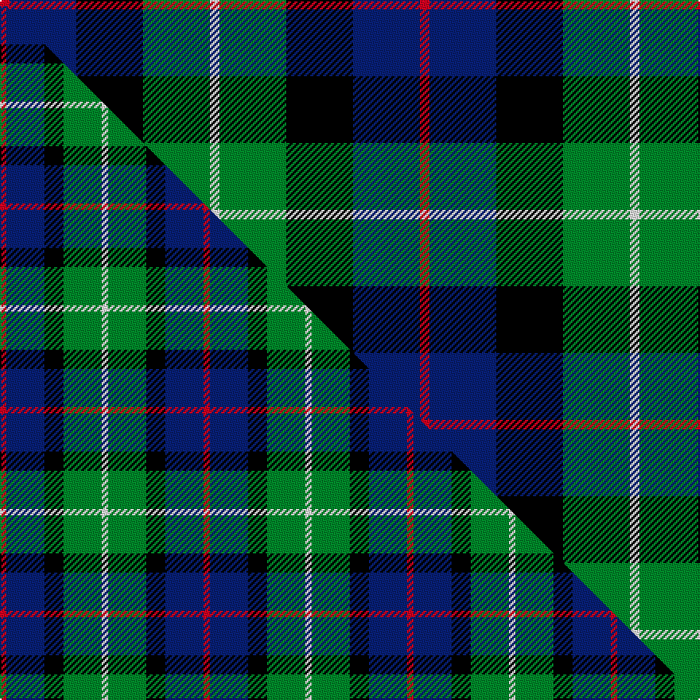

This page is one **sett** — a single exact thread-count. It belongs to the [tartan](/setts/r1db7k7g7w1/)
(the same proportion at any scale), whose colour order is pattern [RBKGW](/stripes/rbkgw/).

Part of the [Davidson of Tulloch](/tartans/davidson-of-tulloch/) tartan — the named design grouping this sett with its other cloths.

Sourced from tartans-authority.  It is a [5 stripe tartan](/stripes/stripes5/).

Original link http://www.tartansauthority.com/tartan-ferret/display/8613/

## Register references

External register numbers recorded for this tartan.

- Scottish Register of Tartans: [8613](https://www.tartanregister.gov.uk/tartanDetails?ref=8613)
- Scottish Tartans Authority (ITI): 8613

## Thread count
R/6 DB42 K42 G42 W/6

One full sett is **264 threads**.

## Palette
<table><thead><tr><th>Colour</th><th>Shade</th><th>OKLCh</th></tr></thead><tbody><tr><td>DB</td><td><code style="background-color:#082077;">#082077</code> <small style="color:#888">#082077</small></td><td><small style="color:#888">oklch(30.0% 0.149 265.1)</small></td></tr><tr><td>G</td><td><code style="background-color:#008B2A;">#008B2A</code> <small style="color:#888">#008B2A</small></td><td><small style="color:#888">oklch(55.4% 0.170 145.9)</small></td></tr><tr><td>K</td><td><code style="background-color:#000000;">#000000</code> <small style="color:#888">#000000</small></td><td><small style="color:#888">oklch(0.0% 0.000 0.0)</small></td></tr><tr><td>W</td><td><code style="background-color:#F7F7F7;">#F7F7F7</code> <small style="color:#888">#F7F7F7</small></td><td><small style="color:#888">oklch(97.6% 0.000 89.9)</small></td></tr><tr><td>R</td><td><code style="background-color:#D60020;">#D60020</code> <small style="color:#888">#D60020</small></td><td><small style="color:#888">oklch(55.2% 0.224 25.5)</small></td></tr></tbody></table>

# Sample pattern

## Compared to the master

This cloth is one sett of its design; the master sett (the exemplar the design is anchored on) is below for comparison.

Its **ΔTartan distance** from the master is **0.67** — the same measure the nearest-tartans table ranks by (0 is identical; a re-scale of the same cloth is near 0, a recolour or a different proportion further).

<figure class="master-compare" style="margin:0">

this sett
master sett ★

<figcaption style="color:#888;font-size:smaller">One weave of this sett against the <a href="/setts/r1db6k3g6w1/">master sett ★</a>, split on the diagonal: a shared proportion runs seamlessly across it with only the shades shifting; a different proportion breaks on it.</figcaption>
</figure>

## Nearest variants

The nearest existing variants by ΔTartan distance, with this cloth at the top so the swatches line up against it.

ΔTartan

Threads

Variant

Sett

—

264

<a href="/variants/s5/r1db7k7g7w1~x6/">Davidson of Tulloch (Clan)</a>

<a href="/ttd/edit/#slug=r1db6k3g6w1~x2&amp;base=r1db7k7g7w1~x6" title="compare in the TTD">0.70</a>

64

<a href="/variants/s5/r1db6k3g6w1~x2/">Davidson of Tulloch</a>

<a href="/ttd/edit/#slug=r1db6k3g6w1~x4&amp;base=r1db7k7g7w1~x6" title="compare in the TTD">0.70</a>

128

<a href="/variants/s5/r1db6k3g6w1~x4/">Davidson of Tulloch #2</a>

<a href="/ttd/edit/#slug=r1db6k3g6w1&amp;base=r1db7k7g7w1~x6" title="compare in the TTD">0.70</a>

32

<a href="/variants/s5/r1db6k3g6w1/">Davidson of Tulloch</a>

<a href="/ttd/edit/#slug=r2db10k5g12w2~x2&amp;base=r1db7k7g7w1~x6" title="compare in the TTD">0.76</a>

116

<a href="/variants/s5/r2db10k5g12w2~x2/">Davidson of Tulloch</a>

<a href="/ttd/edit/#slug=r2db12k7g8lb2~x4&amp;base=r1db7k7g7w1~x6" title="compare in the TTD">0.97</a>

232

<a href="/variants/s5/r2db12k7g8lb2~x4/">Forbo Nairn</a>

<a href="/ttd/edit/#slug=b4dg25k24w3db24w4~x2&amp;base=r1db7k7g7w1~x6" title="compare in the TTD">1.08</a>

320

<a href="/variants/s6/b4dg25k24w3db24w4~x2/">Herd</a>

<a href="/ttd/edit/#slug=db1r1db6k6g6w1~x2&amp;base=r1db7k7g7w1~x6" title="compare in the TTD">1.26</a>

80

<a href="/variants/s6/db1r1db6k6g6w1~x2/">Wellington</a>

<a href="/ttd/edit/#slug=g4w1g10k10db10r2&amp;base=r1db7k7g7w1~x6" title="compare in the TTD">1.35</a>

68

<a href="/variants/s6/g4w1g10k10db10r2/">Rose Hunting</a>

<a href="/ttd/edit/#slug=k4w1g10k10db10r2~x4&amp;base=r1db7k7g7w1~x6" title="compare in the TTD">1.52</a>

272

<a href="/variants/s6/k4w1g10k10db10r2~x4/">Rose Hunting</a>

<a href="/ttd/edit/#slug=k4w1g10k10db10r2~x2&amp;base=r1db7k7g7w1~x6" title="compare in the TTD">1.52</a>

136

<a href="/variants/s6/k4w1g10k10db10r2~x2/">Rose Hunting</a>

## Neighbour map

Every grey dot is one of 13620 variants placed by the first two principal components of the ΔTartan feature space (42% of its variance). Red is this tartan; blue dots are its nearest — click one to open its page.

<svg viewBox="0 0 640 380" role="img" style="max-width:100%;height:auto;border:1px solid #e0e0e0;border-radius:4px;display:block" xmlns="http://www.w3.org/2000/svg"><image href="/nn/cloud.v1.png" width="640" height="380"/><a href="/variants/s5/r1db6k3g6w1~x2/"><circle cx="106.6" cy="227.1" r="4" fill="#3465a4"><title>Davidson of Tulloch</title></circle></a><a href="/variants/s5/r1db6k3g6w1~x4/"><circle cx="106.6" cy="227.1" r="4" fill="#3465a4"><title>Davidson of Tulloch #2</title></circle></a><a href="/variants/s5/r1db6k3g6w1/"><circle cx="106.6" cy="227.1" r="4" fill="#3465a4"><title>Davidson of Tulloch</title></circle></a><a href="/variants/s5/r2db10k5g12w2~x2/"><circle cx="116.5" cy="226.1" r="4" fill="#3465a4"><title>Davidson of Tulloch</title></circle></a><a href="/variants/s5/r2db12k7g8lb2~x4/"><circle cx="114.8" cy="230.9" r="4" fill="#3465a4"><title>Forbo Nairn</title></circle></a><a href="/variants/s6/b4dg25k24w3db24w4~x2/"><circle cx="102.3" cy="201.5" r="4" fill="#3465a4"><title>Herd</title></circle></a><a href="/variants/s6/db1r1db6k6g6w1~x2/"><circle cx="96.7" cy="213.2" r="4" fill="#3465a4"><title>Wellington</title></circle></a><a href="/variants/s6/g4w1g10k10db10r2/"><circle cx="125.1" cy="202.9" r="4" fill="#3465a4"><title>Rose Hunting</title></circle></a><a href="/variants/s6/k4w1g10k10db10r2~x4/"><circle cx="120.7" cy="197.5" r="4" fill="#3465a4"><title>Rose Hunting</title></circle></a><a href="/variants/s6/k4w1g10k10db10r2~x2/"><circle cx="120.7" cy="197.5" r="4" fill="#3465a4"><title>Rose Hunting</title></circle></a><circle cx="91.3" cy="223.1" r="5" fill="#c00000"/><text x="320" y="376" text-anchor="middle" font-size="11" fill="#999">ground</text><text x="11" y="190" text-anchor="middle" font-size="11" fill="#999" transform="rotate(-90 11 190)">complexity</text></svg>

ID: /variants/s5/r1db7k7g7w1~x6/
