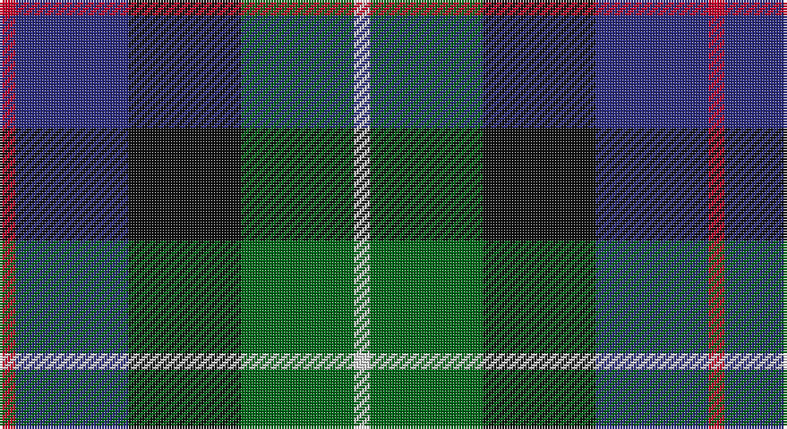

This page is one **sett** — a single exact thread-count. It belongs to the [tartan](/setts/r1db7k7g7w1/)
(the same proportion at any scale), whose colour order is pattern [RBKGW](/stripes/rbkgw/).

Part of the [Davidson of Tulloch](/tartans/davidson-of-tulloch/) tartan — the named design grouping this sett with its other cloths.

Sourced from tartans-authority.  It is a [5 stripe tartan](/stripes/stripes5/).

Original link http://www.tartansauthority.com/tartan-ferret/display/8613/

## Also known as

This cloth is also recorded under:

- Davidson
- Davidson of Tulloch #2

## Register references

External register numbers recorded for this tartan.

- Scottish Register of Tartans: [8613](https://www.tartanregister.gov.uk/tartanDetails?ref=8613)
- Scottish Tartans Authority (ITI): 8613

## Thread count
R/6 DB42 K42 G42 LN/6

One full sett is **264 threads**.

## Palette

Palette: <strong>Tartan Register</strong>
<table><thead><tr><th>Colour</th><th>Threads</th><th>Shade</th><th>Base</th><th>OKLCh</th></tr></thead><tbody><tr><td>R/</td><td style="text-align:right;font-variant-numeric:tabular-nums">6</td><td><code style="background-color:#C8002C;">#C8002C</code> <small style="color:#888">#C8002C</small></td><td>R <code style="background-color:#CC0000;">#CC0000</code></td><td><small style="color:#888">oklch(52.6% 0.212 22.0)</small></td></tr><tr><td>DB</td><td style="text-align:right;font-variant-numeric:tabular-nums">42</td><td><code style="background-color:#2C2C80;">#2C2C80</code> <small style="color:#888">#2C2C80</small></td><td>B <code style="background-color:#2A418A;">#2A418A</code></td><td><small style="color:#888">oklch(35.0% 0.138 276.6)</small></td></tr><tr><td>K</td><td style="text-align:right;font-variant-numeric:tabular-nums">42</td><td><code style="background-color:#101010;">#101010</code> <small style="color:#888">#101010</small></td><td>K <code style="background-color:#000000;">#000000</code></td><td><small style="color:#888">oklch(17.3% 0.000 89.9)</small></td></tr><tr><td>G</td><td style="text-align:right;font-variant-numeric:tabular-nums">42</td><td><code style="background-color:#006818;">#006818</code> <small style="color:#888">#006818</small></td><td>G <code style="background-color:#006100;">#006100</code></td><td><small style="color:#888">oklch(45.0% 0.142 145.0)</small></td></tr><tr><td>LN/</td><td style="text-align:right;font-variant-numeric:tabular-nums">6</td><td><code style="background-color:#E0E0E0;">#E0E0E0</code> <small style="color:#888">#E0E0E0</small></td><td>W <code style="background-color:#F7F7F7;">#F7F7F7</code></td><td><small style="color:#888">oklch(90.7% 0.000 89.9)</small></td></tr></tbody></table>

# Sample pattern

## Compared to the master

This cloth is one sett of its design; the master sett (the exemplar the design is anchored on) is below for comparison.

<figure style="margin:0"><figcaption style="color:#888;font-size:smaller">this sett</figcaption></figure>
<figure style="margin:0"><figcaption style="color:#888;font-size:smaller"><a href="/setts/r1db6k3dg6w1/">master sett →</a></figcaption></figure>

## Nearest tartans

The nearest existing variants by ΔTartan distance, with this tartan at the top so the swatches line up against it.

ΔTartan

Tartan

Sett

—

<a href="/ttd/edit/#slug=r1db7k7g7w1~x6">Davidson of Tulloch (Clan)</a> <a class="nn-out" href="/variants/s5/r1db7k7g7w1~x6/" title="open its dictionary page">↗</a>

0.61

<a href="/ttd/edit/#slug=r1db6k3dg6w1~x4&amp;base=r1db7k7g7w1~x6">Davidson of Tulloch #2</a> <a class="nn-out" href="/variants/s5/r1db6k3dg6w1~x4/" title="open its dictionary page">↗</a>

0.66

<a href="/ttd/edit/#slug=k2ly1dg6k6db6w1~x4&amp;base=r1db7k7g7w1~x6">Dyce #3</a> <a class="nn-out" href="/variants/s6/k2ly1dg6k6db6w1~x4/" title="open its dictionary page">↗</a>

0.70

<a href="/ttd/edit/#slug=db1r1db6k6dg6w1~x2&amp;base=r1db7k7g7w1~x6">Wellington</a> <a class="nn-out" href="/variants/s6/db1r1db6k6dg6w1~x2/" title="open its dictionary page">↗</a>

0.75

<a href="/ttd/edit/#slug=r2k1db6k2g6m2~x4&amp;base=r1db7k7g7w1~x6">MacEachain (Clan)</a> <a class="nn-out" href="/variants/s6/r2k1db6k2g6m2~x4/" title="open its dictionary page">↗</a>

0.77

<a href="/ttd/edit/#slug=k2g17k16r2db17w2~x2&amp;base=r1db7k7g7w1~x6">Galbraith</a> <a class="nn-out" href="/variants/s6/k2g17k16r2db17w2~x2/" title="open its dictionary page">↗</a>

0.79

<a href="/ttd/edit/#slug=dp27db4k27g27lo4~x2&amp;base=r1db7k7g7w1~x6">Selkirk (Personal)</a> <a class="nn-out" href="/variants/s5/dp27db4k27g27lo4~x2/" title="open its dictionary page">↗</a>

0.83

<a href="/ttd/edit/#slug=k1g8w1k8db8r1~x4&amp;base=r1db7k7g7w1~x6">Leslie Hunting</a> <a class="nn-out" href="/variants/s6/k1g8w1k8db8r1~x4/" title="open its dictionary page">↗</a>

0.84

<a href="/ttd/edit/#slug=t2g6ly1k6db6k1db1~x2&amp;base=r1db7k7g7w1~x6">Hogarth of Firhill</a> <a class="nn-out" href="/variants/s7/t2g6ly1k6db6k1db1~x2/" title="open its dictionary page">↗</a>

0.86

<a href="/ttd/edit/#slug=t4g14ly2k14db14k2db3~x2&amp;base=r1db7k7g7w1~x6">Hogarth of Firhill (Clan)</a> <a class="nn-out" href="/variants/s7/t4g14ly2k14db14k2db3~x2/" title="open its dictionary page">↗</a>

0.90

<a href="/ttd/edit/#slug=dp2g6k2db6k1r2~x4&amp;base=r1db7k7g7w1~x6">MacCaughan, or MacEachain</a> <a class="nn-out" href="/variants/s6/dp2g6k2db6k1r2~x4/" title="open its dictionary page">↗</a>

## Neighbour map

Every grey dot is one of 14360 variants placed by the first two principal components of the ΔTartan feature space (44% of its variance). Red is this tartan; blue dots are its nearest — click one to open its page.

<svg viewBox="0 0 640 380" role="img" style="max-width:100%;height:auto;border:1px solid #e0e0e0;border-radius:4px;display:block" xmlns="http://www.w3.org/2000/svg"><image href="/nn/cloud.v1.png" width="640" height="380"/><a href="/variants/s5/r1db6k3dg6w1~x4/"><circle cx="146.7" cy="248.4" r="4" fill="#3465a4"><title>Davidson of Tulloch #2</title></circle></a><a href="/variants/s6/k2ly1dg6k6db6w1~x4/"><circle cx="135.4" cy="240.4" r="4" fill="#3465a4"><title>Dyce #3</title></circle></a><a href="/variants/s6/db1r1db6k6dg6w1~x2/"><circle cx="142.2" cy="237.6" r="4" fill="#3465a4"><title>Wellington</title></circle></a><a href="/variants/s6/r2k1db6k2g6m2~x4/"><circle cx="118.6" cy="242.0" r="4" fill="#3465a4"><title>MacEachain (Clan)</title></circle></a><a href="/variants/s6/k2g17k16r2db17w2~x2/"><circle cx="151.3" cy="214.4" r="4" fill="#3465a4"><title>Galbraith</title></circle></a><a href="/variants/s5/dp27db4k27g27lo4~x2/"><circle cx="136.0" cy="244.5" r="4" fill="#3465a4"><title>Selkirk (Personal)</title></circle></a><a href="/variants/s6/k1g8w1k8db8r1~x4/"><circle cx="160.6" cy="222.5" r="4" fill="#3465a4"><title>Leslie Hunting</title></circle></a><a href="/variants/s7/t2g6ly1k6db6k1db1~x2/"><circle cx="116.2" cy="227.0" r="4" fill="#3465a4"><title>Hogarth of Firhill</title></circle></a><a href="/variants/s7/t4g14ly2k14db14k2db3~x2/"><circle cx="134.9" cy="222.1" r="4" fill="#3465a4"><title>Hogarth of Firhill (Clan)</title></circle></a><a href="/variants/s6/dp2g6k2db6k1r2~x4/"><circle cx="94.1" cy="227.1" r="4" fill="#3465a4"><title>MacCaughan, or MacEachain</title></circle></a><circle cx="126.6" cy="242.8" r="5" fill="#c00000"/></svg>

ID: /variants/s5/r1db7k7g7w1~x6/
