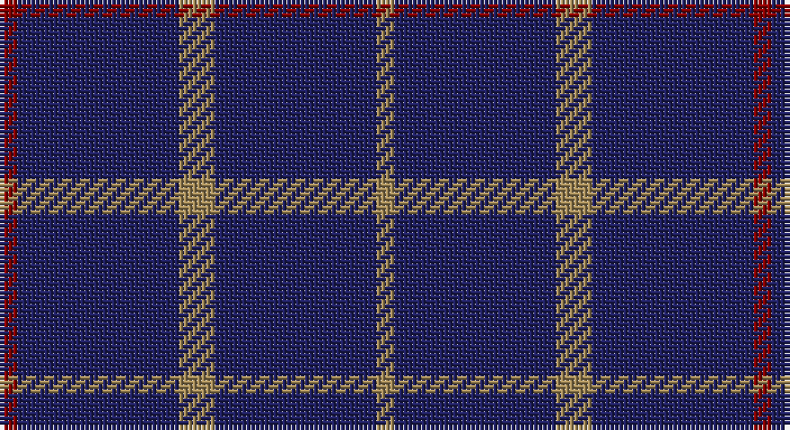

This page is one **sett** — a single exact thread-count. It belongs to the [tartan](/setts/r1db9lo2db9lo1/)
(the same proportion at any scale), whose colour order is pattern [RBYBY](/stripes/rbyby/).

Sourced from register-of-tartans.  It is a [5 stripe tartan](/stripes/stripes5/).

Original link https://www.tartanregister.gov.uk/tartanDetails.aspx?ref=382

## Also known as

This cloth is also recorded under:

- Brooks Brothers Tattersall Blue

2 attestations — the source records this cloth was collapsed from (oldest owns this page)

<ul>
<li>01/01/2005 — Brooks Brothers Tattersall Blue (register-of-tartans, <a href="https://www.tartanregister.gov.uk/tartanDetails.aspx?ref=382">record</a>)</li>
<li>pre 2005 — Brooks Bros Tattersall Blue (Fashion (tartans-authority, <a href="http://www.tartansauthority.com/tartan-ferret/display/6573/">record</a>)</li>
</ul>

## Register references

External register numbers recorded for this tartan.

- Scottish Register of Tartans: [382](https://www.tartanregister.gov.uk/tartanDetails.aspx?ref=382)
- Scottish Tartans Authority (ITI): 6573

## Thread count
DR/4 DB36 LT8 DB36 LT/4

One full sett is **168 threads**.

## Palette

Palette: <strong>Tartan Register</strong>
<table><thead><tr><th>Colour</th><th>Threads</th><th>Shade</th><th>Base</th><th>OKLCh</th></tr></thead><tbody><tr><td>DR/</td><td style="text-align:right;font-variant-numeric:tabular-nums">4</td><td><code style="background-color:#880000;">#880000</code> <small style="color:#888">#880000</small></td><td>R <code style="background-color:#CC0000;">#CC0000</code></td><td><small style="color:#888">oklch(39.4% 0.162 29.2)</small></td></tr><tr><td>DB</td><td style="text-align:right;font-variant-numeric:tabular-nums">36</td><td><code style="background-color:#202060;">#202060</code> <small style="color:#888">#202060</small></td><td>B <code style="background-color:#2A418A;">#2A418A</code></td><td><small style="color:#888">oklch(28.9% 0.111 276.9)</small></td></tr><tr><td>LT</td><td style="text-align:right;font-variant-numeric:tabular-nums">8</td><td><code style="background-color:#A08858;">#A08858</code> <small style="color:#888">#A08858</small></td><td>Y <code style="background-color:#F2BF00;">#F2BF00</code></td><td><small style="color:#888">oklch(63.7% 0.071 84.0)</small></td></tr><tr><td>DB</td><td style="text-align:right;font-variant-numeric:tabular-nums">36</td><td><code style="background-color:#202060;">#202060</code> <small style="color:#888">#202060</small></td><td>B <code style="background-color:#2A418A;">#2A418A</code></td><td><small style="color:#888">oklch(28.9% 0.111 276.9)</small></td></tr><tr><td>LT/</td><td style="text-align:right;font-variant-numeric:tabular-nums">4</td><td><code style="background-color:#A08858;">#A08858</code> <small style="color:#888">#A08858</small></td><td>Y <code style="background-color:#F2BF00;">#F2BF00</code></td><td><small style="color:#888">oklch(63.7% 0.071 84.0)</small></td></tr></tbody></table>

# Sample pattern

## Nearest tartans

The nearest existing variants by ΔTartan distance, with this tartan at the top so the swatches line up against it.

ΔTartan

Tartan

Sett

—

<a href="/ttd/edit/#slug=r1db9lo2db9lo1~x4">Brooks Brothers Tattersall Blue</a> <a class="nn-out" href="/variants/s5/r1db9lo2db9lo1~x4/" title="open its dictionary page">↗</a>

1.42

<a href="/ttd/edit/#slug=db16ri4db3r1~x2&amp;base=r1db9lo2db9lo1~x4">Elliott</a> <a class="nn-out" href="/variants/s4/db16ri4db3r1~x2/" title="open its dictionary page">↗</a>

1.44

<a href="/ttd/edit/#slug=dt50k12dt21w5~x2&amp;base=r1db9lo2db9lo1~x4">Coinean Dubh</a> <a class="nn-out" href="/variants/s4/dt50k12dt21w5~x2/" title="open its dictionary page">↗</a>

1.47

<a href="/ttd/edit/#slug=db10r1db10r2db10r1g2~x2&amp;base=r1db9lo2db9lo1~x4">Hebridean, (Old..)</a> <a class="nn-out" href="/variants/s7/db10r1db10r2db10r1g2~x2/" title="open its dictionary page">↗</a>

1.55

<a href="/ttd/edit/#slug=db24t6db10t6db32ly3~x2&amp;base=r1db9lo2db9lo1~x4">Sultan of Qaboo's Air Force</a> <a class="nn-out" href="/variants/s6/db24t6db10t6db32ly3~x2/" title="open its dictionary page">↗</a>

1.55

<a href="/ttd/edit/#slug=db32r3db4ly3~x2&amp;base=r1db9lo2db9lo1~x4">MacLaine of Lochbuie</a> <a class="nn-out" href="/variants/s4/db32r3db4ly3~x2/" title="open its dictionary page">↗</a>

1.57

<a href="/ttd/edit/#slug=db9k9db9k9db42lb5~x2&amp;base=r1db9lo2db9lo1~x4">Dollar Academy</a> <a class="nn-out" href="/variants/s6/db9k9db9k9db42lb5~x2/" title="open its dictionary page">↗</a>

1.59

<a href="/ttd/edit/#slug=k4k12k3o7k26o3~x2&amp;base=r1db9lo2db9lo1~x4">Crombie House Check</a> <a class="nn-out" href="/variants/s6/k4k12k3o7k26o3~x2/" title="open its dictionary page">↗</a>

1.67

<a href="/ttd/edit/#slug=db9k9db9k9db42w5~x2&amp;base=r1db9lo2db9lo1~x4">Dollar Academy (1930s) (Corporate)</a> <a class="nn-out" href="/variants/s6/db9k9db9k9db42w5~x2/" title="open its dictionary page">↗</a>

1.73

<a href="/ttd/edit/#slug=db1t1db8r1~x2&amp;base=r1db9lo2db9lo1~x4">Lochaber #3</a> <a class="nn-out" href="/variants/s4/db1t1db8r1~x2/" title="open its dictionary page">↗</a>

1.76

<a href="/ttd/edit/#slug=db140r11db14ly11&amp;base=r1db9lo2db9lo1~x4">Gem</a> <a class="nn-out" href="/variants/s4/db140r11db14ly11/" title="open its dictionary page">↗</a>

## Neighbour map

Every grey dot is one of 14360 variants placed by the first two principal components of the ΔTartan feature space (44% of its variance). Red is this tartan; blue dots are its nearest — click one to open its page.

<svg viewBox="0 0 640 380" role="img" style="max-width:100%;height:auto;border:1px solid #e0e0e0;border-radius:4px;display:block" xmlns="http://www.w3.org/2000/svg"><image href="/nn/cloud.v1.png" width="640" height="380"/><a href="/variants/s4/db16ri4db3r1~x2/"><circle cx="554.0" cy="251.9" r="4" fill="#3465a4"><title>Elliott</title></circle></a><a href="/variants/s4/dt50k12dt21w5~x2/"><circle cx="507.8" cy="277.4" r="4" fill="#3465a4"><title>Coinean Dubh</title></circle></a><a href="/variants/s7/db10r1db10r2db10r1g2~x2/"><circle cx="577.9" cy="267.6" r="4" fill="#3465a4"><title>Hebridean, (Old..)</title></circle></a><a href="/variants/s6/db24t6db10t6db32ly3~x2/"><circle cx="510.5" cy="253.1" r="4" fill="#3465a4"><title>Sultan of Qaboo's Air Force</title></circle></a><a href="/variants/s4/db32r3db4ly3~x2/"><circle cx="589.6" cy="240.0" r="4" fill="#3465a4"><title>MacLaine of Lochbuie</title></circle></a><a href="/variants/s6/db9k9db9k9db42lb5~x2/"><circle cx="463.7" cy="258.6" r="4" fill="#3465a4"><title>Dollar Academy</title></circle></a><a href="/variants/s6/k4k12k3o7k26o3~x2/"><circle cx="552.3" cy="281.2" r="4" fill="#3465a4"><title>Crombie House Check</title></circle></a><a href="/variants/s6/db9k9db9k9db42w5~x2/"><circle cx="447.9" cy="250.6" r="4" fill="#3465a4"><title>Dollar Academy (1930s) (Corporate)</title></circle></a><a href="/variants/s4/db1t1db8r1~x2/"><circle cx="590.0" cy="280.1" r="4" fill="#3465a4"><title>Lochaber #3</title></circle></a><a href="/variants/s4/db140r11db14ly11/"><circle cx="614.9" cy="231.6" r="4" fill="#3465a4"><title>Gem</title></circle></a><circle cx="543.1" cy="269.9" r="5" fill="#c00000"/></svg>

ID: /variants/s5/r1db9lo2db9lo1~x4/
