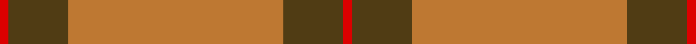
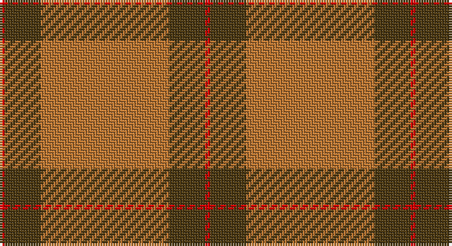

This page is one **sett** — a single exact thread-count. It belongs to the [tartan](/setts/r1dy7o25dy7r1/)
(the same proportion at any scale), whose colour order is pattern [RGRGR](/stripes/rgrgr/).

Part of the [Un-named](/tartans/un-named/) tartan — the named design grouping this sett with its other cloths.

Sourced from register-of-tartans.  It is a [5 stripe tartan](/stripes/stripes5/).

Original link https://www.tartanregister.gov.uk/tartanDetails.aspx?ref=4411

## Also known as

This cloth is also recorded under:

- Un-named #2
- Un-named #3
- Unnamed
- Unnamed Brown
- Unnamed Green

## Register references

External register numbers recorded for this tartan.

- Scottish Register of Tartans: [4411](https://www.tartanregister.gov.uk/tartanDetails.aspx?ref=4411)
- Scottish Tartans World Register: 2555

## Thread count
R/2 T14 DO50 T14 R/2

One full sett is **160 threads**.

## Palette

Palette: <strong>Tartan Register</strong>
<table><thead><tr><th>Colour</th><th>Threads</th><th>Shade</th><th>Base</th><th>OKLCh</th></tr></thead><tbody><tr><td>R/</td><td style="text-align:right;font-variant-numeric:tabular-nums">2</td><td><code style="background-color:#DC0000;">#DC0000</code> <small style="color:#888">#DC0000</small></td><td>R <code style="background-color:#CC0000;">#CC0000</code></td><td><small style="color:#888">oklch(56.2% 0.230 29.2)</small></td></tr><tr><td>T</td><td style="text-align:right;font-variant-numeric:tabular-nums">14</td><td><code style="background-color:#503C14;">#503C14</code> <small style="color:#888">#503C14</small></td><td>G <code style="background-color:#006100;">#006100</code></td><td><small style="color:#888">oklch(37.0% 0.062 81.8)</small></td></tr><tr><td>DO</td><td style="text-align:right;font-variant-numeric:tabular-nums">50</td><td><code style="background-color:#BE7832;">#BE7832</code> <small style="color:#888">#BE7832</small></td><td>R <code style="background-color:#CC0000;">#CC0000</code></td><td><small style="color:#888">oklch(63.5% 0.121 62.2)</small></td></tr><tr><td>T</td><td style="text-align:right;font-variant-numeric:tabular-nums">14</td><td><code style="background-color:#503C14;">#503C14</code> <small style="color:#888">#503C14</small></td><td>G <code style="background-color:#006100;">#006100</code></td><td><small style="color:#888">oklch(37.0% 0.062 81.8)</small></td></tr><tr><td>R/</td><td style="text-align:right;font-variant-numeric:tabular-nums">2</td><td><code style="background-color:#DC0000;">#DC0000</code> <small style="color:#888">#DC0000</small></td><td>R <code style="background-color:#CC0000;">#CC0000</code></td><td><small style="color:#888">oklch(56.2% 0.230 29.2)</small></td></tr></tbody></table>

# Sample pattern

## Compared to the master

This cloth is one sett of its design; the master sett (the exemplar the design is anchored on) is below for comparison.

<figure style="margin:0"><figcaption style="color:#888;font-size:smaller">this sett</figcaption></figure>
<figure style="margin:0"><figcaption style="color:#888;font-size:smaller"><a href="/setts/b5lg2b2lg9k3b9g3b3g25lr2/">master sett →</a></figcaption></figure>

## Nearest tartans

The nearest existing variants by ΔTartan distance, with this tartan at the top so the swatches line up against it.

ΔTartan

Tartan

Sett

—

<a href="/ttd/edit/#slug=r1dy7o25dy7r1~x2">Unnamed Brown (Teddy Bear)</a> <a class="nn-out" href="/variants/s5/r1dy7o25dy7r1~x2/" title="open its dictionary page">↗</a>

1.30

<a href="/ttd/edit/#slug=r48db2r3g28r4db2~x2&amp;base=r1dy7o25dy7r1~x2">MacKintosh 2</a> <a class="nn-out" href="/variants/s6/r48db2r3g28r4db2~x2/" title="open its dictionary page">↗</a>

1.46

<a href="/ttd/edit/#slug=r22db5r2g11r3db1~x2&amp;base=r1dy7o25dy7r1~x2">MacKintosh 1</a> <a class="nn-out" href="/variants/s6/r22db5r2g11r3db1~x2/" title="open its dictionary page">↗</a>

1.51

<a href="/ttd/edit/#slug=r24g5r3g9r3db1~x4&amp;base=r1dy7o25dy7r1~x2">MacKintosh, Red</a> <a class="nn-out" href="/variants/s6/r24g5r3g9r3db1~x4/" title="open its dictionary page">↗</a>

1.51

<a href="/ttd/edit/#slug=r1g10r1db4r18g1~x4&amp;base=r1dy7o25dy7r1~x2">Robertson 6</a> <a class="nn-out" href="/variants/s6/r1g10r1db4r18g1~x4/" title="open its dictionary page">↗</a>

1.52

<a href="/ttd/edit/#slug=r68db18r9g34r9db3~x2&amp;base=r1dy7o25dy7r1~x2">MacKintosh 3</a> <a class="nn-out" href="/variants/s6/r68db18r9g34r9db3~x2/" title="open its dictionary page">↗</a>

1.53

<a href="/ttd/edit/#slug=r2g6r2g6r16ly1~x4&amp;base=r1dy7o25dy7r1~x2">Cameron (Clan)</a> <a class="nn-out" href="/variants/s6/r2g6r2g6r16ly1~x4/" title="open its dictionary page">↗</a>

1.54

<a href="/ttd/edit/#slug=r2g6r2g6r16ly1~x2&amp;base=r1dy7o25dy7r1~x2">Cameron</a> <a class="nn-out" href="/variants/s6/r2g6r2g6r16ly1~x2/" title="open its dictionary page">↗</a>

1.56

<a href="/ttd/edit/#slug=g6r1g24r28g1r4~x2&amp;base=r1dy7o25dy7r1~x2">Erskine (Vestiarium Scoticum)</a> <a class="nn-out" href="/variants/s6/g6r1g24r28g1r4~x2/" title="open its dictionary page">↗</a>

1.60

<a href="/ttd/edit/#slug=r16g1r1g1r4g12~x4&amp;base=r1dy7o25dy7r1~x2">MacQuarrie #5</a> <a class="nn-out" href="/variants/s6/r16g1r1g1r4g12~x4/" title="open its dictionary page">↗</a>

1.65

<a href="/ttd/edit/#slug=r3o10r3o4r20lb1~x4&amp;base=r1dy7o25dy7r1~x2">Monica</a> <a class="nn-out" href="/variants/s6/r3o10r3o4r20lb1~x4/" title="open its dictionary page">↗</a>

## Neighbour map

Every grey dot is one of 14360 variants placed by the first two principal components of the ΔTartan feature space (44% of its variance). Red is this tartan; blue dots are its nearest — click one to open its page.

<svg viewBox="0 0 640 380" role="img" style="max-width:100%;height:auto;border:1px solid #e0e0e0;border-radius:4px;display:block" xmlns="http://www.w3.org/2000/svg"><image href="/nn/cloud.v1.png" width="640" height="380"/><a href="/variants/s6/r48db2r3g28r4db2~x2/"><circle cx="465.6" cy="170.5" r="4" fill="#3465a4"><title>MacKintosh 2</title></circle></a><a href="/variants/s6/r22db5r2g11r3db1~x2/"><circle cx="423.8" cy="185.6" r="4" fill="#3465a4"><title>MacKintosh 1</title></circle></a><a href="/variants/s6/r24g5r3g9r3db1~x4/"><circle cx="488.5" cy="184.0" r="4" fill="#3465a4"><title>MacKintosh, Red</title></circle></a><a href="/variants/s6/r1g10r1db4r18g1~x4/"><circle cx="396.6" cy="186.7" r="4" fill="#3465a4"><title>Robertson 6</title></circle></a><a href="/variants/s6/r68db18r9g34r9db3~x2/"><circle cx="417.9" cy="188.3" r="4" fill="#3465a4"><title>MacKintosh 3</title></circle></a><a href="/variants/s6/r2g6r2g6r16ly1~x4/"><circle cx="420.6" cy="202.7" r="4" fill="#3465a4"><title>Cameron (Clan)</title></circle></a><a href="/variants/s6/r2g6r2g6r16ly1~x2/"><circle cx="415.5" cy="201.3" r="4" fill="#3465a4"><title>Cameron</title></circle></a><a href="/variants/s6/g6r1g24r28g1r4~x2/"><circle cx="443.6" cy="200.0" r="4" fill="#3465a4"><title>Erskine (Vestiarium Scoticum)</title></circle></a><a href="/variants/s6/r16g1r1g1r4g12~x4/"><circle cx="455.5" cy="215.6" r="4" fill="#3465a4"><title>MacQuarrie #5</title></circle></a><a href="/variants/s6/r3o10r3o4r20lb1~x4/"><circle cx="460.8" cy="199.5" r="4" fill="#3465a4"><title>Monica</title></circle></a><circle cx="474.1" cy="200.6" r="5" fill="#c00000"/></svg>

ID: /variants/s5/r1dy7o25dy7r1~x2/
