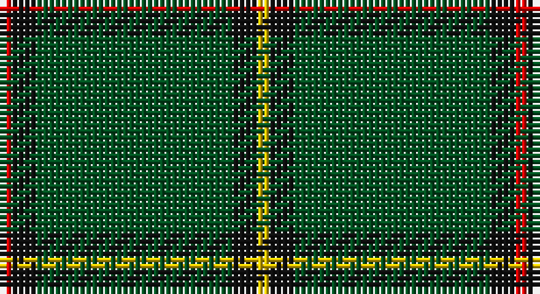

This page is one **sett** — a single exact thread-count. It belongs to the [tartan](/setts/r1k2dg16k2ly1/)
(the same proportion at any scale), whose colour order is pattern [RKGKY](/stripes/rkgky/).

Sourced from register-of-tartans.  It is a [5 stripe tartan](/stripes/stripes5/).

Original link https://www.tartanregister.gov.uk/tartanDetails.aspx?ref=3808

## Also known as

This cloth is also recorded under:

- Skene or Tribe of Mar

2 attestations — the source records this cloth was collapsed from (oldest owns this page)

<ul>
<li>undated — Skene or Tribe of Mar (register-of-tartans, <a href="https://www.tartanregister.gov.uk/tartanDetails.aspx?ref=3808">record</a>)</li>
<li>undated — Mar District (weddslist, <a href="http://www.weddslist.com/cgi-bin/tartans/pg.pl?source=rb">record</a>)</li>
</ul>

## Register references

External register numbers recorded for this tartan.

- Scottish Register of Tartans: [3808](https://www.tartanregister.gov.uk/tartanDetails.aspx?ref=3808)
- Scottish Tartans World Register: 1585

## Thread count
R/2 K4 G32 K4 Y/2

One full sett is **84 threads**.

## Palette

Palette: <strong>Tartan Register</strong>
<table><thead><tr><th>Colour</th><th>Threads</th><th>Shade</th><th>Base</th><th>OKLCh</th></tr></thead><tbody><tr><td>R/</td><td style="text-align:right;font-variant-numeric:tabular-nums">2</td><td><code style="background-color:#DC0000;">#DC0000</code> <small style="color:#888">#DC0000</small></td><td>R <code style="background-color:#CC0000;">#CC0000</code></td><td><small style="color:#888">oklch(56.2% 0.230 29.2)</small></td></tr><tr><td>K</td><td style="text-align:right;font-variant-numeric:tabular-nums">4</td><td><code style="background-color:#101010;">#101010</code> <small style="color:#888">#101010</small></td><td>K <code style="background-color:#000000;">#000000</code></td><td><small style="color:#888">oklch(17.3% 0.000 89.9)</small></td></tr><tr><td>G</td><td style="text-align:right;font-variant-numeric:tabular-nums">32</td><td><code style="background-color:#005020;">#005020</code> <small style="color:#888">#005020</small></td><td>G <code style="background-color:#006100;">#006100</code></td><td><small style="color:#888">oklch(37.7% 0.105 149.6)</small></td></tr><tr><td>K</td><td style="text-align:right;font-variant-numeric:tabular-nums">4</td><td><code style="background-color:#101010;">#101010</code> <small style="color:#888">#101010</small></td><td>K <code style="background-color:#000000;">#000000</code></td><td><small style="color:#888">oklch(17.3% 0.000 89.9)</small></td></tr><tr><td>Y/</td><td style="text-align:right;font-variant-numeric:tabular-nums">2</td><td><code style="background-color:#E8C000;">#E8C000</code> <small style="color:#888">#E8C000</small></td><td>Y <code style="background-color:#F2BF00;">#F2BF00</code></td><td><small style="color:#888">oklch(81.9% 0.168 93.7)</small></td></tr></tbody></table>

# Sample pattern

## Nearest tartans

The nearest existing variants by ΔTartan distance, with this tartan at the top so the swatches line up against it.

ΔTartan

Tartan

Sett

—

<a href="/ttd/edit/#slug=r1k2dg16k2ly1~x2">Skene or Tribe of Mar</a> <a class="nn-out" href="/variants/s5/r1k2dg16k2ly1~x2/" title="open its dictionary page">↗</a>

1.31

<a href="/ttd/edit/#slug=r2dg24k2dg12lo6k1r2~x2&amp;base=r1k2dg16k2ly1~x2">Inman (2016)</a> <a class="nn-out" href="/variants/s7/r2dg24k2dg12lo6k1r2~x2/" title="open its dictionary page">↗</a>

1.36

<a href="/ttd/edit/#slug=g44db9r2db9g2~x2&amp;base=r1k2dg16k2ly1~x2">Tyrconnell (Personal)</a> <a class="nn-out" href="/variants/s5/g44db9r2db9g2~x2/" title="open its dictionary page">↗</a>

1.52

<a href="/ttd/edit/#slug=dg18r6dg75b6dg13lo35dg12b6&amp;base=r1k2dg16k2ly1~x2">Glenlivet Check (Corporate)</a> <a class="nn-out" href="/variants/s8/dg18r6dg75b6dg13lo35dg12b6/" title="open its dictionary page">↗</a>

1.52

<a href="/ttd/edit/#slug=r8g3r4g44w4~x2&amp;base=r1k2dg16k2ly1~x2">Welsh National (District)</a> <a class="nn-out" href="/variants/s5/r8g3r4g44w4~x2/" title="open its dictionary page">↗</a>

1.54

<a href="/ttd/edit/#slug=dg10o1dg1o1lr2dg1o1~x4&amp;base=r1k2dg16k2ly1~x2">Green Watch</a> <a class="nn-out" href="/variants/s7/dg10o1dg1o1lr2dg1o1~x4/" title="open its dictionary page">↗</a>

1.55

<a href="/ttd/edit/#slug=dg6do2m1dg15m3do1dg15g6m1~x2&amp;base=r1k2dg16k2ly1~x2">McCall, F W (Personal)</a> <a class="nn-out" href="/variants/s9/dg6do2m1dg15m3do1dg15g6m1~x2/" title="open its dictionary page">↗</a>

1.59

<a href="/ttd/edit/#slug=db6w3r3g55k10r3~x4&amp;base=r1k2dg16k2ly1~x2">Military Medical Memorial (USA)</a> <a class="nn-out" href="/variants/s6/db6w3r3g55k10r3~x4/" title="open its dictionary page">↗</a>

1.59

<a href="/ttd/edit/#slug=g30t8g5lb4g5r2~x4&amp;base=r1k2dg16k2ly1~x2">Annapolis Valley</a> <a class="nn-out" href="/variants/s6/g30t8g5lb4g5r2~x4/" title="open its dictionary page">↗</a>

1.63

<a href="/ttd/edit/#slug=k88g17k8gi28k8r6~x2&amp;base=r1k2dg16k2ly1~x2">Childers Regimental Tartan</a> <a class="nn-out" href="/variants/s6/k88g17k8gi28k8r6~x2/" title="open its dictionary page">↗</a>

1.63

<a href="/ttd/edit/#slug=m2g1m1g10w1~x4&amp;base=r1k2dg16k2ly1~x2">Welsh National District Tartan</a> <a class="nn-out" href="/variants/s5/m2g1m1g10w1~x4/" title="open its dictionary page">↗</a>

## Neighbour map

Every grey dot is one of 14360 variants placed by the first two principal components of the ΔTartan feature space (44% of its variance). Red is this tartan; blue dots are its nearest — click one to open its page.

<svg viewBox="0 0 640 380" role="img" style="max-width:100%;height:auto;border:1px solid #e0e0e0;border-radius:4px;display:block" xmlns="http://www.w3.org/2000/svg"><image href="/nn/cloud.v1.png" width="640" height="380"/><a href="/variants/s7/r2dg24k2dg12lo6k1r2~x2/"><circle cx="471.7" cy="171.9" r="4" fill="#3465a4"><title>Inman (2016)</title></circle></a><a href="/variants/s5/g44db9r2db9g2~x2/"><circle cx="512.3" cy="221.4" r="4" fill="#3465a4"><title>Tyrconnell (Personal)</title></circle></a><a href="/variants/s8/dg18r6dg75b6dg13lo35dg12b6/"><circle cx="423.6" cy="201.9" r="4" fill="#3465a4"><title>Glenlivet Check (Corporate)</title></circle></a><a href="/variants/s5/r8g3r4g44w4~x2/"><circle cx="503.5" cy="208.4" r="4" fill="#3465a4"><title>Welsh National (District)</title></circle></a><a href="/variants/s7/dg10o1dg1o1lr2dg1o1~x4/"><circle cx="458.6" cy="214.8" r="4" fill="#3465a4"><title>Green Watch</title></circle></a><a href="/variants/s9/dg6do2m1dg15m3do1dg15g6m1~x2/"><circle cx="452.6" cy="206.2" r="4" fill="#3465a4"><title>McCall, F W (Personal)</title></circle></a><a href="/variants/s6/db6w3r3g55k10r3~x4/"><circle cx="410.7" cy="150.4" r="4" fill="#3465a4"><title>Military Medical Memorial (USA)</title></circle></a><a href="/variants/s6/g30t8g5lb4g5r2~x4/"><circle cx="477.5" cy="213.2" r="4" fill="#3465a4"><title>Annapolis Valley</title></circle></a><a href="/variants/s6/k88g17k8gi28k8r6~x2/"><circle cx="408.9" cy="197.5" r="4" fill="#3465a4"><title>Childers Regimental Tartan</title></circle></a><a href="/variants/s5/m2g1m1g10w1~x4/"><circle cx="478.5" cy="228.8" r="4" fill="#3465a4"><title>Welsh National District Tartan</title></circle></a><circle cx="488.8" cy="201.6" r="5" fill="#c00000"/></svg>

ID: /variants/s5/r1k2dg16k2ly1~x2/
