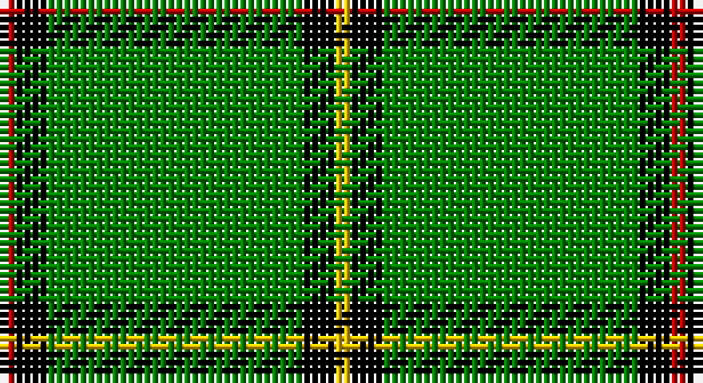

This page is one **sett** — a single exact thread-count. It belongs to the [tartan](/setts/r1k2g16k2ly1/)
(the same proportion at any scale), whose colour order is pattern [RKGKY](/stripes/rkgky/).

Sourced from weddslist.  It is a [5 stripe tartan](/stripes/stripes5/).

Original link http://www.weddslist.com/cgi-bin/tartans/pg.pl?source=sts

## Thread count
R/2 K4 G32 K4 Y/2

One full sett is **84 threads**.

## Palette

Palette: <strong>Ingles Buchan</strong> <small style="color:#888">(1 of 4 colours)</small>
<table><thead><tr><th>Colour</th><th>Threads</th><th>Shade</th><th>Base</th><th>OKLCh</th></tr></thead><tbody><tr><td>R/</td><td style="text-align:right;font-variant-numeric:tabular-nums">2</td><td><code style="background-color:#C00000;">#C00000</code> <small style="color:#888">#C00000</small></td><td>R <code style="background-color:#CC0000;">#CC0000</code></td><td><small style="color:#888">oklch(50.7% 0.208 29.2)</small></td></tr><tr><td>K</td><td style="text-align:right;font-variant-numeric:tabular-nums">4</td><td><code style="background-color:#000000;">#000000</code> <small style="color:#888">#000000</small></td><td>K <code style="background-color:#000000;">#000000</code></td><td><small style="color:#888">oklch(0.0% 0.000 0.0)</small></td></tr><tr><td>G</td><td style="text-align:right;font-variant-numeric:tabular-nums">32</td><td><code style="background-color:#008000;">#008000</code> <small style="color:#888">#008000</small></td><td>G <code style="background-color:#006100;">#006100</code></td><td><small style="color:#888">oklch(52.0% 0.177 142.5)</small></td></tr><tr><td>K</td><td style="text-align:right;font-variant-numeric:tabular-nums">4</td><td><code style="background-color:#000000;">#000000</code> <small style="color:#888">#000000</small></td><td>K <code style="background-color:#000000;">#000000</code></td><td><small style="color:#888">oklch(0.0% 0.000 0.0)</small></td></tr><tr><td>Y/</td><td style="text-align:right;font-variant-numeric:tabular-nums">2</td><td><code style="background-color:#F0C000;">#F0C000</code> <small style="color:#888">#F0C000</small></td><td>Y <code style="background-color:#F2BF00;">#F2BF00</code></td><td><small style="color:#888">oklch(82.7% 0.169 90.5)</small></td></tr></tbody></table>

# Sample pattern

## Nearest tartans

The nearest existing variants by ΔTartan distance, with this tartan at the top so the swatches line up against it.

ΔTartan

Tartan

Sett

—

<a href="/ttd/edit/#slug=r1k2g16k2ly1~x2">Skene, or Tribe of Mar</a> <a class="nn-out" href="/variants/s5/r1k2g16k2ly1~x2/" title="open its dictionary page">↗</a>

1.39

<a href="/ttd/edit/#slug=r2k4g45k3ly2&amp;base=r1k2g16k2ly1~x2">Mar, (Tribe of..)</a> <a class="nn-out" href="/variants/s5/r2k4g45k3ly2/" title="open its dictionary page">↗</a>

1.45

<a href="/ttd/edit/#slug=k3lb1g21k2dr3lb2~x2&amp;base=r1k2g16k2ly1~x2">Leach Htg (Name)</a> <a class="nn-out" href="/variants/s6/k3lb1g21k2dr3lb2~x2/" title="open its dictionary page">↗</a>

1.50

<a href="/ttd/edit/#slug=g25w1dg2w1g6k2w2dg3~x2&amp;base=r1k2g16k2ly1~x2">Marshall University</a> <a class="nn-out" href="/variants/s8/g25w1dg2w1g6k2w2dg3~x2/" title="open its dictionary page">↗</a>

1.57

<a href="/ttd/edit/#slug=g8w4g50k12g4k15lo5~x2&amp;base=r1k2g16k2ly1~x2">Instakilt, Green (Fashion)</a> <a class="nn-out" href="/variants/s7/g8w4g50k12g4k15lo5~x2/" title="open its dictionary page">↗</a>

1.63

<a href="/ttd/edit/#slug=k5w4r15g70k4w5~x2&amp;base=r1k2g16k2ly1~x2">Tahrir - Liberation (Fashion)</a> <a class="nn-out" href="/variants/s6/k5w4r15g70k4w5~x2/" title="open its dictionary page">↗</a>

1.65

<a href="/ttd/edit/#slug=g32k6g4k8r1k2~x2&amp;base=r1k2g16k2ly1~x2">Fife, Duke of..</a> <a class="nn-out" href="/variants/s6/g32k6g4k8r1k2~x2/" title="open its dictionary page">↗</a>

1.68

<a href="/ttd/edit/#slug=r8g12w5k11g42k3~x2&amp;base=r1k2g16k2ly1~x2">Sir Billi (Corporate)</a> <a class="nn-out" href="/variants/s6/r8g12w5k11g42k3~x2/" title="open its dictionary page">↗</a>

1.71

<a href="/ttd/edit/#slug=g37w9g3k9w3&amp;base=r1k2g16k2ly1~x2">Loch Rannoch</a> <a class="nn-out" href="/variants/s5/g37w9g3k9w3/" title="open its dictionary page">↗</a>

1.73

<a href="/ttd/edit/#slug=k3lb1g15g6k2dr3lb2~x2&amp;base=r1k2g16k2ly1~x2">Leach Hunting</a> <a class="nn-out" href="/variants/s7/k3lb1g15g6k2dr3lb2~x2/" title="open its dictionary page">↗</a>

1.77

<a href="/ttd/edit/#slug=db6w3r3g55k10r3~x4&amp;base=r1k2g16k2ly1~x2">Military Medical Memorial (USA)</a> <a class="nn-out" href="/variants/s6/db6w3r3g55k10r3~x4/" title="open its dictionary page">↗</a>

## Neighbour map

Every grey dot is one of 14360 variants placed by the first two principal components of the ΔTartan feature space (44% of its variance). Red is this tartan; blue dots are its nearest — click one to open its page.

<svg viewBox="0 0 640 380" role="img" style="max-width:100%;height:auto;border:1px solid #e0e0e0;border-radius:4px;display:block" xmlns="http://www.w3.org/2000/svg"><image href="/nn/cloud.v1.png" width="640" height="380"/><a href="/variants/s5/r2k4g45k3ly2/"><circle cx="524.0" cy="162.6" r="4" fill="#3465a4"><title>Mar, (Tribe of..)</title></circle></a><a href="/variants/s6/k3lb1g21k2dr3lb2~x2/"><circle cx="386.6" cy="154.1" r="4" fill="#3465a4"><title>Leach Htg (Name)</title></circle></a><a href="/variants/s8/g25w1dg2w1g6k2w2dg3~x2/"><circle cx="471.3" cy="144.1" r="4" fill="#3465a4"><title>Marshall University</title></circle></a><a href="/variants/s7/g8w4g50k12g4k15lo5~x2/"><circle cx="337.8" cy="177.2" r="4" fill="#3465a4"><title>Instakilt, Green (Fashion)</title></circle></a><a href="/variants/s6/k5w4r15g70k4w5~x2/"><circle cx="405.1" cy="153.4" r="4" fill="#3465a4"><title>Tahrir - Liberation (Fashion)</title></circle></a><a href="/variants/s6/g32k6g4k8r1k2~x2/"><circle cx="441.1" cy="167.3" r="4" fill="#3465a4"><title>Fife, Duke of..</title></circle></a><a href="/variants/s6/r8g12w5k11g42k3~x2/"><circle cx="372.8" cy="192.4" r="4" fill="#3465a4"><title>Sir Billi (Corporate)</title></circle></a><a href="/variants/s5/g37w9g3k9w3/"><circle cx="356.6" cy="204.0" r="4" fill="#3465a4"><title>Loch Rannoch</title></circle></a><a href="/variants/s7/k3lb1g15g6k2dr3lb2~x2/"><circle cx="351.1" cy="180.2" r="4" fill="#3465a4"><title>Leach Hunting</title></circle></a><a href="/variants/s6/db6w3r3g55k10r3~x4/"><circle cx="410.7" cy="150.4" r="4" fill="#3465a4"><title>Military Medical Memorial (USA)</title></circle></a><circle cx="431.7" cy="175.1" r="5" fill="#c00000"/></svg>

ID: /variants/s5/r1k2g16k2ly1~x2/
