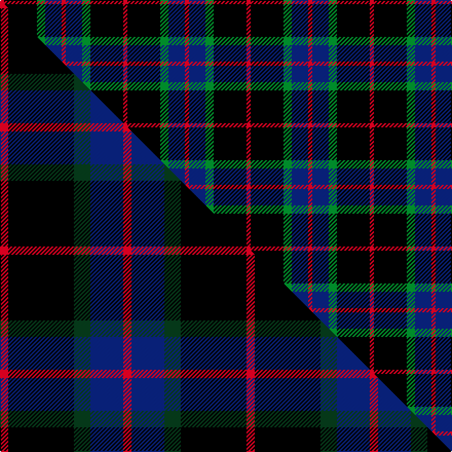

This page is one **sett** — a single exact thread-count. It belongs to the [tartan](/setts/r1k8g2db4r1/)
(the same proportion at any scale), whose colour order is pattern [RBGKR](/stripes/rbgkr/).

Part of the [Nairn](/tartans/nairn/) tartan — the named design grouping this sett with its other cloths.

Sourced from weddslist.  It is a [5 stripe tartan](/stripes/stripes5/).

Original link [http://www.weddslist.com/cgi-bin/tartans/pg.pl?source=sts](http://www.weddslist.com/cgi-bin/tartans/pg.pl?source=sts)

## Provenance

Earliest known date: c.1930 The exact date of this design is uncertain. We know that it appeared around 1930 in the collection of Messrs. Anderson of Edinburgh. (Later Kinloch Anderson). A note on the weavers scale in the STS collection states '..worn by the Spencer-Nairn family. (done)'. The design is similar to the Hunting Brodie sett without the yellow. Nairns were first recorded in Fife and later in Moray. There is also a family called Nairne of Dunsinnan in Perthshire of MacBeth fame.

2 attestations — the source records this cloth was collapsed from (oldest owns this page)

<ul>
<li>undated — Nairn (weddslist, <a href="http://www.weddslist.com/cgi-bin/tartans/pg.pl?source=sts">record</a>) </li>
<li>undated — Nairn Family Tartan (house-of-tartan, <a href="http://www.house-of-tartan.scotland.net/house/TartanViewjs.asp?colr=Def&tnam=1331">record</a>) </li>
</ul>

Dataset <small>— provenance for this record, inherited from the source manifest</small>

<dl class="dataset-prov">
<dt>source</dt><dd><a href="/sources/weddslist/">Weddslist</a></dd>
<dt>data captured from</dt><dd><a href="https://github.com/thetartan/tartan-database/blob/master/data/weddslist/data.csv">https://github.com/thetartan/tartan-database/blob/master/data/weddslist/data.csv</a></dd>
<dt>data date</dt><dd>2016-11-17 <small>(dataset default)</small></dd>
<dt>licence</dt><dd><a href="https://creativecommons.org/licenses/by-nc-nd/4.0/">CC BY-NC-ND 4.0</a></dd>
</dl>

Capture chain <small>— the hands this data passed through, oldest first; each capture carries its own licence</small>

<ol class="capture-chain">
<li><a href="https://www.weddslist.com/tartans/">Weddslist</a> <small>the living privately compiled reference</small></li>
<li><a href="https://github.com/thetartan/tartan-database">thetartan/tartan-database</a> <small>2016-2017</small> · <a href="https://creativecommons.org/licenses/by-nc-nd/4.0/">CC BY-NC-ND 4.0</a> <small>Levko Kravets's frozen compilation — the capture we vendored, and where its CC licence text came from</small></li>
<li>this dictionary <small>captured 2026-06-10 · commit 5bf86c7566</small> <small>each re-capture is a git commit to data/sources</small></li>
</ol>

## Thread count
R/4 K32 G8 DB16 R/4

One full sett is **120 threads**.

## Palette
<table><thead><tr><th>Colour</th><th>Shade</th><th>OKLCh</th></tr></thead><tbody><tr><td>DB</td><td><code style="background-color:#082077;">#082077</code> <small style="color:#888">#082077</small></td><td><small style="color:#888">oklch(30.0% 0.149 265.1)</small></td></tr><tr><td>G</td><td><code style="background-color:#008B2A;">#008B2A</code> <small style="color:#888">#008B2A</small></td><td><small style="color:#888">oklch(55.4% 0.170 145.9)</small></td></tr><tr><td>K</td><td><code style="background-color:#000000;">#000000</code> <small style="color:#888">#000000</small></td><td><small style="color:#888">oklch(0.0% 0.000 0.0)</small></td></tr><tr><td>R</td><td><code style="background-color:#D60020;">#D60020</code> <small style="color:#888">#D60020</small></td><td><small style="color:#888">oklch(55.2% 0.224 25.5)</small></td></tr></tbody></table>

# Sample pattern

## Compared to the master

This cloth is one sett of its design; the master sett (the exemplar the design is anchored on) is below for comparison.

Its **ΔTartan distance** from the master is **0.07** — the same measure the nearest-tartans table ranks by (0 is identical; a re-scale of the same cloth is near 0, a recolour or a different proportion further).

<figure class="master-compare" style="margin:0">

this sett
master sett ★

<figcaption style="color:#888;font-size:smaller">One weave of this sett against the <a href="/setts/r1k8dg2db4r1/">master sett ★</a>, split on the diagonal: a shared proportion runs seamlessly across it with only the shades shifting; a different proportion breaks on it.</figcaption>
</figure>

## Nearest tartan variants

The nearest existing variants by ΔTartan distance, with this cloth at the top so the swatches line up against it.

ΔTartan

Threads

Variant

Sett

—

120

<a href="/variants/s5/r1k8g2db4r1~x4/">Nairn</a>

<a href="/ttd/edit/#slug=r1k8g2db4r1~x8&amp;base=r1k8g2db4r1~x4" title="compare in the TTD">0.00</a>

240

<a href="/variants/s5/r1k8g2db4r1~x8/">Nairn (Name)</a>

<a href="/ttd/edit/#slug=r1k8dg2db4r1~x8&amp;base=r1k8g2db4r1~x4" title="compare in the TTD">0.07</a>

240

<a href="/variants/s5/r1k8dg2db4r1~x8/">Nairn</a>

<a href="/ttd/edit/#slug=db8k3r4y1~x2&amp;base=r1k8g2db4r1~x4" title="compare in the TTD">1.34</a>

46

<a href="/variants/s4/db8k3r4y1~x2/">Unidentified #17</a>

<a href="/ttd/edit/#slug=dr1k10n2lb5k5dr1~x4&amp;base=r1k8g2db4r1~x4" title="compare in the TTD">1.73</a>

184

<a href="/variants/s6/dr1k10n2lb5k5dr1~x4/">Callaway (Corporate)</a>

<a href="/ttd/edit/#slug=dr2db9k5g6db1~x4&amp;base=r1k8g2db4r1~x4" title="compare in the TTD">1.77</a>

172

<a href="/variants/s5/dr2db9k5g6db1~x4/">Frobo Nairn</a>

<a href="/ttd/edit/#slug=w3k25n9db17ly3~x2&amp;base=r1k8g2db4r1~x4" title="compare in the TTD">1.95</a>

216

<a href="/variants/s5/w3k25n9db17ly3~x2/">Teylu Coleman (Name)</a>

<a href="/ttd/edit/#slug=k14r4k25db30w4~x2&amp;base=r1k8g2db4r1~x4" title="compare in the TTD">2.00</a>

272

<a href="/variants/s5/k14r4k25db30w4~x2/">Britannia</a>

<a href="/ttd/edit/#slug=k2w1k12g5db11r1~x2&amp;base=r1k8g2db4r1~x4" title="compare in the TTD">2.01</a>

122

<a href="/variants/s6/k2w1k12g5db11r1~x2/">New England (Fashion)</a>

<a href="/ttd/edit/#slug=r3k12g4db12r1k2r1~x4&amp;base=r1k8g2db4r1~x4" title="compare in the TTD">2.06</a>

264

<a href="/variants/s7/r3k12g4db12r1k2r1~x4/">Sandberg</a>

<a href="/ttd/edit/#slug=db1n6k6r1~x10&amp;base=r1k8g2db4r1~x4" title="compare in the TTD">2.12</a>

260

<a href="/variants/s4/db1n6k6r1~x10/">Mayer, Chris (Personal)</a>

## Neighbour map

Every grey dot is one of 13621 variants placed by the first two principal components of the ΔTartan feature space (42% of its variance). Red is this tartan; blue dots are its nearest — click one to open its page.

<svg viewBox="0 0 640 380" role="img" style="max-width:100%;height:auto;border:1px solid #e0e0e0;border-radius:4px;display:block" xmlns="http://www.w3.org/2000/svg"><image href="/nn/cloud.v1.png" width="640" height="380"/><a href="/variants/s5/r1k8g2db4r1~x8/"><circle cx="212.8" cy="203.5" r="4" fill="#3465a4"><title>Nairn (Name)</title></circle></a><a href="/variants/s5/r1k8dg2db4r1~x8/"><circle cx="232.8" cy="208.7" r="4" fill="#3465a4"><title>Nairn</title></circle></a><a href="/variants/s4/db8k3r4y1~x2/"><circle cx="221.2" cy="231.9" r="4" fill="#3465a4"><title>Unidentified #17</title></circle></a><a href="/variants/s6/dr1k10n2lb5k5dr1~x4/"><circle cx="275.6" cy="187.4" r="4" fill="#3465a4"><title>Callaway (Corporate)</title></circle></a><a href="/variants/s5/dr2db9k5g6db1~x4/"><circle cx="189.2" cy="234.0" r="4" fill="#3465a4"><title>Frobo Nairn</title></circle></a><a href="/variants/s5/w3k25n9db17ly3~x2/"><circle cx="160.3" cy="200.9" r="4" fill="#3465a4"><title>Teylu Coleman (Name)</title></circle></a><a href="/variants/s5/k14r4k25db30w4~x2/"><circle cx="226.6" cy="218.1" r="4" fill="#3465a4"><title>Britannia</title></circle></a><a href="/variants/s6/k2w1k12g5db11r1~x2/"><circle cx="181.5" cy="169.3" r="4" fill="#3465a4"><title>New England (Fashion)</title></circle></a><a href="/variants/s7/r3k12g4db12r1k2r1~x4/"><circle cx="184.1" cy="171.7" r="4" fill="#3465a4"><title>Sandberg</title></circle></a><a href="/variants/s4/db1n6k6r1~x10/"><circle cx="196.8" cy="236.3" r="4" fill="#3465a4"><title>Mayer, Chris (Personal)</title></circle></a><circle cx="212.8" cy="203.5" r="5" fill="#c00000"/><text x="320" y="376" text-anchor="middle" font-size="11" fill="#999">ground</text><text x="11" y="190" text-anchor="middle" font-size="11" fill="#999" transform="rotate(-90 11 190)">complexity</text></svg>

ID: /variants/s5/r1k8g2db4r1~x4/
