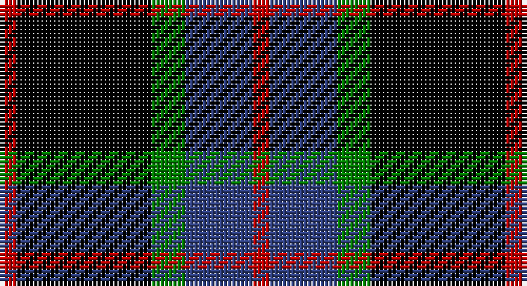

This page is one **sett** — a single exact thread-count. It belongs to the [tartan](/setts/r1k8g2db4r1/)
(the same proportion at any scale), whose colour order is pattern [RBGKR](/stripes/rbgkr/).

Part of the [Nairn](/tartans/nairn/) tartan — the named design grouping this sett with its other cloths.

Sourced from weddslist.  It is a [5 stripe tartan](/stripes/stripes5/).

Original link http://www.weddslist.com/cgi-bin/tartans/pg.pl?source=sts

## Provenance

Earliest known date: c.1930 The exact date of this design is uncertain. We know that it appeared around 1930 in the collection of Messrs. Anderson of Edinburgh. (Later Kinloch Anderson). A note on the weavers scale in the STS collection states '..worn by the Spencer-Nairn family. (done)'. The design is similar to the Hunting Brodie sett without the yellow. Nairns were first recorded in Fife and later in Moray. There is also a family called Nairne of Dunsinnan in Perthshire of MacBeth fame.

2 attestations — the source records this cloth was collapsed from (oldest owns this page)

<ul>
<li>undated — Nairn (weddslist, <a href="http://www.weddslist.com/cgi-bin/tartans/pg.pl?source=sts">record</a>)</li>
<li>undated — Nairn Family Tartan (house-of-tartan, <a href="http://www.house-of-tartan.scotland.net/house/TartanViewjs.asp?colr=Def&tnam=1331">record</a>)</li>
</ul>

## Thread count
R/4 K32 G8 B16 R/4

One full sett is **120 threads**.

## Palette

Palette: <strong>Ingles Buchan</strong> <small style="color:#888">(1 of 4 colours)</small>
<table><thead><tr><th>Colour</th><th>Threads</th><th>Shade</th><th>Base</th><th>OKLCh</th></tr></thead><tbody><tr><td>R/</td><td style="text-align:right;font-variant-numeric:tabular-nums">4</td><td><code style="background-color:#C00000;">#C00000</code> <small style="color:#888">#C00000</small></td><td>R <code style="background-color:#CC0000;">#CC0000</code></td><td><small style="color:#888">oklch(50.7% 0.208 29.2)</small></td></tr><tr><td>K</td><td style="text-align:right;font-variant-numeric:tabular-nums">32</td><td><code style="background-color:#000000;">#000000</code> <small style="color:#888">#000000</small></td><td>K <code style="background-color:#000000;">#000000</code></td><td><small style="color:#888">oklch(0.0% 0.000 0.0)</small></td></tr><tr><td>G</td><td style="text-align:right;font-variant-numeric:tabular-nums">8</td><td><code style="background-color:#008000;">#008000</code> <small style="color:#888">#008000</small></td><td>G <code style="background-color:#006100;">#006100</code></td><td><small style="color:#888">oklch(52.0% 0.177 142.5)</small></td></tr><tr><td>B</td><td style="text-align:right;font-variant-numeric:tabular-nums">16</td><td><code style="background-color:#304080;">#304080</code> <small style="color:#888">#304080</small></td><td>B <code style="background-color:#2A418A;">#2A418A</code></td><td><small style="color:#888">oklch(39.4% 0.109 270.2)</small></td></tr><tr><td>R/</td><td style="text-align:right;font-variant-numeric:tabular-nums">4</td><td><code style="background-color:#C00000;">#C00000</code> <small style="color:#888">#C00000</small></td><td>R <code style="background-color:#CC0000;">#CC0000</code></td><td><small style="color:#888">oklch(50.7% 0.208 29.2)</small></td></tr></tbody></table>

# Sample pattern

## Nearest tartans

The nearest existing variants by ΔTartan distance, with this tartan at the top so the swatches line up against it.

ΔTartan

Tartan

Sett

—

<a href="/ttd/edit/#slug=r1k8g2db4r1~x4">Nairn</a> <a class="nn-out" href="/variants/s5/r1k8g2db4r1~x4/" title="open its dictionary page">↗</a>

1.09

<a href="/ttd/edit/#slug=k5lb2dg18k17dp16k3&amp;base=r1k8g2db4r1~x4">Melville</a> <a class="nn-out" href="/variants/s6/k5lb2dg18k17dp16k3/" title="open its dictionary page">↗</a>

1.13

<a href="/ttd/edit/#slug=k4dg3dp18k18lb2~x2&amp;base=r1k8g2db4r1~x4">Wcwm 1106-2</a> <a class="nn-out" href="/variants/s5/k4dg3dp18k18lb2~x2/" title="open its dictionary page">↗</a>

1.22

<a href="/ttd/edit/#slug=k15y2k10db18w3~x2&amp;base=r1k8g2db4r1~x4">College of Radiographers</a> <a class="nn-out" href="/variants/s5/k15y2k10db18w3~x2/" title="open its dictionary page">↗</a>

1.23

<a href="/ttd/edit/#slug=dg21lb2dg4k17dp14k3&amp;base=r1k8g2db4r1~x4">Graham W</a> <a class="nn-out" href="/variants/s6/dg21lb2dg4k17dp14k3/" title="open its dictionary page">↗</a>

1.23

<a href="/ttd/edit/#slug=k5lr2dg18k17n16k3~x2&amp;base=r1k8g2db4r1~x4">Melville</a> <a class="nn-out" href="/variants/s6/k5lr2dg18k17n16k3~x2/" title="open its dictionary page">↗</a>

1.23

<a href="/ttd/edit/#slug=k5lr2dg18k17n16k3&amp;base=r1k8g2db4r1~x4">Melville</a> <a class="nn-out" href="/variants/s6/k5lr2dg18k17n16k3/" title="open its dictionary page">↗</a>

1.26

<a href="/variants/s7/ly3k9ly1k1ki6k2ly3~x4/">LP Cover (Dance)</a>

1.28

<a href="/ttd/edit/#slug=k3g9t2k11p9k3~x2&amp;base=r1k8g2db4r1~x4">Scott, Sir Walter</a> <a class="nn-out" href="/variants/s6/k3g9t2k11p9k3~x2/" title="open its dictionary page">↗</a>

1.31

<a href="/ttd/edit/#slug=k1g8k9r1k1r1k9db8r1~x6&amp;base=r1k8g2db4r1~x4">Guthrie</a> <a class="nn-out" href="/variants/s9/k1g8k9r1k1r1k9db8r1~x6/" title="open its dictionary page">↗</a>

1.37

<a href="/ttd/edit/#slug=db1k6db6k6g6k1w1~x2&amp;base=r1k8g2db4r1~x4">Forbes Ancient</a> <a class="nn-out" href="/variants/s7/db1k6db6k6g6k1w1~x2/" title="open its dictionary page">↗</a>

## Neighbour map

Every grey dot is one of 14360 variants placed by the first two principal components of the ΔTartan feature space (44% of its variance). Red is this tartan; blue dots are its nearest — click one to open its page.

<svg viewBox="0 0 640 380" role="img" style="max-width:100%;height:auto;border:1px solid #e0e0e0;border-radius:4px;display:block" xmlns="http://www.w3.org/2000/svg"><image href="/nn/cloud.v1.png" width="640" height="380"/><a href="/variants/s6/k5lb2dg18k17dp16k3/"><circle cx="187.4" cy="232.9" r="4" fill="#3465a4"><title>Melville</title></circle></a><a href="/variants/s5/k4dg3dp18k18lb2~x2/"><circle cx="271.6" cy="232.6" r="4" fill="#3465a4"><title>Wcwm 1106-2</title></circle></a><a href="/variants/s5/k15y2k10db18w3~x2/"><circle cx="250.4" cy="241.6" r="4" fill="#3465a4"><title>College of Radiographers</title></circle></a><a href="/variants/s6/dg21lb2dg4k17dp14k3/"><circle cx="200.6" cy="223.5" r="4" fill="#3465a4"><title>Graham W</title></circle></a><a href="/variants/s6/k5lr2dg18k17n16k3~x2/"><circle cx="195.2" cy="235.9" r="4" fill="#3465a4"><title>Melville</title></circle></a><a href="/variants/s6/k5lr2dg18k17n16k3/"><circle cx="195.2" cy="235.9" r="4" fill="#3465a4"><title>Melville</title></circle></a><a href="/variants/s7/ly3k9ly1k1ki6k2ly3~x4/"><circle cx="210.2" cy="211.2" r="4" fill="#3465a4"><title>LP Cover (Dance)</title></circle></a><a href="/variants/s6/k3g9t2k11p9k3~x2/"><circle cx="168.2" cy="252.6" r="4" fill="#3465a4"><title>Scott, Sir Walter</title></circle></a><a href="/variants/s9/k1g8k9r1k1r1k9db8r1~x6/"><circle cx="232.9" cy="198.2" r="4" fill="#3465a4"><title>Guthrie</title></circle></a><a href="/variants/s7/db1k6db6k6g6k1w1~x2/"><circle cx="184.2" cy="242.3" r="4" fill="#3465a4"><title>Forbes Ancient</title></circle></a><circle cx="233.5" cy="228.3" r="5" fill="#c00000"/></svg>

ID: /variants/s5/r1k8g2db4r1~x4/
