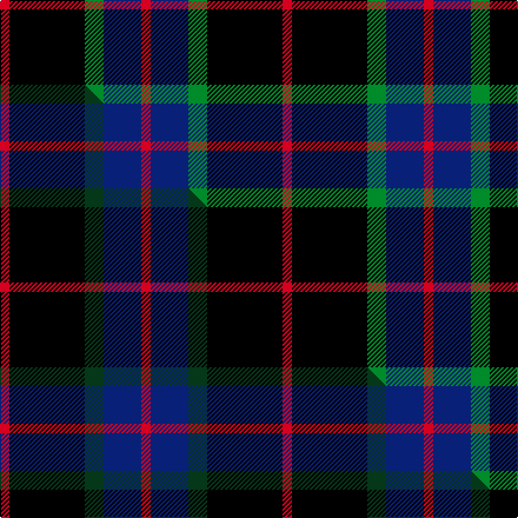

This page is one **sett** — a single exact thread-count. It belongs to the [tartan](/setts/r1k8g2db4r1/)
(the same proportion at any scale), whose colour order is pattern [RBGKR](/stripes/rbgkr/).

Part of the [Nairn](/tartans/nairn/) tartan — the named design grouping this sett with its other cloths.

Sourced from tartans-authority.  It is a [5 stripe tartan](/stripes/stripes5/).

Original link http://www.tartansauthority.com/tartan-ferret/display/1331/

## Register references

External register numbers recorded for this tartan.

- Scottish Tartans Authority (ITI): 1331

## Thread count
R/8 K64 G16 DB32 R/8

One full sett is **240 threads**.

## Palette
<table><thead><tr><th>Colour</th><th>Shade</th><th>OKLCh</th></tr></thead><tbody><tr><td>DB</td><td><code style="background-color:#082077;">#082077</code> <small style="color:#888">#082077</small></td><td><small style="color:#888">oklch(30.0% 0.149 265.1)</small></td></tr><tr><td>G</td><td><code style="background-color:#008B2A;">#008B2A</code> <small style="color:#888">#008B2A</small></td><td><small style="color:#888">oklch(55.4% 0.170 145.9)</small></td></tr><tr><td>K</td><td><code style="background-color:#000000;">#000000</code> <small style="color:#888">#000000</small></td><td><small style="color:#888">oklch(0.0% 0.000 0.0)</small></td></tr><tr><td>R</td><td><code style="background-color:#D60020;">#D60020</code> <small style="color:#888">#D60020</small></td><td><small style="color:#888">oklch(55.2% 0.224 25.5)</small></td></tr></tbody></table>

# Sample pattern

## Compared to the master

This cloth is one sett of its design; the master sett (the exemplar the design is anchored on) is below for comparison.

Its **ΔTartan distance** from the master is **0.64** — the same measure the nearest-tartans table ranks by (0 is identical; a re-scale of the same cloth is near 0, a recolour or a different proportion further).

<figure class="master-compare" style="margin:0">

this sett
master sett ★

<figcaption style="color:#888;font-size:smaller">One weave of this sett against the <a href="/setts/r1k8dg2db4r1/">master sett ★</a>, split on the diagonal: a shared proportion runs seamlessly across it with only the shades shifting; a different proportion breaks on it.</figcaption>
</figure>

## Nearest tartan variants

The nearest existing variants by ΔTartan distance, with this cloth at the top so the swatches line up against it.

ΔTartan

Threads

Variant

Sett

—

240

<a href="/variants/s5/r1k8g2db4r1~x8/">Nairn (Name)</a>

<a href="/ttd/edit/#slug=r1k8g2db4r1~x4&amp;base=r1k8g2db4r1~x8" title="compare in the TTD">0.00</a>

120

<a href="/variants/s5/r1k8g2db4r1~x4/">Nairn</a>

<a href="/ttd/edit/#slug=r1k8dg2db4r1~x8&amp;base=r1k8g2db4r1~x8" title="compare in the TTD">0.00</a>

240

<a href="/variants/s5/r1k8dg2db4r1~x8/">Nairn</a>

<a href="/ttd/edit/#slug=w3k25n9db17ly3~x2&amp;base=r1k8g2db4r1~x8" title="compare in the TTD">1.93</a>

216

<a href="/variants/s5/w3k25n9db17ly3~x2/">Teylu Coleman (Name)</a>

<a href="/ttd/edit/#slug=k2w1k12g5db11r1~x2&amp;base=r1k8g2db4r1~x8" title="compare in the TTD">1.99</a>

122

<a href="/variants/s6/k2w1k12g5db11r1~x2/">New England (Fashion)</a>

<a href="/ttd/edit/#slug=k14r4k25db30w4~x2&amp;base=r1k8g2db4r1~x8" title="compare in the TTD">2.01</a>

272

<a href="/variants/s5/k14r4k25db30w4~x2/">Britannia</a>

<a href="/ttd/edit/#slug=r3k12g4db12r1k2r1~x4&amp;base=r1k8g2db4r1~x8" title="compare in the TTD">2.05</a>

264

<a href="/variants/s7/r3k12g4db12r1k2r1~x4/">Sandberg</a>

<a href="/ttd/edit/#slug=k15y2k10db18w3~x2&amp;base=r1k8g2db4r1~x8" title="compare in the TTD">2.11</a>

156

<a href="/variants/s5/k15y2k10db18w3~x2/">College of Radiographers</a>

<a href="/ttd/edit/#slug=k15dy2k10db18w3~x2&amp;base=r1k8g2db4r1~x8" title="compare in the TTD">2.11</a>

156

<a href="/variants/s5/k15dy2k10db18w3~x2/">College of Radiographers Corporate Tartan</a>

<a href="/ttd/edit/#slug=k15lo2k10db18lr3~x2&amp;base=r1k8g2db4r1~x8" title="compare in the TTD">2.11</a>

156

<a href="/variants/s5/k15lo2k10db18lr3~x2/">College of Radiographers</a>

<a href="/ttd/edit/#slug=k7r3k24b28y3~x2&amp;base=r1k8g2db4r1~x8" title="compare in the TTD">2.15</a>

240

<a href="/variants/s5/k7r3k24b28y3~x2/">Robert Gordon University</a>

## Neighbour map

Every grey dot is one of 13620 variants placed by the first two principal components of the ΔTartan feature space (42% of its variance). Red is this tartan; blue dots are its nearest — click one to open its page.

<svg viewBox="0 0 640 380" role="img" style="max-width:100%;height:auto;border:1px solid #e0e0e0;border-radius:4px;display:block" xmlns="http://www.w3.org/2000/svg"><image href="/nn/cloud.v1.png" width="640" height="380"/><a href="/variants/s5/r1k8g2db4r1~x4/"><circle cx="212.8" cy="203.0" r="4" fill="#3465a4"><title>Nairn</title></circle></a><a href="/variants/s5/r1k8dg2db4r1~x8/"><circle cx="232.7" cy="208.2" r="4" fill="#3465a4"><title>Nairn</title></circle></a><a href="/variants/s5/w3k25n9db17ly3~x2/"><circle cx="160.3" cy="200.4" r="4" fill="#3465a4"><title>Teylu Coleman (Name)</title></circle></a><a href="/variants/s6/k2w1k12g5db11r1~x2/"><circle cx="181.6" cy="169.0" r="4" fill="#3465a4"><title>New England (Fashion)</title></circle></a><a href="/variants/s5/k14r4k25db30w4~x2/"><circle cx="226.6" cy="217.5" r="4" fill="#3465a4"><title>Britannia</title></circle></a><a href="/variants/s7/r3k12g4db12r1k2r1~x4/"><circle cx="184.1" cy="171.3" r="4" fill="#3465a4"><title>Sandberg</title></circle></a><a href="/variants/s5/k15y2k10db18w3~x2/"><circle cx="235.5" cy="216.2" r="4" fill="#3465a4"><title>College of Radiographers</title></circle></a><a href="/variants/s5/k15dy2k10db18w3~x2/"><circle cx="240.2" cy="217.6" r="4" fill="#3465a4"><title>College of Radiographers Corporate Tartan</title></circle></a><a href="/variants/s5/k15lo2k10db18lr3~x2/"><circle cx="244.7" cy="219.6" r="4" fill="#3465a4"><title>College of Radiographers</title></circle></a><a href="/variants/s5/k7r3k24b28y3~x2/"><circle cx="225.6" cy="195.0" r="4" fill="#3465a4"><title>Robert Gordon University</title></circle></a><circle cx="212.8" cy="203.0" r="5" fill="#c00000"/><text x="320" y="376" text-anchor="middle" font-size="11" fill="#999">ground</text><text x="11" y="190" text-anchor="middle" font-size="11" fill="#999" transform="rotate(-90 11 190)">complexity</text></svg>

ID: /variants/s5/r1k8g2db4r1~x8/
