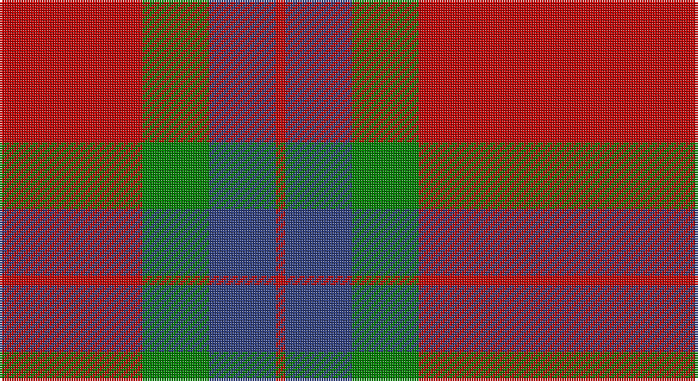

This page is one **sett** — a single exact thread-count. It belongs to the [tartan](/setts/r1r14g7db7r1/)
(the same proportion at any scale), whose colour order is pattern [RBGRR](/stripes/rbgrr/).

Sourced from weddslist.  It is a [5 stripe tartan](/stripes/stripes5/).

Original link http://www.weddslist.com/cgi-bin/tartans/pg.pl?source=sts

## Thread count
R/4 R56 G28 B28 R/4

One full sett is **232 threads**.

## Palette

Palette: <strong>custom</strong>
<table><thead><tr><th>Colour</th><th>Threads</th><th>Shade</th><th>Base</th><th>OKLCh</th></tr></thead><tbody><tr><td>R/</td><td style="text-align:right;font-variant-numeric:tabular-nums">4</td><td><code style="background-color:#C00000;">#C00000</code> <small style="color:#888">#C00000</small></td><td>R <code style="background-color:#CC0000;">#CC0000</code></td><td><small style="color:#888">oklch(50.7% 0.208 29.2)</small></td></tr><tr><td>R</td><td style="text-align:right;font-variant-numeric:tabular-nums">56</td><td><code style="background-color:#C00000;">#C00000</code> <small style="color:#888">#C00000</small></td><td>R <code style="background-color:#CC0000;">#CC0000</code></td><td><small style="color:#888">oklch(50.7% 0.208 29.2)</small></td></tr><tr><td>G</td><td style="text-align:right;font-variant-numeric:tabular-nums">28</td><td><code style="background-color:#008000;">#008000</code> <small style="color:#888">#008000</small></td><td>G <code style="background-color:#006100;">#006100</code></td><td><small style="color:#888">oklch(52.0% 0.177 142.5)</small></td></tr><tr><td>B</td><td style="text-align:right;font-variant-numeric:tabular-nums">28</td><td><code style="background-color:#304080;">#304080</code> <small style="color:#888">#304080</small></td><td>B <code style="background-color:#2A418A;">#2A418A</code></td><td><small style="color:#888">oklch(39.4% 0.109 270.2)</small></td></tr><tr><td>R/</td><td style="text-align:right;font-variant-numeric:tabular-nums">4</td><td><code style="background-color:#C00000;">#C00000</code> <small style="color:#888">#C00000</small></td><td>R <code style="background-color:#CC0000;">#CC0000</code></td><td><small style="color:#888">oklch(50.7% 0.208 29.2)</small></td></tr></tbody></table>

# Sample pattern

## Nearest tartans

The nearest existing variants by ΔTartan distance, with this tartan at the top so the swatches line up against it.

ΔTartan

Tartan

Sett

—

<a href="/ttd/edit/#slug=r1r14g7db7r1~x4">Hugh Fraser of Boblainy</a> <a class="nn-out" href="/variants/s5/r1r14g7db7r1~x4/" title="open its dictionary page">↗</a>

0.60

<a href="/ttd/edit/#slug=db1r14g7db7r1~x4&amp;base=r1r14g7db7r1~x4">Fraser of Boblainy, Hugh (Personal)</a> <a class="nn-out" href="/variants/s5/db1r14g7db7r1~x4/" title="open its dictionary page">↗</a>

0.80

<a href="/ttd/edit/#slug=db2o28g13o2db13o2~x4&amp;base=r1r14g7db7r1~x4">Edinchat</a> <a class="nn-out" href="/variants/s6/db2o28g13o2db13o2~x4/" title="open its dictionary page">↗</a>

0.80

<a href="/ttd/edit/#slug=db2r25g10r2db10r2~x2&amp;base=r1r14g7db7r1~x4">Grant of Lurg</a> <a class="nn-out" href="/variants/s6/db2r25g10r2db10r2~x2/" title="open its dictionary page">↗</a>

0.91

<a href="/ttd/edit/#slug=r6g21k8r28k2r4~x2&amp;base=r1r14g7db7r1~x4">Dunbar</a> <a class="nn-out" href="/variants/s6/r6g21k8r28k2r4~x2/" title="open its dictionary page">↗</a>

1.00

<a href="/ttd/edit/#slug=r12g8r54db45g6&amp;base=r1r14g7db7r1~x4">Wotherspoon</a> <a class="nn-out" href="/variants/s5/r12g8r54db45g6/" title="open its dictionary page">↗</a>

1.06

<a href="/ttd/edit/#slug=r16db6r2g6r2db1~x2&amp;base=r1r14g7db7r1~x4">MacKintosh, Plaid</a> <a class="nn-out" href="/variants/s6/r16db6r2g6r2db1~x2/" title="open its dictionary page">↗</a>

1.17

<a href="/ttd/edit/#slug=g28r4dp25r22g27r4dp2~x2&amp;base=r1r14g7db7r1~x4">Glasgow, City of</a> <a class="nn-out" href="/variants/s7/g28r4dp25r22g27r4dp2~x2/" title="open its dictionary page">↗</a>

1.18

<a href="/ttd/edit/#slug=dg8r2dg9r16w1~x2&amp;base=r1r14g7db7r1~x4">MacGregor of Balquhidder</a> <a class="nn-out" href="/variants/s5/dg8r2dg9r16w1~x2/" title="open its dictionary page">↗</a>

1.18

<a href="/ttd/edit/#slug=r70db20r10g40r10db3&amp;base=r1r14g7db7r1~x4">MacKintosh</a> <a class="nn-out" href="/variants/s6/r70db20r10g40r10db3/" title="open its dictionary page">↗</a>

1.22

<a href="/ttd/edit/#slug=dg16r5dg2r18k2~x2&amp;base=r1r14g7db7r1~x4">MacDonald Lord of the Isles #2</a> <a class="nn-out" href="/variants/s5/dg16r5dg2r18k2~x2/" title="open its dictionary page">↗</a>

## Neighbour map

Every grey dot is one of 14360 variants placed by the first two principal components of the ΔTartan feature space (44% of its variance). Red is this tartan; blue dots are its nearest — click one to open its page.

<svg viewBox="0 0 640 380" role="img" style="max-width:100%;height:auto;border:1px solid #e0e0e0;border-radius:4px;display:block" xmlns="http://www.w3.org/2000/svg"><image href="/nn/cloud.v1.png" width="640" height="380"/><a href="/variants/s5/db1r14g7db7r1~x4/"><circle cx="318.4" cy="221.2" r="4" fill="#3465a4"><title>Fraser of Boblainy, Hugh (Personal)</title></circle></a><a href="/variants/s6/db2o28g13o2db13o2~x4/"><circle cx="347.5" cy="209.0" r="4" fill="#3465a4"><title>Edinchat</title></circle></a><a href="/variants/s6/db2r25g10r2db10r2~x2/"><circle cx="369.4" cy="207.4" r="4" fill="#3465a4"><title>Grant of Lurg</title></circle></a><a href="/variants/s6/r6g21k8r28k2r4~x2/"><circle cx="344.5" cy="208.5" r="4" fill="#3465a4"><title>Dunbar</title></circle></a><a href="/variants/s5/r12g8r54db45g6/"><circle cx="340.6" cy="241.5" r="4" fill="#3465a4"><title>Wotherspoon</title></circle></a><a href="/variants/s6/r16db6r2g6r2db1~x2/"><circle cx="401.6" cy="202.3" r="4" fill="#3465a4"><title>MacKintosh, Plaid</title></circle></a><a href="/variants/s7/g28r4dp25r22g27r4dp2~x2/"><circle cx="298.2" cy="224.7" r="4" fill="#3465a4"><title>Glasgow, City of</title></circle></a><a href="/variants/s5/dg8r2dg9r16w1~x2/"><circle cx="345.6" cy="217.9" r="4" fill="#3465a4"><title>MacGregor of Balquhidder</title></circle></a><a href="/variants/s6/r70db20r10g40r10db3/"><circle cx="400.1" cy="188.2" r="4" fill="#3465a4"><title>MacKintosh</title></circle></a><a href="/variants/s5/dg16r5dg2r18k2~x2/"><circle cx="342.1" cy="233.7" r="4" fill="#3465a4"><title>MacDonald Lord of the Isles #2</title></circle></a><circle cx="340.7" cy="223.6" r="5" fill="#c00000"/></svg>

ID: /variants/s5/r1r14g7db7r1~x4/
