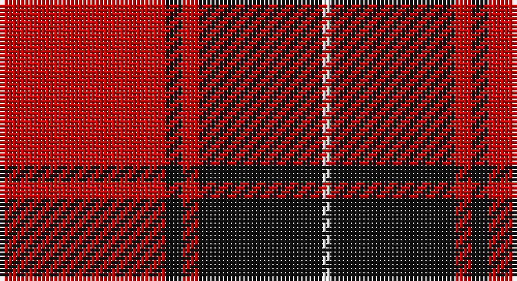

This page is one **sett** — a single exact thread-count. It belongs to the [tartan](/setts/r20k2r2k15w1/)
(the same proportion at any scale), whose colour order is pattern [RKRKW](/stripes/rkrkw/).

Sourced from tartans-authority.  It is a [5 stripe tartan](/stripes/stripes5/).

Original link http://www.tartansauthority.com/tartan-ferret/display/7211/

## Register references

External register numbers recorded for this tartan.

- Scottish Tartans Authority (ITI): 7211

## Thread count
R/40 K4 R4 K30 LN/2

One full sett is **118 threads**.

## Palette

Palette: <strong>Tartan Register</strong>
<table><thead><tr><th>Colour</th><th>Threads</th><th>Shade</th><th>Base</th><th>OKLCh</th></tr></thead><tbody><tr><td>R/</td><td style="text-align:right;font-variant-numeric:tabular-nums">40</td><td><code style="background-color:#C80000;">#C80000</code> <small style="color:#888">#C80000</small></td><td>R <code style="background-color:#CC0000;">#CC0000</code></td><td><small style="color:#888">oklch(52.3% 0.215 29.2)</small></td></tr><tr><td>K</td><td style="text-align:right;font-variant-numeric:tabular-nums">4</td><td><code style="background-color:#101010;">#101010</code> <small style="color:#888">#101010</small></td><td>K <code style="background-color:#000000;">#000000</code></td><td><small style="color:#888">oklch(17.3% 0.000 89.9)</small></td></tr><tr><td>R</td><td style="text-align:right;font-variant-numeric:tabular-nums">4</td><td><code style="background-color:#C80000;">#C80000</code> <small style="color:#888">#C80000</small></td><td>R <code style="background-color:#CC0000;">#CC0000</code></td><td><small style="color:#888">oklch(52.3% 0.215 29.2)</small></td></tr><tr><td>K</td><td style="text-align:right;font-variant-numeric:tabular-nums">30</td><td><code style="background-color:#101010;">#101010</code> <small style="color:#888">#101010</small></td><td>K <code style="background-color:#000000;">#000000</code></td><td><small style="color:#888">oklch(17.3% 0.000 89.9)</small></td></tr><tr><td>LN/</td><td style="text-align:right;font-variant-numeric:tabular-nums">2</td><td><code style="background-color:#E0E0E0;">#E0E0E0</code> <small style="color:#888">#E0E0E0</small></td><td>W <code style="background-color:#F7F7F7;">#F7F7F7</code></td><td><small style="color:#888">oklch(90.7% 0.000 89.9)</small></td></tr></tbody></table>

# Sample pattern

## Nearest tartans

The nearest existing variants by ΔTartan distance, with this tartan at the top so the swatches line up against it.

ΔTartan

Tartan

Sett

—

<a href="/ttd/edit/#slug=r20k2r2k15w1~x2">Masai Shuka 15 (Artefact)</a> <a class="nn-out" href="/variants/s5/r20k2r2k15w1~x2/" title="open its dictionary page">↗</a>

0.52

<a href="/ttd/edit/#slug=r36k18r4k7w2~x2&amp;base=r20k2r2k15w1~x2">Hopkins (Name)</a> <a class="nn-out" href="/variants/s5/r36k18r4k7w2~x2/" title="open its dictionary page">↗</a>

0.68

<a href="/ttd/edit/#slug=k16r2k2r12w1~x2&amp;base=r20k2r2k15w1~x2">MacIver</a> <a class="nn-out" href="/variants/s5/k16r2k2r12w1~x2/" title="open its dictionary page">↗</a>

0.90

<a href="/ttd/edit/#slug=k2r16k8ly1k8r2~x4&amp;base=r20k2r2k15w1~x2">Brodie (Clan)</a> <a class="nn-out" href="/variants/s6/k2r16k8ly1k8r2~x4/" title="open its dictionary page">↗</a>

0.92

<a href="/ttd/edit/#slug=r41k19r7k9w3~x2&amp;base=r20k2r2k15w1~x2">MacGregor, Black (Personal)</a> <a class="nn-out" href="/variants/s5/r41k19r7k9w3~x2/" title="open its dictionary page">↗</a>

0.95

<a href="/ttd/edit/#slug=r42k2w2k18w2k5~x2&amp;base=r20k2r2k15w1~x2">Forget Family (Red)</a> <a class="nn-out" href="/variants/s6/r42k2w2k18w2k5~x2/" title="open its dictionary page">↗</a>

0.97

<a href="/ttd/edit/#slug=r4k1r24k22r2~x2&amp;base=r20k2r2k15w1~x2">Campbell Red (artefact)</a> <a class="nn-out" href="/variants/s5/r4k1r24k22r2~x2/" title="open its dictionary page">↗</a>

0.99

<a href="/ttd/edit/#slug=k4w2k28r30k1r3~x2&amp;base=r20k2r2k15w1~x2">Ramsay of Dalhousie</a> <a class="nn-out" href="/variants/s6/k4w2k28r30k1r3~x2/" title="open its dictionary page">↗</a>

1.06

<a href="/ttd/edit/#slug=r22db5r2dg11r3db1&amp;base=r20k2r2k15w1~x2">MacKintosh D</a> <a class="nn-out" href="/variants/s6/r22db5r2dg11r3db1/" title="open its dictionary page">↗</a>

1.07

<a href="/ttd/edit/#slug=r28k4w2k13~x2&amp;base=r20k2r2k15w1~x2">Dunbar (District)</a> <a class="nn-out" href="/variants/s4/r28k4w2k13~x2/" title="open its dictionary page">↗</a>

1.08

<a href="/ttd/edit/#slug=k4r33k24w3k4r3~x2&amp;base=r20k2r2k15w1~x2">Monmouth College</a> <a class="nn-out" href="/variants/s6/k4r33k24w3k4r3~x2/" title="open its dictionary page">↗</a>

## Neighbour map

Every grey dot is one of 14360 variants placed by the first two principal components of the ΔTartan feature space (44% of its variance). Red is this tartan; blue dots are its nearest — click one to open its page.

<svg viewBox="0 0 640 380" role="img" style="max-width:100%;height:auto;border:1px solid #e0e0e0;border-radius:4px;display:block" xmlns="http://www.w3.org/2000/svg"><image href="/nn/cloud.v1.png" width="640" height="380"/><a href="/variants/s5/r36k18r4k7w2~x2/"><circle cx="398.3" cy="190.2" r="4" fill="#3465a4"><title>Hopkins (Name)</title></circle></a><a href="/variants/s5/k16r2k2r12w1~x2/"><circle cx="359.3" cy="196.1" r="4" fill="#3465a4"><title>MacIver</title></circle></a><a href="/variants/s6/k2r16k8ly1k8r2~x4/"><circle cx="340.2" cy="199.5" r="4" fill="#3465a4"><title>Brodie (Clan)</title></circle></a><a href="/variants/s5/r41k19r7k9w3~x2/"><circle cx="381.4" cy="202.6" r="4" fill="#3465a4"><title>MacGregor, Black (Personal)</title></circle></a><a href="/variants/s6/r42k2w2k18w2k5~x2/"><circle cx="400.0" cy="151.5" r="4" fill="#3465a4"><title>Forget Family (Red)</title></circle></a><a href="/variants/s5/r4k1r24k22r2~x2/"><circle cx="419.6" cy="192.9" r="4" fill="#3465a4"><title>Campbell Red (artefact)</title></circle></a><a href="/variants/s6/k4w2k28r30k1r3~x2/"><circle cx="369.6" cy="151.3" r="4" fill="#3465a4"><title>Ramsay of Dalhousie</title></circle></a><a href="/variants/s6/r22db5r2dg11r3db1/"><circle cx="407.5" cy="178.0" r="4" fill="#3465a4"><title>MacKintosh D</title></circle></a><a href="/variants/s4/r28k4w2k13~x2/"><circle cx="374.0" cy="210.7" r="4" fill="#3465a4"><title>Dunbar (District)</title></circle></a><a href="/variants/s6/k4r33k24w3k4r3~x2/"><circle cx="334.4" cy="194.5" r="4" fill="#3465a4"><title>Monmouth College</title></circle></a><circle cx="385.2" cy="184.7" r="5" fill="#c00000"/></svg>

ID: /variants/s5/r20k2r2k15w1~x2/
