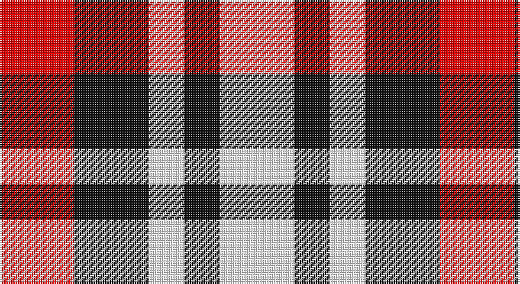

This page is one **sett** — a single exact thread-count. It belongs to the [tartan](/setts/r21k21w10k10w21/)
(the same proportion at any scale), whose colour order is pattern [RKWKW](/stripes/rkwkw/).

Sourced from register-of-tartans.  It is a [5 stripe tartan](/stripes/stripes5/).

Original link https://www.tartanregister.gov.uk/tartanDetails.aspx?ref=10625

2 attestations — the source records this cloth was collapsed from (oldest owns this page)

<ul>
<li>18/08/2011 — Havel (register-of-tartans, <a href="https://www.tartanregister.gov.uk/tartanDetails.aspx?ref=10625">record</a>)</li>
<li>18/08/2011 — Havel (Fashion) (tartans-authority, <a href="http://www.tartansauthority.com/tartan-ferret/display/10625/">record</a>)</li>
</ul>

## Register references

External register numbers recorded for this tartan.

- Scottish Register of Tartans: [10625](https://www.tartanregister.gov.uk/tartanDetails?ref=10625)
- Scottish Tartans Authority (ITI): 10625

## Thread count
R/42 K42 W20 K20 W/42

One full sett is **248 threads**.

## Palette

Palette: <strong>Tartan Register</strong>
<table><thead><tr><th>Colour</th><th>Threads</th><th>Shade</th><th>Base</th><th>OKLCh</th></tr></thead><tbody><tr><td>R/</td><td style="text-align:right;font-variant-numeric:tabular-nums">42</td><td><code style="background-color:#FF0000;">#FF0000</code> <small style="color:#888">#FF0000</small></td><td>R <code style="background-color:#CC0000;">#CC0000</code></td><td><small style="color:#888">oklch(62.8% 0.258 29.2)</small></td></tr><tr><td>K</td><td style="text-align:right;font-variant-numeric:tabular-nums">42</td><td><code style="background-color:#101010;">#101010</code> <small style="color:#888">#101010</small></td><td>K <code style="background-color:#000000;">#000000</code></td><td><small style="color:#888">oklch(17.3% 0.000 89.9)</small></td></tr><tr><td>W</td><td style="text-align:right;font-variant-numeric:tabular-nums">20</td><td><code style="background-color:#FFFFFF;">#FFFFFF</code> <small style="color:#888">#FFFFFF</small></td><td>W <code style="background-color:#F7F7F7;">#F7F7F7</code></td><td><small style="color:#888">oklch(100.0% 0.000 89.9)</small></td></tr><tr><td>K</td><td style="text-align:right;font-variant-numeric:tabular-nums">20</td><td><code style="background-color:#101010;">#101010</code> <small style="color:#888">#101010</small></td><td>K <code style="background-color:#000000;">#000000</code></td><td><small style="color:#888">oklch(17.3% 0.000 89.9)</small></td></tr><tr><td>W/</td><td style="text-align:right;font-variant-numeric:tabular-nums">42</td><td><code style="background-color:#FFFFFF;">#FFFFFF</code> <small style="color:#888">#FFFFFF</small></td><td>W <code style="background-color:#F7F7F7;">#F7F7F7</code></td><td><small style="color:#888">oklch(100.0% 0.000 89.9)</small></td></tr></tbody></table>

# Sample pattern

## Nearest tartans

The nearest existing variants by ΔTartan distance, with this tartan at the top so the swatches line up against it.

ΔTartan

Tartan

Sett

—

<a href="/ttd/edit/#slug=r21k21w10k10w21~x2">Havel</a> <a class="nn-out" href="/variants/s5/r21k21w10k10w21~x2/" title="open its dictionary page">↗</a>

0.92

<a href="/ttd/edit/#slug=w3r2w1dt2r2~x4&amp;base=r21k21w10k10w21~x2">Oakland Centre</a> <a class="nn-out" href="/variants/s5/w3r2w1dt2r2~x4/" title="open its dictionary page">↗</a>

1.63

<a href="/ttd/edit/#slug=w9r23g23w9~x2&amp;base=r21k21w10k10w21~x2">Quaboos Pipers Plaid</a> <a class="nn-out" href="/variants/s4/w9r23g23w9~x2/" title="open its dictionary page">↗</a>

1.69

<a href="/variants/s8/r2g1w1k1~x20/">Harazeen</a>

1.88

<a href="/ttd/edit/#slug=r3g1k3w1~x20&amp;base=r21k21w10k10w21~x2">SAL Glindrande Stiernan</a> <a class="nn-out" href="/variants/s4/r3g1k3w1~x20/" title="open its dictionary page">↗</a>

1.91

<a href="/ttd/edit/#slug=k7r5w3db2~x4&amp;base=r21k21w10k10w21~x2">Thomas Newcomen's Combustion Engine</a> <a class="nn-out" href="/variants/s4/k7r5w3db2~x4/" title="open its dictionary page">↗</a>

1.92

<a href="/ttd/edit/#slug=r3k1dg1k1lb3~x4&amp;base=r21k21w10k10w21~x2">Clark</a> <a class="nn-out" href="/variants/s5/r3k1dg1k1lb3~x4/" title="open its dictionary page">↗</a>

1.96

<a href="/ttd/edit/#slug=r10t5lb5dt4~x8&amp;base=r21k21w10k10w21~x2">Haggis Hostels</a> <a class="nn-out" href="/variants/s4/r10t5lb5dt4~x8/" title="open its dictionary page">↗</a>

2.00

<a href="/ttd/edit/#slug=o16dr21r32w16~x2&amp;base=r21k21w10k10w21~x2">Bloomer-Alexander (Personal)</a> <a class="nn-out" href="/variants/s4/o16dr21r32w16~x2/" title="open its dictionary page">↗</a>

2.03

<a href="/ttd/edit/#slug=dy1w2db1~x12&amp;base=r21k21w10k10w21~x2">Aquascutum</a> <a class="nn-out" href="/variants/s3/dy1w2db1~x12/" title="open its dictionary page">↗</a>

2.04

<a href="/ttd/edit/#slug=g23r23w9r23g23w9~x2&amp;base=r21k21w10k10w21~x2">Omani Regiment 2nd Pipe Sqn.</a> <a class="nn-out" href="/variants/s6/g23r23w9r23g23w9~x2/" title="open its dictionary page">↗</a>

## Neighbour map

Every grey dot is one of 14360 variants placed by the first two principal components of the ΔTartan feature space (44% of its variance). Red is this tartan; blue dots are its nearest — click one to open its page.

<svg viewBox="0 0 640 380" role="img" style="max-width:100%;height:auto;border:1px solid #e0e0e0;border-radius:4px;display:block" xmlns="http://www.w3.org/2000/svg"><image href="/nn/cloud.v1.png" width="640" height="380"/><a href="/variants/s5/w3r2w1dt2r2~x4/"><circle cx="108.9" cy="294.3" r="4" fill="#3465a4"><title>Oakland Centre</title></circle></a><a href="/variants/s4/w9r23g23w9~x2/"><circle cx="120.5" cy="308.5" r="4" fill="#3465a4"><title>Quaboos Pipers Plaid</title></circle></a><a href="/variants/s8/r2g1w1k1~x20/"><circle cx="44.7" cy="271.0" r="4" fill="#3465a4"><title>Harazeen</title></circle></a><a href="/variants/s4/r3g1k3w1~x20/"><circle cx="102.5" cy="271.1" r="4" fill="#3465a4"><title>SAL Glindrande Stiernan</title></circle></a><a href="/variants/s4/k7r5w3db2~x4/"><circle cx="104.2" cy="273.1" r="4" fill="#3465a4"><title>Thomas Newcomen's Combustion Engine</title></circle></a><a href="/variants/s5/r3k1dg1k1lb3~x4/"><circle cx="73.7" cy="256.0" r="4" fill="#3465a4"><title>Clark</title></circle></a><a href="/variants/s4/r10t5lb5dt4~x8/"><circle cx="112.6" cy="306.3" r="4" fill="#3465a4"><title>Haggis Hostels</title></circle></a><a href="/variants/s4/o16dr21r32w16~x2/"><circle cx="72.0" cy="322.1" r="4" fill="#3465a4"><title>Bloomer-Alexander (Personal)</title></circle></a><a href="/variants/s3/dy1w2db1~x12/"><circle cx="142.4" cy="338.1" r="4" fill="#3465a4"><title>Aquascutum</title></circle></a><a href="/variants/s6/g23r23w9r23g23w9~x2/"><circle cx="136.7" cy="304.3" r="4" fill="#3465a4"><title>Omani Regiment 2nd Pipe Sqn.</title></circle></a><circle cx="74.9" cy="307.9" r="5" fill="#c00000"/></svg>

ID: /variants/s5/r21k21w10k10w21~x2/
