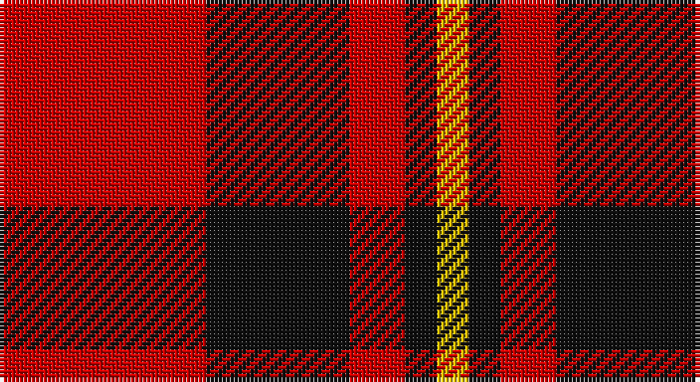

This page is one **sett** — a single exact thread-count. It belongs to the [tartan](/setts/r26k18r7k4ly4/)
(the same proportion at any scale), whose colour order is pattern [RKRKY](/stripes/rkrky/).

Sourced from tartans-authority.  It is a [5 stripe tartan](/stripes/stripes5/).

Original link http://www.tartansauthority.com/tartan-ferret/display/1609/

## Provenance

Earliest known date: 1979 For Messrs John Haig.

## Also known as

This cloth is also recorded under:

- Haig & Haig Whisky

2 attestations — the source records this cloth was collapsed from (oldest owns this page)

<ul>
<li>1979 — Haig & Haig Whisky (Corporate) (tartans-authority, <a href="http://www.tartansauthority.com/tartan-ferret/display/1609/">record</a>)</li>
<li>undated — Haig Corporate Tartan (house-of-tartan, <a href="http://www.house-of-tartan.scotland.net/house/TartanViewjs.asp?colr=Def&tnam=1609">record</a>)</li>
</ul>

## Register references

External register numbers recorded for this tartan.

- Scottish Tartans Authority (ITI): 1609

## Thread count
R/52 K36 R14 K8 Y/8

One full sett is **176 threads**.

## Palette

Palette: <strong>Tartan Register</strong>
<table><thead><tr><th>Colour</th><th>Threads</th><th>Shade</th><th>Base</th><th>OKLCh</th></tr></thead><tbody><tr><td>R/</td><td style="text-align:right;font-variant-numeric:tabular-nums">52</td><td><code style="background-color:#C80000;">#C80000</code> <small style="color:#888">#C80000</small></td><td>R <code style="background-color:#CC0000;">#CC0000</code></td><td><small style="color:#888">oklch(52.3% 0.215 29.2)</small></td></tr><tr><td>K</td><td style="text-align:right;font-variant-numeric:tabular-nums">36</td><td><code style="background-color:#101010;">#101010</code> <small style="color:#888">#101010</small></td><td>K <code style="background-color:#000000;">#000000</code></td><td><small style="color:#888">oklch(17.3% 0.000 89.9)</small></td></tr><tr><td>R</td><td style="text-align:right;font-variant-numeric:tabular-nums">14</td><td><code style="background-color:#C80000;">#C80000</code> <small style="color:#888">#C80000</small></td><td>R <code style="background-color:#CC0000;">#CC0000</code></td><td><small style="color:#888">oklch(52.3% 0.215 29.2)</small></td></tr><tr><td>K</td><td style="text-align:right;font-variant-numeric:tabular-nums">8</td><td><code style="background-color:#101010;">#101010</code> <small style="color:#888">#101010</small></td><td>K <code style="background-color:#000000;">#000000</code></td><td><small style="color:#888">oklch(17.3% 0.000 89.9)</small></td></tr><tr><td>Y/</td><td style="text-align:right;font-variant-numeric:tabular-nums">8</td><td><code style="background-color:#E8C000;">#E8C000</code> <small style="color:#888">#E8C000</small></td><td>Y <code style="background-color:#F2BF00;">#F2BF00</code></td><td><small style="color:#888">oklch(81.9% 0.168 93.7)</small></td></tr></tbody></table>

# Sample pattern

## Nearest tartans

The nearest existing variants by ΔTartan distance, with this tartan at the top so the swatches line up against it.

ΔTartan

Tartan

Sett

—

<a href="/ttd/edit/#slug=r26k18r7k4ly4~x2">Haig &amp; Haig Whisky (Corporate)</a> <a class="nn-out" href="/variants/s5/r26k18r7k4ly4~x2/" title="open its dictionary page">↗</a>

0.96

<a href="/ttd/edit/#slug=k3r15k11ly2k4r3~x2&amp;base=r26k18r7k4ly4~x2">Brodie (Clan)</a> <a class="nn-out" href="/variants/s6/k3r15k11ly2k4r3~x2/" title="open its dictionary page">↗</a>

1.00

<a href="/ttd/edit/#slug=k1r8k8ly1~x6&amp;base=r26k18r7k4ly4~x2">Wallace</a> <a class="nn-out" href="/variants/s4/k1r8k8ly1~x6/" title="open its dictionary page">↗</a>

1.00

<a href="/ttd/edit/#slug=k1r8k8ly1~x4&amp;base=r26k18r7k4ly4~x2">Wallace (Clan)</a> <a class="nn-out" href="/variants/s4/k1r8k8ly1~x4/" title="open its dictionary page">↗</a>

1.02

<a href="/ttd/edit/#slug=r3k25r25k10lb3~x2&amp;base=r26k18r7k4ly4~x2">Bodog.com</a> <a class="nn-out" href="/variants/s5/r3k25r25k10lb3~x2/" title="open its dictionary page">↗</a>

1.16

<a href="/ttd/edit/#slug=k18r4k18r32w3~x2&amp;base=r26k18r7k4ly4~x2">Munro (Black and Red)</a> <a class="nn-out" href="/variants/s5/k18r4k18r32w3~x2/" title="open its dictionary page">↗</a>

1.17

<a href="/ttd/edit/#slug=r4k8r12k1ly1~x2&amp;base=r26k18r7k4ly4~x2">MacKeane</a> <a class="nn-out" href="/variants/s5/r4k8r12k1ly1~x2/" title="open its dictionary page">↗</a>

1.23

<a href="/ttd/edit/#slug=dg7r3dg1r9k1~x2&amp;base=r26k18r7k4ly4~x2">MacDonald of Sleat</a> <a class="nn-out" href="/variants/s5/dg7r3dg1r9k1~x2/" title="open its dictionary page">↗</a>

1.26

<a href="/variants/s8/r26k18r7k4ly4~x2/">Haig &amp; Haig Whisky</a>

1.28

<a href="/ttd/edit/#slug=k8r1k8r11ly1r1~x4&amp;base=r26k18r7k4ly4~x2">Swanstrom (Personal)</a> <a class="nn-out" href="/variants/s6/k8r1k8r11ly1r1~x4/" title="open its dictionary page">↗</a>

1.28

<a href="/ttd/edit/#slug=r4k8r4k8r12k1ly1~x2&amp;base=r26k18r7k4ly4~x2">MacKeane (Clan?)</a> <a class="nn-out" href="/variants/s7/r4k8r4k8r12k1ly1~x2/" title="open its dictionary page">↗</a>

## Neighbour map

Every grey dot is one of 14360 variants placed by the first two principal components of the ΔTartan feature space (44% of its variance). Red is this tartan; blue dots are its nearest — click one to open its page.

<svg viewBox="0 0 640 380" role="img" style="max-width:100%;height:auto;border:1px solid #e0e0e0;border-radius:4px;display:block" xmlns="http://www.w3.org/2000/svg"><image href="/nn/cloud.v1.png" width="640" height="380"/><a href="/variants/s6/k3r15k11ly2k4r3~x2/"><circle cx="287.0" cy="228.9" r="4" fill="#3465a4"><title>Brodie (Clan)</title></circle></a><a href="/variants/s4/k1r8k8ly1~x6/"><circle cx="304.9" cy="243.9" r="4" fill="#3465a4"><title>Wallace</title></circle></a><a href="/variants/s4/k1r8k8ly1~x4/"><circle cx="304.9" cy="243.9" r="4" fill="#3465a4"><title>Wallace (Clan)</title></circle></a><a href="/variants/s5/r3k25r25k10lb3~x2/"><circle cx="316.6" cy="238.4" r="4" fill="#3465a4"><title>Bodog.com</title></circle></a><a href="/variants/s5/k18r4k18r32w3~x2/"><circle cx="300.8" cy="228.3" r="4" fill="#3465a4"><title>Munro (Black and Red)</title></circle></a><a href="/variants/s5/r4k8r12k1ly1~x2/"><circle cx="383.5" cy="213.8" r="4" fill="#3465a4"><title>MacKeane</title></circle></a><a href="/variants/s5/dg7r3dg1r9k1~x2/"><circle cx="353.6" cy="237.9" r="4" fill="#3465a4"><title>MacDonald of Sleat</title></circle></a><a href="/variants/s8/r26k18r7k4ly4~x2/"><circle cx="283.1" cy="228.6" r="4" fill="#3465a4"><title>Haig &amp; Haig Whisky</title></circle></a><a href="/variants/s6/k8r1k8r11ly1r1~x4/"><circle cx="335.5" cy="215.7" r="4" fill="#3465a4"><title>Swanstrom (Personal)</title></circle></a><a href="/variants/s7/r4k8r4k8r12k1ly1~x2/"><circle cx="326.8" cy="214.9" r="4" fill="#3465a4"><title>MacKeane (Clan?)</title></circle></a><circle cx="313.1" cy="239.4" r="5" fill="#c00000"/></svg>

ID: /variants/s5/r26k18r7k4ly4~x2/
