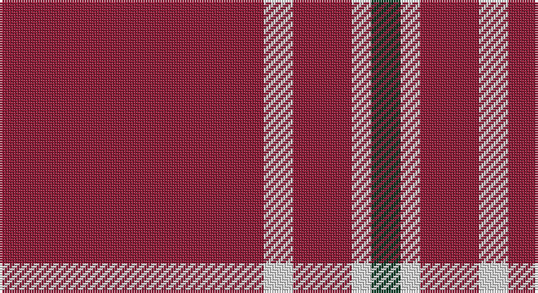

This page is one **sett** — a single exact thread-count. It belongs to the [tartan](/setts/r27w3r6w2dg3/)
(the same proportion at any scale), whose colour order is pattern [GWRWR](/stripes/gwrwr/).

Sourced from tartans-authority.  It is a [5 stripe tartan](/stripes/stripes5/).

Original link http://www.tartansauthority.com/tartan-ferret/display/10481/

## Provenance

Earliest known date: 2011 May This tartan was designed to honour Robert Nunley Martin. The maroon and white colours represent Texas A&M University where Robert Nunley Martin (and his grandson, Ian Thomas Martin) were educated. The dark green represents Baylor University where Robert's mother, Vernon Nunley Martin, and his grandson, Ryan Len Martin graduated.

## Also known as

This cloth is also recorded under:

- Martin Family, Robert N Personal
- Martin, Robert N

2 attestations — the source records this cloth was collapsed from (oldest owns this page)

<ul>
<li>25th May 2011 — Martin, Robert N (Personal) (tartans-authority, <a href="http://www.tartansauthority.com/tartan-ferret/display/10481/">record</a>)</li>
<li>undated — Martin Family, Robert N Personal Tartan (house-of-tartan, <a href="http://www.house-of-tartan.scotland.net/house/TartanViewjs.asp?colr=Def&tnam=10481">record</a>)</li>
</ul>

## Register references

External register numbers recorded for this tartan.

- Scottish Register of Tartans: [10481](https://www.tartanregister.gov.uk/tartanDetails?ref=10481)
- Scottish Tartans Authority (ITI): 10481

## Thread count
DR/108 LN12 DR24 LN8 DG/12

One full sett is **208 threads**.

## Palette

Palette: <strong>Tartan Register</strong>
<table><thead><tr><th>Colour</th><th>Threads</th><th>Shade</th><th>Base</th><th>OKLCh</th></tr></thead><tbody><tr><td>DR/</td><td style="text-align:right;font-variant-numeric:tabular-nums">108</td><td><code style="background-color:#901C38;">#901C38</code> <small style="color:#888">#901C38</small></td><td>R <code style="background-color:#CC0000;">#CC0000</code></td><td><small style="color:#888">oklch(43.2% 0.150 13.1)</small></td></tr><tr><td>LN</td><td style="text-align:right;font-variant-numeric:tabular-nums">12</td><td><code style="background-color:#E0E0E0;">#E0E0E0</code> <small style="color:#888">#E0E0E0</small></td><td>W <code style="background-color:#F7F7F7;">#F7F7F7</code></td><td><small style="color:#888">oklch(90.7% 0.000 89.9)</small></td></tr><tr><td>DR</td><td style="text-align:right;font-variant-numeric:tabular-nums">24</td><td><code style="background-color:#901C38;">#901C38</code> <small style="color:#888">#901C38</small></td><td>R <code style="background-color:#CC0000;">#CC0000</code></td><td><small style="color:#888">oklch(43.2% 0.150 13.1)</small></td></tr><tr><td>LN</td><td style="text-align:right;font-variant-numeric:tabular-nums">8</td><td><code style="background-color:#E0E0E0;">#E0E0E0</code> <small style="color:#888">#E0E0E0</small></td><td>W <code style="background-color:#F7F7F7;">#F7F7F7</code></td><td><small style="color:#888">oklch(90.7% 0.000 89.9)</small></td></tr><tr><td>DG/</td><td style="text-align:right;font-variant-numeric:tabular-nums">12</td><td><code style="background-color:#003820;">#003820</code> <small style="color:#888">#003820</small></td><td>G <code style="background-color:#006100;">#006100</code></td><td><small style="color:#888">oklch(30.0% 0.070 158.3)</small></td></tr></tbody></table>

# Sample pattern

## Nearest tartans

The nearest existing variants by ΔTartan distance, with this tartan at the top so the swatches line up against it.

ΔTartan

Tartan

Sett

—

<a href="/ttd/edit/#slug=r27w3r6w2dg3~x4">Martin, Robert N (Personal)</a> <a class="nn-out" href="/variants/s5/r27w3r6w2dg3~x4/" title="open its dictionary page">↗</a>

1.63

<a href="/ttd/edit/#slug=r8w1k1~x20&amp;base=r27w3r6w2dg3~x4">International Karate Fed. (Corporat)</a> <a class="nn-out" href="/variants/s3/r8w1k1~x20/" title="open its dictionary page">↗</a>

1.64

<a href="/ttd/edit/#slug=r32k2r4k2r2k8r30lb3~x2&amp;base=r27w3r6w2dg3~x4">University of Chicago (Corporate)</a> <a class="nn-out" href="/variants/s8/r32k2r4k2r2k8r30lb3~x2/" title="open its dictionary page">↗</a>

1.66

<a href="/ttd/edit/#slug=r74w27r13lr7r13w13r74k7&amp;base=r27w3r6w2dg3~x4">Cornell (Corporate)</a> <a class="nn-out" href="/variants/s8/r74w27r13lr7r13w13r74k7/" title="open its dictionary page">↗</a>

1.70

<a href="/ttd/edit/#slug=m18g1k5g1k1g1m9~x2&amp;base=r27w3r6w2dg3~x4">Inverness, Augustus</a> <a class="nn-out" href="/variants/s7/m18g1k5g1k1g1m9~x2/" title="open its dictionary page">↗</a>

1.73

<a href="/ttd/edit/#slug=r75k15r4k15r4~x2&amp;base=r27w3r6w2dg3~x4">Masai Shuka 07 (Artefact)</a> <a class="nn-out" href="/variants/s5/r75k15r4k15r4~x2/" title="open its dictionary page">↗</a>

1.74

<a href="/ttd/edit/#slug=dg2r28db6r5db2r2db2r11lr2~x2&amp;base=r27w3r6w2dg3~x4">Rose</a> <a class="nn-out" href="/variants/s9/dg2r28db6r5db2r2db2r11lr2~x2/" title="open its dictionary page">↗</a>

1.74

<a href="/ttd/edit/#slug=dg2r28db6r5db2r2db2r11lr2&amp;base=r27w3r6w2dg3~x4">Rose</a> <a class="nn-out" href="/variants/s9/dg2r28db6r5db2r2db2r11lr2/" title="open its dictionary page">↗</a>

1.76

<a href="/ttd/edit/#slug=dr27w3dr6w2g3~x4&amp;base=r27w3r6w2dg3~x4">Martin Family, Robert N (Personal)</a> <a class="nn-out" href="/variants/s5/dr27w3dr6w2g3~x4/" title="open its dictionary page">↗</a>

1.76

<a href="/ttd/edit/#slug=dg2r28db6r5db2r2db2r11lb2&amp;base=r27w3r6w2dg3~x4">Rose</a> <a class="nn-out" href="/variants/s9/dg2r28db6r5db2r2db2r11lb2/" title="open its dictionary page">↗</a>

1.79

<a href="/ttd/edit/#slug=r40db2r6db15~x2&amp;base=r27w3r6w2dg3~x4">Masai Shuka 21 (Artefact)</a> <a class="nn-out" href="/variants/s4/r40db2r6db15~x2/" title="open its dictionary page">↗</a>

## Neighbour map

Every grey dot is one of 14360 variants placed by the first two principal components of the ΔTartan feature space (44% of its variance). Red is this tartan; blue dots are its nearest — click one to open its page.

<svg viewBox="0 0 640 380" role="img" style="max-width:100%;height:auto;border:1px solid #e0e0e0;border-radius:4px;display:block" xmlns="http://www.w3.org/2000/svg"><image href="/nn/cloud.v1.png" width="640" height="380"/><a href="/variants/s3/r8w1k1~x20/"><circle cx="521.8" cy="246.8" r="4" fill="#3465a4"><title>International Karate Fed. (Corporat)</title></circle></a><a href="/variants/s8/r32k2r4k2r2k8r30lb3~x2/"><circle cx="563.1" cy="175.5" r="4" fill="#3465a4"><title>University of Chicago (Corporate)</title></circle></a><a href="/variants/s8/r74w27r13lr7r13w13r74k7/"><circle cx="449.4" cy="174.0" r="4" fill="#3465a4"><title>Cornell (Corporate)</title></circle></a><a href="/variants/s7/m18g1k5g1k1g1m9~x2/"><circle cx="507.3" cy="180.7" r="4" fill="#3465a4"><title>Inverness, Augustus</title></circle></a><a href="/variants/s5/r75k15r4k15r4~x2/"><circle cx="538.1" cy="193.9" r="4" fill="#3465a4"><title>Masai Shuka 07 (Artefact)</title></circle></a><a href="/variants/s9/dg2r28db6r5db2r2db2r11lr2~x2/"><circle cx="506.4" cy="156.8" r="4" fill="#3465a4"><title>Rose</title></circle></a><a href="/variants/s9/dg2r28db6r5db2r2db2r11lr2/"><circle cx="506.4" cy="156.8" r="4" fill="#3465a4"><title>Rose</title></circle></a><a href="/variants/s5/dr27w3dr6w2g3~x4/"><circle cx="516.4" cy="193.5" r="4" fill="#3465a4"><title>Martin Family, Robert N (Personal)</title></circle></a><a href="/variants/s9/dg2r28db6r5db2r2db2r11lb2/"><circle cx="490.3" cy="143.4" r="4" fill="#3465a4"><title>Rose</title></circle></a><a href="/variants/s4/r40db2r6db15~x2/"><circle cx="546.2" cy="226.0" r="4" fill="#3465a4"><title>Masai Shuka 21 (Artefact)</title></circle></a><circle cx="547.8" cy="196.1" r="5" fill="#c00000"/></svg>

ID: /variants/s5/r27w3r6w2dg3~x4/
