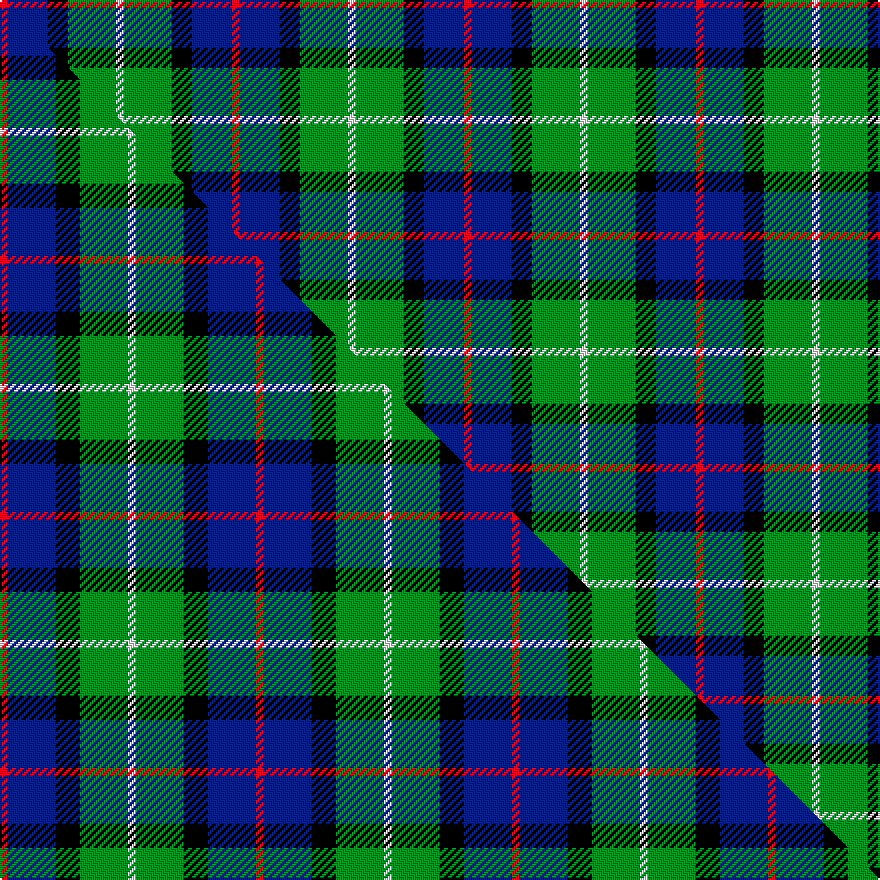

This page is one **sett** — a single exact thread-count. It belongs to the [tartan](/setts/r2db10k5g12w2/)
(the same proportion at any scale), whose colour order is pattern [RBKGW](/stripes/rbkgw/).

Part of the [Davidson of Tulloch](/tartans/davidson-of-tulloch/) tartan — the named design grouping this sett with its other cloths.

Sourced from register-of-tartans.  It is a [5 stripe tartan](/stripes/stripes5/).

Original link https://www.tartanregister.gov.uk/tartanDetails.aspx?ref=893

## Register references

External register numbers recorded for this tartan.

- Scottish Register of Tartans: [893](https://www.tartanregister.gov.uk/tartanDetails.aspx?ref=893)
- Scottish Tartans Authority (ITI): 1360
- Scottish Tartans World Register: 1360

## Thread count
R/4 DB20 K10 G24 W/4

One full sett is **116 threads**.

## Palette
<table><thead><tr><th>Colour</th><th>Shade</th><th>OKLCh</th></tr></thead><tbody><tr><td>DB</td><td><code style="background-color:#082077;">#082077</code> <small style="color:#888">#082077</small></td><td><small style="color:#888">oklch(30.0% 0.149 265.1)</small></td></tr><tr><td>G</td><td><code style="background-color:#008B2A;">#008B2A</code> <small style="color:#888">#008B2A</small></td><td><small style="color:#888">oklch(55.4% 0.170 145.9)</small></td></tr><tr><td>K</td><td><code style="background-color:#000000;">#000000</code> <small style="color:#888">#000000</small></td><td><small style="color:#888">oklch(0.0% 0.000 0.0)</small></td></tr><tr><td>R</td><td><code style="background-color:#D60020;">#D60020</code> <small style="color:#888">#D60020</small></td><td><small style="color:#888">oklch(55.2% 0.224 25.5)</small></td></tr><tr><td>W</td><td><code style="background-color:#F7F7F7;">#F7F7F7</code> <small style="color:#888">#F7F7F7</small></td><td><small style="color:#888">oklch(97.6% 0.000 89.9)</small></td></tr></tbody></table>

# Sample pattern

## Compared to the master

This cloth is one sett of its design; the master sett (the exemplar the design is anchored on) is below for comparison.

Its **ΔTartan distance** from the master is **0.21** — the same measure the nearest-tartans table ranks by (0 is identical; a re-scale of the same cloth is near 0, a recolour or a different proportion further).

<figure class="master-compare" style="margin:0">

this sett
master sett ★

<figcaption style="color:#888;font-size:smaller">One weave of this sett against the <a href="/setts/r1db6k3g6w1/">master sett ★</a>, split on the diagonal: a shared proportion runs seamlessly across it with only the shades shifting; a different proportion breaks on it.</figcaption>
</figure>

## Nearest tartan variants

The nearest existing variants by ΔTartan distance, with this cloth at the top so the swatches line up against it.

ΔTartan

Threads

Variant

Sett

—

116

<a href="/variants/s5/r2db10k5g12w2~x2/">Davidson of Tulloch</a>

<a href="/ttd/edit/#slug=r1db6k3g6w1~x4&amp;base=r2db10k5g12w2~x2" title="compare in the TTD">0.21</a>

128

<a href="/variants/s5/r1db6k3g6w1~x4/">Davidson of Tulloch #2</a>

<a href="/ttd/edit/#slug=r1db6k3g6w1&amp;base=r2db10k5g12w2~x2" title="compare in the TTD">0.21</a>

32

<a href="/variants/s5/r1db6k3g6w1/">Davidson of Tulloch</a>

<a href="/ttd/edit/#slug=r1db6k3g6w1~x2&amp;base=r2db10k5g12w2~x2" title="compare in the TTD">0.21</a>

64

<a href="/variants/s5/r1db6k3g6w1~x2/">Davidson of Tulloch</a>

<a href="/ttd/edit/#slug=r1db7k7g7w1~x6&amp;base=r2db10k5g12w2~x2" title="compare in the TTD">0.59</a>

264

<a href="/variants/s5/r1db7k7g7w1~x6/">Davidson of Tulloch (Clan)</a>

<a href="/ttd/edit/#slug=r3db22k11g32ly3~x2&amp;base=r2db10k5g12w2~x2" title="compare in the TTD">0.80</a>

272

<a href="/variants/s5/r3db22k11g32ly3~x2/">Cultoquhey (Corporate)</a>

<a href="/ttd/edit/#slug=r3db22k11g32y3~x2&amp;base=r2db10k5g12w2~x2" title="compare in the TTD">0.80</a>

272

<a href="/variants/s5/r3db22k11g32y3~x2/">Cultoquhey Hotel</a>

<a href="/ttd/edit/#slug=r2db12k7g8lb2~x4&amp;base=r2db10k5g12w2~x2" title="compare in the TTD">0.89</a>

232

<a href="/variants/s5/r2db12k7g8lb2~x4/">Forbo Nairn</a>

<a href="/ttd/edit/#slug=db18r3k9r3g23y3~x2&amp;base=r2db10k5g12w2~x2" title="compare in the TTD">1.48</a>

194

<a href="/variants/s6/db18r3k9r3g23y3~x2/">Royal College of Physicians (Corp)</a>

<a href="/ttd/edit/#slug=db1r1db6k6g6w1~x2&amp;base=r2db10k5g12w2~x2" title="compare in the TTD">1.50</a>

80

<a href="/variants/s6/db1r1db6k6g6w1~x2/">Wellington</a>

<a href="/ttd/edit/#slug=k4t2g13db13w2~x4&amp;base=r2db10k5g12w2~x2" title="compare in the TTD">1.50</a>

248

<a href="/variants/s5/k4t2g13db13w2~x4/">Bath</a>

## Neighbour map

Every grey dot is one of 13620 variants placed by the first two principal components of the ΔTartan feature space (42% of its variance). Red is this tartan; blue dots are its nearest — click one to open its page.

<svg viewBox="0 0 640 380" role="img" style="max-width:100%;height:auto;border:1px solid #e0e0e0;border-radius:4px;display:block" xmlns="http://www.w3.org/2000/svg"><image href="/nn/cloud.v1.png" width="640" height="380"/><a href="/variants/s5/r1db6k3g6w1~x4/"><circle cx="106.6" cy="227.1" r="4" fill="#3465a4"><title>Davidson of Tulloch #2</title></circle></a><a href="/variants/s5/r1db6k3g6w1/"><circle cx="106.6" cy="227.1" r="4" fill="#3465a4"><title>Davidson of Tulloch</title></circle></a><a href="/variants/s5/r1db6k3g6w1~x2/"><circle cx="106.6" cy="227.1" r="4" fill="#3465a4"><title>Davidson of Tulloch</title></circle></a><a href="/variants/s5/r1db7k7g7w1~x6/"><circle cx="91.3" cy="223.1" r="4" fill="#3465a4"><title>Davidson of Tulloch (Clan)</title></circle></a><a href="/variants/s5/r3db22k11g32ly3~x2/"><circle cx="183.9" cy="194.5" r="4" fill="#3465a4"><title>Cultoquhey (Corporate)</title></circle></a><a href="/variants/s5/r3db22k11g32y3~x2/"><circle cx="188.9" cy="195.5" r="4" fill="#3465a4"><title>Cultoquhey Hotel</title></circle></a><a href="/variants/s5/r2db12k7g8lb2~x4/"><circle cx="114.8" cy="230.9" r="4" fill="#3465a4"><title>Forbo Nairn</title></circle></a><a href="/variants/s6/db18r3k9r3g23y3~x2/"><circle cx="138.2" cy="196.1" r="4" fill="#3465a4"><title>Royal College of Physicians (Corp)</title></circle></a><a href="/variants/s6/db1r1db6k6g6w1~x2/"><circle cx="96.7" cy="213.2" r="4" fill="#3465a4"><title>Wellington</title></circle></a><a href="/variants/s5/k4t2g13db13w2~x4/"><circle cx="142.0" cy="220.6" r="4" fill="#3465a4"><title>Bath</title></circle></a><circle cx="116.5" cy="226.1" r="5" fill="#c00000"/><text x="320" y="376" text-anchor="middle" font-size="11" fill="#999">ground</text><text x="11" y="190" text-anchor="middle" font-size="11" fill="#999" transform="rotate(-90 11 190)">complexity</text></svg>

ID: /variants/s5/r2db10k5g12w2~x2/
