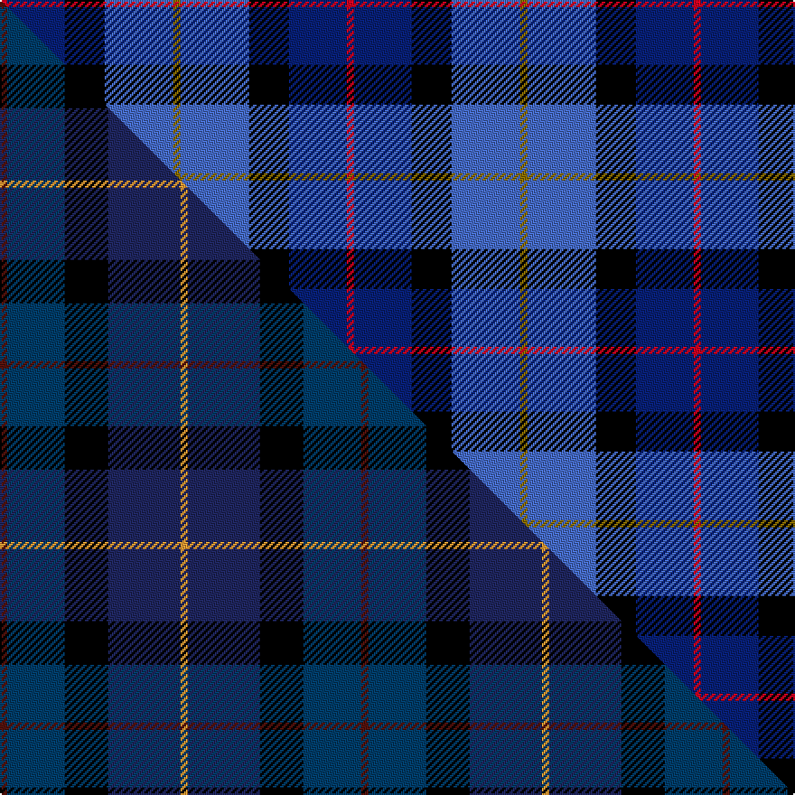

This page is one **sett** — a single exact thread-count. It belongs to the [tartan](/setts/r2db16k11b19y2/)
(the same proportion at any scale), whose colour order is pattern [GBKBR](/stripes/gbkbr/).

Part of the [Sanix](/tartans/sanix/) tartan — the named design grouping this sett with its other cloths.

Sourced from weddslist.  It is a [5 stripe tartan](/stripes/stripes5/).

Original link http://www.weddslist.com/cgi-bin/tartans/pg.pl?source=sts

## Thread count
R/4 DB32 K22 B38 Y/4

One full sett is **192 threads**.

## Palette
<table><thead><tr><th>Colour</th><th>Shade</th><th>OKLCh</th></tr></thead><tbody><tr><td>DB</td><td><code style="background-color:#082077;">#082077</code> <small style="color:#888">#082077</small></td><td><small style="color:#888">oklch(30.0% 0.149 265.1)</small></td></tr><tr><td>B</td><td><code style="background-color:#466CC8;">#466CC8</code> <small style="color:#888">#466CC8</small></td><td><small style="color:#888">oklch(55.1% 0.149 265.0)</small></td></tr><tr><td>K</td><td><code style="background-color:#000000;">#000000</code> <small style="color:#888">#000000</small></td><td><small style="color:#888">oklch(0.0% 0.000 0.0)</small></td></tr><tr><td>R</td><td><code style="background-color:#D60020;">#D60020</code> <small style="color:#888">#D60020</small></td><td><small style="color:#888">oklch(55.2% 0.224 25.5)</small></td></tr><tr><td>Y</td><td><code style="background-color:#8B6E00;">#8B6E00</code> <small style="color:#888">#8B6E00</small></td><td><small style="color:#888">oklch(55.1% 0.113 90.4)</small></td></tr></tbody></table>

# Sample pattern

## Compared to the master

This cloth is one sett of its design; the master sett (the exemplar the design is anchored on) is below for comparison.

Its **ΔTartan distance** from the master is **1.92** — the same measure the nearest-tartans table ranks by (0 is identical; a re-scale of the same cloth is near 0, a recolour or a different proportion further).

<figure class="master-compare" style="margin:0">

this sett
master sett ★

<figcaption style="color:#888;font-size:smaller">One weave of this sett against the <a href="/setts/dr1dbi8k6db10lo1/">master sett ★</a>, split on the diagonal: a shared proportion runs seamlessly across it with only the shades shifting; a different proportion breaks on it.</figcaption>
</figure>

## Nearest variants

The nearest existing variants by ΔTartan distance, with this cloth at the top so the swatches line up against it.

ΔTartan

Threads

Variant

Sett

—

192

<a href="/variants/s5/r2db16k11b19y2~x2/">Sanix Modern</a>

0.69

—

<a href="/variants/s5/r6db35k36dbi36w6~db0805267-dbi1604274/">Davidson of Tulloch</a>

1.30

—

<a href="/variants/s6/w2dbi15n2db20r9w2~x2~dbi1604274-db0805267/">The Open Championship</a>

<a href="/ttd/edit/#slug=k7lb3dy30db30w3~x2&amp;base=r2db16k11b19y2~x2" title="compare in the TTD">1.57</a>

272

<a href="/variants/s5/k7lb3dy30db30w3~x2/">Douglas, (Brown)</a>

1.90

—

<a href="/variants/s6/ly5db24k8dbi18ly6dy3~ly3307090-db1204274-dbi1406275-dy1603076/">Cala Homes (Corporate)</a>

1.90

—

<a href="/variants/s6/y5db24k8dbi18y6o3~db0805267-dbi1604274/">CALA Homes</a>

<a href="/ttd/edit/#slug=r2db12k7g8lb2~x4&amp;base=r2db16k11b19y2~x2" title="compare in the TTD">2.04</a>

232

<a href="/variants/s5/r2db12k7g8lb2~x4/">Forbo Nairn</a>

<a href="/ttd/edit/#slug=lb11dbi19db38r7k7~x2~dbi1208266-db1003265&amp;base=r2db16k11b19y2~x2" title="compare in the TTD">2.16</a>

292

<a href="/variants/s5/lb11dbi19db38r7k7~x2~dbi1208266-db1003265/">Rose, Danny and Hanna (Personal)</a>

<a href="/ttd/edit/#slug=t12db35lb4w3k11dr5~x2&amp;base=r2db16k11b19y2~x2" title="compare in the TTD">2.36</a>

246

<a href="/variants/s6/t12db35lb4w3k11dr5~x2/">Ferster, James Carney (Personal)</a>

<a href="/ttd/edit/#slug=b4dg25k24w3db24w4~x2&amp;base=r2db16k11b19y2~x2" title="compare in the TTD">2.49</a>

320

<a href="/variants/s6/b4dg25k24w3db24w4~x2/">Herd</a>

<a href="/ttd/edit/#slug=k7lt3dg18db18w2~x2&amp;base=r2db16k11b19y2~x2" title="compare in the TTD">2.54</a>

174

<a href="/variants/s5/k7lt3dg18db18w2~x2/">Bhatti</a>

## Neighbour map

Every grey dot is one of 13620 variants placed by the first two principal components of the ΔTartan feature space (42% of its variance). Red is this tartan; blue dots are its nearest — click one to open its page.

<svg viewBox="0 0 640 380" role="img" style="max-width:100%;height:auto;border:1px solid #e0e0e0;border-radius:4px;display:block" xmlns="http://www.w3.org/2000/svg"><image href="/nn/cloud.v1.png" width="640" height="380"/><a href="/variants/s5/r6db35k36dbi36w6~db0805267-dbi1604274/"><circle cx="105.1" cy="234.9" r="4" fill="#3465a4"><title>Davidson of Tulloch</title></circle></a><a href="/variants/s6/w2dbi15n2db20r9w2~x2~dbi1604274-db0805267/"><circle cx="193.0" cy="196.7" r="4" fill="#3465a4"><title>The Open Championship</title></circle></a><a href="/variants/s5/k7lb3dy30db30w3~x2/"><circle cx="227.5" cy="202.6" r="4" fill="#3465a4"><title>Douglas, (Brown)</title></circle></a><a href="/variants/s6/ly5db24k8dbi18ly6dy3~ly3307090-db1204274-dbi1406275-dy1603076/"><circle cx="138.0" cy="206.2" r="4" fill="#3465a4"><title>Cala Homes (Corporate)</title></circle></a><a href="/variants/s6/y5db24k8dbi18y6o3~db0805267-dbi1604274/"><circle cx="166.5" cy="215.7" r="4" fill="#3465a4"><title>CALA Homes</title></circle></a><a href="/variants/s5/r2db12k7g8lb2~x4/"><circle cx="114.8" cy="230.9" r="4" fill="#3465a4"><title>Forbo Nairn</title></circle></a><a href="/variants/s5/lb11dbi19db38r7k7~x2~dbi1208266-db1003265/"><circle cx="169.1" cy="223.0" r="4" fill="#3465a4"><title>Rose, Danny and Hanna (Personal)</title></circle></a><a href="/variants/s6/t12db35lb4w3k11dr5~x2/"><circle cx="196.9" cy="156.8" r="4" fill="#3465a4"><title>Ferster, James Carney (Personal)</title></circle></a><a href="/variants/s6/b4dg25k24w3db24w4~x2/"><circle cx="102.3" cy="201.5" r="4" fill="#3465a4"><title>Herd</title></circle></a><a href="/variants/s5/k7lt3dg18db18w2~x2/"><circle cx="172.9" cy="217.4" r="4" fill="#3465a4"><title>Bhatti</title></circle></a><circle cx="162.9" cy="209.9" r="5" fill="#c00000"/><text x="320" y="376" text-anchor="middle" font-size="11" fill="#999">ground</text><text x="11" y="190" text-anchor="middle" font-size="11" fill="#999" transform="rotate(-90 11 190)">complexity</text></svg>

ID: /variants/s5/r2db16k11b19y2~x2/
