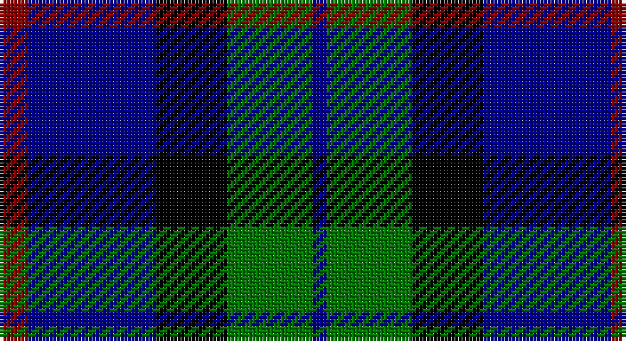

This page is one **sett** — a single exact thread-count. It belongs to the [tartan](/setts/r2db9k5g6db1/)
(the same proportion at any scale), whose colour order is pattern [BGKBR](/stripes/bgkbr/).

Sourced from register-of-tartans.  It is a [5 stripe tartan](/stripes/stripes5/).

Original link https://www.tartanregister.gov.uk/tartanDetails.aspx?ref=1283

## Register references

External register numbers recorded for this tartan.

- Scottish Register of Tartans: [1283](https://www.tartanregister.gov.uk/tartanDetails.aspx?ref=1283)
- Scottish Tartans Authority (ITI): 4940

## Thread count
DR/8 DB36 K20 G24 DB/4

One full sett is **172 threads**.

## Palette

Palette: <strong>Tartan Register</strong> <small style="color:#888">(3 of 4 colours)</small>
<table><thead><tr><th>Colour</th><th>Threads</th><th>Shade</th><th>Base</th><th>OKLCh</th></tr></thead><tbody><tr><td>DR/</td><td style="text-align:right;font-variant-numeric:tabular-nums">8</td><td><code style="background-color:#8C0000;">#8C0000</code> <small style="color:#888">#8C0000</small></td><td>R <code style="background-color:#CC0000;">#CC0000</code></td><td><small style="color:#888">oklch(40.2% 0.165 29.2)</small></td></tr><tr><td>DB</td><td style="text-align:right;font-variant-numeric:tabular-nums">36</td><td><code style="background-color:#00008C;">#00008C</code> <small style="color:#888">#00008C</small></td><td>B <code style="background-color:#2A418A;">#2A418A</code></td><td><small style="color:#888">oklch(28.9% 0.200 264.1)</small></td></tr><tr><td>K</td><td style="text-align:right;font-variant-numeric:tabular-nums">20</td><td><code style="background-color:#000000;">#000000</code> <small style="color:#888">#000000</small></td><td>K <code style="background-color:#000000;">#000000</code></td><td><small style="color:#888">oklch(0.0% 0.000 0.0)</small></td></tr><tr><td>G</td><td style="text-align:right;font-variant-numeric:tabular-nums">24</td><td><code style="background-color:#007800;">#007800</code> <small style="color:#888">#007800</small></td><td>G <code style="background-color:#006100;">#006100</code></td><td><small style="color:#888">oklch(49.6% 0.169 142.5)</small></td></tr><tr><td>DB/</td><td style="text-align:right;font-variant-numeric:tabular-nums">4</td><td><code style="background-color:#00008C;">#00008C</code> <small style="color:#888">#00008C</small></td><td>B <code style="background-color:#2A418A;">#2A418A</code></td><td><small style="color:#888">oklch(28.9% 0.200 264.1)</small></td></tr></tbody></table>

# Sample pattern

## Nearest tartans

The nearest existing variants by ΔTartan distance, with this tartan at the top so the swatches line up against it.

ΔTartan

Tartan

Sett

—

<a href="/ttd/edit/#slug=r2db9k5g6db1~x4">Frobo Nairn</a> <a class="nn-out" href="/variants/s5/r2db9k5g6db1~x4/" title="open its dictionary page">↗</a>

0.93

<a href="/ttd/edit/#slug=g1k9t4db9t1~x6&amp;base=r2db9k5g6db1~x4">Wallace Blue Dress Tartan</a> <a class="nn-out" href="/variants/s5/g1k9t4db9t1~x6/" title="open its dictionary page">↗</a>

1.00

<a href="/ttd/edit/#slug=k4lb2dg8db8lb1&amp;base=r2db9k5g6db1~x4">Douglas Green</a> <a class="nn-out" href="/variants/s5/k4lb2dg8db8lb1/" title="open its dictionary page">↗</a>

1.01

<a href="/ttd/edit/#slug=k2lb2dg8db8lb1&amp;base=r2db9k5g6db1~x4">Douglas</a> <a class="nn-out" href="/variants/s5/k2lb2dg8db8lb1/" title="open its dictionary page">↗</a>

1.14

<a href="/ttd/edit/#slug=n6db3n6db20k20db8w4~x2&amp;base=r2db9k5g6db1~x4">Allianz Deutschland 2012</a> <a class="nn-out" href="/variants/s7/n6db3n6db20k20db8w4~x2/" title="open its dictionary page">↗</a>

1.14

<a href="/ttd/edit/#slug=k5lb2dg18k17dp16k3&amp;base=r2db9k5g6db1~x4">Melville</a> <a class="nn-out" href="/variants/s6/k5lb2dg18k17dp16k3/" title="open its dictionary page">↗</a>

1.19

<a href="/ttd/edit/#slug=b10k10b10dg26ly5~x2&amp;base=r2db9k5g6db1~x4">Marshall of Keith (Personal)</a> <a class="nn-out" href="/variants/s5/b10k10b10dg26ly5~x2/" title="open its dictionary page">↗</a>

1.21

<a href="/ttd/edit/#slug=k7lt3dg18db18w2~x2&amp;base=r2db9k5g6db1~x4">Bhatti</a> <a class="nn-out" href="/variants/s5/k7lt3dg18db18w2~x2/" title="open its dictionary page">↗</a>

1.23

<a href="/ttd/edit/#slug=db6k1db6k8r1g8k2~x2&amp;base=r2db9k5g6db1~x4">Fletcher</a> <a class="nn-out" href="/variants/s7/db6k1db6k8r1g8k2~x2/" title="open its dictionary page">↗</a>

1.26

<a href="/ttd/edit/#slug=db4k2db16k10g18k3~x2&amp;base=r2db9k5g6db1~x4">Wartley Htg (Fashion)</a> <a class="nn-out" href="/variants/s6/db4k2db16k10g18k3~x2/" title="open its dictionary page">↗</a>

1.28

<a href="/ttd/edit/#slug=db6k1db6k8r1dg8r2&amp;base=r2db9k5g6db1~x4">Fletcher C</a> <a class="nn-out" href="/variants/s7/db6k1db6k8r1dg8r2/" title="open its dictionary page">↗</a>

## Neighbour map

Every grey dot is one of 14360 variants placed by the first two principal components of the ΔTartan feature space (44% of its variance). Red is this tartan; blue dots are its nearest — click one to open its page.

<svg viewBox="0 0 640 380" role="img" style="max-width:100%;height:auto;border:1px solid #e0e0e0;border-radius:4px;display:block" xmlns="http://www.w3.org/2000/svg"><image href="/nn/cloud.v1.png" width="640" height="380"/><a href="/variants/s5/g1k9t4db9t1~x6/"><circle cx="183.9" cy="234.3" r="4" fill="#3465a4"><title>Wallace Blue Dress Tartan</title></circle></a><a href="/variants/s5/k4lb2dg8db8lb1/"><circle cx="135.9" cy="244.6" r="4" fill="#3465a4"><title>Douglas Green</title></circle></a><a href="/variants/s5/k2lb2dg8db8lb1/"><circle cx="168.0" cy="234.7" r="4" fill="#3465a4"><title>Douglas</title></circle></a><a href="/variants/s7/n6db3n6db20k20db8w4~x2/"><circle cx="199.7" cy="237.6" r="4" fill="#3465a4"><title>Allianz Deutschland 2012</title></circle></a><a href="/variants/s6/k5lb2dg18k17dp16k3/"><circle cx="187.4" cy="232.9" r="4" fill="#3465a4"><title>Melville</title></circle></a><a href="/variants/s5/b10k10b10dg26ly5~x2/"><circle cx="157.6" cy="265.5" r="4" fill="#3465a4"><title>Marshall of Keith (Personal)</title></circle></a><a href="/variants/s5/k7lt3dg18db18w2~x2/"><circle cx="165.2" cy="226.3" r="4" fill="#3465a4"><title>Bhatti</title></circle></a><a href="/variants/s7/db6k1db6k8r1g8k2~x2/"><circle cx="158.2" cy="233.5" r="4" fill="#3465a4"><title>Fletcher</title></circle></a><a href="/variants/s6/db4k2db16k10g18k3~x2/"><circle cx="195.1" cy="249.5" r="4" fill="#3465a4"><title>Wartley Htg (Fashion)</title></circle></a><a href="/variants/s7/db6k1db6k8r1dg8r2/"><circle cx="168.3" cy="244.5" r="4" fill="#3465a4"><title>Fletcher C</title></circle></a><circle cx="186.4" cy="248.9" r="5" fill="#c00000"/></svg>

ID: /variants/s5/r2db9k5g6db1~x4/
