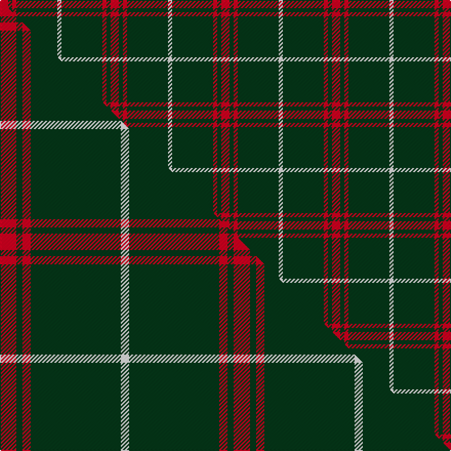

This page is one **sett** — a single exact thread-count. It belongs to the [tartan](/setts/r2dg1r1dg10w1/)
(the same proportion at any scale), whose colour order is pattern [RGRGW](/stripes/rgrgw/).

Part of the [Welsh National](/tartans/welsh-national/) tartan — the named design grouping this sett with its other cloths.

Sourced from house-of-tartan.  It is a [5 stripe tartan](/stripes/stripes5/).

Original link http://www.house-of-tartan.scotland.net/house/TartanViewjs.asp?colr=Def&tnam=1523

## Provenance

Earliest known date: 1968 The Welsh Tartan owes its origin to a Society formed in Cardiff in 1967. Its aims were cultural and political - to strengthen Celtic ties and give visible signs of being an individual nation in culture, language and dress. The colours are those of the Welsh flag. It is said that the design was based on the Lord of the Isles tartan because the present Lord is also Prince of Wales. However comparison reveals similarity only to MacDonald, MacDonald of the Isles, or perhaps Applecross district.

## Thread count
R/8 DG4 R4 DG40 W/4

One full sett is **108 threads**.

## Palette
<table><thead><tr><th>Colour</th><th>Shade</th><th>OKLCh</th></tr></thead><tbody><tr><td>DG</td><td><code style="background-color:#053819;">#053819</code> <small style="color:#888">#053819</small></td><td><small style="color:#888">oklch(30.0% 0.075 151.3)</small></td></tr><tr><td>W</td><td><code style="background-color:#F7F7F7;">#F7F7F7</code> <small style="color:#888">#F7F7F7</small></td><td><small style="color:#888">oklch(97.6% 0.000 89.9)</small></td></tr><tr><td>R</td><td><code style="background-color:#D60020;">#D60020</code> <small style="color:#888">#D60020</small></td><td><small style="color:#888">oklch(55.2% 0.224 25.5)</small></td></tr></tbody></table>

# Sample pattern

## Compared to the master

This cloth is one sett of its design; the master sett (the exemplar the design is anchored on) is below for comparison.

Its **ΔTartan distance** from the master is **0.63** — the same measure the nearest-tartans table ranks by (0 is identical; a re-scale of the same cloth is near 0, a recolour or a different proportion further).

<figure class="master-compare" style="margin:0">

this sett
master sett ★

<figcaption style="color:#888;font-size:smaller">One weave of this sett against the <a href="/setts/r8dg3r4dg44w4/">master sett ★</a>, split on the diagonal: a shared proportion runs seamlessly across it with only the shades shifting; a different proportion breaks on it.</figcaption>
</figure>

## Nearest tartan variants

The nearest existing variants by ΔTartan distance, with this cloth at the top so the swatches line up against it.

ΔTartan

Threads

Variant

Sett

—

108

<a href="/variants/s5/r2dg1r1dg10w1~x4/">Welsh National District Tartan</a>

<a href="/ttd/edit/#slug=r2g1r1g11w1~x8&amp;base=r2dg1r1dg10w1~x4" title="compare in the TTD">0.13</a>

232

<a href="/variants/s5/r2g1r1g11w1~x8/">Welsh, National</a>

<a href="/ttd/edit/#slug=dg32r12dg6r6k2w3~x2&amp;base=r2dg1r1dg10w1~x4" title="compare in the TTD">1.03</a>

174

<a href="/variants/s6/dg32r12dg6r6k2w3~x2/">Princess Margaret Rose</a>

<a href="/ttd/edit/#slug=r2g2r1g12r3k1~x4&amp;base=r2dg1r1dg10w1~x4" title="compare in the TTD">1.43</a>

156

<a href="/variants/s6/r2g2r1g12r3k1~x4/">Connell (Personal?)</a>

<a href="/ttd/edit/#slug=dr13w3dr1dg3w1~x6&amp;base=r2dg1r1dg10w1~x4" title="compare in the TTD">1.96</a>

168

<a href="/variants/s5/dr13w3dr1dg3w1~x6/">Glen Shiel (Fashion)</a>

<a href="/ttd/edit/#slug=r8dg12lr5k11dg42k3~x2&amp;base=r2dg1r1dg10w1~x4" title="compare in the TTD">1.97</a>

302

<a href="/variants/s6/r8dg12lr5k11dg42k3~x2/">Sir Billi (Corporate)</a>

<a href="/ttd/edit/#slug=dr8g2dr2k1dr1g2~x10&amp;base=r2dg1r1dg10w1~x4" title="compare in the TTD">1.98</a>

220

<a href="/variants/s6/dr8g2dr2k1dr1g2~x10/">Waverley Care Aids Trust (Corporate)</a>

<a href="/ttd/edit/#slug=dr27w3dr6w2g3~x4&amp;base=r2dg1r1dg10w1~x4" title="compare in the TTD">1.99</a>

208

<a href="/variants/s5/dr27w3dr6w2g3~x4/">Martin Family, Robert N (Personal)</a>

<a href="/ttd/edit/#slug=dg37o9dg3r9o3~x2&amp;base=r2dg1r1dg10w1~x4" title="compare in the TTD">2.35</a>

164

<a href="/variants/s5/dg37o9dg3r9o3~x2/">Glen Trool</a>

<a href="/ttd/edit/#slug=dp4g10w1r1~x2&amp;base=r2dg1r1dg10w1~x4" title="compare in the TTD">2.54</a>

54

<a href="/variants/s4/dp4g10w1r1~x2/">Wilson's, No 189</a>

<a href="/ttd/edit/#slug=dg20w5r3~x2&amp;base=r2dg1r1dg10w1~x4" title="compare in the TTD">2.67</a>

66

<a href="/variants/s3/dg20w5r3~x2/">Juchter (Personal)</a>

## Neighbour map

Every grey dot is one of 13620 variants placed by the first two principal components of the ΔTartan feature space (42% of its variance). Red is this tartan; blue dots are its nearest — click one to open its page.

<svg viewBox="0 0 640 380" role="img" style="max-width:100%;height:auto;border:1px solid #e0e0e0;border-radius:4px;display:block" xmlns="http://www.w3.org/2000/svg"><image href="/nn/cloud.v1.png" width="640" height="380"/><a href="/variants/s5/r2g1r1g11w1~x8/"><circle cx="492.2" cy="211.4" r="4" fill="#3465a4"><title>Welsh, National</title></circle></a><a href="/variants/s6/dg32r12dg6r6k2w3~x2/"><circle cx="341.4" cy="158.4" r="4" fill="#3465a4"><title>Princess Margaret Rose</title></circle></a><a href="/variants/s6/r2g2r1g12r3k1~x4/"><circle cx="396.4" cy="186.5" r="4" fill="#3465a4"><title>Connell (Personal?)</title></circle></a><a href="/variants/s5/dr13w3dr1dg3w1~x6/"><circle cx="411.7" cy="205.4" r="4" fill="#3465a4"><title>Glen Shiel (Fashion)</title></circle></a><a href="/variants/s6/r8dg12lr5k11dg42k3~x2/"><circle cx="356.1" cy="170.1" r="4" fill="#3465a4"><title>Sir Billi (Corporate)</title></circle></a><a href="/variants/s6/dr8g2dr2k1dr1g2~x10/"><circle cx="414.5" cy="218.3" r="4" fill="#3465a4"><title>Waverley Care Aids Trust (Corporate)</title></circle></a><a href="/variants/s5/dr27w3dr6w2g3~x4/"><circle cx="528.9" cy="197.0" r="4" fill="#3465a4"><title>Martin Family, Robert N (Personal)</title></circle></a><a href="/variants/s5/dg37o9dg3r9o3~x2/"><circle cx="445.3" cy="219.5" r="4" fill="#3465a4"><title>Glen Trool</title></circle></a><a href="/variants/s4/dp4g10w1r1~x2/"><circle cx="351.6" cy="225.2" r="4" fill="#3465a4"><title>Wilson's, No 189</title></circle></a><a href="/variants/s3/dg20w5r3~x2/"><circle cx="387.3" cy="258.5" r="4" fill="#3465a4"><title>Juchter (Personal)</title></circle></a><circle cx="448.6" cy="201.0" r="5" fill="#c00000"/><text x="320" y="376" text-anchor="middle" font-size="11" fill="#999">ground</text><text x="11" y="190" text-anchor="middle" font-size="11" fill="#999" transform="rotate(-90 11 190)">complexity</text></svg>

ID: /variants/s5/r2dg1r1dg10w1~x4/
