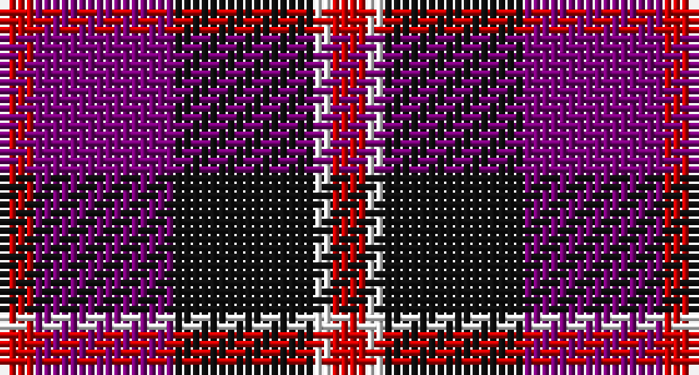

This page is one **sett** — a single exact thread-count. It belongs to the [tartan](/setts/r2dp8k8w1r2/)
(the same proportion at any scale), whose colour order is pattern [RBKWR](/stripes/rbkwr/).

Sourced from tartans-authority.  It is a [5 stripe tartan](/stripes/stripes5/).

Original link http://www.tartansauthority.com/tartan-ferret/display/6733/

2 attestations — the source records this cloth was collapsed from (oldest owns this page)

<ul>
<li>pre 2005 — Inder (Corporate) (tartans-authority, <a href="http://www.tartansauthority.com/tartan-ferret/display/6733/">record</a>)</li>
<li>undated — Inder (register-of-tartans, <a href="https://www.tartanregister.gov.uk/tartanDetails.aspx?ref=5411">record</a>)</li>
</ul>

## Register references

External register numbers recorded for this tartan.

- Scottish Register of Tartans: [5411](https://www.tartanregister.gov.uk/tartanDetails.aspx?ref=5411)
- Scottish Tartans Authority (ITI): 6733
- Scottish Tartans World Register: 3062

## Thread count
R/4 P16 K16 W2 R/4

One full sett is **76 threads**.

## Palette

Palette: <strong>Tartan Register</strong>
<table><thead><tr><th>Colour</th><th>Threads</th><th>Shade</th><th>Base</th><th>OKLCh</th></tr></thead><tbody><tr><td>R/</td><td style="text-align:right;font-variant-numeric:tabular-nums">4</td><td><code style="background-color:#C80000;">#C80000</code> <small style="color:#888">#C80000</small></td><td>R <code style="background-color:#CC0000;">#CC0000</code></td><td><small style="color:#888">oklch(52.3% 0.215 29.2)</small></td></tr><tr><td>P</td><td style="text-align:right;font-variant-numeric:tabular-nums">16</td><td><code style="background-color:#780078;">#780078</code> <small style="color:#888">#780078</small></td><td>B <code style="background-color:#2A418A;">#2A418A</code></td><td><small style="color:#888">oklch(40.2% 0.185 328.4)</small></td></tr><tr><td>K</td><td style="text-align:right;font-variant-numeric:tabular-nums">16</td><td><code style="background-color:#101010;">#101010</code> <small style="color:#888">#101010</small></td><td>K <code style="background-color:#000000;">#000000</code></td><td><small style="color:#888">oklch(17.3% 0.000 89.9)</small></td></tr><tr><td>W</td><td style="text-align:right;font-variant-numeric:tabular-nums">2</td><td><code style="background-color:#F8F8F8;">#F8F8F8</code> <small style="color:#888">#F8F8F8</small></td><td>W <code style="background-color:#F7F7F7;">#F7F7F7</code></td><td><small style="color:#888">oklch(97.9% 0.000 89.9)</small></td></tr><tr><td>R/</td><td style="text-align:right;font-variant-numeric:tabular-nums">4</td><td><code style="background-color:#C80000;">#C80000</code> <small style="color:#888">#C80000</small></td><td>R <code style="background-color:#CC0000;">#CC0000</code></td><td><small style="color:#888">oklch(52.3% 0.215 29.2)</small></td></tr></tbody></table>

# Sample pattern

## Nearest tartans

The nearest existing variants by ΔTartan distance, with this tartan at the top so the swatches line up against it.

ΔTartan

Tartan

Sett

—

<a href="/ttd/edit/#slug=r2dp8k8w1r2~x2">Inder (Corporate)</a> <a class="nn-out" href="/variants/s5/r2dp8k8w1r2~x2/" title="open its dictionary page">↗</a>

0.91

<a href="/ttd/edit/#slug=k60w8lo15dp74k14&amp;base=r2dp8k8w1r2~x2">Gingles (Personal)</a> <a class="nn-out" href="/variants/s5/k60w8lo15dp74k14/" title="open its dictionary page">↗</a>

1.04

<a href="/ttd/edit/#slug=db13k13db13r29ly4~x2&amp;base=r2dp8k8w1r2~x2">Highland Pub Company</a> <a class="nn-out" href="/variants/s5/db13k13db13r29ly4~x2/" title="open its dictionary page">↗</a>

1.09

<a href="/ttd/edit/#slug=r26t3r4k16db16k4~x2&amp;base=r2dp8k8w1r2~x2">Graham of Menteith, (Red)</a> <a class="nn-out" href="/variants/s6/r26t3r4k16db16k4~x2/" title="open its dictionary page">↗</a>

1.10

<a href="/ttd/edit/#slug=r9k4r9k25ly3dp18k4~x2&amp;base=r2dp8k8w1r2~x2">Wounded Warriors Canada</a> <a class="nn-out" href="/variants/s7/r9k4r9k25ly3dp18k4~x2/" title="open its dictionary page">↗</a>

1.11

<a href="/ttd/edit/#slug=b2r12db2b6k6b1~x2&amp;base=r2dp8k8w1r2~x2">MacTavish</a> <a class="nn-out" href="/variants/s6/b2r12db2b6k6b1~x2/" title="open its dictionary page">↗</a>

1.11

<a href="/ttd/edit/#slug=b2r12db2b6k6b1&amp;base=r2dp8k8w1r2~x2">MacTavish</a> <a class="nn-out" href="/variants/s6/b2r12db2b6k6b1/" title="open its dictionary page">↗</a>

1.12

<a href="/ttd/edit/#slug=r36lb3r5k21db24k3~x2&amp;base=r2dp8k8w1r2~x2">Graham of Menteith (Red)</a> <a class="nn-out" href="/variants/s6/r36lb3r5k21db24k3~x2/" title="open its dictionary page">↗</a>

1.29

<a href="/ttd/edit/#slug=ly4r27k12db15ly4~x2&amp;base=r2dp8k8w1r2~x2">Aberdeen University (1992)</a> <a class="nn-out" href="/variants/s5/ly4r27k12db15ly4~x2/" title="open its dictionary page">↗</a>

1.29

<a href="/variants/s6/dg3k20ki20r20k3r3~x2/">Unidentified #65</a>

1.34

<a href="/ttd/edit/#slug=ly3db22k3db3k11r20ly3~x2&amp;base=r2dp8k8w1r2~x2">Biffy Clyro</a> <a class="nn-out" href="/variants/s7/ly3db22k3db3k11r20ly3~x2/" title="open its dictionary page">↗</a>

## Neighbour map

Every grey dot is one of 14360 variants placed by the first two principal components of the ΔTartan feature space (44% of its variance). Red is this tartan; blue dots are its nearest — click one to open its page.

<svg viewBox="0 0 640 380" role="img" style="max-width:100%;height:auto;border:1px solid #e0e0e0;border-radius:4px;display:block" xmlns="http://www.w3.org/2000/svg"><image href="/nn/cloud.v1.png" width="640" height="380"/><a href="/variants/s5/k60w8lo15dp74k14/"><circle cx="247.5" cy="218.8" r="4" fill="#3465a4"><title>Gingles (Personal)</title></circle></a><a href="/variants/s5/db13k13db13r29ly4~x2/"><circle cx="184.1" cy="249.7" r="4" fill="#3465a4"><title>Highland Pub Company</title></circle></a><a href="/variants/s6/r26t3r4k16db16k4~x2/"><circle cx="205.3" cy="208.7" r="4" fill="#3465a4"><title>Graham of Menteith, (Red)</title></circle></a><a href="/variants/s7/r9k4r9k25ly3dp18k4~x2/"><circle cx="229.3" cy="211.0" r="4" fill="#3465a4"><title>Wounded Warriors Canada</title></circle></a><a href="/variants/s6/b2r12db2b6k6b1~x2/"><circle cx="209.9" cy="196.7" r="4" fill="#3465a4"><title>MacTavish</title></circle></a><a href="/variants/s6/b2r12db2b6k6b1/"><circle cx="209.9" cy="196.7" r="4" fill="#3465a4"><title>MacTavish</title></circle></a><a href="/variants/s6/r36lb3r5k21db24k3~x2/"><circle cx="248.5" cy="195.7" r="4" fill="#3465a4"><title>Graham of Menteith (Red)</title></circle></a><a href="/variants/s5/ly4r27k12db15ly4~x2/"><circle cx="187.3" cy="223.5" r="4" fill="#3465a4"><title>Aberdeen University (1992)</title></circle></a><a href="/variants/s6/dg3k20ki20r20k3r3~x2/"><circle cx="164.7" cy="227.9" r="4" fill="#3465a4"><title>Unidentified #65</title></circle></a><a href="/variants/s7/ly3db22k3db3k11r20ly3~x2/"><circle cx="163.4" cy="192.5" r="4" fill="#3465a4"><title>Biffy Clyro</title></circle></a><circle cx="203.1" cy="223.2" r="5" fill="#c00000"/></svg>

ID: /variants/s5/r2dp8k8w1r2~x2/
