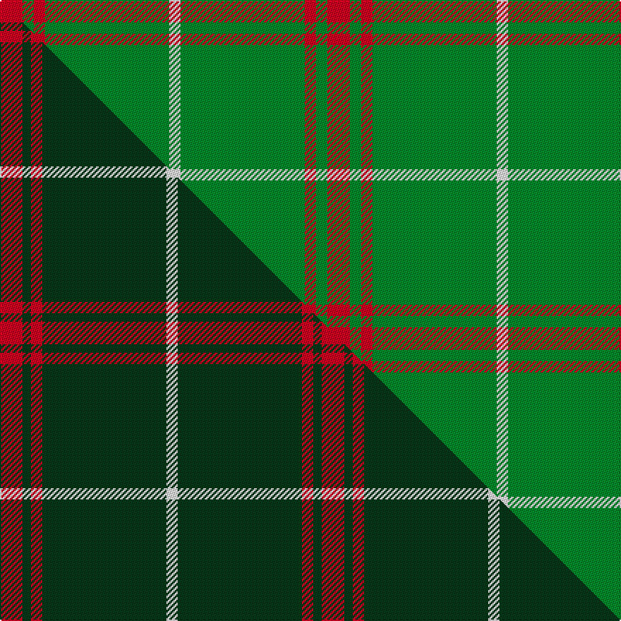

This page is one **sett** — a single exact thread-count. It belongs to the [tartan](/setts/r2g1r1g11w1/)
(the same proportion at any scale), whose colour order is pattern [RGRGW](/stripes/rgrgw/).

Part of the [Welsh National](/tartans/welsh-national/) tartan — the named design grouping this sett with its other cloths.

Sourced from weddslist.  It is a [5 stripe tartan](/stripes/stripes5/).

Original link http://www.weddslist.com/cgi-bin/tartans/pg.pl?source=sts

## Thread count
R/16 G8 R8 G88 W/8

One full sett is **232 threads**.

## Palette
<table><thead><tr><th>Colour</th><th>Shade</th><th>OKLCh</th></tr></thead><tbody><tr><td>G</td><td><code style="background-color:#008B2A;">#008B2A</code> <small style="color:#888">#008B2A</small></td><td><small style="color:#888">oklch(55.4% 0.170 145.9)</small></td></tr><tr><td>W</td><td><code style="background-color:#F7F7F7;">#F7F7F7</code> <small style="color:#888">#F7F7F7</small></td><td><small style="color:#888">oklch(97.6% 0.000 89.9)</small></td></tr><tr><td>R</td><td><code style="background-color:#D60020;">#D60020</code> <small style="color:#888">#D60020</small></td><td><small style="color:#888">oklch(55.2% 0.224 25.5)</small></td></tr></tbody></table>

# Sample pattern

## Compared to the master

This cloth is one sett of its design; the master sett (the exemplar the design is anchored on) is below for comparison.

Its **ΔTartan distance** from the master is **0.46** — the same measure the nearest-tartans table ranks by (0 is identical; a re-scale of the same cloth is near 0, a recolour or a different proportion further).

<figure class="master-compare" style="margin:0">

this sett
master sett ★

<figcaption style="color:#888;font-size:smaller">One weave of this sett against the <a href="/setts/r8dg3r4dg44w4/">master sett ★</a>, split on the diagonal: a shared proportion runs seamlessly across it with only the shades shifting; a different proportion breaks on it.</figcaption>
</figure>

## Nearest tartan variants

The nearest existing variants by ΔTartan distance, with this cloth at the top so the swatches line up against it.

ΔTartan

Threads

Variant

Sett

—

232

<a href="/variants/s5/r2g1r1g11w1~x8/">Welsh, National</a>

<a href="/ttd/edit/#slug=r2dg1r1dg10w1~x4&amp;base=r2g1r1g11w1~x8" title="compare in the TTD">0.32</a>

108

<a href="/variants/s5/r2dg1r1dg10w1~x4/">Welsh National District Tartan</a>

<a href="/ttd/edit/#slug=r8dg3r4dg44w4~x2&amp;base=r2g1r1g11w1~x8" title="compare in the TTD">0.46</a>

228

<a href="/variants/s5/r8dg3r4dg44w4~x2/">Welsh National</a>

<a href="/ttd/edit/#slug=g32r12g6r6k2w3~x2&amp;base=r2g1r1g11w1~x8" title="compare in the TTD">1.08</a>

174

<a href="/variants/s6/g32r12g6r6k2w3~x2/">Princess Margaret Rose (Royal)</a>

<a href="/ttd/edit/#slug=g16r1g2r11~x8&amp;base=r2g1r1g11w1~x8" title="compare in the TTD">1.23</a>

264

<a href="/variants/s4/g16r1g2r11~x8/">Middleton</a>

<a href="/ttd/edit/#slug=g75r2g4r40~x2&amp;base=r2g1r1g11w1~x8" title="compare in the TTD">1.26</a>

254

<a href="/variants/s4/g75r2g4r40~x2/">Duke of Windsor (Royal)</a>

<a href="/ttd/edit/#slug=r19g6r7g101k7g7&amp;base=r2g1r1g11w1~x8" title="compare in the TTD">1.41</a>

268

<a href="/variants/s6/r19g6r7g101k7g7/">Loch Laggan</a>

<a href="/ttd/edit/#slug=r2g2r1g12r3k1~x4&amp;base=r2g1r1g11w1~x8" title="compare in the TTD">1.42</a>

156

<a href="/variants/s6/r2g2r1g12r3k1~x4/">Connell (Personal?)</a>

<a href="/ttd/edit/#slug=r4g2r1g19k1g2~x4&amp;base=r2g1r1g11w1~x8" title="compare in the TTD">1.51</a>

208

<a href="/variants/s6/r4g2r1g19k1g2~x4/">Loch Laggan</a>

<a href="/ttd/edit/#slug=r4g2r1g20k1g1~x4&amp;base=r2g1r1g11w1~x8" title="compare in the TTD">1.52</a>

212

<a href="/variants/s6/r4g2r1g20k1g1~x4/">Loch Laggan (District)</a>

<a href="/ttd/edit/#slug=g23r3g7r3g23dp7~x2&amp;base=r2g1r1g11w1~x8" title="compare in the TTD">1.89</a>

204

<a href="/variants/s6/g23r3g7r3g23dp7~x2/">Highland Spring (1997)</a>

## Neighbour map

Every grey dot is one of 13620 variants placed by the first two principal components of the ΔTartan feature space (42% of its variance). Red is this tartan; blue dots are its nearest — click one to open its page.

<svg viewBox="0 0 640 380" role="img" style="max-width:100%;height:auto;border:1px solid #e0e0e0;border-radius:4px;display:block" xmlns="http://www.w3.org/2000/svg"><image href="/nn/cloud.v1.png" width="640" height="380"/><a href="/variants/s5/r2dg1r1dg10w1~x4/"><circle cx="448.6" cy="201.0" r="4" fill="#3465a4"><title>Welsh National District Tartan</title></circle></a><a href="/variants/s5/r8dg3r4dg44w4~x2/"><circle cx="542.5" cy="173.3" r="4" fill="#3465a4"><title>Welsh National</title></circle></a><a href="/variants/s6/g32r12g6r6k2w3~x2/"><circle cx="346.2" cy="167.1" r="4" fill="#3465a4"><title>Princess Margaret Rose (Royal)</title></circle></a><a href="/variants/s4/g16r1g2r11~x8/"><circle cx="442.8" cy="247.3" r="4" fill="#3465a4"><title>Middleton</title></circle></a><a href="/variants/s4/g75r2g4r40~x2/"><circle cx="505.7" cy="205.3" r="4" fill="#3465a4"><title>Duke of Windsor (Royal)</title></circle></a><a href="/variants/s6/r19g6r7g101k7g7/"><circle cx="499.6" cy="162.2" r="4" fill="#3465a4"><title>Loch Laggan</title></circle></a><a href="/variants/s6/r2g2r1g12r3k1~x4/"><circle cx="396.4" cy="186.5" r="4" fill="#3465a4"><title>Connell (Personal?)</title></circle></a><a href="/variants/s6/r4g2r1g19k1g2~x4/"><circle cx="557.5" cy="146.9" r="4" fill="#3465a4"><title>Loch Laggan</title></circle></a><a href="/variants/s6/r4g2r1g20k1g1~x4/"><circle cx="529.1" cy="158.5" r="4" fill="#3465a4"><title>Loch Laggan (District)</title></circle></a><a href="/variants/s6/g23r3g7r3g23dp7~x2/"><circle cx="506.4" cy="255.1" r="4" fill="#3465a4"><title>Highland Spring (1997)</title></circle></a><circle cx="492.2" cy="211.4" r="5" fill="#c00000"/><text x="320" y="376" text-anchor="middle" font-size="11" fill="#999">ground</text><text x="11" y="190" text-anchor="middle" font-size="11" fill="#999" transform="rotate(-90 11 190)">complexity</text></svg>

ID: /variants/s5/r2g1r1g11w1~x8/
