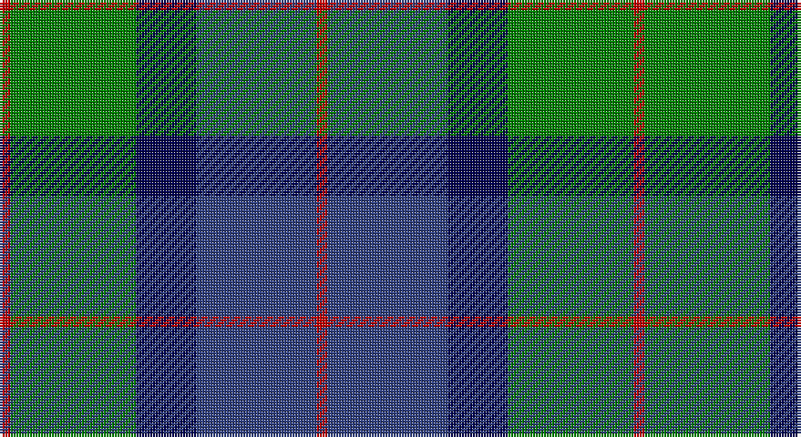

This page is one **sett** — a single exact thread-count. It belongs to the [tartan](/setts/r2g23dbi11db22r2/)
(the same proportion at any scale), whose colour order is pattern [RBBGR](/stripes/rbbgr/).

Part of the [Skibo](/tartans/skibo/) tartan — the named design grouping this sett with its other cloths.

Sourced from weddslist.  It is a [5 stripe tartan](/stripes/stripes5/).

Original link http://www.weddslist.com/cgi-bin/tartans/pg.pl?source=sts

## Thread count
R/4 G46 DB22 B44 R/4

One full sett is **232 threads**.

## Palette

Palette: <strong>custom</strong>
<table><thead><tr><th>Colour</th><th>Threads</th><th>Shade</th><th>Base</th><th>OKLCh</th></tr></thead><tbody><tr><td>R/</td><td style="text-align:right;font-variant-numeric:tabular-nums">4</td><td><code style="background-color:#C00000;">#C00000</code> <small style="color:#888">#C00000</small></td><td>R <code style="background-color:#CC0000;">#CC0000</code></td><td><small style="color:#888">oklch(50.7% 0.208 29.2)</small></td></tr><tr><td>G</td><td style="text-align:right;font-variant-numeric:tabular-nums">46</td><td><code style="background-color:#008000;">#008000</code> <small style="color:#888">#008000</small></td><td>G <code style="background-color:#006100;">#006100</code></td><td><small style="color:#888">oklch(52.0% 0.177 142.5)</small></td></tr><tr><td>DB</td><td style="text-align:right;font-variant-numeric:tabular-nums">22</td><td><code style="background-color:#000050;">#000050</code> <small style="color:#888">#000050</small></td><td>B <code style="background-color:#2A418A;">#2A418A</code></td><td><small style="color:#888">oklch(19.5% 0.135 264.1)</small></td></tr><tr><td>B</td><td style="text-align:right;font-variant-numeric:tabular-nums">44</td><td><code style="background-color:#304080;">#304080</code> <small style="color:#888">#304080</small></td><td>B <code style="background-color:#2A418A;">#2A418A</code></td><td><small style="color:#888">oklch(39.4% 0.109 270.2)</small></td></tr><tr><td>R/</td><td style="text-align:right;font-variant-numeric:tabular-nums">4</td><td><code style="background-color:#C00000;">#C00000</code> <small style="color:#888">#C00000</small></td><td>R <code style="background-color:#CC0000;">#CC0000</code></td><td><small style="color:#888">oklch(50.7% 0.208 29.2)</small></td></tr></tbody></table>

# Sample pattern

## Compared to the master

This cloth is one sett of its design; the master sett (the exemplar the design is anchored on) is below for comparison.

<figure style="margin:0"><figcaption style="color:#888;font-size:smaller">this sett</figcaption></figure>
<figure style="margin:0"><figcaption style="color:#888;font-size:smaller"><a href="/setts/y23db11b22r2b22db11y23r2/">master sett →</a></figcaption></figure>

## Nearest tartans

The nearest existing variants by ΔTartan distance, with this tartan at the top so the swatches line up against it.

ΔTartan

Tartan

Sett

—

<a href="/ttd/edit/#slug=r2g23dbi11db22r2~x2">Skibo</a> <a class="nn-out" href="/variants/s5/r2g23dbi11db22r2~x2/" title="open its dictionary page">↗</a>

0.76

<a href="/ttd/edit/#slug=t2db29t12g29w2~x2&amp;base=r2g23dbi11db22r2~x2">Wallace Blue (Fashion)</a> <a class="nn-out" href="/variants/s5/t2db29t12g29w2~x2/" title="open its dictionary page">↗</a>

0.77

<a href="/ttd/edit/#slug=k2g12k11b12w1~x2&amp;base=r2g23dbi11db22r2~x2">MacKirdy</a> <a class="nn-out" href="/variants/s5/k2g12k11b12w1~x2/" title="open its dictionary page">↗</a>

0.87

<a href="/variants/s6/b12k4g6ly1~x8/">Sinclair of Ulbster</a>

0.87

<a href="/ttd/edit/#slug=db2k2db12k11g16w2~x2&amp;base=r2g23dbi11db22r2~x2">Campbell of Argyll (Smiths)</a> <a class="nn-out" href="/variants/s6/db2k2db12k11g16w2~x2/" title="open its dictionary page">↗</a>

0.93

<a href="/ttd/edit/#slug=db2g12k13w1db13w2~x2&amp;base=r2g23dbi11db22r2~x2">Herd Family Tartan</a> <a class="nn-out" href="/variants/s6/db2g12k13w1db13w2~x2/" title="open its dictionary page">↗</a>

0.95

<a href="/ttd/edit/#slug=db30k10g10lb2g15lb2~x2&amp;base=r2g23dbi11db22r2~x2">MacRobart (Personal)</a> <a class="nn-out" href="/variants/s6/db30k10g10lb2g15lb2~x2/" title="open its dictionary page">↗</a>

0.96

<a href="/ttd/edit/#slug=r3b25k16b3g25b3~x2&amp;base=r2g23dbi11db22r2~x2">Flower of Scotland</a> <a class="nn-out" href="/variants/s6/r3b25k16b3g25b3~x2/" title="open its dictionary page">↗</a>

0.96

<a href="/ttd/edit/#slug=g24b6lb3k6b12k15g4~x2&amp;base=r2g23dbi11db22r2~x2">Blaylock Annandale</a> <a class="nn-out" href="/variants/s7/g24b6lb3k6b12k15g4~x2/" title="open its dictionary page">↗</a>

0.98

<a href="/ttd/edit/#slug=g52lb7g9k35db35k7&amp;base=r2g23dbi11db22r2~x2">Redland</a> <a class="nn-out" href="/variants/s6/g52lb7g9k35db35k7/" title="open its dictionary page">↗</a>

1.03

<a href="/ttd/edit/#slug=k2dg9t1k6b4dg2~x2&amp;base=r2g23dbi11db22r2~x2">Unidentified #28</a> <a class="nn-out" href="/variants/s6/k2dg9t1k6b4dg2~x2/" title="open its dictionary page">↗</a>

## Neighbour map

Every grey dot is one of 14360 variants placed by the first two principal components of the ΔTartan feature space (44% of its variance). Red is this tartan; blue dots are its nearest — click one to open its page.

<svg viewBox="0 0 640 380" role="img" style="max-width:100%;height:auto;border:1px solid #e0e0e0;border-radius:4px;display:block" xmlns="http://www.w3.org/2000/svg"><image href="/nn/cloud.v1.png" width="640" height="380"/><a href="/variants/s5/t2db29t12g29w2~x2/"><circle cx="248.9" cy="224.0" r="4" fill="#3465a4"><title>Wallace Blue (Fashion)</title></circle></a><a href="/variants/s5/k2g12k11b12w1~x2/"><circle cx="179.1" cy="234.0" r="4" fill="#3465a4"><title>MacKirdy</title></circle></a><a href="/variants/s6/b12k4g6ly1~x8/"><circle cx="191.9" cy="240.6" r="4" fill="#3465a4"><title>Sinclair of Ulbster</title></circle></a><a href="/variants/s6/db2k2db12k11g16w2~x2/"><circle cx="184.6" cy="238.2" r="4" fill="#3465a4"><title>Campbell of Argyll (Smiths)</title></circle></a><a href="/variants/s6/db2g12k13w1db13w2~x2/"><circle cx="187.8" cy="214.3" r="4" fill="#3465a4"><title>Herd Family Tartan</title></circle></a><a href="/variants/s6/db30k10g10lb2g15lb2~x2/"><circle cx="264.1" cy="218.3" r="4" fill="#3465a4"><title>MacRobart (Personal)</title></circle></a><a href="/variants/s6/r3b25k16b3g25b3~x2/"><circle cx="210.3" cy="231.2" r="4" fill="#3465a4"><title>Flower of Scotland</title></circle></a><a href="/variants/s7/g24b6lb3k6b12k15g4~x2/"><circle cx="189.5" cy="236.9" r="4" fill="#3465a4"><title>Blaylock Annandale</title></circle></a><a href="/variants/s6/g52lb7g9k35db35k7/"><circle cx="207.5" cy="247.7" r="4" fill="#3465a4"><title>Redland</title></circle></a><a href="/variants/s6/k2dg9t1k6b4dg2~x2/"><circle cx="229.2" cy="243.7" r="4" fill="#3465a4"><title>Unidentified #28</title></circle></a><circle cx="216.3" cy="232.8" r="5" fill="#c00000"/></svg>

ID: /variants/s5/r2g23dbi11db22r2~x2/
