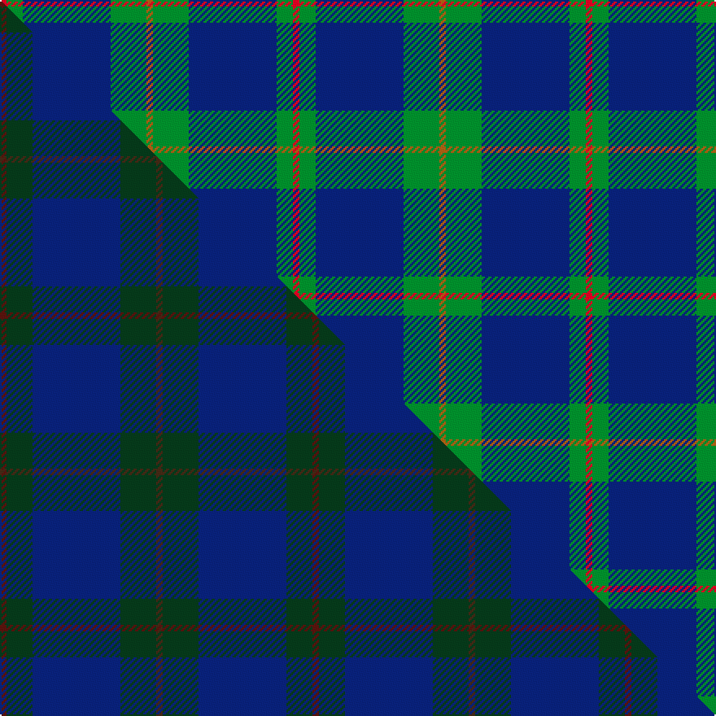

This page is one **sett** — a single exact thread-count. It belongs to the [tartan](/setts/r2g5db27g11o2/)
(the same proportion at any scale), whose colour order is pattern [RGBGR](/stripes/rgbgr/).

Part of the [Hector, James](/tartans/hector-james/) tartan — the named design grouping this sett with its other cloths.

Sourced from weddslist.  It is a [5 stripe tartan](/stripes/stripes5/).

Original link http://www.weddslist.com/cgi-bin/tartans/pg.pl?source=sts

## Thread count
R/4 G10 DB54 G22 O/4

One full sett is **180 threads**.

## Palette
<table><thead><tr><th>Colour</th><th>Shade</th><th>OKLCh</th></tr></thead><tbody><tr><td>DB</td><td><code style="background-color:#082077;">#082077</code> <small style="color:#888">#082077</small></td><td><small style="color:#888">oklch(30.0% 0.149 265.1)</small></td></tr><tr><td>G</td><td><code style="background-color:#008B2A;">#008B2A</code> <small style="color:#888">#008B2A</small></td><td><small style="color:#888">oklch(55.4% 0.170 145.9)</small></td></tr><tr><td>O</td><td><code style="background-color:#A65C11;">#A65C11</code> <small style="color:#888">#A65C11</small></td><td><small style="color:#888">oklch(55.0% 0.125 58.3)</small></td></tr><tr><td>R</td><td><code style="background-color:#D60020;">#D60020</code> <small style="color:#888">#D60020</small></td><td><small style="color:#888">oklch(55.2% 0.224 25.5)</small></td></tr></tbody></table>

# Sample pattern

## Compared to the master

This cloth is one sett of its design; the master sett (the exemplar the design is anchored on) is below for comparison.

Its **ΔTartan distance** from the master is **5.05** — the same measure the nearest-tartans table ranks by (0 is identical; a re-scale of the same cloth is near 0, a recolour or a different proportion further).

<figure class="master-compare" style="margin:0">

this sett
master sett ★

<figcaption style="color:#888;font-size:smaller">One weave of this sett against the <a href="/setts/dr2dg8db27dg11do2/">master sett ★</a>, split on the diagonal: a shared proportion runs seamlessly across it with only the shades shifting; a different proportion breaks on it.</figcaption>
</figure>

## Nearest tartan variants

The nearest existing variants by ΔTartan distance, with this cloth at the top so the swatches line up against it.

ΔTartan

Threads

Variant

Sett

—

180

<a href="/variants/s5/r2g5db27g11o2~x2/">Hector James</a>

<a href="/ttd/edit/#slug=db47g14do5o2r3g7~x2&amp;base=r2g5db27g11o2~x2" title="compare in the TTD">0.85</a>

204

<a href="/variants/s6/db47g14do5o2r3g7~x2/">Round Table of Britain and Ireland, RtbI.</a>

<a href="/ttd/edit/#slug=r1g16db16g1~x2~r2109032-db1406275&amp;base=r2g5db27g11o2~x2" title="compare in the TTD">1.00</a>

132

<a href="/variants/s4/r1g16db16g1~x2~r2109032-db1406275/">Barclay</a>

<a href="/ttd/edit/#slug=r1g16db16g1~x4&amp;base=r2g5db27g11o2~x2" title="compare in the TTD">1.09</a>

264

<a href="/variants/s4/r1g16db16g1~x4/">Barclay Htg (Clan)</a>

<a href="/ttd/edit/#slug=r1g16db16g1&amp;base=r2g5db27g11o2~x2" title="compare in the TTD">1.09</a>

66

<a href="/variants/s4/r1g16db16g1/">Barclay Hunting</a>

<a href="/ttd/edit/#slug=r1g16db16g1~x2&amp;base=r2g5db27g11o2~x2" title="compare in the TTD">1.09</a>

132

<a href="/variants/s4/r1g16db16g1~x2/">Barclay</a>

<a href="/ttd/edit/#slug=g47r3g6db35y3~x2&amp;base=r2g5db27g11o2~x2" title="compare in the TTD">1.36</a>

276

<a href="/variants/s5/g47r3g6db35y3~x2/">Gracie</a>

<a href="/ttd/edit/#slug=o4g9w2g24db37r3~x2&amp;base=r2g5db27g11o2~x2" title="compare in the TTD">1.80</a>

302

<a href="/variants/s6/o4g9w2g24db37r3~x2/">Hardie Clan Tartan</a>

<a href="/ttd/edit/#slug=r1db12g5db2g4lb1~x2&amp;base=r2g5db27g11o2~x2" title="compare in the TTD">1.92</a>

96

<a href="/variants/s6/r1db12g5db2g4lb1~x2/">Connaught Green</a>

<a href="/ttd/edit/#slug=r2db32g14db5g16w2~x2~g2106142&amp;base=r2g5db27g11o2~x2" title="compare in the TTD">2.03</a>

276

<a href="/variants/s6/r2db32g14db5g16w2~x2~g2106142/">Connacht Irish District Tartan</a>

<a href="/ttd/edit/#slug=g20r7db40w2~x2&amp;base=r2g5db27g11o2~x2" title="compare in the TTD">2.11</a>

232

<a href="/variants/s4/g20r7db40w2~x2/">McNiff, Kevin (Personal)</a>

## Neighbour map

Every grey dot is one of 13620 variants placed by the first two principal components of the ΔTartan feature space (42% of its variance). Red is this tartan; blue dots are its nearest — click one to open its page.

<svg viewBox="0 0 640 380" role="img" style="max-width:100%;height:auto;border:1px solid #e0e0e0;border-radius:4px;display:block" xmlns="http://www.w3.org/2000/svg"><image href="/nn/cloud.v1.png" width="640" height="380"/><a href="/variants/s6/db47g14do5o2r3g7~x2/"><circle cx="375.1" cy="147.6" r="4" fill="#3465a4"><title>Round Table of Britain and Ireland, RtbI.</title></circle></a><a href="/variants/s4/r1g16db16g1~x2~r2109032-db1406275/"><circle cx="373.5" cy="235.7" r="4" fill="#3465a4"><title>Barclay</title></circle></a><a href="/variants/s4/r1g16db16g1~x4/"><circle cx="358.4" cy="232.1" r="4" fill="#3465a4"><title>Barclay Htg (Clan)</title></circle></a><a href="/variants/s4/r1g16db16g1/"><circle cx="358.4" cy="232.1" r="4" fill="#3465a4"><title>Barclay Hunting</title></circle></a><a href="/variants/s4/r1g16db16g1~x2/"><circle cx="358.4" cy="232.1" r="4" fill="#3465a4"><title>Barclay</title></circle></a><a href="/variants/s5/g47r3g6db35y3~x2/"><circle cx="359.6" cy="203.1" r="4" fill="#3465a4"><title>Gracie</title></circle></a><a href="/variants/s6/o4g9w2g24db37r3~x2/"><circle cx="278.7" cy="169.6" r="4" fill="#3465a4"><title>Hardie Clan Tartan</title></circle></a><a href="/variants/s6/r1db12g5db2g4lb1~x2/"><circle cx="332.0" cy="207.3" r="4" fill="#3465a4"><title>Connaught Green</title></circle></a><a href="/variants/s6/r2db32g14db5g16w2~x2~g2106142/"><circle cx="332.4" cy="200.6" r="4" fill="#3465a4"><title>Connacht Irish District Tartan</title></circle></a><a href="/variants/s4/g20r7db40w2~x2/"><circle cx="344.8" cy="202.7" r="4" fill="#3465a4"><title>McNiff, Kevin (Personal)</title></circle></a><circle cx="352.2" cy="200.6" r="5" fill="#c00000"/><text x="320" y="376" text-anchor="middle" font-size="11" fill="#999">ground</text><text x="11" y="190" text-anchor="middle" font-size="11" fill="#999" transform="rotate(-90 11 190)">complexity</text></svg>

ID: /variants/s5/r2g5db27g11o2~x2/
