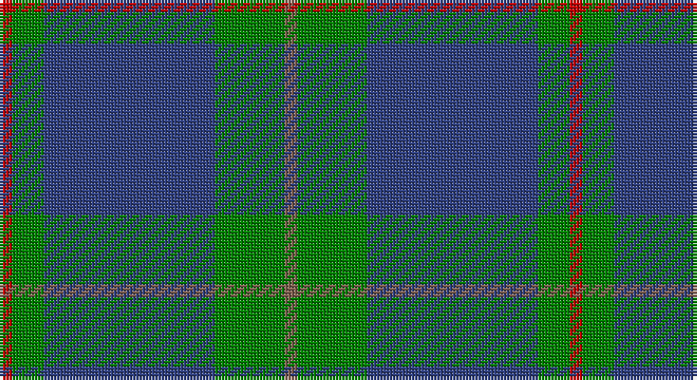

This page is one **sett** — a single exact thread-count. It belongs to the [tartan](/setts/r2g5db27g11o2/)
(the same proportion at any scale), whose colour order is pattern [RGBGR](/stripes/rgbgr/).

Part of the [Hector, James](/tartans/hector-james/) tartan — the named design grouping this sett with its other cloths.

Sourced from weddslist.  It is a [5 stripe tartan](/stripes/stripes5/).

Original link http://www.weddslist.com/cgi-bin/tartans/pg.pl?source=sts

## Also known as

This cloth is also recorded under:

- Hector James

## Thread count
R/4 G10 B54 G22 LT/4

One full sett is **180 threads**.

## Palette

Palette: <strong>custom</strong>
<table><thead><tr><th>Colour</th><th>Threads</th><th>Shade</th><th>Base</th><th>OKLCh</th></tr></thead><tbody><tr><td>R/</td><td style="text-align:right;font-variant-numeric:tabular-nums">4</td><td><code style="background-color:#C00000;">#C00000</code> <small style="color:#888">#C00000</small></td><td>R <code style="background-color:#CC0000;">#CC0000</code></td><td><small style="color:#888">oklch(50.7% 0.208 29.2)</small></td></tr><tr><td>G</td><td style="text-align:right;font-variant-numeric:tabular-nums">10</td><td><code style="background-color:#008000;">#008000</code> <small style="color:#888">#008000</small></td><td>G <code style="background-color:#006100;">#006100</code></td><td><small style="color:#888">oklch(52.0% 0.177 142.5)</small></td></tr><tr><td>B</td><td style="text-align:right;font-variant-numeric:tabular-nums">54</td><td><code style="background-color:#304080;">#304080</code> <small style="color:#888">#304080</small></td><td>B <code style="background-color:#2A418A;">#2A418A</code></td><td><small style="color:#888">oklch(39.4% 0.109 270.2)</small></td></tr><tr><td>G</td><td style="text-align:right;font-variant-numeric:tabular-nums">22</td><td><code style="background-color:#008000;">#008000</code> <small style="color:#888">#008000</small></td><td>G <code style="background-color:#006100;">#006100</code></td><td><small style="color:#888">oklch(52.0% 0.177 142.5)</small></td></tr><tr><td>LT/</td><td style="text-align:right;font-variant-numeric:tabular-nums">4</td><td><code style="background-color:#806050;">#806050</code> <small style="color:#888">#806050</small></td><td>R <code style="background-color:#CC0000;">#CC0000</code></td><td><small style="color:#888">oklch(51.7% 0.049 47.8)</small></td></tr></tbody></table>

# Sample pattern

## Compared to the master

This cloth is one sett of its design; the master sett (the exemplar the design is anchored on) is below for comparison.

<figure style="margin:0"><figcaption style="color:#888;font-size:smaller">this sett</figcaption></figure>
<figure style="margin:0"><figcaption style="color:#888;font-size:smaller"><a href="/setts/dg8dt27dg11do2dg11dt27dg8r2/">master sett →</a></figcaption></figure>

## Nearest tartans

The nearest existing variants by ΔTartan distance, with this tartan at the top so the swatches line up against it.

ΔTartan

Tartan

Sett

—

<a href="/ttd/edit/#slug=r2g5db27g11o2~x2">Hector James</a> <a class="nn-out" href="/variants/s5/r2g5db27g11o2~x2/" title="open its dictionary page">↗</a>

0.81

<a href="/ttd/edit/#slug=g12lo1db8k1db1~x4&amp;base=r2g5db27g11o2~x2">Rowan (Personal)</a> <a class="nn-out" href="/variants/s5/g12lo1db8k1db1~x4/" title="open its dictionary page">↗</a>

1.09

<a href="/ttd/edit/#slug=dg4db12r3db12dg32w4~x2&amp;base=r2g5db27g11o2~x2">MacIntyre</a> <a class="nn-out" href="/variants/s6/dg4db12r3db12dg32w4~x2/" title="open its dictionary page">↗</a>

1.15

<a href="/ttd/edit/#slug=g24k2db3k2db8r2~x2&amp;base=r2g5db27g11o2~x2">Shaw (Clan 1)</a> <a class="nn-out" href="/variants/s6/g24k2db3k2db8r2~x2/" title="open its dictionary page">↗</a>

1.15

<a href="/ttd/edit/#slug=dt3t14dt3o16dt34r3~x2&amp;base=r2g5db27g11o2~x2">Thorburn (Lochcarron)</a> <a class="nn-out" href="/variants/s6/dt3t14dt3o16dt34r3~x2/" title="open its dictionary page">↗</a>

1.18

<a href="/ttd/edit/#slug=t9dt3t1dt12ly1~x4&amp;base=r2g5db27g11o2~x2">North Sea Commission</a> <a class="nn-out" href="/variants/s5/t9dt3t1dt12ly1~x4/" title="open its dictionary page">↗</a>

1.21

<a href="/ttd/edit/#slug=g47r3g6db35lo3~x2&amp;base=r2g5db27g11o2~x2">Gracie (Name)</a> <a class="nn-out" href="/variants/s5/g47r3g6db35lo3~x2/" title="open its dictionary page">↗</a>

1.22

<a href="/ttd/edit/#slug=r1db12y5db2y4lb1~x2&amp;base=r2g5db27g11o2~x2">Connaught Green</a> <a class="nn-out" href="/variants/s6/r1db12y5db2y4lb1~x2/" title="open its dictionary page">↗</a>

1.25

<a href="/ttd/edit/#slug=t9db2t39dt33lo2dt5~x2&amp;base=r2g5db27g11o2~x2">Port Authority of NY &amp; NJ</a> <a class="nn-out" href="/variants/s6/t9db2t39dt33lo2dt5~x2/" title="open its dictionary page">↗</a>

1.25

<a href="/ttd/edit/#slug=db3r3g18db16w2db26r3g3~x2&amp;base=r2g5db27g11o2~x2">MacHardy</a> <a class="nn-out" href="/variants/s8/db3r3g18db16w2db26r3g3~x2/" title="open its dictionary page">↗</a>

1.27

<a href="/ttd/edit/#slug=db16w1db1w1db8dg16r1db2~x2&amp;base=r2g5db27g11o2~x2">Roxburgh</a> <a class="nn-out" href="/variants/s8/db16w1db1w1db8dg16r1db2~x2/" title="open its dictionary page">↗</a>

## Neighbour map

Every grey dot is one of 14360 variants placed by the first two principal components of the ΔTartan feature space (44% of its variance). Red is this tartan; blue dots are its nearest — click one to open its page.

<svg viewBox="0 0 640 380" role="img" style="max-width:100%;height:auto;border:1px solid #e0e0e0;border-radius:4px;display:block" xmlns="http://www.w3.org/2000/svg"><image href="/nn/cloud.v1.png" width="640" height="380"/><a href="/variants/s5/g12lo1db8k1db1~x4/"><circle cx="339.9" cy="226.8" r="4" fill="#3465a4"><title>Rowan (Personal)</title></circle></a><a href="/variants/s6/dg4db12r3db12dg32w4~x2/"><circle cx="323.0" cy="226.7" r="4" fill="#3465a4"><title>MacIntyre</title></circle></a><a href="/variants/s6/g24k2db3k2db8r2~x2/"><circle cx="369.4" cy="209.1" r="4" fill="#3465a4"><title>Shaw (Clan 1)</title></circle></a><a href="/variants/s6/dt3t14dt3o16dt34r3~x2/"><circle cx="332.7" cy="226.1" r="4" fill="#3465a4"><title>Thorburn (Lochcarron)</title></circle></a><a href="/variants/s5/t9dt3t1dt12ly1~x4/"><circle cx="397.6" cy="252.6" r="4" fill="#3465a4"><title>North Sea Commission</title></circle></a><a href="/variants/s5/g47r3g6db35lo3~x2/"><circle cx="356.4" cy="211.1" r="4" fill="#3465a4"><title>Gracie (Name)</title></circle></a><a href="/variants/s6/r1db12y5db2y4lb1~x2/"><circle cx="353.3" cy="220.4" r="4" fill="#3465a4"><title>Connaught Green</title></circle></a><a href="/variants/s6/t9db2t39dt33lo2dt5~x2/"><circle cx="381.2" cy="203.2" r="4" fill="#3465a4"><title>Port Authority of NY &amp; NJ</title></circle></a><a href="/variants/s8/db3r3g18db16w2db26r3g3~x2/"><circle cx="360.0" cy="198.7" r="4" fill="#3465a4"><title>MacHardy</title></circle></a><a href="/variants/s8/db16w1db1w1db8dg16r1db2~x2/"><circle cx="398.6" cy="197.9" r="4" fill="#3465a4"><title>Roxburgh</title></circle></a><circle cx="378.7" cy="224.5" r="5" fill="#c00000"/></svg>

ID: /variants/s5/r2g5db27g11o2~x2/
