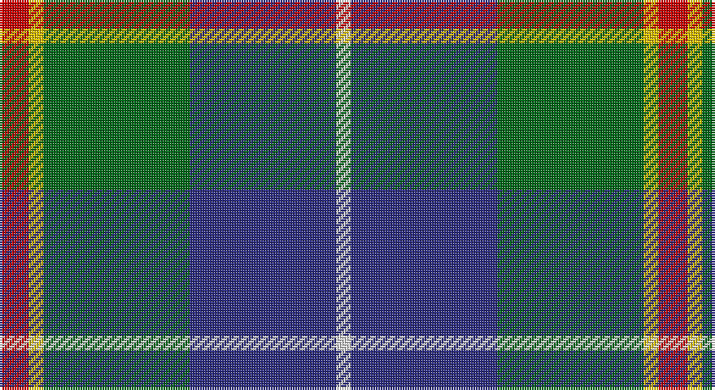

This page is one **sett** — a single exact thread-count. It belongs to the [tartan](/setts/r2ly1g10db10w1/)
(the same proportion at any scale), whose colour order is pattern [RYGBW](/stripes/rygbw/).

Part of the [Turnbull Hunting](/tartans/turnbull-hunting/) tartan — the named design grouping this sett with its other cloths.

Sourced from tartans-authority.  It is a [5 stripe tartan](/stripes/stripes5/).

Original link http://www.tartansauthority.com/tartan-ferret/display/1714/

## Also known as

This cloth is also recorded under:

- Turnbull Hunting #2
- Turnbull, hunting

## Register references

External register numbers recorded for this tartan.

- Scottish Tartans Authority (ITI): 1714

## Thread count
R/12 Y6 G60 DB60 LN/6

One full sett is **270 threads**.

## Palette

Palette: <strong>Tartan Register</strong>
<table><thead><tr><th>Colour</th><th>Threads</th><th>Shade</th><th>Base</th><th>OKLCh</th></tr></thead><tbody><tr><td>R/</td><td style="text-align:right;font-variant-numeric:tabular-nums">12</td><td><code style="background-color:#C80000;">#C80000</code> <small style="color:#888">#C80000</small></td><td>R <code style="background-color:#CC0000;">#CC0000</code></td><td><small style="color:#888">oklch(52.3% 0.215 29.2)</small></td></tr><tr><td>Y</td><td style="text-align:right;font-variant-numeric:tabular-nums">6</td><td><code style="background-color:#E8C000;">#E8C000</code> <small style="color:#888">#E8C000</small></td><td>Y <code style="background-color:#F2BF00;">#F2BF00</code></td><td><small style="color:#888">oklch(81.9% 0.168 93.7)</small></td></tr><tr><td>G</td><td style="text-align:right;font-variant-numeric:tabular-nums">60</td><td><code style="background-color:#006818;">#006818</code> <small style="color:#888">#006818</small></td><td>G <code style="background-color:#006100;">#006100</code></td><td><small style="color:#888">oklch(45.0% 0.142 145.0)</small></td></tr><tr><td>DB</td><td style="text-align:right;font-variant-numeric:tabular-nums">60</td><td><code style="background-color:#2C2C80;">#2C2C80</code> <small style="color:#888">#2C2C80</small></td><td>B <code style="background-color:#2A418A;">#2A418A</code></td><td><small style="color:#888">oklch(35.0% 0.138 276.6)</small></td></tr><tr><td>LN/</td><td style="text-align:right;font-variant-numeric:tabular-nums">6</td><td><code style="background-color:#E0E0E0;">#E0E0E0</code> <small style="color:#888">#E0E0E0</small></td><td>W <code style="background-color:#F7F7F7;">#F7F7F7</code></td><td><small style="color:#888">oklch(90.7% 0.000 89.9)</small></td></tr></tbody></table>

# Sample pattern

## Compared to the master

This cloth is one sett of its design; the master sett (the exemplar the design is anchored on) is below for comparison.

<figure style="margin:0"><figcaption style="color:#888;font-size:smaller">this sett</figcaption></figure>
<figure style="margin:0"><figcaption style="color:#888;font-size:smaller"><a href="/setts/r7ly3dg28db28w3/">master sett →</a></figcaption></figure>

## Nearest tartans

The nearest existing variants by ΔTartan distance, with this tartan at the top so the swatches line up against it.

ΔTartan

Tartan

Sett

—

<a href="/ttd/edit/#slug=r2ly1g10db10w1~x6">Turnbull Hunting (Name)</a> <a class="nn-out" href="/variants/s5/r2ly1g10db10w1~x6/" title="open its dictionary page">↗</a>

0.46

<a href="/ttd/edit/#slug=k2ly1g10db10w1~x6&amp;base=r2ly1g10db10w1~x6">Turnbull Hunting (1983) #2</a> <a class="nn-out" href="/variants/s5/k2ly1g10db10w1~x6/" title="open its dictionary page">↗</a>

0.70

<a href="/ttd/edit/#slug=k7m3g29db29w3~x2&amp;base=r2ly1g10db10w1~x6">Highlander, Highland Laddie Kilts</a> <a class="nn-out" href="/variants/s5/k7m3g29db29w3~x2/" title="open its dictionary page">↗</a>

0.71

<a href="/ttd/edit/#slug=r7ly3g28db28w3~x2&amp;base=r2ly1g10db10w1~x6">Turnbull, hunting</a> <a class="nn-out" href="/variants/s5/r7ly3g28db28w3~x2/" title="open its dictionary page">↗</a>

0.73

<a href="/ttd/edit/#slug=db20k6lo4db3g20w2~x2&amp;base=r2ly1g10db10w1~x6">DeLoughery (Personal)</a> <a class="nn-out" href="/variants/s6/db20k6lo4db3g20w2~x2/" title="open its dictionary page">↗</a>

0.74

<a href="/ttd/edit/#slug=r7ly3dg28db28w3~x2&amp;base=r2ly1g10db10w1~x6">Turnbull Hunting</a> <a class="nn-out" href="/variants/s5/r7ly3dg28db28w3~x2/" title="open its dictionary page">↗</a>

0.75

<a href="/ttd/edit/#slug=k1dbi1g8db8w1~x4&amp;base=r2ly1g10db10w1~x6">Douglas, Green (Wilsons)</a> <a class="nn-out" href="/variants/s5/k1dbi1g8db8w1~x4/" title="open its dictionary page">↗</a>

0.79

<a href="/ttd/edit/#slug=r5t3g24db24r4ly2~x2&amp;base=r2ly1g10db10w1~x6">Canine All Dogs</a> <a class="nn-out" href="/variants/s6/r5t3g24db24r4ly2~x2/" title="open its dictionary page">↗</a>

0.80

<a href="/ttd/edit/#slug=lr4g24db10r3db12lo4~x2&amp;base=r2ly1g10db10w1~x6">Inglis (Name)</a> <a class="nn-out" href="/variants/s6/lr4g24db10r3db12lo4~x2/" title="open its dictionary page">↗</a>

0.81

<a href="/ttd/edit/#slug=w15dg98dt72r25dt8ly15&amp;base=r2ly1g10db10w1~x6">Afternoon Tea / Darjeeling</a> <a class="nn-out" href="/variants/s6/w15dg98dt72r25dt8ly15/" title="open its dictionary page">↗</a>

0.82

<a href="/ttd/edit/#slug=k1t1g8db8w1~x4&amp;base=r2ly1g10db10w1~x6">Douglas</a> <a class="nn-out" href="/variants/s5/k1t1g8db8w1~x4/" title="open its dictionary page">↗</a>

## Neighbour map

Every grey dot is one of 14360 variants placed by the first two principal components of the ΔTartan feature space (44% of its variance). Red is this tartan; blue dots are its nearest — click one to open its page.

<svg viewBox="0 0 640 380" role="img" style="max-width:100%;height:auto;border:1px solid #e0e0e0;border-radius:4px;display:block" xmlns="http://www.w3.org/2000/svg"><image href="/nn/cloud.v1.png" width="640" height="380"/><a href="/variants/s5/k2ly1g10db10w1~x6/"><circle cx="215.3" cy="205.5" r="4" fill="#3465a4"><title>Turnbull Hunting (1983) #2</title></circle></a><a href="/variants/s5/k7m3g29db29w3~x2/"><circle cx="198.1" cy="205.9" r="4" fill="#3465a4"><title>Highlander, Highland Laddie Kilts</title></circle></a><a href="/variants/s5/r7ly3g28db28w3~x2/"><circle cx="206.8" cy="209.7" r="4" fill="#3465a4"><title>Turnbull, hunting</title></circle></a><a href="/variants/s6/db20k6lo4db3g20w2~x2/"><circle cx="206.5" cy="204.1" r="4" fill="#3465a4"><title>DeLoughery (Personal)</title></circle></a><a href="/variants/s5/r7ly3dg28db28w3~x2/"><circle cx="224.5" cy="219.3" r="4" fill="#3465a4"><title>Turnbull Hunting</title></circle></a><a href="/variants/s5/k1dbi1g8db8w1~x4/"><circle cx="219.0" cy="218.1" r="4" fill="#3465a4"><title>Douglas, Green (Wilsons)</title></circle></a><a href="/variants/s6/r5t3g24db24r4ly2~x2/"><circle cx="218.5" cy="189.0" r="4" fill="#3465a4"><title>Canine All Dogs</title></circle></a><a href="/variants/s6/lr4g24db10r3db12lo4~x2/"><circle cx="183.1" cy="209.9" r="4" fill="#3465a4"><title>Inglis (Name)</title></circle></a><a href="/variants/s6/w15dg98dt72r25dt8ly15/"><circle cx="205.8" cy="188.4" r="4" fill="#3465a4"><title>Afternoon Tea / Darjeeling</title></circle></a><a href="/variants/s5/k1t1g8db8w1~x4/"><circle cx="210.1" cy="212.6" r="4" fill="#3465a4"><title>Douglas</title></circle></a><circle cx="220.5" cy="203.4" r="5" fill="#c00000"/></svg>

ID: /variants/s5/r2ly1g10db10w1~x6/
