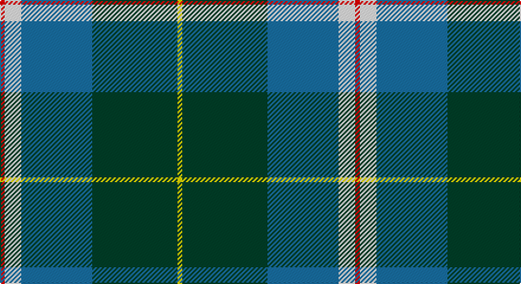

This page is one **sett** — a single exact thread-count. It belongs to the [tartan](/setts/r2w7b30dg36ly2/)
(the same proportion at any scale), whose colour order is pattern [RWBGY](/stripes/rwbgy/).

Part of the [Centennial-King George Lodge No.171](/tartans/centennial-king-george-lodge-no-171/) tartan — the named design grouping this sett with its other cloths.

Sourced from register-of-tartans.  It is a [5 stripe tartan](/stripes/stripes5/).

Original link https://www.tartanregister.gov.uk/tartanDetails.aspx?ref=10846

## Register references

External register numbers recorded for this tartan.

- Scottish Register of Tartans: [10846](https://www.tartanregister.gov.uk/tartanDetails.aspx?ref=10846)

## Thread count
R/4 W14 B60 DG72 Y/4

One full sett is **300 threads**.

## Palette

Palette: <strong>Tartan Register</strong>
<table><thead><tr><th>Colour</th><th>Threads</th><th>Shade</th><th>Base</th><th>OKLCh</th></tr></thead><tbody><tr><td>R/</td><td style="text-align:right;font-variant-numeric:tabular-nums">4</td><td><code style="background-color:#FF0000;">#FF0000</code> <small style="color:#888">#FF0000</small></td><td>R <code style="background-color:#CC0000;">#CC0000</code></td><td><small style="color:#888">oklch(62.8% 0.258 29.2)</small></td></tr><tr><td>W</td><td style="text-align:right;font-variant-numeric:tabular-nums">14</td><td><code style="background-color:#FFFFFF;">#FFFFFF</code> <small style="color:#888">#FFFFFF</small></td><td>W <code style="background-color:#F7F7F7;">#F7F7F7</code></td><td><small style="color:#888">oklch(100.0% 0.000 89.9)</small></td></tr><tr><td>B</td><td style="text-align:right;font-variant-numeric:tabular-nums">60</td><td><code style="background-color:#1870A4;">#1870A4</code> <small style="color:#888">#1870A4</small></td><td>B <code style="background-color:#2A418A;">#2A418A</code></td><td><small style="color:#888">oklch(52.2% 0.113 241.2)</small></td></tr><tr><td>DG</td><td style="text-align:right;font-variant-numeric:tabular-nums">72</td><td><code style="background-color:#004028;">#004028</code> <small style="color:#888">#004028</small></td><td>G <code style="background-color:#006100;">#006100</code></td><td><small style="color:#888">oklch(32.8% 0.073 160.8)</small></td></tr><tr><td>Y/</td><td style="text-align:right;font-variant-numeric:tabular-nums">4</td><td><code style="background-color:#FFE600;">#FFE600</code> <small style="color:#888">#FFE600</small></td><td>Y <code style="background-color:#F2BF00;">#F2BF00</code></td><td><small style="color:#888">oklch(91.7% 0.192 101.4)</small></td></tr></tbody></table>

# Sample pattern

## Nearest tartans

The nearest existing variants by ΔTartan distance, with this tartan at the top so the swatches line up against it.

ΔTartan

Tartan

Sett

—

<a href="/ttd/edit/#slug=r2w7b30dg36ly2~x2">Centennial-King George Lodge No.171</a> <a class="nn-out" href="/variants/s5/r2w7b30dg36ly2~x2/" title="open its dictionary page">↗</a>

0.61

<a href="/ttd/edit/#slug=r2w7db30g36ly2~x2&amp;base=r2w7b30dg36ly2~x2">Centennial-King George Lodge No.171</a> <a class="nn-out" href="/variants/s5/r2w7db30g36ly2~x2/" title="open its dictionary page">↗</a>

0.97

<a href="/ttd/edit/#slug=db10k3t65dg56ly6&amp;base=r2w7b30dg36ly2~x2">Phoenix Police Honor Guard</a> <a class="nn-out" href="/variants/s5/db10k3t65dg56ly6/" title="open its dictionary page">↗</a>

1.02

<a href="/ttd/edit/#slug=dt36t21ly4lb12dp2~x2&amp;base=r2w7b30dg36ly2~x2">Emond, Kenneth (Personal)</a> <a class="nn-out" href="/variants/s5/dt36t21ly4lb12dp2~x2/" title="open its dictionary page">↗</a>

1.08

<a href="/ttd/edit/#slug=lo8k2dt20t4w1k2~x4&amp;base=r2w7b30dg36ly2~x2">Solberg-Bell (Personal)</a> <a class="nn-out" href="/variants/s6/lo8k2dt20t4w1k2~x4/" title="open its dictionary page">↗</a>

1.10

<a href="/variants/s6/k4t24k2g13t2ki3~x4/">Vance (Family Association) Corporate Family Tartan</a>

1.12

<a href="/ttd/edit/#slug=r6db27t2g2t2g30w4~x2&amp;base=r2w7b30dg36ly2~x2">MX-5 Owners' Club</a> <a class="nn-out" href="/variants/s7/r6db27t2g2t2g30w4~x2/" title="open its dictionary page">↗</a>

1.13

<a href="/ttd/edit/#slug=ly8k2dt20t4w1k2~x4&amp;base=r2w7b30dg36ly2~x2">Solberg-Bell</a> <a class="nn-out" href="/variants/s6/ly8k2dt20t4w1k2~x4/" title="open its dictionary page">↗</a>

1.14

<a href="/ttd/edit/#slug=b32k10g15k2ly4~x2&amp;base=r2w7b30dg36ly2~x2">Rothesay &amp; Caithness Fencibles (Mil)</a> <a class="nn-out" href="/variants/s5/b32k10g15k2ly4~x2/" title="open its dictionary page">↗</a>

1.18

<a href="/ttd/edit/#slug=b24k8g8r2g8k1w2~x2&amp;base=r2w7b30dg36ly2~x2">Ferguson of Atholl Clan</a> <a class="nn-out" href="/variants/s7/b24k8g8r2g8k1w2~x2/" title="open its dictionary page">↗</a>

1.18

<a href="/ttd/edit/#slug=k2ly1g10db10w1~x6&amp;base=r2w7b30dg36ly2~x2">Turnbull Hunting (1983) #2</a> <a class="nn-out" href="/variants/s5/k2ly1g10db10w1~x6/" title="open its dictionary page">↗</a>

## Neighbour map

Every grey dot is one of 14360 variants placed by the first two principal components of the ΔTartan feature space (44% of its variance). Red is this tartan; blue dots are its nearest — click one to open its page.

<svg viewBox="0 0 640 380" role="img" style="max-width:100%;height:auto;border:1px solid #e0e0e0;border-radius:4px;display:block" xmlns="http://www.w3.org/2000/svg"><image href="/nn/cloud.v1.png" width="640" height="380"/><a href="/variants/s5/r2w7db30g36ly2~x2/"><circle cx="252.0" cy="172.2" r="4" fill="#3465a4"><title>Centennial-King George Lodge No.171</title></circle></a><a href="/variants/s5/db10k3t65dg56ly6/"><circle cx="284.8" cy="181.9" r="4" fill="#3465a4"><title>Phoenix Police Honor Guard</title></circle></a><a href="/variants/s5/dt36t21ly4lb12dp2~x2/"><circle cx="239.8" cy="180.6" r="4" fill="#3465a4"><title>Emond, Kenneth (Personal)</title></circle></a><a href="/variants/s6/lo8k2dt20t4w1k2~x4/"><circle cx="280.4" cy="148.7" r="4" fill="#3465a4"><title>Solberg-Bell (Personal)</title></circle></a><a href="/variants/s6/k4t24k2g13t2ki3~x4/"><circle cx="260.6" cy="179.0" r="4" fill="#3465a4"><title>Vance (Family Association) Corporate Family Tartan</title></circle></a><a href="/variants/s7/r6db27t2g2t2g30w4~x2/"><circle cx="242.4" cy="159.2" r="4" fill="#3465a4"><title>MX-5 Owners' Club</title></circle></a><a href="/variants/s6/ly8k2dt20t4w1k2~x4/"><circle cx="266.2" cy="141.7" r="4" fill="#3465a4"><title>Solberg-Bell</title></circle></a><a href="/variants/s5/b32k10g15k2ly4~x2/"><circle cx="276.6" cy="209.3" r="4" fill="#3465a4"><title>Rothesay &amp; Caithness Fencibles (Mil)</title></circle></a><a href="/variants/s7/b24k8g8r2g8k1w2~x2/"><circle cx="253.3" cy="157.6" r="4" fill="#3465a4"><title>Ferguson of Atholl Clan</title></circle></a><a href="/variants/s5/k2ly1g10db10w1~x6/"><circle cx="215.3" cy="205.5" r="4" fill="#3465a4"><title>Turnbull Hunting (1983) #2</title></circle></a><circle cx="255.3" cy="174.2" r="5" fill="#c00000"/></svg>

ID: /variants/s5/r2w7b30dg36ly2~x2/
